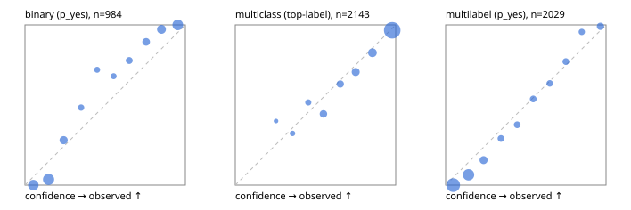

# Evaluation report

- model `Qwen/Qwen3.5-4B` @ `851bf6e806` (shared document / forked native cache branches), adapter/checkpoint `runs/qwen35_4b_tree_cost_jevall/adapter_last`, prompt `challenger-state-first-v1` (6c9d8459ac44)
- data data/ova/hf.jsonl, data/ova/eval.jsonl; splits ['test']; n=3471; calibration `None`
- cuda / bfloat16; 2026-09-26T22:10:09+0000; wall 538.8s

## Overall

question accuracy 84.4%

**binary**: n 984, positives 475, accuracy 0.907, precision 0.936, recall 0.865, f1 0.899, auroc 0.975, brier 0.071, log_loss 0.254, ece 0.091

**multiclass**: n 2143, accuracy 0.856, macro_f1 0.932, log_loss 0.407, brier 0.209, ece_top_label 0.025

**multilabel**: n 344, labels 2029, exact_match 0.593, micro_f1 0.772, macro_f1 0.860, label_auroc 0.952, brier 0.073, log_loss 0.253, ece 0.056

## By family

| family | n | question acc % | details |
|---|---|---|---|
| eval_adversarial | 27 | 100.0 | bin acc 100.0 F1 100.0 AUROC 1.000 ECE 0.083; mc acc 100.0 mF1 100.0 ECE 0.007; ml EM 100.0 µF1 100.0 ECE 0.054 |
| eval_agent_output | 26 | 92.3 | bin acc 100.0 F1 100.0 AUROC 1.000 ECE 0.088; mc acc 71.4 mF1 70.0 ECE 0.188; ml EM 100.0 µF1 100.0 ECE 0.111 |
| eval_evidence | 17 | 94.1 | bin acc 100.0 F1 100.0 AUROC 1.000 ECE 0.064; ml EM 50.0 µF1 66.7 ECE 0.211 |
| eval_multilabel | 32 | 96.9 | bin acc 100.0 F1 100.0 AUROC 1.000 ECE 0.131; mc acc 100.0 mF1 100.0 ECE 0.001; ml EM 95.8 µF1 98.0 ECE 0.045 |
| eval_policy | 22 | 68.2 | bin acc 76.9 F1 76.9 AUROC 0.881 ECE 0.220; mc acc 60.0 mF1 42.9 ECE 0.406; ml EM 50.0 µF1 88.9 ECE 0.145 |
| eval_routing | 25 | 96.0 | bin acc 100.0 F1 100.0 AUROC 1.000 ECE 0.061; mc acc 100.0 mF1 100.0 ECE 0.065; ml EM 50.0 µF1 80.0 ECE 0.109 |
| eval_urgency_sentiment | 22 | 95.5 | bin acc 90.0 F1 92.3 AUROC 1.000 ECE 0.084; mc acc 100.0 mF1 100.0 ECE 0.044; ml EM 100.0 µF1 100.0 ECE 0.048 |
| heldout_boolq | 300 | 85.3 | bin acc 85.3 F1 87.1 AUROC 0.952 ECE 0.093 |
| heldout_emotion_multiclass | 300 | 58.7 | mc acc 58.7 mF1 49.6 ECE 0.105 |
| heldout_intent_clinc | 300 | 94.7 | mc acc 94.7 mF1 95.6 ECE 0.029 |
| heldout_question_type_trec | 300 | 92.0 | mc acc 92.0 mF1 91.6 ECE 0.039 |
| heldout_sentiment_sst2 | 300 | 90.7 | bin acc 90.7 F1 90.1 AUROC 0.979 ECE 0.122 |
| heldout_topic_dbpedia | 300 | 97.7 | mc acc 97.7 mF1 97.4 ECE 0.011 |
| hf_emotions_multilabel | 300 | 55.0 | ml EM 55.0 µF1 72.4 ECE 0.057 |
| hf_intent_banking77 | 300 | 97.3 | mc acc 97.3 mF1 97.4 ECE 0.025 |
| hf_nli | 300 | 94.7 | bin acc 94.7 F1 92.5 AUROC 0.989 ECE 0.114 |
| hf_sentiment_tweets | 300 | 69.0 | mc acc 69.0 mF1 69.8 ECE 0.096 |
| hf_topic_agnews | 300 | 89.0 | mc acc 89.0 mF1 89.0 ECE 0.040 |

## by hard case

| slice | n | question acc % |
|---|---|---|
| (none) | 3042 | 84.0 |
| contradiction | 107 | 100.0 |
| distractor | 33 | 81.8 |
| double_negation | 6 | 83.3 |
| evidence_end | 13 | 100.0 |
| evidence_middle | 11 | 90.9 |
| evidence_start | 9 | 100.0 |
| exception | 7 | 57.1 |
| hypothetical | 7 | 100.0 |
| injection | 10 | 100.0 |
| lexical_overlap | 20 | 100.0 |
| long_state | 50 | 94.0 |
| missing_evidence | 104 | 93.3 |
| multi_positive | 81 | 48.1 |
| multi_turn | 9 | 88.9 |
| negation | 30 | 100.0 |
| new_label_names | 3 | 100.0 |
| nota | 46 | 100.0 |
| numeric_reasoning | 16 | 87.5 |
| paraphrase | 22 | 90.9 |
| role_reversal | 15 | 93.3 |
| sarcasm | 12 | 100.0 |
| temporal_reasoning | 29 | 72.4 |
| zero_positive | 6 | 100.0 |

## by state tokens

| slice | n | question acc % |
|---|---|---|
| 00000-00127 | 3213 | 84.2 |
| 00128-00511 | 206 | 85.4 |
| 00512-02047 | 52 | 94.2 |

## by candidates

| slice | n | question acc % |
|---|---|---|
| 01 | 984 | 90.7 |
| 03 | 310 | 70.0 |
| 04 | 333 | 88.6 |
| 05 | 22 | 90.9 |
| 06 | 1218 | 76.0 |
| 07 | 49 | 100.0 |
| 08 | 555 | 95.7 |

## Paraphrase groups

11 groups; same prediction 81.8%; all correct 90.9%

## Multiclass abstention (coverage vs error on accepted)

| abstain_below | coverage % | error % |
|---|---|---|
| 0.0 | 100.0 | 14.4 |
| 0.4 | 98.1 | 13.4 |
| 0.5 | 95.2 | 12.4 |
| 0.6 | 89.3 | 9.5 |
| 0.7 | 83.6 | 7.6 |
| 0.8 | 75.7 | 5.4 |
| 0.9 | 65.0 | 3.4 |

## Reliability: binary

| bin | n | mean confidence | observed frequency |
|---|---|---|---|
| [0.0,0.1) | 183 | 0.052 | 0.000 |
| [0.1,0.2) | 224 | 0.147 | 0.036 |
| [0.2,0.3) | 82 | 0.241 | 0.280 |
| [0.3,0.4) | 31 | 0.350 | 0.484 |
| [0.4,0.5) | 25 | 0.450 | 0.720 |
| [0.5,0.6) | 25 | 0.553 | 0.680 |
| [0.6,0.7) | 45 | 0.650 | 0.778 |
| [0.7,0.8) | 66 | 0.755 | 0.894 |
| [0.8,0.9) | 108 | 0.851 | 0.972 |
| [0.9,1.0] | 195 | 0.953 | 1.000 |

## Reliability: multiclass

| bin | n | mean confidence | observed frequency |
|---|---|---|---|
| [0.2,0.3) | 10 | 0.254 | 0.400 |
| [0.3,0.4) | 31 | 0.357 | 0.323 |
| [0.4,0.5) | 62 | 0.455 | 0.516 |
| [0.5,0.6) | 126 | 0.549 | 0.444 |
| [0.6,0.7) | 122 | 0.654 | 0.631 |
| [0.7,0.8) | 170 | 0.751 | 0.706 |
| [0.8,0.9) | 230 | 0.855 | 0.826 |
| [0.9,1.0] | 1392 | 0.979 | 0.966 |

## Reliability: multilabel

| bin | n | mean confidence | observed frequency |
|---|---|---|---|
| [0.0,0.1) | 800 | 0.047 | 0.000 |
| [0.1,0.2) | 495 | 0.143 | 0.065 |
| [0.2,0.3) | 160 | 0.236 | 0.156 |
| [0.3,0.4) | 79 | 0.345 | 0.291 |
| [0.4,0.5) | 77 | 0.446 | 0.377 |
| [0.5,0.6) | 80 | 0.546 | 0.537 |
| [0.6,0.7) | 74 | 0.650 | 0.635 |
| [0.7,0.8) | 83 | 0.749 | 0.771 |
| [0.8,0.9) | 68 | 0.849 | 0.956 |
| [0.9,1.0] | 113 | 0.965 | 0.991 |
