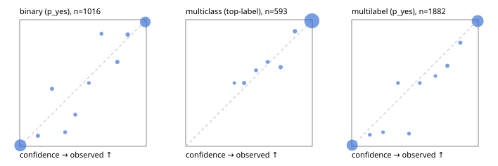

# Evaluation report

- model `Qwen/Qwen3.5-4B` @ `851bf6e806` (shared document / forked native cache branches), adapter/checkpoint `runs/qwen35_4b_tree_rlcd_fresh/adapter`, prompt `challenger-state-first-v1` (6c9d8459ac44)
- data data/ova/eval2.jsonl; splits ['test']; n=1991; calibration `None`
- cuda / bfloat16; 2026-09-26T06:19:01+0000; wall 197.7s

## Overall

question accuracy 95.6%

**binary**: n 1016, positives 435, accuracy 0.969, precision 0.959, recall 0.970, f1 0.965, auroc 0.995, brier 0.025, log_loss 0.091, ece 0.016

**multiclass**: n 593, accuracy 0.970, macro_f1 0.946, log_loss 0.101, brier 0.047, ece_top_label 0.009

**multilabel**: n 382, labels 1882, exact_match 0.901, micro_f1 0.977, macro_f1 0.957, label_auroc 0.997, brier 0.020, log_loss 0.077, ece 0.011

## By family

| family | n | question acc % | details |
|---|---|---|---|
| e2_hard | 673 | 94.7 | bin acc 96.6 F1 95.2 AUROC 0.996 ECE 0.022; mc acc 96.9 mF1 93.3 ECE 0.023; ml EM 86.4 µF1 96.3 ECE 0.027 |
| e2_simple | 664 | 98.6 | bin acc 97.4 F1 97.6 AUROC 0.996 ECE 0.022; mc acc 100.0 mF1 100.0 ECE 0.005; ml EM 100.0 µF1 100.0 ECE 0.006 |
| e2_very_hard | 654 | 93.6 | bin acc 96.9 F1 96.0 AUROC 0.992 ECE 0.020; mc acc 94.0 mF1 90.5 ECE 0.035; ml EM 84.6 µF1 96.9 ECE 0.017 |

## by hard case

| slice | n | question acc % |
|---|---|---|
| (none) | 569 | 98.8 |
| contradiction | 172 | 95.9 |
| distractor | 474 | 93.2 |
| double_negation | 126 | 94.4 |
| evidence_end | 57 | 96.5 |
| evidence_middle | 114 | 98.2 |
| evidence_start | 17 | 94.1 |
| exception | 213 | 94.8 |
| hypothetical | 128 | 94.5 |
| injection | 151 | 94.7 |
| lexical_overlap | 201 | 97.0 |
| long_state | 191 | 95.8 |
| missing_evidence | 141 | 97.9 |
| multi_positive | 322 | 91.3 |
| multi_turn | 149 | 94.0 |
| negation | 257 | 96.9 |
| nota | 118 | 94.1 |
| numeric_reasoning | 224 | 88.4 |
| paraphrase | 218 | 91.7 |
| role_reversal | 187 | 94.1 |
| sarcasm | 149 | 94.6 |
| temporal_reasoning | 203 | 85.2 |
| zero_positive | 73 | 93.2 |
| zero_positive_distractor | 1 | 100.0 |

## by state tokens

| slice | n | question acc % |
|---|---|---|
| 00000-00127 | 666 | 96.2 |
| 00128-00511 | 469 | 92.8 |
| 00512-02047 | 488 | 95.9 |
| 02048-08191 | 329 | 97.9 |
| 08192+ | 39 | 97.4 |

## by candidates

| slice | n | question acc % |
|---|---|---|
| 01 | 1016 | 96.9 |
| 03 | 128 | 96.9 |
| 04 | 515 | 95.9 |
| 05 | 224 | 91.5 |
| 06 | 86 | 88.4 |
| 07 | 18 | 94.4 |
| 08 | 4 | 75.0 |

## Paraphrase groups

76 groups; same prediction 80.3%; all correct 88.2%

## Multiclass abstention (coverage vs error on accepted)

| abstain_below | coverage % | error % |
|---|---|---|
| 0.0 | 100.0 | 3.0 |
| 0.4 | 99.7 | 2.9 |
| 0.5 | 98.3 | 2.2 |
| 0.6 | 97.5 | 1.9 |
| 0.7 | 96.5 | 1.6 |
| 0.8 | 95.1 | 1.1 |
| 0.9 | 93.3 | 0.9 |

## Reliability: binary

| bin | n | mean confidence | observed frequency |
|---|---|---|---|
| [0.0,0.1) | 536 | 0.005 | 0.007 |
| [0.1,0.2) | 12 | 0.144 | 0.083 |
| [0.2,0.3) | 11 | 0.255 | 0.455 |
| [0.3,0.4) | 9 | 0.359 | 0.111 |
| [0.4,0.5) | 8 | 0.439 | 0.250 |
| [0.5,0.6) | 6 | 0.547 | 0.500 |
| [0.6,0.7) | 9 | 0.646 | 0.889 |
| [0.7,0.8) | 15 | 0.771 | 0.667 |
| [0.8,0.9) | 17 | 0.854 | 0.882 |
| [0.9,1.0] | 393 | 0.992 | 0.982 |

## Reliability: multiclass

| bin | n | mean confidence | observed frequency |
|---|---|---|---|
| [0.3,0.4) | 2 | 0.384 | 0.500 |
| [0.4,0.5) | 8 | 0.462 | 0.500 |
| [0.5,0.6) | 5 | 0.555 | 0.600 |
| [0.6,0.7) | 6 | 0.647 | 0.667 |
| [0.7,0.8) | 8 | 0.750 | 0.625 |
| [0.8,0.9) | 11 | 0.863 | 0.909 |
| [0.9,1.0] | 553 | 0.997 | 0.991 |

## Reliability: multilabel

| bin | n | mean confidence | observed frequency |
|---|---|---|---|
| [0.0,0.1) | 800 | 0.004 | 0.009 |
| [0.1,0.2) | 11 | 0.143 | 0.091 |
| [0.2,0.3) | 9 | 0.248 | 0.111 |
| [0.3,0.4) | 10 | 0.366 | 0.500 |
| [0.4,0.5) | 10 | 0.453 | 0.100 |
| [0.5,0.6) | 10 | 0.538 | 0.500 |
| [0.6,0.7) | 9 | 0.661 | 0.556 |
| [0.7,0.8) | 22 | 0.755 | 0.636 |
| [0.8,0.9) | 22 | 0.858 | 0.818 |
| [0.9,1.0] | 979 | 0.995 | 0.989 |
