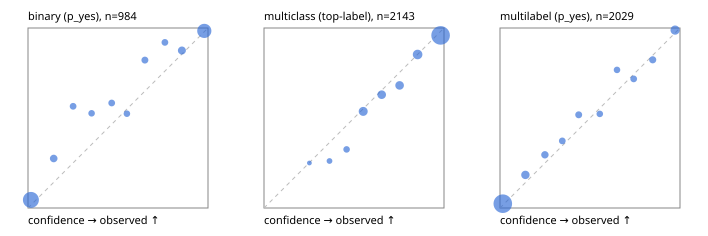

# Evaluation report

- model `Qwen/Qwen3.5-4B` @ `851bf6e806` (shared document / forked native cache branches), adapter/checkpoint `runs/qwen35_4b_tree_rlcd_fresh/adapter`, prompt `challenger-state-first-v1` (6c9d8459ac44)
- data data/ova/hf.jsonl, data/ova/eval.jsonl; splits ['test']; n=3471; calibration `None`
- cuda / bfloat16; 2026-09-26T06:28:11+0000; wall 549.8s

## Overall

question accuracy 84.4%

**binary**: n 984, positives 475, accuracy 0.902, precision 0.936, recall 0.857, f1 0.895, auroc 0.972, brier 0.071, log_loss 0.235, ece 0.044

**multiclass**: n 2143, accuracy 0.856, macro_f1 0.920, log_loss 0.414, brier 0.207, ece_top_label 0.026

**multilabel**: n 344, labels 2029, exact_match 0.599, micro_f1 0.776, macro_f1 0.826, label_auroc 0.959, brier 0.064, log_loss 0.209, ece 0.018

## By family

| family | n | question acc % | details |
|---|---|---|---|
| eval_adversarial | 27 | 100.0 | bin acc 100.0 F1 100.0 AUROC 1.000 ECE 0.009; mc acc 100.0 mF1 100.0 ECE 0.003; ml EM 100.0 µF1 100.0 ECE 0.004 |
| eval_agent_output | 26 | 80.8 | bin acc 100.0 F1 100.0 AUROC 1.000 ECE 0.053; mc acc 85.7 mF1 86.7 ECE 0.199; ml EM 20.0 µF1 75.0 ECE 0.139 |
| eval_evidence | 17 | 94.1 | bin acc 100.0 F1 100.0 AUROC 1.000 ECE 0.001; ml EM 50.0 µF1 66.7 ECE 0.200 |
| eval_multilabel | 32 | 96.9 | bin acc 100.0 F1 100.0 AUROC 1.000 ECE 0.062; mc acc 100.0 mF1 100.0 ECE 0.003; ml EM 95.8 µF1 99.0 ECE 0.012 |
| eval_policy | 22 | 68.2 | bin acc 76.9 F1 76.9 AUROC 0.857 ECE 0.250; mc acc 60.0 mF1 42.9 ECE 0.316; ml EM 50.0 µF1 88.9 ECE 0.109 |
| eval_routing | 25 | 92.0 | bin acc 100.0 F1 100.0 AUROC 1.000 ECE 0.011; mc acc 92.3 mF1 81.8 ECE 0.027; ml EM 50.0 µF1 80.0 ECE 0.058 |
| eval_urgency_sentiment | 22 | 95.5 | bin acc 90.0 F1 92.3 AUROC 0.958 ECE 0.126; mc acc 100.0 mF1 100.0 ECE 0.036; ml EM 100.0 µF1 100.0 ECE 0.002 |
| heldout_boolq | 300 | 85.0 | bin acc 85.0 F1 86.8 AUROC 0.956 ECE 0.092 |
| heldout_emotion_multiclass | 300 | 59.3 | mc acc 59.3 mF1 50.9 ECE 0.133 |
| heldout_intent_clinc | 300 | 94.7 | mc acc 94.7 mF1 94.8 ECE 0.012 |
| heldout_question_type_trec | 300 | 91.7 | mc acc 91.7 mF1 91.5 ECE 0.049 |
| heldout_sentiment_sst2 | 300 | 89.7 | bin acc 89.7 F1 88.9 AUROC 0.973 ECE 0.072 |
| heldout_topic_dbpedia | 300 | 97.7 | mc acc 97.7 mF1 97.4 ECE 0.007 |
| hf_emotions_multilabel | 300 | 57.0 | ml EM 57.0 µF1 73.1 ECE 0.020 |
| hf_intent_banking77 | 300 | 96.7 | mc acc 96.7 mF1 96.1 ECE 0.012 |
| hf_nli | 300 | 94.7 | bin acc 94.7 F1 92.5 AUROC 0.987 ECE 0.033 |
| hf_sentiment_tweets | 300 | 68.3 | mc acc 68.3 mF1 69.0 ECE 0.066 |
| hf_topic_agnews | 300 | 90.0 | mc acc 90.0 mF1 90.1 ECE 0.046 |

## by hard case

| slice | n | question acc % |
|---|---|---|
| (none) | 3042 | 84.2 |
| contradiction | 107 | 100.0 |
| distractor | 33 | 72.7 |
| double_negation | 6 | 83.3 |
| evidence_end | 13 | 92.3 |
| evidence_middle | 11 | 90.9 |
| evidence_start | 9 | 100.0 |
| exception | 7 | 57.1 |
| hypothetical | 7 | 100.0 |
| injection | 10 | 100.0 |
| lexical_overlap | 20 | 100.0 |
| long_state | 50 | 92.0 |
| missing_evidence | 104 | 93.3 |
| multi_positive | 81 | 40.7 |
| multi_turn | 9 | 88.9 |
| negation | 30 | 100.0 |
| new_label_names | 3 | 100.0 |
| nota | 46 | 100.0 |
| numeric_reasoning | 16 | 87.5 |
| paraphrase | 22 | 90.9 |
| role_reversal | 15 | 93.3 |
| sarcasm | 12 | 100.0 |
| temporal_reasoning | 29 | 72.4 |
| zero_positive | 6 | 100.0 |

## by state tokens

| slice | n | question acc % |
|---|---|---|
| 00000-00127 | 3213 | 84.3 |
| 00128-00511 | 206 | 83.5 |
| 00512-02047 | 52 | 92.3 |

## by candidates

| slice | n | question acc % |
|---|---|---|
| 01 | 984 | 90.2 |
| 03 | 310 | 69.4 |
| 04 | 333 | 88.6 |
| 05 | 22 | 90.9 |
| 06 | 1218 | 76.5 |
| 07 | 49 | 100.0 |
| 08 | 555 | 95.3 |

## Paraphrase groups

11 groups; same prediction 81.8%; all correct 90.9%

## Multiclass abstention (coverage vs error on accepted)

| abstain_below | coverage % | error % |
|---|---|---|
| 0.0 | 100.0 | 14.4 |
| 0.4 | 98.7 | 13.7 |
| 0.5 | 96.7 | 12.5 |
| 0.6 | 89.1 | 9.6 |
| 0.7 | 82.8 | 7.6 |
| 0.8 | 76.2 | 5.5 |
| 0.9 | 66.7 | 4.1 |

## Reliability: binary

| bin | n | mean confidence | observed frequency |
|---|---|---|---|
| [0.0,0.1) | 443 | 0.016 | 0.045 |
| [0.1,0.2) | 40 | 0.143 | 0.275 |
| [0.2,0.3) | 23 | 0.251 | 0.565 |
| [0.3,0.4) | 19 | 0.354 | 0.526 |
| [0.4,0.5) | 24 | 0.465 | 0.583 |
| [0.5,0.6) | 21 | 0.549 | 0.524 |
| [0.6,0.7) | 28 | 0.650 | 0.821 |
| [0.7,0.8) | 25 | 0.761 | 0.920 |
| [0.8,0.9) | 48 | 0.855 | 0.875 |
| [0.9,1.0] | 313 | 0.980 | 0.984 |

## Reliability: multiclass

| bin | n | mean confidence | observed frequency |
|---|---|---|---|
| [0.2,0.3) | 4 | 0.252 | 0.250 |
| [0.3,0.4) | 23 | 0.364 | 0.261 |
| [0.4,0.5) | 43 | 0.459 | 0.326 |
| [0.5,0.6) | 164 | 0.551 | 0.537 |
| [0.6,0.7) | 135 | 0.654 | 0.630 |
| [0.7,0.8) | 141 | 0.753 | 0.681 |
| [0.8,0.9) | 204 | 0.854 | 0.853 |
| [0.9,1.0] | 1429 | 0.981 | 0.959 |

## Reliability: multilabel

| bin | n | mean confidence | observed frequency |
|---|---|---|---|
| [0.0,0.1) | 1352 | 0.016 | 0.024 |
| [0.1,0.2) | 125 | 0.141 | 0.184 |
| [0.2,0.3) | 71 | 0.250 | 0.296 |
| [0.3,0.4) | 51 | 0.346 | 0.373 |
| [0.4,0.5) | 56 | 0.437 | 0.518 |
| [0.5,0.6) | 44 | 0.554 | 0.523 |
| [0.6,0.7) | 43 | 0.650 | 0.767 |
| [0.7,0.8) | 46 | 0.743 | 0.717 |
| [0.8,0.9) | 68 | 0.848 | 0.824 |
| [0.9,1.0] | 173 | 0.973 | 0.988 |
