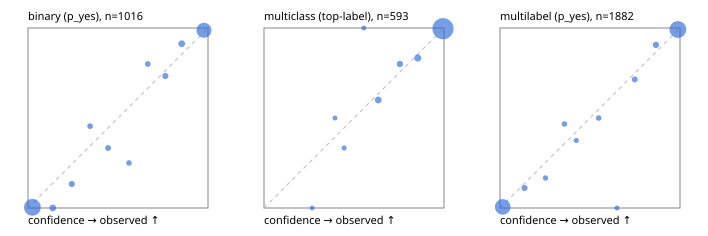

# Evaluation report

- model `Qwen/Qwen3.5-4B` @ `851bf6e806` (shared document / forked native cache branches), adapter/checkpoint `runs/qwen35_4b_tree_rlcd_jevall/adapter_last`, prompt `challenger-state-first-v1` (6c9d8459ac44)
- data data/ova/eval2.jsonl; splits ['test']; n=1991; calibration `None`
- cuda / bfloat16; 2026-09-26T15:52:09+0000; wall 171.9s

## Overall

question accuracy 95.4%

**binary**: n 1016, positives 435, accuracy 0.969, precision 0.957, recall 0.970, f1 0.963, auroc 0.996, brier 0.023, log_loss 0.092, ece 0.027

**multiclass**: n 593, accuracy 0.971, macro_f1 0.950, log_loss 0.086, brier 0.042, ece_top_label 0.007

**multilabel**: n 382, labels 1882, exact_match 0.890, micro_f1 0.975, macro_f1 0.953, label_auroc 0.996, brier 0.019, log_loss 0.073, ece 0.011

## By family

| family | n | question acc % | details |
|---|---|---|---|
| e2_hard | 673 | 94.9 | bin acc 97.1 F1 96.0 AUROC 0.997 ECE 0.043; mc acc 97.4 mF1 94.0 ECE 0.021; ml EM 85.6 µF1 96.3 ECE 0.018 |
| e2_simple | 664 | 98.5 | bin acc 97.1 F1 97.3 AUROC 0.997 ECE 0.018; mc acc 100.0 mF1 100.0 ECE 0.007; ml EM 100.0 µF1 100.0 ECE 0.015 |
| e2_very_hard | 654 | 92.8 | bin acc 96.3 F1 95.2 AUROC 0.994 ECE 0.033; mc acc 94.0 mF1 90.9 ECE 0.025; ml EM 82.3 µF1 96.3 ECE 0.017 |

## by hard case

| slice | n | question acc % |
|---|---|---|
| (none) | 569 | 98.4 |
| contradiction | 172 | 96.5 |
| distractor | 474 | 93.9 |
| double_negation | 126 | 94.4 |
| evidence_end | 57 | 96.5 |
| evidence_middle | 114 | 99.1 |
| evidence_start | 17 | 94.1 |
| exception | 213 | 93.9 |
| hypothetical | 128 | 96.9 |
| injection | 151 | 93.4 |
| lexical_overlap | 201 | 97.0 |
| long_state | 191 | 97.4 |
| missing_evidence | 141 | 97.9 |
| multi_positive | 322 | 89.8 |
| multi_turn | 149 | 91.9 |
| negation | 257 | 96.5 |
| nota | 118 | 94.9 |
| numeric_reasoning | 224 | 86.6 |
| paraphrase | 218 | 92.2 |
| role_reversal | 187 | 94.7 |
| sarcasm | 149 | 95.3 |
| temporal_reasoning | 203 | 85.7 |
| zero_positive | 73 | 91.8 |
| zero_positive_distractor | 1 | 100.0 |

## by state tokens

| slice | n | question acc % |
|---|---|---|
| 00000-00127 | 666 | 95.0 |
| 00128-00511 | 469 | 92.8 |
| 00512-02047 | 488 | 96.1 |
| 02048-08191 | 329 | 98.5 |
| 08192+ | 39 | 100.0 |

## by candidates

| slice | n | question acc % |
|---|---|---|
| 01 | 1016 | 96.9 |
| 03 | 128 | 96.1 |
| 04 | 515 | 95.7 |
| 05 | 224 | 91.1 |
| 06 | 86 | 88.4 |
| 07 | 18 | 94.4 |
| 08 | 4 | 75.0 |

## Paraphrase groups

76 groups; same prediction 80.3%; all correct 88.2%

## Multiclass abstention (coverage vs error on accepted)

| abstain_below | coverage % | error % |
|---|---|---|
| 0.0 | 100.0 | 2.9 |
| 0.4 | 99.5 | 2.5 |
| 0.5 | 99.0 | 2.2 |
| 0.6 | 98.7 | 2.2 |
| 0.7 | 96.1 | 1.2 |
| 0.8 | 94.4 | 0.9 |
| 0.9 | 91.4 | 0.4 |

## Reliability: binary

| bin | n | mean confidence | observed frequency |
|---|---|---|---|
| [0.0,0.1) | 511 | 0.024 | 0.004 |
| [0.1,0.2) | 26 | 0.138 | 0.000 |
| [0.2,0.3) | 15 | 0.243 | 0.133 |
| [0.3,0.4) | 11 | 0.345 | 0.455 |
| [0.4,0.5) | 12 | 0.445 | 0.333 |
| [0.5,0.6) | 8 | 0.561 | 0.250 |
| [0.6,0.7) | 10 | 0.666 | 0.800 |
| [0.7,0.8) | 15 | 0.763 | 0.733 |
| [0.8,0.9) | 23 | 0.854 | 0.913 |
| [0.9,1.0] | 385 | 0.978 | 0.987 |

## Reliability: multiclass

| bin | n | mean confidence | observed frequency |
|---|---|---|---|
| [0.2,0.3) | 1 | 0.267 | 0.000 |
| [0.3,0.4) | 2 | 0.394 | 0.500 |
| [0.4,0.5) | 3 | 0.445 | 0.333 |
| [0.5,0.6) | 2 | 0.554 | 1.000 |
| [0.6,0.7) | 15 | 0.635 | 0.600 |
| [0.7,0.8) | 10 | 0.755 | 0.800 |
| [0.8,0.9) | 18 | 0.854 | 0.833 |
| [0.9,1.0] | 542 | 0.994 | 0.996 |

## Reliability: multilabel

| bin | n | mean confidence | observed frequency |
|---|---|---|---|
| [0.0,0.1) | 784 | 0.015 | 0.006 |
| [0.1,0.2) | 27 | 0.136 | 0.111 |
| [0.2,0.3) | 12 | 0.253 | 0.167 |
| [0.3,0.4) | 15 | 0.358 | 0.467 |
| [0.4,0.5) | 8 | 0.424 | 0.375 |
| [0.5,0.6) | 14 | 0.549 | 0.500 |
| [0.6,0.7) | 7 | 0.650 | 0.000 |
| [0.7,0.8) | 21 | 0.749 | 0.714 |
| [0.8,0.9) | 32 | 0.866 | 0.906 |
| [0.9,1.0] | 962 | 0.988 | 0.992 |
