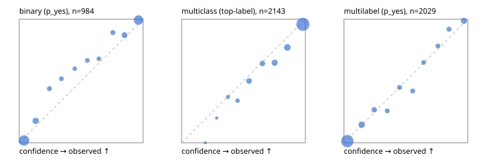

# Evaluation report

- model `Qwen/Qwen3.5-4B` @ `851bf6e806` (shared document / forked native cache branches), adapter/checkpoint `runs/qwen35_4b_tree_rlcd_jevall/adapter_last`, prompt `challenger-state-first-v1` (6c9d8459ac44)
- data data/ova/hf.jsonl, data/ova/eval.jsonl; splits ['test']; n=3471; calibration `None`
- cuda / bfloat16; 2026-09-26T16:00:52+0000; wall 522.8s

## Overall

question accuracy 84.5%

**binary**: n 984, positives 475, accuracy 0.907, precision 0.930, recall 0.872, f1 0.900, auroc 0.975, brier 0.066, log_loss 0.221, ece 0.045

**multiclass**: n 2143, accuracy 0.855, macro_f1 0.934, log_loss 0.417, brier 0.213, ece_top_label 0.036

**multilabel**: n 344, labels 2029, exact_match 0.608, micro_f1 0.775, macro_f1 0.852, label_auroc 0.958, brier 0.065, log_loss 0.214, ece 0.022

## By family

| family | n | question acc % | details |
|---|---|---|---|
| eval_adversarial | 27 | 100.0 | bin acc 100.0 F1 100.0 AUROC 1.000 ECE 0.056; mc acc 100.0 mF1 100.0 ECE 0.003; ml EM 100.0 µF1 100.0 ECE 0.017 |
| eval_agent_output | 26 | 92.3 | bin acc 100.0 F1 100.0 AUROC 1.000 ECE 0.053; mc acc 85.7 mF1 86.7 ECE 0.139; ml EM 80.0 µF1 94.1 ECE 0.112 |
| eval_evidence | 17 | 94.1 | bin acc 100.0 F1 100.0 AUROC 1.000 ECE 0.018; ml EM 50.0 µF1 66.7 ECE 0.194 |
| eval_multilabel | 32 | 96.9 | bin acc 100.0 F1 100.0 AUROC 1.000 ECE 0.086; mc acc 100.0 mF1 100.0 ECE 0.003; ml EM 95.8 µF1 98.0 ECE 0.022 |
| eval_policy | 22 | 68.2 | bin acc 76.9 F1 76.9 AUROC 0.833 ECE 0.201; mc acc 60.0 mF1 42.9 ECE 0.362; ml EM 50.0 µF1 88.9 ECE 0.164 |
| eval_routing | 25 | 96.0 | bin acc 100.0 F1 100.0 AUROC 1.000 ECE 0.023; mc acc 100.0 mF1 100.0 ECE 0.094; ml EM 50.0 µF1 80.0 ECE 0.109 |
| eval_urgency_sentiment | 22 | 95.5 | bin acc 90.0 F1 92.3 AUROC 0.958 ECE 0.142; mc acc 100.0 mF1 100.0 ECE 0.038; ml EM 100.0 µF1 100.0 ECE 0.014 |
| heldout_boolq | 300 | 85.0 | bin acc 85.0 F1 86.8 AUROC 0.958 ECE 0.073 |
| heldout_emotion_multiclass | 300 | 58.0 | mc acc 58.0 mF1 49.8 ECE 0.144 |
| heldout_intent_clinc | 300 | 95.0 | mc acc 95.0 mF1 96.0 ECE 0.014 |
| heldout_question_type_trec | 300 | 92.0 | mc acc 92.0 mF1 91.6 ECE 0.037 |
| heldout_sentiment_sst2 | 300 | 90.7 | bin acc 90.7 F1 90.1 AUROC 0.977 ECE 0.081 |
| heldout_topic_dbpedia | 300 | 97.7 | mc acc 97.7 mF1 97.4 ECE 0.013 |
| hf_emotions_multilabel | 300 | 57.0 | ml EM 57.0 µF1 72.9 ECE 0.022 |
| hf_intent_banking77 | 300 | 97.0 | mc acc 97.0 mF1 96.5 ECE 0.014 |
| hf_nli | 300 | 95.0 | bin acc 95.0 F1 93.2 AUROC 0.989 ECE 0.035 |
| hf_sentiment_tweets | 300 | 68.3 | mc acc 68.3 mF1 68.9 ECE 0.106 |
| hf_topic_agnews | 300 | 89.3 | mc acc 89.3 mF1 89.4 ECE 0.044 |

## by hard case

| slice | n | question acc % |
|---|---|---|
| (none) | 3042 | 84.2 |
| contradiction | 107 | 100.0 |
| distractor | 33 | 78.8 |
| double_negation | 6 | 83.3 |
| evidence_end | 13 | 100.0 |
| evidence_middle | 11 | 90.9 |
| evidence_start | 9 | 100.0 |
| exception | 7 | 57.1 |
| hypothetical | 7 | 100.0 |
| injection | 10 | 100.0 |
| lexical_overlap | 20 | 100.0 |
| long_state | 50 | 94.0 |
| missing_evidence | 104 | 91.3 |
| multi_positive | 81 | 45.7 |
| multi_turn | 9 | 88.9 |
| negation | 30 | 100.0 |
| new_label_names | 3 | 100.0 |
| nota | 46 | 100.0 |
| numeric_reasoning | 16 | 87.5 |
| paraphrase | 22 | 90.9 |
| role_reversal | 15 | 93.3 |
| sarcasm | 12 | 100.0 |
| temporal_reasoning | 29 | 72.4 |
| zero_positive | 6 | 100.0 |

## by state tokens

| slice | n | question acc % |
|---|---|---|
| 00000-00127 | 3213 | 84.3 |
| 00128-00511 | 206 | 85.9 |
| 00512-02047 | 52 | 94.2 |

## by candidates

| slice | n | question acc % |
|---|---|---|
| 01 | 984 | 90.7 |
| 03 | 310 | 69.4 |
| 04 | 333 | 88.6 |
| 05 | 22 | 95.5 |
| 06 | 1218 | 76.4 |
| 07 | 49 | 100.0 |
| 08 | 555 | 95.7 |

## Paraphrase groups

11 groups; same prediction 81.8%; all correct 90.9%

## Multiclass abstention (coverage vs error on accepted)

| abstain_below | coverage % | error % |
|---|---|---|
| 0.0 | 100.0 | 14.5 |
| 0.4 | 98.5 | 13.7 |
| 0.5 | 96.3 | 12.5 |
| 0.6 | 91.0 | 10.4 |
| 0.7 | 86.1 | 8.9 |
| 0.8 | 78.7 | 6.4 |
| 0.9 | 69.1 | 4.1 |

## Reliability: binary

| bin | n | mean confidence | observed frequency |
|---|---|---|---|
| [0.0,0.1) | 381 | 0.038 | 0.018 |
| [0.1,0.2) | 79 | 0.133 | 0.177 |
| [0.2,0.3) | 32 | 0.243 | 0.438 |
| [0.3,0.4) | 27 | 0.341 | 0.519 |
| [0.4,0.5) | 20 | 0.448 | 0.600 |
| [0.5,0.6) | 27 | 0.550 | 0.667 |
| [0.6,0.7) | 25 | 0.643 | 0.680 |
| [0.7,0.8) | 37 | 0.756 | 0.892 |
| [0.8,0.9) | 62 | 0.850 | 0.871 |
| [0.9,1.0] | 294 | 0.963 | 0.993 |

## Reliability: multiclass

| bin | n | mean confidence | observed frequency |
|---|---|---|---|
| [0.1,0.2) | 1 | 0.191 | 0.000 |
| [0.2,0.3) | 5 | 0.283 | 0.200 |
| [0.3,0.4) | 27 | 0.374 | 0.370 |
| [0.4,0.5) | 47 | 0.452 | 0.340 |
| [0.5,0.6) | 112 | 0.545 | 0.500 |
| [0.6,0.7) | 106 | 0.653 | 0.642 |
| [0.7,0.8) | 159 | 0.752 | 0.648 |
| [0.8,0.9) | 206 | 0.854 | 0.772 |
| [0.9,1.0] | 1480 | 0.980 | 0.959 |

## Reliability: multilabel

| bin | n | mean confidence | observed frequency |
|---|---|---|---|
| [0.0,0.1) | 1223 | 0.028 | 0.013 |
| [0.1,0.2) | 185 | 0.143 | 0.146 |
| [0.2,0.3) | 86 | 0.245 | 0.267 |
| [0.3,0.4) | 62 | 0.350 | 0.258 |
| [0.4,0.5) | 67 | 0.449 | 0.448 |
| [0.5,0.6) | 62 | 0.556 | 0.419 |
| [0.6,0.7) | 60 | 0.644 | 0.650 |
| [0.7,0.8) | 60 | 0.759 | 0.783 |
| [0.8,0.9) | 74 | 0.849 | 0.919 |
| [0.9,1.0] | 150 | 0.969 | 0.987 |
