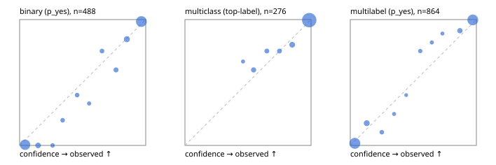

# Evaluation report

- model `Qwen/Qwen3.5-4B` @ `851bf6e806` (shared document / forked native cache branches), adapter/checkpoint `runs/qwen35_4b_tree_scratch_jevall/adapter`, prompt `challenger-state-first-v1` (6c9d8459ac44)
- data data/ova/eval_llm.jsonl; splits ['test']; n=946; calibration `None`
- cuda / bfloat16; 2026-09-27T03:58:52+0000; wall 73.6s

## Overall

question accuracy 93.1%

**binary**: n 488, positives 245, accuracy 0.943, precision 0.919, recall 0.971, f1 0.944, auroc 0.986, brier 0.045, log_loss 0.168, ece 0.047

**multiclass**: n 276, accuracy 0.953, macro_f1 0.924, log_loss 0.138, brier 0.074, ece_top_label 0.018

**multilabel**: n 182, labels 864, exact_match 0.868, micro_f1 0.963, macro_f1 0.931, label_auroc 0.991, brier 0.033, log_loss 0.128, ece 0.034

## By family

| family | n | question acc % | details |
|---|---|---|---|
| tllm_guardrail_hard | 60 | 91.7 | bin acc 96.9 F1 96.6 AUROC 1.000 ECE 0.122; mc acc 94.1 mF1 87.5 ECE 0.051; ml EM 72.7 µF1 92.7 ECE 0.078 |
| tllm_guardrail_simple | 67 | 100.0 | bin acc 100.0 F1 100.0 AUROC 1.000 ECE 0.031; mc acc 100.0 mF1 100.0 ECE 0.023; ml EM 100.0 µF1 100.0 ECE 0.037 |
| tllm_guardrail_very_hard | 43 | 97.7 | bin acc 100.0 F1 100.0 AUROC 1.000 ECE 0.077; mc acc 92.9 mF1 83.3 ECE 0.063; ml EM 100.0 µF1 100.0 ECE 0.065 |
| tllm_jailbreak_hard | 59 | 98.3 | bin acc 96.3 F1 96.6 AUROC 1.000 ECE 0.081; mc acc 100.0 mF1 100.0 ECE 0.068; ml EM 100.0 µF1 100.0 ECE 0.059 |
| tllm_jailbreak_simple | 70 | 97.1 | bin acc 100.0 F1 100.0 AUROC 1.000 ECE 0.042; mc acc 95.5 mF1 87.5 ECE 0.047; ml EM 90.9 µF1 98.6 ECE 0.036 |
| tllm_jailbreak_very_hard | 60 | 88.3 | bin acc 87.5 F1 85.7 AUROC 0.960 ECE 0.109; mc acc 94.4 mF1 91.7 ECE 0.087; ml EM 80.0 µF1 96.3 ECE 0.056 |
| tllm_judge_hard | 86 | 95.3 | bin acc 95.0 F1 93.3 AUROC 0.973 ECE 0.092; mc acc 100.0 mF1 100.0 ECE 0.018; ml EM 90.5 µF1 94.3 ECE 0.039 |
| tllm_judge_simple | 72 | 95.8 | bin acc 97.4 F1 97.9 AUROC 1.000 ECE 0.070; mc acc 100.0 mF1 100.0 ECE 0.034; ml EM 85.7 µF1 97.6 ECE 0.064 |
| tllm_judge_very_hard | 64 | 90.6 | bin acc 96.9 F1 97.3 AUROC 0.996 ECE 0.091; mc acc 90.5 mF1 81.5 ECE 0.050; ml EM 72.7 µF1 95.8 ECE 0.095 |
| tllm_score_hard | 62 | 96.8 | bin acc 100.0 F1 100.0 AUROC 1.000 ECE 0.106; mc acc 100.0 mF1 100.0 ECE 0.058; ml EM 83.3 µF1 96.0 ECE 0.108 |
| tllm_score_simple | 62 | 96.8 | bin acc 94.1 F1 95.8 AUROC 0.992 ECE 0.064; mc acc 100.0 mF1 100.0 ECE 0.055; ml EM 100.0 µF1 100.0 ECE 0.049 |
| tllm_score_very_hard | 76 | 85.5 | bin acc 84.2 F1 76.9 AUROC 0.970 ECE 0.123; mc acc 90.9 mF1 82.6 ECE 0.123; ml EM 81.2 µF1 90.6 ECE 0.058 |
| tllm_verify_hard | 50 | 76.0 | bin acc 80.8 F1 81.5 AUROC 0.897 ECE 0.200; mc acc 81.2 mF1 70.6 ECE 0.150; ml EM 50.0 µF1 80.0 ECE 0.095 |
| tllm_verify_simple | 60 | 100.0 | bin acc 100.0 F1 100.0 AUROC 1.000 ECE 0.047; mc acc 100.0 mF1 100.0 ECE 0.006; ml EM 100.0 µF1 100.0 ECE 0.042 |
| tllm_verify_very_hard | 55 | 83.6 | bin acc 83.9 F1 81.5 AUROC 0.880 ECE 0.127; mc acc 86.7 mF1 82.2 ECE 0.184; ml EM 77.8 µF1 88.9 ECE 0.125 |

## by hard case

| slice | n | question acc % |
|---|---|---|
| (none) | 265 | 98.1 |
| answer_trace_mismatch | 45 | 91.1 |
| benign_lookalike | 88 | 90.9 |
| confident_wrong | 39 | 82.1 |
| contradiction | 22 | 100.0 |
| distractor | 117 | 92.3 |
| double_negation | 3 | 100.0 |
| evidence_end | 11 | 100.0 |
| evidence_middle | 20 | 80.0 |
| evidence_start | 2 | 50.0 |
| exception | 20 | 95.0 |
| fake_authority | 1 | 100.0 |
| flawed_step | 44 | 68.2 |
| format_near_miss | 46 | 84.8 |
| gradual_escalation | 1 | 100.0 |
| hypothetical | 7 | 100.0 |
| indirect_injection | 25 | 96.0 |
| injection | 22 | 100.0 |
| judge_injection | 112 | 91.1 |
| length_bias | 7 | 100.0 |
| lexical_overlap | 103 | 94.2 |
| long_state | 74 | 97.3 |
| missing_evidence | 35 | 94.3 |
| multi_positive | 124 | 85.5 |
| multi_turn | 44 | 90.9 |
| negation | 62 | 95.2 |
| nota | 55 | 90.9 |
| numeric_reasoning | 109 | 79.8 |
| obfuscation | 1 | 0.0 |
| over_refusal | 50 | 88.0 |
| paraphrase | 73 | 93.2 |
| partial_compliance | 31 | 74.2 |
| role_reversal | 6 | 83.3 |
| sarcasm | 8 | 87.5 |
| speaker_confusion | 58 | 94.8 |
| subtle_violation | 16 | 93.8 |
| sycophancy | 13 | 100.0 |
| temporal_reasoning | 20 | 95.0 |
| tool_misuse | 6 | 100.0 |
| unsupported_claim | 96 | 87.5 |
| zero_positive | 55 | 94.5 |
| zero_positive_partial | 1 | 100.0 |

## by state tokens

| slice | n | question acc % |
|---|---|---|
| 00000-00127 | 308 | 89.9 |
| 00128-00511 | 284 | 97.2 |
| 00512-02047 | 222 | 93.7 |
| 02048-08191 | 125 | 90.4 |
| 08192+ | 7 | 100.0 |

## by candidates

| slice | n | question acc % |
|---|---|---|
| 01 | 488 | 94.3 |
| 03 | 82 | 92.7 |
| 04 | 239 | 95.0 |
| 05 | 98 | 83.7 |
| 06 | 33 | 93.9 |
| 07 | 3 | 100.0 |
| 08 | 3 | 66.7 |

## Paraphrase groups

29 groups; same prediction 93.1%; all correct 89.7%

## Multiclass abstention (coverage vs error on accepted)

| abstain_below | coverage % | error % |
|---|---|---|
| 0.0 | 100.0 | 4.7 |
| 0.4 | 100.0 | 4.7 |
| 0.5 | 98.9 | 4.4 |
| 0.6 | 95.3 | 3.0 |
| 0.7 | 92.4 | 2.4 |
| 0.8 | 89.5 | 1.6 |
| 0.9 | 84.1 | 0.4 |

## Reliability: binary

| bin | n | mean confidence | observed frequency |
|---|---|---|---|
| [0.0,0.1) | 177 | 0.044 | 0.006 |
| [0.1,0.2) | 24 | 0.147 | 0.000 |
| [0.2,0.3) | 8 | 0.262 | 0.000 |
| [0.3,0.4) | 10 | 0.341 | 0.200 |
| [0.4,0.5) | 10 | 0.456 | 0.400 |
| [0.5,0.6) | 6 | 0.551 | 0.333 |
| [0.6,0.7) | 12 | 0.653 | 0.750 |
| [0.7,0.8) | 15 | 0.764 | 0.600 |
| [0.8,0.9) | 32 | 0.850 | 0.844 |
| [0.9,1.0] | 194 | 0.965 | 0.985 |

## Reliability: multiclass

| bin | n | mean confidence | observed frequency |
|---|---|---|---|
| [0.4,0.5) | 3 | 0.460 | 0.667 |
| [0.5,0.6) | 10 | 0.545 | 0.600 |
| [0.6,0.7) | 8 | 0.649 | 0.750 |
| [0.7,0.8) | 8 | 0.749 | 0.750 |
| [0.8,0.9) | 15 | 0.851 | 0.800 |
| [0.9,1.0] | 232 | 0.986 | 0.996 |

## Reliability: multilabel

| bin | n | mean confidence | observed frequency |
|---|---|---|---|
| [0.0,0.1) | 364 | 0.036 | 0.016 |
| [0.1,0.2) | 51 | 0.131 | 0.176 |
| [0.2,0.3) | 19 | 0.250 | 0.105 |
| [0.3,0.4) | 8 | 0.347 | 0.250 |
| [0.4,0.5) | 5 | 0.443 | 0.400 |
| [0.5,0.6) | 12 | 0.555 | 0.750 |
| [0.6,0.7) | 11 | 0.647 | 0.818 |
| [0.7,0.8) | 9 | 0.731 | 0.889 |
| [0.8,0.9) | 34 | 0.869 | 0.912 |
| [0.9,1.0] | 351 | 0.972 | 0.997 |
