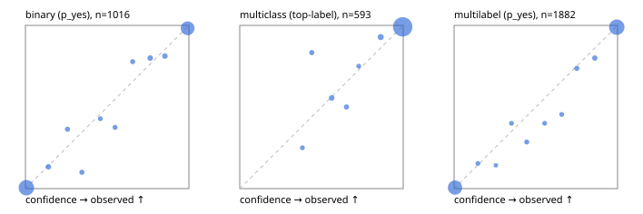

# Evaluation report

- model `Qwen/Qwen3.5-4B` @ `851bf6e806` (shared document / forked native cache branches), adapter/checkpoint `runs/qwen35_4b_tree_sft_fresh/adapter`, prompt `challenger-state-first-v1` (6c9d8459ac44)
- data data/ova/eval2.jsonl; splits ['test']; n=1991; calibration `None`
- cuda / bfloat16; 2026-09-26T06:31:16+0000; wall 172.9s

## Overall

question accuracy 95.4%

**binary**: n 1016, positives 435, accuracy 0.968, precision 0.955, recall 0.970, f1 0.962, auroc 0.995, brier 0.025, log_loss 0.090, ece 0.011

**multiclass**: n 593, accuracy 0.970, macro_f1 0.945, log_loss 0.103, brier 0.048, ece_top_label 0.013

**multilabel**: n 382, labels 1882, exact_match 0.895, micro_f1 0.976, macro_f1 0.956, label_auroc 0.996, brier 0.020, log_loss 0.076, ece 0.008

## By family

| family | n | question acc % | details |
|---|---|---|---|
| e2_hard | 673 | 94.1 | bin acc 96.3 F1 94.9 AUROC 0.996 ECE 0.025; mc acc 96.4 mF1 92.7 ECE 0.021; ml EM 84.8 µF1 96.1 ECE 0.028 |
| e2_simple | 664 | 98.5 | bin acc 97.1 F1 97.3 AUROC 0.996 ECE 0.022; mc acc 100.0 mF1 100.0 ECE 0.006; ml EM 100.0 µF1 100.0 ECE 0.007 |
| e2_very_hard | 654 | 93.7 | bin acc 96.9 F1 96.0 AUROC 0.992 ECE 0.015; mc acc 94.5 mF1 90.5 ECE 0.035; ml EM 84.6 µF1 96.7 ECE 0.011 |

## by hard case

| slice | n | question acc % |
|---|---|---|
| (none) | 569 | 98.6 |
| contradiction | 172 | 95.9 |
| distractor | 474 | 93.2 |
| double_negation | 126 | 93.7 |
| evidence_end | 57 | 96.5 |
| evidence_middle | 114 | 98.2 |
| evidence_start | 17 | 94.1 |
| exception | 213 | 95.3 |
| hypothetical | 128 | 94.5 |
| injection | 151 | 95.4 |
| lexical_overlap | 201 | 96.5 |
| long_state | 191 | 95.8 |
| missing_evidence | 141 | 97.9 |
| multi_positive | 322 | 91.0 |
| multi_turn | 149 | 94.0 |
| negation | 257 | 96.1 |
| nota | 118 | 94.1 |
| numeric_reasoning | 224 | 88.8 |
| paraphrase | 218 | 91.3 |
| role_reversal | 187 | 94.7 |
| sarcasm | 149 | 94.6 |
| temporal_reasoning | 203 | 84.2 |
| zero_positive | 73 | 93.2 |
| zero_positive_distractor | 1 | 100.0 |

## by state tokens

| slice | n | question acc % |
|---|---|---|
| 00000-00127 | 666 | 95.8 |
| 00128-00511 | 469 | 92.8 |
| 00512-02047 | 488 | 95.7 |
| 02048-08191 | 329 | 97.9 |
| 08192+ | 39 | 97.4 |

## by candidates

| slice | n | question acc % |
|---|---|---|
| 01 | 1016 | 96.8 |
| 03 | 128 | 96.9 |
| 04 | 515 | 95.7 |
| 05 | 224 | 91.5 |
| 06 | 86 | 87.2 |
| 07 | 18 | 94.4 |
| 08 | 4 | 75.0 |

## Paraphrase groups

76 groups; same prediction 77.6%; all correct 86.8%

## Multiclass abstention (coverage vs error on accepted)

| abstain_below | coverage % | error % |
|---|---|---|
| 0.0 | 100.0 | 3.0 |
| 0.4 | 99.3 | 2.5 |
| 0.5 | 98.3 | 2.4 |
| 0.6 | 96.8 | 1.7 |
| 0.7 | 95.8 | 1.2 |
| 0.8 | 95.1 | 1.1 |
| 0.9 | 92.7 | 0.9 |

## Reliability: binary

| bin | n | mean confidence | observed frequency |
|---|---|---|---|
| [0.0,0.1) | 531 | 0.005 | 0.006 |
| [0.1,0.2) | 15 | 0.141 | 0.133 |
| [0.2,0.3) | 11 | 0.257 | 0.364 |
| [0.3,0.4) | 10 | 0.346 | 0.100 |
| [0.4,0.5) | 7 | 0.458 | 0.429 |
| [0.5,0.6) | 8 | 0.549 | 0.375 |
| [0.6,0.7) | 9 | 0.656 | 0.778 |
| [0.7,0.8) | 15 | 0.764 | 0.800 |
| [0.8,0.9) | 16 | 0.853 | 0.812 |
| [0.9,1.0] | 394 | 0.992 | 0.982 |

## Reliability: multiclass

| bin | n | mean confidence | observed frequency |
|---|---|---|---|
| [0.3,0.4) | 4 | 0.383 | 0.250 |
| [0.4,0.5) | 6 | 0.441 | 0.833 |
| [0.5,0.6) | 9 | 0.562 | 0.556 |
| [0.6,0.7) | 6 | 0.653 | 0.500 |
| [0.7,0.8) | 4 | 0.728 | 0.750 |
| [0.8,0.9) | 14 | 0.862 | 0.929 |
| [0.9,1.0] | 550 | 0.996 | 0.991 |

## Reliability: multilabel

| bin | n | mean confidence | observed frequency |
|---|---|---|---|
| [0.0,0.1) | 796 | 0.005 | 0.006 |
| [0.1,0.2) | 13 | 0.146 | 0.154 |
| [0.2,0.3) | 7 | 0.256 | 0.143 |
| [0.3,0.4) | 10 | 0.351 | 0.400 |
| [0.4,0.5) | 14 | 0.445 | 0.286 |
| [0.5,0.6) | 10 | 0.554 | 0.400 |
| [0.6,0.7) | 11 | 0.659 | 0.455 |
| [0.7,0.8) | 19 | 0.751 | 0.737 |
| [0.8,0.9) | 25 | 0.860 | 0.800 |
| [0.9,1.0] | 977 | 0.995 | 0.989 |
