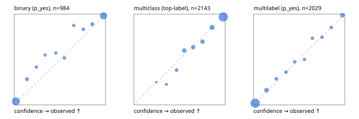

# Evaluation report

- model `Qwen/Qwen3.5-4B` @ `851bf6e806` (shared document / forked native cache branches), adapter/checkpoint `runs/qwen35_4b_tree_sft_fresh/adapter`, prompt `challenger-state-first-v1` (6c9d8459ac44)
- data data/ova/hf.jsonl, data/ova/eval.jsonl; splits ['test']; n=3471; calibration `None`
- cuda / bfloat16; 2026-09-26T06:40:22+0000; wall 545.5s

## Overall

question accuracy 84.5%

**binary**: n 984, positives 475, accuracy 0.902, precision 0.926, recall 0.867, f1 0.896, auroc 0.971, brier 0.070, log_loss 0.229, ece 0.038

**multiclass**: n 2143, accuracy 0.858, macro_f1 0.931, log_loss 0.405, brier 0.205, ece_top_label 0.020

**multilabel**: n 344, labels 2029, exact_match 0.599, micro_f1 0.778, macro_f1 0.827, label_auroc 0.959, brier 0.064, log_loss 0.208, ece 0.008

## By family

| family | n | question acc % | details |
|---|---|---|---|
| eval_adversarial | 27 | 100.0 | bin acc 100.0 F1 100.0 AUROC 1.000 ECE 0.011; mc acc 100.0 mF1 100.0 ECE 0.004; ml EM 100.0 µF1 100.0 ECE 0.005 |
| eval_agent_output | 26 | 80.8 | bin acc 100.0 F1 100.0 AUROC 1.000 ECE 0.065; mc acc 85.7 mF1 86.7 ECE 0.231; ml EM 20.0 µF1 75.0 ECE 0.157 |
| eval_evidence | 17 | 94.1 | bin acc 100.0 F1 100.0 AUROC 1.000 ECE 0.002; ml EM 50.0 µF1 66.7 ECE 0.205 |
| eval_multilabel | 32 | 96.9 | bin acc 100.0 F1 100.0 AUROC 1.000 ECE 0.063; mc acc 100.0 mF1 100.0 ECE 0.002; ml EM 95.8 µF1 99.0 ECE 0.014 |
| eval_policy | 22 | 68.2 | bin acc 76.9 F1 76.9 AUROC 0.857 ECE 0.261; mc acc 60.0 mF1 42.9 ECE 0.329; ml EM 50.0 µF1 88.9 ECE 0.155 |
| eval_routing | 25 | 92.0 | bin acc 100.0 F1 100.0 AUROC 1.000 ECE 0.012; mc acc 92.3 mF1 81.8 ECE 0.102; ml EM 50.0 µF1 80.0 ECE 0.104 |
| eval_urgency_sentiment | 22 | 95.5 | bin acc 90.0 F1 92.3 AUROC 0.958 ECE 0.127; mc acc 100.0 mF1 100.0 ECE 0.037; ml EM 100.0 µF1 100.0 ECE 0.002 |
| heldout_boolq | 300 | 85.3 | bin acc 85.3 F1 87.2 AUROC 0.957 ECE 0.086 |
| heldout_emotion_multiclass | 300 | 59.0 | mc acc 59.0 mF1 50.8 ECE 0.109 |
| heldout_intent_clinc | 300 | 96.0 | mc acc 96.0 mF1 96.9 ECE 0.019 |
| heldout_question_type_trec | 300 | 91.7 | mc acc 91.7 mF1 91.5 ECE 0.044 |
| heldout_sentiment_sst2 | 300 | 90.0 | bin acc 90.0 F1 89.4 AUROC 0.973 ECE 0.069 |
| heldout_topic_dbpedia | 300 | 97.7 | mc acc 97.7 mF1 97.4 ECE 0.010 |
| hf_emotions_multilabel | 300 | 57.0 | ml EM 57.0 µF1 73.4 ECE 0.010 |
| hf_intent_banking77 | 300 | 97.0 | mc acc 97.0 mF1 96.3 ECE 0.017 |
| hf_nli | 300 | 94.0 | bin acc 94.0 F1 91.7 AUROC 0.987 ECE 0.027 |
| hf_sentiment_tweets | 300 | 68.3 | mc acc 68.3 mF1 69.1 ECE 0.071 |
| hf_topic_agnews | 300 | 90.3 | mc acc 90.3 mF1 90.4 ECE 0.028 |

## by hard case

| slice | n | question acc % |
|---|---|---|
| (none) | 3042 | 84.4 |
| contradiction | 107 | 99.1 |
| distractor | 33 | 72.7 |
| double_negation | 6 | 83.3 |
| evidence_end | 13 | 92.3 |
| evidence_middle | 11 | 90.9 |
| evidence_start | 9 | 100.0 |
| exception | 7 | 57.1 |
| hypothetical | 7 | 100.0 |
| injection | 10 | 100.0 |
| lexical_overlap | 20 | 100.0 |
| long_state | 50 | 92.0 |
| missing_evidence | 104 | 91.3 |
| multi_positive | 81 | 42.0 |
| multi_turn | 9 | 88.9 |
| negation | 30 | 100.0 |
| new_label_names | 3 | 100.0 |
| nota | 46 | 100.0 |
| numeric_reasoning | 16 | 87.5 |
| paraphrase | 22 | 90.9 |
| role_reversal | 15 | 93.3 |
| sarcasm | 12 | 100.0 |
| temporal_reasoning | 29 | 72.4 |
| zero_positive | 6 | 100.0 |

## by state tokens

| slice | n | question acc % |
|---|---|---|
| 00000-00127 | 3213 | 84.4 |
| 00128-00511 | 206 | 84.0 |
| 00512-02047 | 52 | 92.3 |

## by candidates

| slice | n | question acc % |
|---|---|---|
| 01 | 984 | 90.2 |
| 03 | 310 | 69.4 |
| 04 | 333 | 88.9 |
| 05 | 22 | 90.9 |
| 06 | 1218 | 76.4 |
| 07 | 49 | 100.0 |
| 08 | 555 | 96.2 |

## Paraphrase groups

11 groups; same prediction 81.8%; all correct 90.9%

## Multiclass abstention (coverage vs error on accepted)

| abstain_below | coverage % | error % |
|---|---|---|
| 0.0 | 100.0 | 14.2 |
| 0.4 | 98.4 | 13.1 |
| 0.5 | 95.3 | 11.6 |
| 0.6 | 88.0 | 9.2 |
| 0.7 | 81.5 | 7.0 |
| 0.8 | 74.2 | 4.8 |
| 0.9 | 63.4 | 3.1 |

## Reliability: binary

| bin | n | mean confidence | observed frequency |
|---|---|---|---|
| [0.0,0.1) | 428 | 0.019 | 0.040 |
| [0.1,0.2) | 46 | 0.140 | 0.283 |
| [0.2,0.3) | 24 | 0.242 | 0.417 |
| [0.3,0.4) | 20 | 0.339 | 0.550 |
| [0.4,0.5) | 21 | 0.456 | 0.571 |
| [0.5,0.6) | 29 | 0.550 | 0.517 |
| [0.6,0.7) | 24 | 0.652 | 0.875 |
| [0.7,0.8) | 30 | 0.758 | 0.833 |
| [0.8,0.9) | 45 | 0.856 | 0.889 |
| [0.9,1.0] | 317 | 0.979 | 0.981 |

## Reliability: multiclass

| bin | n | mean confidence | observed frequency |
|---|---|---|---|
| [0.2,0.3) | 4 | 0.246 | 0.250 |
| [0.3,0.4) | 31 | 0.357 | 0.226 |
| [0.4,0.5) | 65 | 0.468 | 0.385 |
| [0.5,0.6) | 157 | 0.552 | 0.599 |
| [0.6,0.7) | 140 | 0.650 | 0.636 |
| [0.7,0.8) | 155 | 0.752 | 0.697 |
| [0.8,0.9) | 232 | 0.857 | 0.853 |
| [0.9,1.0] | 1359 | 0.980 | 0.969 |

## Reliability: multilabel

| bin | n | mean confidence | observed frequency |
|---|---|---|---|
| [0.0,0.1) | 1292 | 0.019 | 0.019 |
| [0.1,0.2) | 167 | 0.142 | 0.162 |
| [0.2,0.3) | 73 | 0.251 | 0.288 |
| [0.3,0.4) | 61 | 0.356 | 0.361 |
| [0.4,0.5) | 59 | 0.450 | 0.475 |
| [0.5,0.6) | 40 | 0.557 | 0.500 |
| [0.6,0.7) | 49 | 0.646 | 0.735 |
| [0.7,0.8) | 55 | 0.750 | 0.745 |
| [0.8,0.9) | 68 | 0.851 | 0.853 |
| [0.9,1.0] | 165 | 0.973 | 0.988 |
