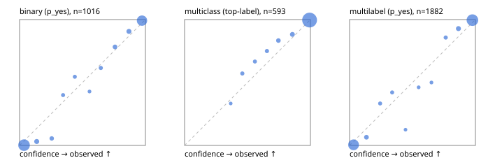

# Evaluation report

- model `Qwen/Qwen3.5-4B` @ `851bf6e806` (shared document / forked native cache branches), adapter/checkpoint `runs/qwen35_4b_tree_sft_jevall/adapter_last`, prompt `challenger-state-first-v1` (6c9d8459ac44)
- data data/ova/eval2.jsonl; splits ['test']; n=1991; calibration `None`
- cuda / bfloat16; 2026-09-26T14:35:55+0000; wall 172.2s

## Overall

question accuracy 95.7%

**binary**: n 1016, positives 435, accuracy 0.968, precision 0.955, recall 0.970, f1 0.962, auroc 0.996, brier 0.024, log_loss 0.101, ece 0.035

**multiclass**: n 593, accuracy 0.975, macro_f1 0.952, log_loss 0.077, brier 0.038, ece_top_label 0.009

**multilabel**: n 382, labels 1882, exact_match 0.903, micro_f1 0.978, macro_f1 0.960, label_auroc 0.996, brier 0.019, log_loss 0.083, ece 0.029

## By family

| family | n | question acc % | details |
|---|---|---|---|
| e2_hard | 673 | 95.5 | bin acc 97.1 F1 96.0 AUROC 0.997 ECE 0.052; mc acc 97.9 mF1 95.2 ECE 0.023; ml EM 87.9 µF1 96.8 ECE 0.030 |
| e2_simple | 664 | 98.5 | bin acc 97.1 F1 97.3 AUROC 0.998 ECE 0.034; mc acc 100.0 mF1 100.0 ECE 0.008; ml EM 100.0 µF1 100.0 ECE 0.031 |
| e2_very_hard | 654 | 93.1 | bin acc 96.0 F1 94.8 AUROC 0.993 ECE 0.046; mc acc 94.5 mF1 90.5 ECE 0.013; ml EM 83.8 µF1 96.4 ECE 0.036 |

## by hard case

| slice | n | question acc % |
|---|---|---|
| (none) | 569 | 98.4 |
| contradiction | 172 | 96.5 |
| distractor | 474 | 94.7 |
| double_negation | 126 | 95.2 |
| evidence_end | 57 | 96.5 |
| evidence_middle | 114 | 99.1 |
| evidence_start | 17 | 94.1 |
| exception | 213 | 93.9 |
| hypothetical | 128 | 96.1 |
| injection | 151 | 92.7 |
| lexical_overlap | 201 | 97.5 |
| long_state | 191 | 97.4 |
| missing_evidence | 141 | 98.6 |
| multi_positive | 322 | 90.7 |
| multi_turn | 149 | 92.6 |
| negation | 257 | 97.3 |
| nota | 118 | 95.8 |
| numeric_reasoning | 224 | 87.1 |
| paraphrase | 218 | 91.7 |
| role_reversal | 187 | 95.7 |
| sarcasm | 149 | 96.0 |
| temporal_reasoning | 203 | 84.2 |
| zero_positive | 73 | 93.2 |
| zero_positive_distractor | 1 | 100.0 |

## by state tokens

| slice | n | question acc % |
|---|---|---|
| 00000-00127 | 666 | 95.2 |
| 00128-00511 | 469 | 93.2 |
| 00512-02047 | 488 | 96.5 |
| 02048-08191 | 329 | 98.8 |
| 08192+ | 39 | 100.0 |

## by candidates

| slice | n | question acc % |
|---|---|---|
| 01 | 1016 | 96.8 |
| 03 | 128 | 96.9 |
| 04 | 515 | 95.9 |
| 05 | 224 | 92.0 |
| 06 | 86 | 90.7 |
| 07 | 18 | 100.0 |
| 08 | 4 | 75.0 |

## Paraphrase groups

76 groups; same prediction 76.3%; all correct 85.5%

## Multiclass abstention (coverage vs error on accepted)

| abstain_below | coverage % | error % |
|---|---|---|
| 0.0 | 100.0 | 2.5 |
| 0.4 | 99.5 | 2.2 |
| 0.5 | 98.3 | 1.7 |
| 0.6 | 97.3 | 1.4 |
| 0.7 | 96.0 | 1.1 |
| 0.8 | 93.9 | 0.7 |
| 0.9 | 91.1 | 0.4 |

## Reliability: binary

| bin | n | mean confidence | observed frequency |
|---|---|---|---|
| [0.0,0.1) | 503 | 0.036 | 0.002 |
| [0.1,0.2) | 32 | 0.136 | 0.031 |
| [0.2,0.3) | 18 | 0.255 | 0.056 |
| [0.3,0.4) | 10 | 0.346 | 0.400 |
| [0.4,0.5) | 11 | 0.439 | 0.545 |
| [0.5,0.6) | 7 | 0.556 | 0.429 |
| [0.6,0.7) | 13 | 0.646 | 0.615 |
| [0.7,0.8) | 23 | 0.758 | 0.783 |
| [0.8,0.9) | 32 | 0.869 | 0.906 |
| [0.9,1.0] | 367 | 0.973 | 0.992 |

## Reliability: multiclass

| bin | n | mean confidence | observed frequency |
|---|---|---|---|
| [0.3,0.4) | 3 | 0.366 | 0.333 |
| [0.4,0.5) | 7 | 0.459 | 0.571 |
| [0.5,0.6) | 6 | 0.559 | 0.667 |
| [0.6,0.7) | 8 | 0.655 | 0.750 |
| [0.7,0.8) | 12 | 0.746 | 0.833 |
| [0.8,0.9) | 17 | 0.857 | 0.882 |
| [0.9,1.0] | 540 | 0.993 | 0.996 |

## Reliability: multilabel

| bin | n | mean confidence | observed frequency |
|---|---|---|---|
| [0.0,0.1) | 764 | 0.032 | 0.005 |
| [0.1,0.2) | 46 | 0.134 | 0.065 |
| [0.2,0.3) | 18 | 0.243 | 0.333 |
| [0.3,0.4) | 19 | 0.338 | 0.421 |
| [0.4,0.5) | 8 | 0.445 | 0.125 |
| [0.5,0.6) | 13 | 0.549 | 0.462 |
| [0.6,0.7) | 12 | 0.651 | 0.500 |
| [0.7,0.8) | 21 | 0.764 | 0.857 |
| [0.8,0.9) | 56 | 0.865 | 0.929 |
| [0.9,1.0] | 925 | 0.976 | 0.996 |
