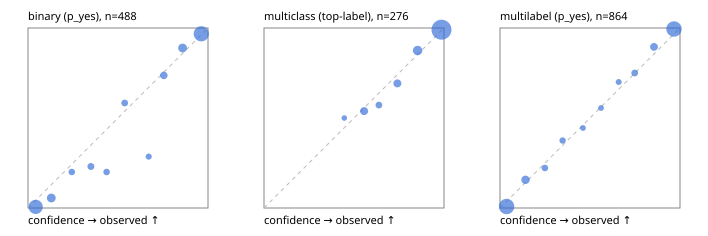

# Evaluation report

- model `Qwen/Qwen3.5-4B` @ `851bf6e806` (shared document / forked native cache branches), adapter/checkpoint `runs/qwen35_4b_tree_sft_jevall/adapter_last`, prompt `challenger-state-first-v1` (6c9d8459ac44)
- data data/ova/eval_llm.jsonl; splits ['test']; n=946; calibration `None`
- cuda / bfloat16; 2026-09-27T04:14:30+0000; wall 73.2s

## Overall

question accuracy 90.1%

**binary**: n 488, positives 245, accuracy 0.928, precision 0.904, recall 0.959, f1 0.931, auroc 0.977, brier 0.057, log_loss 0.203, ece 0.038

**multiclass**: n 276, accuracy 0.931, macro_f1 0.885, log_loss 0.181, brier 0.100, ece_top_label 0.011

**multilabel**: n 182, labels 864, exact_match 0.780, micro_f1 0.949, macro_f1 0.909, label_auroc 0.990, brier 0.038, log_loss 0.141, ece 0.027

## By family

| family | n | question acc % | details |
|---|---|---|---|
| tllm_guardrail_hard | 60 | 83.3 | bin acc 87.5 F1 87.5 AUROC 1.000 ECE 0.205; mc acc 88.2 mF1 80.4 ECE 0.092; ml EM 63.6 µF1 90.5 ECE 0.064 |
| tllm_guardrail_simple | 67 | 98.5 | bin acc 100.0 F1 100.0 AUROC 1.000 ECE 0.040; mc acc 100.0 mF1 100.0 ECE 0.023; ml EM 92.9 µF1 98.5 ECE 0.049 |
| tllm_guardrail_very_hard | 43 | 95.3 | bin acc 100.0 F1 100.0 AUROC 1.000 ECE 0.098; mc acc 100.0 mF1 100.0 ECE 0.080; ml EM 77.8 µF1 95.8 ECE 0.074 |
| tllm_jailbreak_hard | 59 | 94.9 | bin acc 96.3 F1 96.6 AUROC 1.000 ECE 0.078; mc acc 100.0 mF1 100.0 ECE 0.047; ml EM 83.3 µF1 96.3 ECE 0.081 |
| tllm_jailbreak_simple | 70 | 92.9 | bin acc 97.3 F1 97.6 AUROC 1.000 ECE 0.068; mc acc 90.9 mF1 76.5 ECE 0.056; ml EM 81.8 µF1 97.1 ECE 0.047 |
| tllm_jailbreak_very_hard | 60 | 86.7 | bin acc 87.5 F1 85.7 AUROC 0.955 ECE 0.127; mc acc 94.4 mF1 91.7 ECE 0.071; ml EM 70.0 µF1 94.5 ECE 0.061 |
| tllm_judge_hard | 86 | 93.0 | bin acc 92.5 F1 90.3 AUROC 0.968 ECE 0.108; mc acc 96.0 mF1 90.9 ECE 0.041; ml EM 90.5 µF1 94.3 ECE 0.070 |
| tllm_judge_simple | 72 | 94.4 | bin acc 97.4 F1 97.9 AUROC 0.997 ECE 0.069; mc acc 100.0 mF1 100.0 ECE 0.044; ml EM 78.6 µF1 96.4 ECE 0.061 |
| tllm_judge_very_hard | 64 | 82.8 | bin acc 90.6 F1 91.9 AUROC 0.984 ECE 0.124; mc acc 85.7 mF1 75.1 ECE 0.119; ml EM 54.5 µF1 93.0 ECE 0.107 |
| tllm_score_hard | 62 | 93.5 | bin acc 97.1 F1 97.0 AUROC 1.000 ECE 0.085; mc acc 100.0 mF1 100.0 ECE 0.046; ml EM 75.0 µF1 93.9 ECE 0.108 |
| tllm_score_simple | 62 | 96.8 | bin acc 97.1 F1 98.0 AUROC 0.954 ECE 0.065; mc acc 100.0 mF1 100.0 ECE 0.077; ml EM 91.7 µF1 98.6 ECE 0.053 |
| tllm_score_very_hard | 76 | 88.2 | bin acc 89.5 F1 84.6 AUROC 0.983 ECE 0.126; mc acc 90.9 mF1 82.6 ECE 0.115; ml EM 81.2 µF1 95.5 ECE 0.049 |
| tllm_verify_hard | 50 | 72.0 | bin acc 80.8 F1 78.3 AUROC 0.867 ECE 0.140; mc acc 75.0 mF1 57.9 ECE 0.126; ml EM 37.5 µF1 75.9 ECE 0.139 |
| tllm_verify_simple | 60 | 95.0 | bin acc 97.0 F1 97.7 AUROC 0.976 ECE 0.053; mc acc 100.0 mF1 100.0 ECE 0.011; ml EM 83.3 µF1 97.0 ECE 0.063 |
| tllm_verify_very_hard | 55 | 78.2 | bin acc 80.6 F1 75.0 AUROC 0.863 ECE 0.158; mc acc 73.3 mF1 62.7 ECE 0.138; ml EM 77.8 µF1 92.9 ECE 0.073 |

## by hard case

| slice | n | question acc % |
|---|---|---|
| (none) | 265 | 96.6 |
| answer_trace_mismatch | 45 | 80.0 |
| benign_lookalike | 88 | 87.5 |
| confident_wrong | 39 | 74.4 |
| contradiction | 22 | 100.0 |
| distractor | 117 | 88.9 |
| double_negation | 3 | 100.0 |
| evidence_end | 11 | 100.0 |
| evidence_middle | 20 | 70.0 |
| evidence_start | 2 | 50.0 |
| exception | 20 | 100.0 |
| fake_authority | 1 | 100.0 |
| flawed_step | 44 | 70.5 |
| format_near_miss | 46 | 84.8 |
| gradual_escalation | 1 | 100.0 |
| hypothetical | 7 | 100.0 |
| indirect_injection | 25 | 92.0 |
| injection | 22 | 95.5 |
| judge_injection | 112 | 85.7 |
| length_bias | 7 | 100.0 |
| lexical_overlap | 103 | 96.1 |
| long_state | 74 | 89.2 |
| missing_evidence | 35 | 94.3 |
| multi_positive | 124 | 75.8 |
| multi_turn | 44 | 86.4 |
| negation | 62 | 91.9 |
| nota | 55 | 87.3 |
| numeric_reasoning | 109 | 81.7 |
| obfuscation | 1 | 0.0 |
| over_refusal | 50 | 84.0 |
| paraphrase | 73 | 93.2 |
| partial_compliance | 31 | 67.7 |
| role_reversal | 6 | 83.3 |
| sarcasm | 8 | 87.5 |
| speaker_confusion | 58 | 87.9 |
| subtle_violation | 16 | 93.8 |
| sycophancy | 13 | 76.9 |
| temporal_reasoning | 20 | 85.0 |
| tool_misuse | 6 | 66.7 |
| unsupported_claim | 96 | 88.5 |
| zero_positive | 55 | 89.1 |
| zero_positive_partial | 1 | 100.0 |

## by state tokens

| slice | n | question acc % |
|---|---|---|
| 00000-00127 | 308 | 87.7 |
| 00128-00511 | 284 | 94.7 |
| 00512-02047 | 222 | 91.9 |
| 02048-08191 | 125 | 83.2 |
| 08192+ | 7 | 71.4 |

## by candidates

| slice | n | question acc % |
|---|---|---|
| 01 | 488 | 92.8 |
| 03 | 82 | 91.5 |
| 04 | 239 | 91.2 |
| 05 | 98 | 78.6 |
| 06 | 33 | 78.8 |
| 07 | 3 | 33.3 |
| 08 | 3 | 66.7 |

## Paraphrase groups

29 groups; same prediction 82.8%; all correct 82.8%

## Multiclass abstention (coverage vs error on accepted)

| abstain_below | coverage % | error % |
|---|---|---|
| 0.0 | 100.0 | 6.9 |
| 0.4 | 100.0 | 6.9 |
| 0.5 | 99.3 | 6.6 |
| 0.6 | 94.6 | 4.6 |
| 0.7 | 92.0 | 3.5 |
| 0.8 | 87.3 | 2.1 |
| 0.9 | 78.6 | 0.9 |

## Reliability: binary

| bin | n | mean confidence | observed frequency |
|---|---|---|---|
| [0.0,0.1) | 159 | 0.043 | 0.006 |
| [0.1,0.2) | 36 | 0.129 | 0.056 |
| [0.2,0.3) | 10 | 0.243 | 0.200 |
| [0.3,0.4) | 13 | 0.350 | 0.231 |
| [0.4,0.5) | 10 | 0.436 | 0.200 |
| [0.5,0.6) | 12 | 0.537 | 0.583 |
| [0.6,0.7) | 7 | 0.670 | 0.286 |
| [0.7,0.8) | 19 | 0.755 | 0.737 |
| [0.8,0.9) | 36 | 0.859 | 0.889 |
| [0.9,1.0] | 186 | 0.963 | 0.968 |

## Reliability: multiclass

| bin | n | mean confidence | observed frequency |
|---|---|---|---|
| [0.4,0.5) | 2 | 0.446 | 0.500 |
| [0.5,0.6) | 13 | 0.556 | 0.538 |
| [0.6,0.7) | 7 | 0.638 | 0.571 |
| [0.7,0.8) | 13 | 0.741 | 0.692 |
| [0.8,0.9) | 24 | 0.853 | 0.875 |
| [0.9,1.0] | 217 | 0.986 | 0.991 |

## Reliability: multilabel

| bin | n | mean confidence | observed frequency |
|---|---|---|---|
| [0.0,0.1) | 349 | 0.036 | 0.009 |
| [0.1,0.2) | 51 | 0.141 | 0.157 |
| [0.2,0.3) | 18 | 0.249 | 0.222 |
| [0.3,0.4) | 16 | 0.348 | 0.375 |
| [0.4,0.5) | 9 | 0.461 | 0.444 |
| [0.5,0.6) | 9 | 0.561 | 0.556 |
| [0.6,0.7) | 10 | 0.659 | 0.700 |
| [0.7,0.8) | 20 | 0.748 | 0.750 |
| [0.8,0.9) | 38 | 0.856 | 0.895 |
| [0.9,1.0] | 344 | 0.966 | 0.994 |
