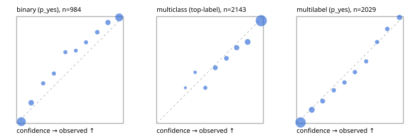

# Evaluation report

- model `Qwen/Qwen3.5-4B` @ `851bf6e806` (shared document / forked native cache branches), adapter/checkpoint `runs/qwen35_4b_tree_sft_jevall/adapter_last`, prompt `challenger-state-first-v1` (6c9d8459ac44)
- data data/ova/hf.jsonl, data/ova/eval.jsonl; splits ['test']; n=3471; calibration `None`
- cuda / bfloat16; 2026-09-26T14:44:46+0000; wall 530.3s

## Overall

question accuracy 84.4%

**binary**: n 984, positives 475, accuracy 0.905, precision 0.940, recall 0.859, f1 0.898, auroc 0.976, brier 0.067, log_loss 0.226, ece 0.055

**multiclass**: n 2143, accuracy 0.857, macro_f1 0.938, log_loss 0.414, brier 0.211, ece_top_label 0.033

**multilabel**: n 344, labels 2029, exact_match 0.590, micro_f1 0.763, macro_f1 0.855, label_auroc 0.953, brier 0.070, log_loss 0.232, ece 0.031

## By family

| family | n | question acc % | details |
|---|---|---|---|
| eval_adversarial | 27 | 100.0 | bin acc 100.0 F1 100.0 AUROC 1.000 ECE 0.064; mc acc 100.0 mF1 100.0 ECE 0.004; ml EM 100.0 µF1 100.0 ECE 0.034 |
| eval_agent_output | 26 | 96.2 | bin acc 100.0 F1 100.0 AUROC 1.000 ECE 0.061; mc acc 85.7 mF1 86.7 ECE 0.242; ml EM 100.0 µF1 100.0 ECE 0.106 |
| eval_evidence | 17 | 94.1 | bin acc 100.0 F1 100.0 AUROC 1.000 ECE 0.028; ml EM 50.0 µF1 66.7 ECE 0.177 |
| eval_multilabel | 32 | 93.8 | bin acc 85.7 F1 80.0 AUROC 1.000 ECE 0.107; mc acc 100.0 mF1 100.0 ECE 0.003; ml EM 95.8 µF1 98.0 ECE 0.037 |
| eval_policy | 22 | 68.2 | bin acc 76.9 F1 76.9 AUROC 0.881 ECE 0.289; mc acc 60.0 mF1 42.9 ECE 0.320; ml EM 50.0 µF1 88.9 ECE 0.131 |
| eval_routing | 25 | 96.0 | bin acc 100.0 F1 100.0 AUROC 1.000 ECE 0.029; mc acc 100.0 mF1 100.0 ECE 0.059; ml EM 50.0 µF1 80.0 ECE 0.135 |
| eval_urgency_sentiment | 22 | 95.5 | bin acc 90.0 F1 92.3 AUROC 0.958 ECE 0.139; mc acc 100.0 mF1 100.0 ECE 0.035; ml EM 100.0 µF1 100.0 ECE 0.032 |
| heldout_boolq | 300 | 85.3 | bin acc 85.3 F1 87.0 AUROC 0.957 ECE 0.070 |
| heldout_emotion_multiclass | 300 | 58.7 | mc acc 58.7 mF1 50.9 ECE 0.157 |
| heldout_intent_clinc | 300 | 95.3 | mc acc 95.3 mF1 96.1 ECE 0.021 |
| heldout_question_type_trec | 300 | 91.7 | mc acc 91.7 mF1 91.4 ECE 0.040 |
| heldout_sentiment_sst2 | 300 | 90.0 | bin acc 90.0 F1 89.4 AUROC 0.978 ECE 0.084 |
| heldout_topic_dbpedia | 300 | 97.7 | mc acc 97.7 mF1 97.4 ECE 0.013 |
| hf_emotions_multilabel | 300 | 54.7 | ml EM 54.7 µF1 71.3 ECE 0.030 |
| hf_intent_banking77 | 300 | 97.3 | mc acc 97.3 mF1 97.4 ECE 0.018 |
| hf_nli | 300 | 95.3 | bin acc 95.3 F1 93.5 AUROC 0.989 ECE 0.051 |
| hf_sentiment_tweets | 300 | 68.7 | mc acc 68.7 mF1 69.5 ECE 0.121 |
| hf_topic_agnews | 300 | 89.3 | mc acc 89.3 mF1 89.4 ECE 0.050 |

## by hard case

| slice | n | question acc % |
|---|---|---|
| (none) | 3042 | 84.0 |
| contradiction | 107 | 100.0 |
| distractor | 33 | 78.8 |
| double_negation | 6 | 83.3 |
| evidence_end | 13 | 92.3 |
| evidence_middle | 11 | 90.9 |
| evidence_start | 9 | 100.0 |
| exception | 7 | 57.1 |
| hypothetical | 7 | 100.0 |
| injection | 10 | 100.0 |
| lexical_overlap | 20 | 100.0 |
| long_state | 50 | 92.0 |
| missing_evidence | 104 | 94.2 |
| multi_positive | 81 | 48.1 |
| multi_turn | 9 | 88.9 |
| negation | 30 | 100.0 |
| new_label_names | 3 | 100.0 |
| nota | 46 | 100.0 |
| numeric_reasoning | 16 | 81.2 |
| paraphrase | 22 | 90.9 |
| role_reversal | 15 | 93.3 |
| sarcasm | 12 | 100.0 |
| temporal_reasoning | 29 | 69.0 |
| zero_positive | 6 | 100.0 |

## by state tokens

| slice | n | question acc % |
|---|---|---|
| 00000-00127 | 3213 | 84.2 |
| 00128-00511 | 206 | 86.4 |
| 00512-02047 | 52 | 92.3 |

## by candidates

| slice | n | question acc % |
|---|---|---|
| 01 | 984 | 90.5 |
| 03 | 310 | 69.7 |
| 04 | 333 | 88.9 |
| 05 | 22 | 95.5 |
| 06 | 1218 | 75.9 |
| 07 | 49 | 100.0 |
| 08 | 555 | 96.0 |

## Paraphrase groups

11 groups; same prediction 81.8%; all correct 90.9%

## Multiclass abstention (coverage vs error on accepted)

| abstain_below | coverage % | error % |
|---|---|---|
| 0.0 | 100.0 | 14.3 |
| 0.4 | 98.6 | 13.8 |
| 0.5 | 95.8 | 12.2 |
| 0.6 | 90.3 | 10.0 |
| 0.7 | 85.4 | 8.4 |
| 0.8 | 78.0 | 6.4 |
| 0.9 | 68.0 | 3.8 |

## Reliability: binary

| bin | n | mean confidence | observed frequency |
|---|---|---|---|
| [0.0,0.1) | 373 | 0.045 | 0.016 |
| [0.1,0.2) | 88 | 0.137 | 0.193 |
| [0.2,0.3) | 32 | 0.249 | 0.375 |
| [0.3,0.4) | 30 | 0.349 | 0.467 |
| [0.4,0.5) | 27 | 0.457 | 0.667 |
| [0.5,0.6) | 22 | 0.555 | 0.682 |
| [0.6,0.7) | 29 | 0.650 | 0.759 |
| [0.7,0.8) | 41 | 0.755 | 0.854 |
| [0.8,0.9) | 73 | 0.855 | 0.945 |
| [0.9,1.0] | 269 | 0.960 | 0.993 |

## Reliability: multiclass

| bin | n | mean confidence | observed frequency |
|---|---|---|---|
| [0.2,0.3) | 6 | 0.270 | 0.333 |
| [0.3,0.4) | 23 | 0.361 | 0.478 |
| [0.4,0.5) | 60 | 0.456 | 0.333 |
| [0.5,0.6) | 119 | 0.549 | 0.521 |
| [0.6,0.7) | 105 | 0.654 | 0.610 |
| [0.7,0.8) | 158 | 0.750 | 0.709 |
| [0.8,0.9) | 215 | 0.853 | 0.763 |
| [0.9,1.0] | 1457 | 0.980 | 0.962 |

## Reliability: multilabel

| bin | n | mean confidence | observed frequency |
|---|---|---|---|
| [0.0,0.1) | 1125 | 0.037 | 0.009 |
| [0.1,0.2) | 228 | 0.142 | 0.127 |
| [0.2,0.3) | 115 | 0.244 | 0.209 |
| [0.3,0.4) | 71 | 0.348 | 0.310 |
| [0.4,0.5) | 73 | 0.448 | 0.384 |
| [0.5,0.6) | 75 | 0.546 | 0.480 |
| [0.6,0.7) | 62 | 0.652 | 0.581 |
| [0.7,0.8) | 63 | 0.753 | 0.762 |
| [0.8,0.9) | 78 | 0.849 | 0.885 |
| [0.9,1.0] | 139 | 0.963 | 0.993 |
