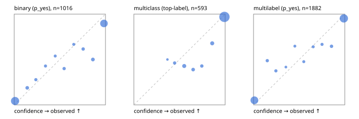

# Evaluation report

- model `Qwen/Qwen3.5-2B` @ `15852e8c16` (shared document / forked native cache branches), adapter/checkpoint `runs/challengers/qwen35/adapter`, prompt `challenger-state-first-v1` (6c9d8459ac44)
- data data/eval2.jsonl; splits ['test']; n=1991; calibration `None`
- cuda / bfloat16; 2026-09-24T23:08:22+0000; wall 199.9s

## Overall

question accuracy 84.3%

**binary**: n 1016, positives 435, accuracy 0.875, precision 0.825, recall 0.899, f1 0.860, auroc 0.952, brier 0.098, log_loss 0.353, ece 0.072

**multiclass**: n 593, accuracy 0.887, macro_f1 0.810, log_loss 0.343, brier 0.164, ece_top_label 0.050

**multilabel**: n 382, labels 1882, exact_match 0.688, micro_f1 0.915, macro_f1 0.848, label_auroc 0.969, brier 0.073, log_loss 0.273, ece 0.053

## By family

| family | n | question acc % | details |
|---|---|---|---|
| e2_hard | 673 | 80.4 | bin acc 83.6 F1 79.6 AUROC 0.933 ECE 0.104; mc acc 85.5 mF1 77.2 ECE 0.060; ml EM 64.4 µF1 89.8 ECE 0.071 |
| e2_simple | 664 | 92.3 | bin acc 94.5 F1 94.9 AUROC 0.982 ECE 0.033; mc acc 96.0 mF1 92.4 ECE 0.017; ml EM 80.0 µF1 95.7 ECE 0.035 |
| e2_very_hard | 654 | 80.1 | bin acc 84.3 F1 80.2 AUROC 0.917 ECE 0.103; mc acc 84.5 mF1 73.2 ECE 0.085; ml EM 63.1 µF1 89.1 ECE 0.068 |

## by hard case

| slice | n | question acc % |
|---|---|---|
| (none) | 569 | 93.8 |
| contradiction | 172 | 86.6 |
| distractor | 474 | 80.6 |
| double_negation | 126 | 75.4 |
| evidence_end | 57 | 86.0 |
| evidence_middle | 114 | 89.5 |
| evidence_start | 17 | 64.7 |
| exception | 213 | 83.1 |
| hypothetical | 128 | 84.4 |
| injection | 151 | 73.5 |
| lexical_overlap | 201 | 88.6 |
| long_state | 191 | 81.7 |
| missing_evidence | 141 | 86.5 |
| multi_positive | 322 | 71.4 |
| multi_turn | 149 | 84.6 |
| negation | 257 | 83.7 |
| nota | 118 | 81.4 |
| numeric_reasoning | 224 | 70.1 |
| paraphrase | 218 | 80.7 |
| role_reversal | 187 | 82.9 |
| sarcasm | 149 | 71.8 |
| temporal_reasoning | 203 | 69.0 |
| zero_positive | 73 | 78.1 |
| zero_positive_distractor | 1 | 100.0 |

## by state tokens

| slice | n | question acc % |
|---|---|---|
| 00000-00127 | 666 | 82.4 |
| 00128-00511 | 469 | 79.3 |
| 00512-02047 | 488 | 89.3 |
| 02048-08191 | 329 | 87.5 |
| 08192+ | 39 | 84.6 |

## by candidates

| slice | n | question acc % |
|---|---|---|
| 01 | 1016 | 87.5 |
| 03 | 128 | 85.9 |
| 04 | 515 | 85.6 |
| 05 | 224 | 69.6 |
| 06 | 86 | 76.7 |
| 07 | 18 | 72.2 |
| 08 | 4 | 75.0 |

## Paraphrase groups

76 groups; same prediction 68.4%; all correct 68.4%

## Multiclass abstention (coverage vs error on accepted)

| abstain_below | coverage % | error % |
|---|---|---|
| 0.0 | 100.0 | 11.3 |
| 0.4 | 99.7 | 11.2 |
| 0.5 | 97.5 | 10.2 |
| 0.6 | 92.7 | 7.8 |
| 0.7 | 89.7 | 6.0 |
| 0.8 | 87.4 | 4.6 |
| 0.9 | 82.6 | 3.1 |

## Reliability: binary

| bin | n | mean confidence | observed frequency |
|---|---|---|---|
| [0.0,0.1) | 465 | 0.009 | 0.043 |
| [0.1,0.2) | 32 | 0.143 | 0.188 |
| [0.2,0.3) | 18 | 0.237 | 0.278 |
| [0.3,0.4) | 14 | 0.343 | 0.429 |
| [0.4,0.5) | 13 | 0.450 | 0.538 |
| [0.5,0.6) | 20 | 0.547 | 0.400 |
| [0.6,0.7) | 12 | 0.652 | 0.667 |
| [0.7,0.8) | 26 | 0.756 | 0.615 |
| [0.8,0.9) | 36 | 0.862 | 0.500 |
| [0.9,1.0] | 380 | 0.983 | 0.897 |

## Reliability: multiclass

| bin | n | mean confidence | observed frequency |
|---|---|---|---|
| [0.3,0.4) | 2 | 0.368 | 0.500 |
| [0.4,0.5) | 13 | 0.447 | 0.462 |
| [0.5,0.6) | 28 | 0.552 | 0.429 |
| [0.6,0.7) | 18 | 0.650 | 0.389 |
| [0.7,0.8) | 14 | 0.745 | 0.429 |
| [0.8,0.9) | 28 | 0.858 | 0.679 |
| [0.9,1.0] | 490 | 0.992 | 0.969 |

## Reliability: multilabel

| bin | n | mean confidence | observed frequency |
|---|---|---|---|
| [0.0,0.1) | 752 | 0.009 | 0.051 |
| [0.1,0.2) | 39 | 0.150 | 0.487 |
| [0.2,0.3) | 32 | 0.245 | 0.375 |
| [0.3,0.4) | 12 | 0.354 | 0.417 |
| [0.4,0.5) | 17 | 0.453 | 0.647 |
| [0.5,0.6) | 21 | 0.550 | 0.476 |
| [0.6,0.7) | 25 | 0.654 | 0.640 |
| [0.7,0.8) | 30 | 0.751 | 0.667 |
| [0.8,0.9) | 48 | 0.855 | 0.646 |
| [0.9,1.0] | 906 | 0.989 | 0.953 |
