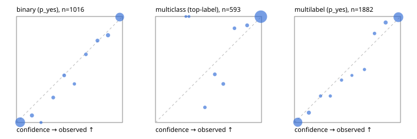

# Evaluation report

- model `Qwen/Qwen3.5-4B` @ `851bf6e806` (shared-prefix tree, forward only: text once per request, each question once, then each candidate), adapter/checkpoint `runs/selfjev_4b_repro/adapter`, prompt `challenger-state-first-v1` (6c9d8459ac44)
- data data/ova/eval2.jsonl; splits ['test']; n=1991; calibration `None`
- cuda / bfloat16; 2026-09-28T04:55:29+0000; wall 307.8s

## Overall

question accuracy 95.1%

**binary**: n 1016, positives 435, accuracy 0.961, precision 0.944, recall 0.966, f1 0.955, auroc 0.995, brier 0.029, log_loss 0.111, ece 0.033

**multiclass**: n 593, accuracy 0.963, macro_f1 0.937, log_loss 0.087, brier 0.047, ece_top_label 0.021

**multilabel**: n 382, labels 1882, exact_match 0.906, micro_f1 0.977, macro_f1 0.955, label_auroc 0.997, brier 0.019, log_loss 0.082, ece 0.026

## By family

| family | n | question acc % | details |
|---|---|---|---|
| e2_hard | 673 | 93.8 | bin acc 95.7 F1 94.0 AUROC 0.992 ECE 0.038; mc acc 95.9 mF1 91.0 ECE 0.022; ml EM 85.6 µF1 95.7 ECE 0.022 |
| e2_simple | 664 | 97.9 | bin acc 97.1 F1 97.3 AUROC 0.997 ECE 0.035; mc acc 99.5 mF1 99.4 ECE 0.005; ml EM 97.5 µF1 99.6 ECE 0.027 |
| e2_very_hard | 654 | 93.6 | bin acc 95.4 F1 94.1 AUROC 0.995 ECE 0.056; mc acc 93.5 mF1 90.7 ECE 0.041; ml EM 89.2 µF1 97.9 ECE 0.038 |

## by hard case

| slice | n | question acc % |
|---|---|---|
| (none) | 569 | 98.1 |
| contradiction | 172 | 95.9 |
| distractor | 474 | 92.6 |
| double_negation | 126 | 96.0 |
| evidence_end | 57 | 98.2 |
| evidence_middle | 114 | 97.4 |
| evidence_start | 17 | 100.0 |
| exception | 213 | 93.0 |
| hypothetical | 128 | 96.1 |
| injection | 151 | 93.4 |
| lexical_overlap | 201 | 98.5 |
| long_state | 191 | 97.4 |
| missing_evidence | 141 | 98.6 |
| multi_positive | 322 | 91.9 |
| multi_turn | 149 | 93.3 |
| negation | 257 | 98.1 |
| nota | 118 | 93.2 |
| numeric_reasoning | 224 | 87.9 |
| paraphrase | 218 | 91.7 |
| role_reversal | 187 | 95.2 |
| sarcasm | 149 | 96.0 |
| temporal_reasoning | 203 | 83.7 |
| zero_positive | 73 | 90.4 |
| zero_positive_distractor | 1 | 100.0 |

## by state tokens

| slice | n | question acc % |
|---|---|---|
| 00000-00127 | 666 | 94.6 |
| 00128-00511 | 469 | 91.7 |
| 00512-02047 | 488 | 96.9 |
| 02048-08191 | 329 | 97.9 |
| 08192+ | 39 | 97.4 |

## by candidates

| slice | n | question acc % |
|---|---|---|
| 01 | 1016 | 96.1 |
| 03 | 128 | 96.1 |
| 04 | 515 | 94.4 |
| 05 | 224 | 91.1 |
| 06 | 86 | 96.5 |
| 07 | 18 | 100.0 |
| 08 | 4 | 75.0 |

## Paraphrase groups

76 groups; same prediction 81.6%; all correct 85.5%

## Multiclass abstention (coverage vs error on accepted)

| abstain_below | coverage % | error % |
|---|---|---|
| 0.0 | 100.0 | 3.7 |
| 0.4 | 99.5 | 3.7 |
| 0.5 | 98.3 | 2.7 |
| 0.6 | 96.5 | 1.7 |
| 0.7 | 94.6 | 0.5 |
| 0.8 | 93.1 | 0.4 |
| 0.9 | 91.1 | 0.2 |

## Reliability: binary

| bin | n | mean confidence | observed frequency |
|---|---|---|---|
| [0.0,0.1) | 501 | 0.035 | 0.002 |
| [0.1,0.2) | 30 | 0.146 | 0.067 |
| [0.2,0.3) | 5 | 0.231 | 0.000 |
| [0.3,0.4) | 17 | 0.347 | 0.235 |
| [0.4,0.5) | 18 | 0.450 | 0.444 |
| [0.5,0.6) | 11 | 0.546 | 0.364 |
| [0.6,0.7) | 14 | 0.655 | 0.643 |
| [0.7,0.8) | 22 | 0.764 | 0.773 |
| [0.8,0.9) | 34 | 0.863 | 0.824 |
| [0.9,1.0] | 364 | 0.974 | 0.995 |

## Reliability: multiclass

| bin | n | mean confidence | observed frequency |
|---|---|---|---|
| [0.2,0.3) | 1 | 0.287 | 1.000 |
| [0.3,0.4) | 2 | 0.316 | 1.000 |
| [0.4,0.5) | 7 | 0.466 | 0.143 |
| [0.5,0.6) | 11 | 0.559 | 0.455 |
| [0.6,0.7) | 11 | 0.639 | 0.364 |
| [0.7,0.8) | 9 | 0.745 | 0.889 |
| [0.8,0.9) | 12 | 0.864 | 0.917 |
| [0.9,1.0] | 540 | 0.994 | 0.998 |

## Reliability: multilabel

| bin | n | mean confidence | observed frequency |
|---|---|---|---|
| [0.0,0.1) | 751 | 0.031 | 0.003 |
| [0.1,0.2) | 54 | 0.136 | 0.093 |
| [0.2,0.3) | 16 | 0.246 | 0.250 |
| [0.3,0.4) | 16 | 0.338 | 0.250 |
| [0.4,0.5) | 15 | 0.444 | 0.400 |
| [0.5,0.6) | 9 | 0.542 | 0.444 |
| [0.6,0.7) | 16 | 0.660 | 0.500 |
| [0.7,0.8) | 25 | 0.755 | 0.840 |
| [0.8,0.9) | 53 | 0.860 | 0.943 |
| [0.9,1.0] | 927 | 0.980 | 0.994 |
