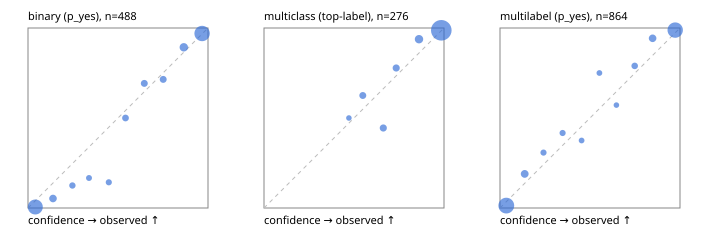

# Evaluation report

- model `Qwen/Qwen3.5-4B` @ `851bf6e806` (shared-prefix tree, forward only: text once per request, each question once, then each candidate), adapter/checkpoint `runs/selfjev_4b_repro/adapter`, prompt `challenger-state-first-v1` (6c9d8459ac44)
- data data/ova/eval_llm.jsonl; splits ['test']; n=946; calibration `None`
- cuda / bfloat16; 2026-09-28T04:59:29+0000; wall 105.0s

## Overall

question accuracy 92.0%

**binary**: n 488, positives 245, accuracy 0.943, precision 0.913, recall 0.980, f1 0.945, auroc 0.982, brier 0.048, log_loss 0.176, ece 0.031

**multiclass**: n 276, accuracy 0.946, macro_f1 0.927, log_loss 0.155, brier 0.081, ece_top_label 0.017

**multilabel**: n 182, labels 864, exact_match 0.819, micro_f1 0.954, macro_f1 0.916, label_auroc 0.990, brier 0.036, log_loss 0.135, ece 0.028

## By family

| family | n | question acc % | details |
|---|---|---|---|
| tllm_guardrail_hard | 60 | 88.3 | bin acc 93.8 F1 93.3 AUROC 1.000 ECE 0.147; mc acc 94.1 mF1 87.5 ECE 0.058; ml EM 63.6 µF1 90.5 ECE 0.080 |
| tllm_guardrail_simple | 67 | 100.0 | bin acc 100.0 F1 100.0 AUROC 1.000 ECE 0.027; mc acc 100.0 mF1 100.0 ECE 0.015; ml EM 100.0 µF1 100.0 ECE 0.032 |
| tllm_guardrail_very_hard | 43 | 97.7 | bin acc 100.0 F1 100.0 AUROC 1.000 ECE 0.068; mc acc 100.0 mF1 100.0 ECE 0.057; ml EM 88.9 µF1 98.0 ECE 0.074 |
| tllm_jailbreak_hard | 59 | 98.3 | bin acc 100.0 F1 100.0 AUROC 1.000 ECE 0.080; mc acc 95.0 mF1 88.2 ECE 0.060; ml EM 100.0 µF1 100.0 ECE 0.052 |
| tllm_jailbreak_simple | 70 | 97.1 | bin acc 100.0 F1 100.0 AUROC 1.000 ECE 0.046; mc acc 100.0 mF1 100.0 ECE 0.035; ml EM 81.8 µF1 97.1 ECE 0.032 |
| tllm_jailbreak_very_hard | 60 | 88.3 | bin acc 90.6 F1 89.7 AUROC 0.955 ECE 0.100; mc acc 94.4 mF1 91.7 ECE 0.033; ml EM 70.0 µF1 94.5 ECE 0.048 |
| tllm_judge_hard | 86 | 94.2 | bin acc 95.0 F1 93.3 AUROC 0.960 ECE 0.092; mc acc 100.0 mF1 100.0 ECE 0.018; ml EM 85.7 µF1 92.6 ECE 0.037 |
| tllm_judge_simple | 72 | 95.8 | bin acc 100.0 F1 100.0 AUROC 1.000 ECE 0.057; mc acc 100.0 mF1 100.0 ECE 0.037; ml EM 78.6 µF1 95.1 ECE 0.055 |
| tllm_judge_very_hard | 64 | 87.5 | bin acc 96.9 F1 97.3 AUROC 0.996 ECE 0.071; mc acc 85.7 mF1 87.7 ECE 0.084; ml EM 63.6 µF1 94.3 ECE 0.109 |
| tllm_score_hard | 62 | 93.5 | bin acc 91.2 F1 91.4 AUROC 0.986 ECE 0.073; mc acc 100.0 mF1 100.0 ECE 0.070; ml EM 91.7 µF1 98.0 ECE 0.094 |
| tllm_score_simple | 62 | 98.4 | bin acc 97.1 F1 98.0 AUROC 0.971 ECE 0.089; mc acc 100.0 mF1 100.0 ECE 0.055; ml EM 100.0 µF1 100.0 ECE 0.037 |
| tllm_score_very_hard | 76 | 86.8 | bin acc 89.5 F1 84.6 AUROC 0.987 ECE 0.095; mc acc 86.4 mF1 75.0 ECE 0.098; ml EM 81.2 µF1 95.5 ECE 0.070 |
| tllm_verify_hard | 50 | 74.0 | bin acc 80.8 F1 80.0 AUROC 0.861 ECE 0.152; mc acc 81.2 mF1 70.6 ECE 0.079; ml EM 37.5 µF1 71.4 ECE 0.206 |
| tllm_verify_simple | 60 | 96.7 | bin acc 97.0 F1 97.7 AUROC 1.000 ECE 0.052; mc acc 100.0 mF1 100.0 ECE 0.004; ml EM 91.7 µF1 98.5 ECE 0.033 |
| tllm_verify_very_hard | 55 | 78.2 | bin acc 80.6 F1 76.9 AUROC 0.876 ECE 0.130; mc acc 80.0 mF1 74.4 ECE 0.170; ml EM 66.7 µF1 84.6 ECE 0.113 |

## by hard case

| slice | n | question acc % |
|---|---|---|
| (none) | 265 | 97.7 |
| answer_trace_mismatch | 45 | 84.4 |
| benign_lookalike | 88 | 90.9 |
| confident_wrong | 39 | 76.9 |
| contradiction | 22 | 100.0 |
| distractor | 117 | 92.3 |
| double_negation | 3 | 100.0 |
| evidence_end | 11 | 100.0 |
| evidence_middle | 20 | 75.0 |
| evidence_start | 2 | 0.0 |
| exception | 20 | 100.0 |
| fake_authority | 1 | 100.0 |
| flawed_step | 44 | 61.4 |
| format_near_miss | 46 | 87.0 |
| gradual_escalation | 1 | 100.0 |
| hypothetical | 7 | 100.0 |
| indirect_injection | 25 | 100.0 |
| injection | 22 | 100.0 |
| judge_injection | 112 | 88.4 |
| length_bias | 7 | 100.0 |
| lexical_overlap | 103 | 92.2 |
| long_state | 74 | 93.2 |
| missing_evidence | 35 | 94.3 |
| multi_positive | 124 | 80.6 |
| multi_turn | 44 | 86.4 |
| negation | 62 | 93.5 |
| nota | 55 | 89.1 |
| numeric_reasoning | 109 | 78.9 |
| obfuscation | 1 | 100.0 |
| over_refusal | 50 | 84.0 |
| paraphrase | 73 | 93.2 |
| partial_compliance | 31 | 71.0 |
| role_reversal | 6 | 83.3 |
| sarcasm | 8 | 75.0 |
| speaker_confusion | 58 | 93.1 |
| subtle_violation | 16 | 87.5 |
| sycophancy | 13 | 100.0 |
| temporal_reasoning | 20 | 95.0 |
| tool_misuse | 6 | 100.0 |
| unsupported_claim | 96 | 89.6 |
| zero_positive | 55 | 94.5 |
| zero_positive_partial | 1 | 100.0 |

## by state tokens

| slice | n | question acc % |
|---|---|---|
| 00000-00127 | 308 | 89.6 |
| 00128-00511 | 284 | 95.8 |
| 00512-02047 | 222 | 91.9 |
| 02048-08191 | 125 | 88.8 |
| 08192+ | 7 | 100.0 |

## by candidates

| slice | n | question acc % |
|---|---|---|
| 01 | 488 | 94.3 |
| 03 | 82 | 91.5 |
| 04 | 239 | 93.3 |
| 05 | 98 | 79.6 |
| 06 | 33 | 87.9 |
| 07 | 3 | 100.0 |
| 08 | 3 | 66.7 |

## Paraphrase groups

29 groups; same prediction 93.1%; all correct 89.7%

## Multiclass abstention (coverage vs error on accepted)

| abstain_below | coverage % | error % |
|---|---|---|
| 0.0 | 100.0 | 5.4 |
| 0.4 | 100.0 | 5.4 |
| 0.5 | 99.3 | 5.1 |
| 0.6 | 96.4 | 4.1 |
| 0.7 | 93.1 | 2.3 |
| 0.8 | 89.9 | 1.6 |
| 0.9 | 84.1 | 1.3 |

## Reliability: binary

| bin | n | mean confidence | observed frequency |
|---|---|---|---|
| [0.0,0.1) | 185 | 0.040 | 0.005 |
| [0.1,0.2) | 19 | 0.139 | 0.053 |
| [0.2,0.3) | 8 | 0.247 | 0.125 |
| [0.3,0.4) | 6 | 0.339 | 0.167 |
| [0.4,0.5) | 7 | 0.449 | 0.143 |
| [0.5,0.6) | 12 | 0.541 | 0.500 |
| [0.6,0.7) | 13 | 0.646 | 0.692 |
| [0.7,0.8) | 14 | 0.751 | 0.714 |
| [0.8,0.9) | 28 | 0.865 | 0.893 |
| [0.9,1.0] | 196 | 0.967 | 0.969 |

## Reliability: multiclass

| bin | n | mean confidence | observed frequency |
|---|---|---|---|
| [0.4,0.5) | 2 | 0.472 | 0.500 |
| [0.5,0.6) | 8 | 0.549 | 0.625 |
| [0.6,0.7) | 9 | 0.663 | 0.444 |
| [0.7,0.8) | 9 | 0.735 | 0.778 |
| [0.8,0.9) | 16 | 0.861 | 0.938 |
| [0.9,1.0] | 232 | 0.985 | 0.987 |

## Reliability: multilabel

| bin | n | mean confidence | observed frequency |
|---|---|---|---|
| [0.0,0.1) | 375 | 0.035 | 0.013 |
| [0.1,0.2) | 37 | 0.137 | 0.189 |
| [0.2,0.3) | 13 | 0.242 | 0.308 |
| [0.3,0.4) | 12 | 0.348 | 0.417 |
| [0.4,0.5) | 8 | 0.453 | 0.375 |
| [0.5,0.6) | 8 | 0.552 | 0.750 |
| [0.6,0.7) | 7 | 0.647 | 0.571 |
| [0.7,0.8) | 19 | 0.749 | 0.789 |
| [0.8,0.9) | 35 | 0.848 | 0.943 |
| [0.9,1.0] | 350 | 0.974 | 0.989 |
