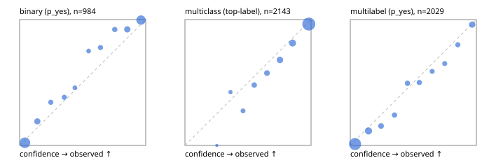

# Evaluation report

- model `Qwen/Qwen3.5-4B` @ `851bf6e806` (shared-prefix tree, forward only: text once per request, each question once, then each candidate), adapter/checkpoint `runs/selfjev_4b_repro/adapter`, prompt `challenger-state-first-v1` (6c9d8459ac44)
- data data/ova/hf.jsonl, data/ova/eval.jsonl; splits ['test']; n=3471; calibration `None`
- cuda / bfloat16; 2026-09-28T04:57:35+0000; wall 116.2s

## Overall

question accuracy 83.8%

**binary**: n 984, positives 475, accuracy 0.918, precision 0.946, recall 0.880, f1 0.912, auroc 0.973, brier 0.065, log_loss 0.225, ece 0.047

**multiclass**: n 2143, accuracy 0.852, macro_f1 0.938, log_loss 0.412, brier 0.210, ece_top_label 0.036

**multilabel**: n 344, labels 2029, exact_match 0.523, micro_f1 0.739, macro_f1 0.835, label_auroc 0.941, brier 0.078, log_loss 0.255, ece 0.038

## By family

| family | n | question acc % | details |
|---|---|---|---|
| eval_adversarial | 27 | 100.0 | bin acc 100.0 F1 100.0 AUROC 1.000 ECE 0.063; mc acc 100.0 mF1 100.0 ECE 0.003; ml EM 100.0 µF1 100.0 ECE 0.041 |
| eval_agent_output | 26 | 92.3 | bin acc 100.0 F1 100.0 AUROC 1.000 ECE 0.043; mc acc 85.7 mF1 86.7 ECE 0.140; ml EM 80.0 µF1 94.1 ECE 0.090 |
| eval_evidence | 17 | 94.1 | bin acc 100.0 F1 100.0 AUROC 1.000 ECE 0.025; ml EM 50.0 µF1 66.7 ECE 0.189 |
| eval_multilabel | 32 | 96.9 | bin acc 100.0 F1 100.0 AUROC 1.000 ECE 0.089; mc acc 100.0 mF1 100.0 ECE 0.050; ml EM 95.8 µF1 98.0 ECE 0.035 |
| eval_policy | 22 | 68.2 | bin acc 84.6 F1 83.3 AUROC 0.786 ECE 0.190; mc acc 60.0 mF1 42.9 ECE 0.295; ml EM 25.0 µF1 84.2 ECE 0.206 |
| eval_routing | 25 | 96.0 | bin acc 100.0 F1 100.0 AUROC 1.000 ECE 0.027; mc acc 100.0 mF1 100.0 ECE 0.065; ml EM 50.0 µF1 85.7 ECE 0.161 |
| eval_urgency_sentiment | 22 | 90.9 | bin acc 80.0 F1 83.3 AUROC 0.958 ECE 0.144; mc acc 100.0 mF1 100.0 ECE 0.035; ml EM 100.0 µF1 100.0 ECE 0.026 |
| heldout_boolq | 300 | 88.3 | bin acc 88.3 F1 89.7 AUROC 0.958 ECE 0.057 |
| heldout_emotion_multiclass | 300 | 56.3 | mc acc 56.3 mF1 44.8 ECE 0.168 |
| heldout_intent_clinc | 300 | 96.0 | mc acc 96.0 mF1 96.8 ECE 0.028 |
| heldout_question_type_trec | 300 | 91.0 | mc acc 91.0 mF1 91.1 ECE 0.053 |
| heldout_sentiment_sst2 | 300 | 91.7 | bin acc 91.7 F1 91.3 AUROC 0.977 ECE 0.088 |
| heldout_topic_dbpedia | 300 | 97.7 | mc acc 97.7 mF1 97.4 ECE 0.007 |
| hf_emotions_multilabel | 300 | 47.7 | ml EM 47.7 µF1 68.5 ECE 0.040 |
| hf_intent_banking77 | 300 | 96.3 | mc acc 96.3 mF1 97.0 ECE 0.029 |
| hf_nli | 300 | 94.3 | bin acc 94.3 F1 92.1 AUROC 0.982 ECE 0.046 |
| hf_sentiment_tweets | 300 | 67.3 | mc acc 67.3 mF1 68.1 ECE 0.094 |
| hf_topic_agnews | 300 | 90.7 | mc acc 90.7 mF1 90.7 ECE 0.049 |

## by hard case

| slice | n | question acc % |
|---|---|---|
| (none) | 3042 | 83.3 |
| contradiction | 107 | 99.1 |
| distractor | 33 | 84.8 |
| double_negation | 6 | 100.0 |
| evidence_end | 13 | 100.0 |
| evidence_middle | 11 | 90.9 |
| evidence_start | 9 | 100.0 |
| exception | 7 | 71.4 |
| hypothetical | 7 | 85.7 |
| injection | 10 | 90.0 |
| lexical_overlap | 20 | 100.0 |
| long_state | 50 | 94.0 |
| missing_evidence | 104 | 93.3 |
| multi_positive | 81 | 49.4 |
| multi_turn | 9 | 100.0 |
| negation | 30 | 96.7 |
| new_label_names | 3 | 100.0 |
| nota | 46 | 100.0 |
| numeric_reasoning | 16 | 81.2 |
| paraphrase | 22 | 90.9 |
| role_reversal | 15 | 93.3 |
| sarcasm | 12 | 100.0 |
| temporal_reasoning | 29 | 72.4 |
| zero_positive | 6 | 100.0 |

## by state tokens

| slice | n | question acc % |
|---|---|---|
| 00000-00127 | 3213 | 83.4 |
| 00128-00511 | 206 | 87.4 |
| 00512-02047 | 52 | 94.2 |

## by candidates

| slice | n | question acc % |
|---|---|---|
| 01 | 984 | 91.8 |
| 03 | 310 | 68.4 |
| 04 | 333 | 89.8 |
| 05 | 22 | 90.9 |
| 06 | 1218 | 73.4 |
| 07 | 49 | 100.0 |
| 08 | 555 | 95.9 |

## Paraphrase groups

11 groups; same prediction 81.8%; all correct 90.9%

## Multiclass abstention (coverage vs error on accepted)

| abstain_below | coverage % | error % |
|---|---|---|
| 0.0 | 100.0 | 14.8 |
| 0.4 | 98.7 | 14.2 |
| 0.5 | 95.8 | 12.4 |
| 0.6 | 91.2 | 10.4 |
| 0.7 | 85.6 | 8.3 |
| 0.8 | 77.0 | 5.7 |
| 0.9 | 66.0 | 3.5 |

## Reliability: binary

| bin | n | mean confidence | observed frequency |
|---|---|---|---|
| [0.0,0.1) | 381 | 0.042 | 0.021 |
| [0.1,0.2) | 68 | 0.141 | 0.191 |
| [0.2,0.3) | 35 | 0.247 | 0.343 |
| [0.3,0.4) | 34 | 0.355 | 0.382 |
| [0.4,0.5) | 24 | 0.438 | 0.458 |
| [0.5,0.6) | 24 | 0.547 | 0.750 |
| [0.6,0.7) | 36 | 0.641 | 0.778 |
| [0.7,0.8) | 38 | 0.754 | 0.921 |
| [0.8,0.9) | 77 | 0.854 | 0.922 |
| [0.9,1.0] | 267 | 0.963 | 0.996 |

## Reliability: multiclass

| bin | n | mean confidence | observed frequency |
|---|---|---|---|
| [0.2,0.3) | 2 | 0.253 | 0.000 |
| [0.3,0.4) | 26 | 0.361 | 0.423 |
| [0.4,0.5) | 62 | 0.461 | 0.274 |
| [0.5,0.6) | 98 | 0.549 | 0.480 |
| [0.6,0.7) | 120 | 0.651 | 0.575 |
| [0.7,0.8) | 184 | 0.753 | 0.679 |
| [0.8,0.9) | 236 | 0.854 | 0.814 |
| [0.9,1.0] | 1415 | 0.982 | 0.965 |

## Reliability: multilabel

| bin | n | mean confidence | observed frequency |
|---|---|---|---|
| [0.0,0.1) | 1078 | 0.038 | 0.011 |
| [0.1,0.2) | 243 | 0.144 | 0.115 |
| [0.2,0.3) | 110 | 0.244 | 0.155 |
| [0.3,0.4) | 83 | 0.351 | 0.241 |
| [0.4,0.5) | 83 | 0.453 | 0.494 |
| [0.5,0.6) | 80 | 0.547 | 0.500 |
| [0.6,0.7) | 68 | 0.650 | 0.588 |
| [0.7,0.8) | 63 | 0.749 | 0.651 |
| [0.8,0.9) | 70 | 0.853 | 0.800 |
| [0.9,1.0] | 151 | 0.966 | 0.960 |
