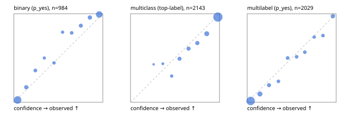

# Evaluation report

- model `Qwen/Qwen3.5-4B` @ `851bf6e806` (shared-prefix tree, forward only: text once per request, each question once, then each candidate), adapter/checkpoint `weights/selfjev_4b`, prompt `challenger-state-first-v1` (6c9d8459ac44)
- data data/ova/hf.jsonl, data/ova/eval.jsonl; splits ['test']; n=3471; calibration `None`
- cuda / bfloat16; 2026-09-27T18:46:44+0000; wall 252.8s

## Overall

question accuracy 83.8%

**binary**: n 984, positives 475, accuracy 0.916, precision 0.943, recall 0.878, f1 0.909, auroc 0.974, brier 0.067, log_loss 0.229, ece 0.050

**multiclass**: n 2143, accuracy 0.852, macro_f1 0.927, log_loss 0.420, brier 0.215, ece_top_label 0.038

**multilabel**: n 344, labels 2029, exact_match 0.526, micro_f1 0.742, macro_f1 0.838, label_auroc 0.944, brier 0.076, log_loss 0.250, ece 0.037

## By family

| family | n | question acc % | details |
|---|---|---|---|
| eval_adversarial | 27 | 96.3 | bin acc 93.3 F1 90.9 AUROC 0.963 ECE 0.071; mc acc 100.0 mF1 100.0 ECE 0.002; ml EM 100.0 µF1 100.0 ECE 0.036 |
| eval_agent_output | 26 | 96.2 | bin acc 100.0 F1 100.0 AUROC 1.000 ECE 0.059; mc acc 100.0 mF1 100.0 ECE 0.113; ml EM 80.0 µF1 94.1 ECE 0.093 |
| eval_evidence | 17 | 88.2 | bin acc 100.0 F1 100.0 AUROC 1.000 ECE 0.026; ml EM 0.0 µF1 50.0 ECE 0.332 |
| eval_multilabel | 32 | 96.9 | bin acc 100.0 F1 100.0 AUROC 1.000 ECE 0.079; mc acc 100.0 mF1 100.0 ECE 0.044; ml EM 95.8 µF1 98.0 ECE 0.034 |
| eval_policy | 22 | 68.2 | bin acc 76.9 F1 76.9 AUROC 0.833 ECE 0.219; mc acc 60.0 mF1 42.9 ECE 0.333; ml EM 50.0 µF1 88.9 ECE 0.134 |
| eval_routing | 25 | 92.0 | bin acc 100.0 F1 100.0 AUROC 1.000 ECE 0.026; mc acc 84.6 mF1 81.8 ECE 0.117; ml EM 100.0 µF1 100.0 ECE 0.140 |
| eval_urgency_sentiment | 22 | 95.5 | bin acc 90.0 F1 92.3 AUROC 0.958 ECE 0.048; mc acc 100.0 mF1 100.0 ECE 0.070; ml EM 100.0 µF1 100.0 ECE 0.029 |
| heldout_boolq | 300 | 87.7 | bin acc 87.7 F1 89.3 AUROC 0.956 ECE 0.058 |
| heldout_emotion_multiclass | 300 | 57.3 | mc acc 57.3 mF1 46.7 ECE 0.168 |
| heldout_intent_clinc | 300 | 95.0 | mc acc 95.0 mF1 95.7 ECE 0.018 |
| heldout_question_type_trec | 300 | 91.3 | mc acc 91.3 mF1 89.6 ECE 0.049 |
| heldout_sentiment_sst2 | 300 | 91.3 | bin acc 91.3 F1 90.8 AUROC 0.981 ECE 0.100 |
| heldout_topic_dbpedia | 300 | 98.0 | mc acc 98.0 mF1 97.8 ECE 0.006 |
| hf_emotions_multilabel | 300 | 47.7 | ml EM 47.7 µF1 68.9 ECE 0.040 |
| hf_intent_banking77 | 300 | 96.3 | mc acc 96.3 mF1 96.4 ECE 0.020 |
| hf_nli | 300 | 95.0 | bin acc 95.0 F1 93.0 AUROC 0.986 ECE 0.056 |
| hf_sentiment_tweets | 300 | 67.3 | mc acc 67.3 mF1 68.0 ECE 0.121 |
| hf_topic_agnews | 300 | 90.3 | mc acc 90.3 mF1 90.3 ECE 0.054 |

## by hard case

| slice | n | question acc % |
|---|---|---|
| (none) | 3042 | 83.3 |
| contradiction | 107 | 99.1 |
| distractor | 33 | 75.8 |
| double_negation | 6 | 83.3 |
| evidence_end | 13 | 100.0 |
| evidence_middle | 11 | 81.8 |
| evidence_start | 9 | 100.0 |
| exception | 7 | 28.6 |
| hypothetical | 7 | 100.0 |
| injection | 10 | 100.0 |
| lexical_overlap | 20 | 100.0 |
| long_state | 50 | 88.0 |
| missing_evidence | 104 | 94.2 |
| multi_positive | 81 | 50.6 |
| multi_turn | 9 | 100.0 |
| negation | 30 | 100.0 |
| new_label_names | 3 | 100.0 |
| nota | 46 | 100.0 |
| numeric_reasoning | 16 | 68.8 |
| paraphrase | 22 | 81.8 |
| role_reversal | 15 | 93.3 |
| sarcasm | 12 | 100.0 |
| temporal_reasoning | 29 | 69.0 |
| zero_positive | 6 | 83.3 |

## by state tokens

| slice | n | question acc % |
|---|---|---|
| 00000-00127 | 3213 | 83.4 |
| 00128-00511 | 206 | 87.9 |
| 00512-02047 | 52 | 88.5 |

## by candidates

| slice | n | question acc % |
|---|---|---|
| 01 | 984 | 91.6 |
| 03 | 310 | 68.4 |
| 04 | 333 | 89.8 |
| 05 | 22 | 95.5 |
| 06 | 1218 | 73.6 |
| 07 | 49 | 100.0 |
| 08 | 555 | 95.3 |

## Paraphrase groups

11 groups; same prediction 81.8%; all correct 81.8%

## Multiclass abstention (coverage vs error on accepted)

| abstain_below | coverage % | error % |
|---|---|---|
| 0.0 | 100.0 | 14.8 |
| 0.4 | 98.6 | 14.2 |
| 0.5 | 96.1 | 12.7 |
| 0.6 | 90.6 | 10.4 |
| 0.7 | 84.6 | 8.4 |
| 0.8 | 78.3 | 6.4 |
| 0.9 | 67.3 | 3.7 |

## Reliability: binary

| bin | n | mean confidence | observed frequency |
|---|---|---|---|
| [0.0,0.1) | 389 | 0.042 | 0.026 |
| [0.1,0.2) | 65 | 0.139 | 0.169 |
| [0.2,0.3) | 39 | 0.241 | 0.359 |
| [0.3,0.4) | 22 | 0.342 | 0.500 |
| [0.4,0.5) | 27 | 0.452 | 0.444 |
| [0.5,0.6) | 24 | 0.548 | 0.792 |
| [0.6,0.7) | 37 | 0.650 | 0.784 |
| [0.7,0.8) | 52 | 0.753 | 0.865 |
| [0.8,0.9) | 71 | 0.855 | 0.958 |
| [0.9,1.0] | 258 | 0.960 | 0.992 |

## Reliability: multiclass

| bin | n | mean confidence | observed frequency |
|---|---|---|---|
| [0.2,0.3) | 7 | 0.260 | 0.429 |
| [0.3,0.4) | 23 | 0.364 | 0.435 |
| [0.4,0.5) | 54 | 0.463 | 0.296 |
| [0.5,0.6) | 118 | 0.551 | 0.492 |
| [0.6,0.7) | 127 | 0.652 | 0.606 |
| [0.7,0.8) | 136 | 0.751 | 0.669 |
| [0.8,0.9) | 235 | 0.857 | 0.774 |
| [0.9,1.0] | 1443 | 0.981 | 0.963 |

## Reliability: multilabel

| bin | n | mean confidence | observed frequency |
|---|---|---|---|
| [0.0,0.1) | 1091 | 0.039 | 0.015 |
| [0.1,0.2) | 247 | 0.143 | 0.093 |
| [0.2,0.3) | 109 | 0.246 | 0.193 |
| [0.3,0.4) | 72 | 0.351 | 0.236 |
| [0.4,0.5) | 82 | 0.455 | 0.500 |
| [0.5,0.6) | 74 | 0.555 | 0.514 |
| [0.6,0.7) | 76 | 0.648 | 0.566 |
| [0.7,0.8) | 57 | 0.754 | 0.737 |
| [0.8,0.9) | 73 | 0.852 | 0.753 |
| [0.9,1.0] | 148 | 0.963 | 0.973 |
