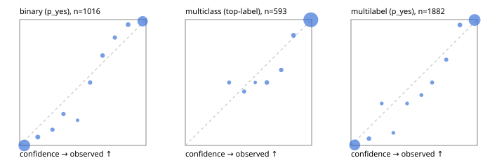

# Evaluation report

- model `Qwen/Qwen3.5-4B` @ `851bf6e806` (shared-prefix tree, forward only: text once per request, each question once, then each candidate), adapter/checkpoint `runs/selfjev_4b_v2/adapter`, prompt `challenger-state-first-v1` (6c9d8459ac44)
- data data/ova/eval2.jsonl; splits ['test']; n=1991; calibration `None`
- cuda / bfloat16; 2026-09-27T17:43:21+0000; wall 307.0s

## Overall

question accuracy 95.4%

**binary**: n 1016, positives 435, accuracy 0.969, precision 0.951, recall 0.979, f1 0.965, auroc 0.996, brier 0.025, log_loss 0.104, ece 0.036

**multiclass**: n 593, accuracy 0.965, macro_f1 0.937, log_loss 0.085, brier 0.047, ece_top_label 0.013

**multilabel**: n 382, labels 1882, exact_match 0.895, micro_f1 0.978, macro_f1 0.959, label_auroc 0.997, brier 0.018, log_loss 0.075, ece 0.030

## By family

| family | n | question acc % | details |
|---|---|---|---|
| e2_hard | 673 | 93.9 | bin acc 96.3 F1 94.9 AUROC 0.996 ECE 0.048; mc acc 94.8 mF1 89.5 ECE 0.041; ml EM 86.4 µF1 96.7 ECE 0.027 |
| e2_simple | 664 | 98.6 | bin acc 98.3 F1 98.4 AUROC 0.998 ECE 0.034; mc acc 100.0 mF1 100.0 ECE 0.008; ml EM 97.5 µF1 99.6 ECE 0.029 |
| e2_very_hard | 654 | 93.6 | bin acc 96.3 F1 95.2 AUROC 0.993 ECE 0.038; mc acc 94.5 mF1 91.1 ECE 0.016; ml EM 85.4 µF1 97.2 ECE 0.041 |

## by hard case

| slice | n | question acc % |
|---|---|---|
| (none) | 569 | 98.4 |
| contradiction | 172 | 94.8 |
| distractor | 474 | 93.9 |
| double_negation | 126 | 96.8 |
| evidence_end | 57 | 96.5 |
| evidence_middle | 114 | 100.0 |
| evidence_start | 17 | 100.0 |
| exception | 213 | 93.0 |
| hypothetical | 128 | 95.3 |
| injection | 151 | 96.7 |
| lexical_overlap | 201 | 98.0 |
| long_state | 191 | 98.4 |
| missing_evidence | 141 | 96.5 |
| multi_positive | 322 | 91.9 |
| multi_turn | 149 | 93.3 |
| negation | 257 | 95.7 |
| nota | 118 | 92.4 |
| numeric_reasoning | 224 | 86.6 |
| paraphrase | 218 | 92.2 |
| role_reversal | 187 | 95.2 |
| sarcasm | 149 | 94.6 |
| temporal_reasoning | 203 | 85.2 |
| zero_positive | 73 | 93.2 |
| zero_positive_distractor | 1 | 100.0 |

## by state tokens

| slice | n | question acc % |
|---|---|---|
| 00000-00127 | 666 | 95.0 |
| 00128-00511 | 469 | 92.3 |
| 00512-02047 | 488 | 96.7 |
| 02048-08191 | 329 | 97.9 |
| 08192+ | 39 | 100.0 |

## by candidates

| slice | n | question acc % |
|---|---|---|
| 01 | 1016 | 96.9 |
| 03 | 128 | 97.7 |
| 04 | 515 | 94.6 |
| 05 | 224 | 91.5 |
| 06 | 86 | 88.4 |
| 07 | 18 | 100.0 |
| 08 | 4 | 75.0 |

## Paraphrase groups

76 groups; same prediction 78.9%; all correct 88.2%

## Multiclass abstention (coverage vs error on accepted)

| abstain_below | coverage % | error % |
|---|---|---|
| 0.0 | 100.0 | 3.5 |
| 0.4 | 99.0 | 3.1 |
| 0.5 | 97.8 | 2.4 |
| 0.6 | 97.5 | 2.2 |
| 0.7 | 95.4 | 1.2 |
| 0.8 | 93.8 | 0.5 |
| 0.9 | 91.1 | 0.2 |

## Reliability: binary

| bin | n | mean confidence | observed frequency |
|---|---|---|---|
| [0.0,0.1) | 501 | 0.037 | 0.000 |
| [0.1,0.2) | 30 | 0.144 | 0.067 |
| [0.2,0.3) | 16 | 0.259 | 0.125 |
| [0.3,0.4) | 16 | 0.347 | 0.250 |
| [0.4,0.5) | 5 | 0.458 | 0.200 |
| [0.5,0.6) | 16 | 0.558 | 0.500 |
| [0.6,0.7) | 21 | 0.656 | 0.714 |
| [0.7,0.8) | 14 | 0.753 | 0.857 |
| [0.8,0.9) | 25 | 0.858 | 0.960 |
| [0.9,1.0] | 372 | 0.974 | 0.987 |

## Reliability: multiclass

| bin | n | mean confidence | observed frequency |
|---|---|---|---|
| [0.3,0.4) | 6 | 0.347 | 0.500 |
| [0.4,0.5) | 7 | 0.466 | 0.429 |
| [0.5,0.6) | 2 | 0.553 | 0.500 |
| [0.6,0.7) | 12 | 0.645 | 0.500 |
| [0.7,0.8) | 10 | 0.759 | 0.600 |
| [0.8,0.9) | 16 | 0.856 | 0.875 |
| [0.9,1.0] | 540 | 0.993 | 0.998 |

## Reliability: multilabel

| bin | n | mean confidence | observed frequency |
|---|---|---|---|
| [0.0,0.1) | 769 | 0.029 | 0.004 |
| [0.1,0.2) | 37 | 0.142 | 0.054 |
| [0.2,0.3) | 12 | 0.243 | 0.333 |
| [0.3,0.4) | 10 | 0.335 | 0.100 |
| [0.4,0.5) | 12 | 0.444 | 0.333 |
| [0.5,0.6) | 15 | 0.557 | 0.400 |
| [0.6,0.7) | 20 | 0.642 | 0.500 |
| [0.7,0.8) | 22 | 0.754 | 0.682 |
| [0.8,0.9) | 47 | 0.862 | 0.957 |
| [0.9,1.0] | 938 | 0.978 | 0.997 |
