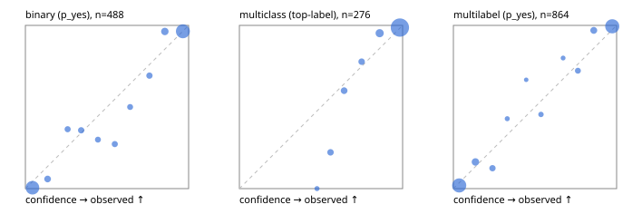

# Evaluation report

- model `Qwen/Qwen3.5-4B` @ `851bf6e806` (shared-prefix tree, forward only: text once per request, each question once, then each candidate), adapter/checkpoint `runs/selfjev_4b_v2/adapter`, prompt `challenger-state-first-v1` (6c9d8459ac44)
- data data/ova/eval_llm.jsonl; splits ['test']; n=946; calibration `None`
- cuda / bfloat16; 2026-09-27T17:47:21+0000; wall 105.2s

## Overall

question accuracy 90.5%

**binary**: n 488, positives 245, accuracy 0.920, precision 0.902, recall 0.943, f1 0.922, auroc 0.975, brier 0.055, log_loss 0.199, ece 0.040

**multiclass**: n 276, accuracy 0.931, macro_f1 0.889, log_loss 0.163, brier 0.085, ece_top_label 0.026

**multilabel**: n 182, labels 864, exact_match 0.824, micro_f1 0.955, macro_f1 0.916, label_auroc 0.990, brier 0.034, log_loss 0.131, ece 0.029

## By family

| family | n | question acc % | details |
|---|---|---|---|
| tllm_guardrail_hard | 60 | 83.3 | bin acc 87.5 F1 87.5 AUROC 0.976 ECE 0.179; mc acc 88.2 mF1 80.4 ECE 0.097; ml EM 63.6 µF1 90.5 ECE 0.072 |
| tllm_guardrail_simple | 67 | 100.0 | bin acc 100.0 F1 100.0 AUROC 1.000 ECE 0.032; mc acc 100.0 mF1 100.0 ECE 0.014; ml EM 100.0 µF1 100.0 ECE 0.038 |
| tllm_guardrail_very_hard | 43 | 95.3 | bin acc 95.0 F1 95.7 AUROC 1.000 ECE 0.101; mc acc 92.9 mF1 83.3 ECE 0.065; ml EM 100.0 µF1 100.0 ECE 0.052 |
| tllm_jailbreak_hard | 59 | 98.3 | bin acc 100.0 F1 100.0 AUROC 1.000 ECE 0.071; mc acc 95.0 mF1 88.2 ECE 0.075; ml EM 100.0 µF1 100.0 ECE 0.054 |
| tllm_jailbreak_simple | 70 | 97.1 | bin acc 97.3 F1 97.6 AUROC 1.000 ECE 0.042; mc acc 100.0 mF1 100.0 ECE 0.019; ml EM 90.9 µF1 98.6 ECE 0.038 |
| tllm_jailbreak_very_hard | 60 | 86.7 | bin acc 84.4 F1 81.5 AUROC 0.955 ECE 0.112; mc acc 94.4 mF1 91.7 ECE 0.035; ml EM 80.0 µF1 96.3 ECE 0.074 |
| tllm_judge_hard | 86 | 94.2 | bin acc 92.5 F1 90.3 AUROC 0.965 ECE 0.104; mc acc 100.0 mF1 100.0 ECE 0.024; ml EM 90.5 µF1 94.3 ECE 0.041 |
| tllm_judge_simple | 72 | 91.7 | bin acc 94.7 F1 95.8 AUROC 1.000 ECE 0.078; mc acc 95.0 mF1 88.2 ECE 0.063; ml EM 78.6 µF1 96.4 ECE 0.058 |
| tllm_judge_very_hard | 64 | 85.9 | bin acc 93.8 F1 94.7 AUROC 1.000 ECE 0.090; mc acc 85.7 mF1 75.1 ECE 0.129; ml EM 63.6 µF1 94.3 ECE 0.075 |
| tllm_score_hard | 62 | 95.2 | bin acc 100.0 F1 100.0 AUROC 1.000 ECE 0.106; mc acc 100.0 mF1 100.0 ECE 0.055; ml EM 75.0 µF1 94.1 ECE 0.068 |
| tllm_score_simple | 62 | 98.4 | bin acc 97.1 F1 98.0 AUROC 0.938 ECE 0.057; mc acc 100.0 mF1 100.0 ECE 0.053; ml EM 100.0 µF1 100.0 ECE 0.037 |
| tllm_score_very_hard | 76 | 82.9 | bin acc 89.5 F1 83.3 AUROC 0.987 ECE 0.119; mc acc 86.4 mF1 75.0 ECE 0.115; ml EM 62.5 µF1 88.2 ECE 0.076 |
| tllm_verify_hard | 50 | 66.0 | bin acc 65.4 F1 60.9 AUROC 0.776 ECE 0.232; mc acc 81.2 mF1 66.7 ECE 0.157; ml EM 37.5 µF1 71.4 ECE 0.159 |
| tllm_verify_simple | 60 | 100.0 | bin acc 100.0 F1 100.0 AUROC 1.000 ECE 0.063; mc acc 100.0 mF1 100.0 ECE 0.011; ml EM 100.0 µF1 100.0 ECE 0.040 |
| tllm_verify_very_hard | 55 | 76.4 | bin acc 77.4 F1 69.6 AUROC 0.846 ECE 0.191; mc acc 73.3 mF1 63.5 ECE 0.124; ml EM 77.8 µF1 92.9 ECE 0.074 |

## by hard case

| slice | n | question acc % |
|---|---|---|
| (none) | 265 | 97.4 |
| answer_trace_mismatch | 45 | 86.7 |
| benign_lookalike | 88 | 86.4 |
| confident_wrong | 39 | 79.5 |
| contradiction | 22 | 95.5 |
| distractor | 117 | 88.0 |
| double_negation | 3 | 100.0 |
| evidence_end | 11 | 100.0 |
| evidence_middle | 20 | 65.0 |
| evidence_start | 2 | 100.0 |
| exception | 20 | 90.0 |
| fake_authority | 1 | 100.0 |
| flawed_step | 44 | 50.0 |
| format_near_miss | 46 | 84.8 |
| gradual_escalation | 1 | 100.0 |
| hypothetical | 7 | 100.0 |
| indirect_injection | 25 | 96.0 |
| injection | 22 | 100.0 |
| judge_injection | 112 | 84.8 |
| length_bias | 7 | 100.0 |
| lexical_overlap | 103 | 91.3 |
| long_state | 74 | 91.9 |
| missing_evidence | 35 | 91.4 |
| multi_positive | 124 | 79.0 |
| multi_turn | 44 | 84.1 |
| negation | 62 | 91.9 |
| nota | 55 | 87.3 |
| numeric_reasoning | 109 | 77.1 |
| obfuscation | 1 | 0.0 |
| over_refusal | 50 | 84.0 |
| paraphrase | 73 | 89.0 |
| partial_compliance | 31 | 74.2 |
| role_reversal | 6 | 50.0 |
| sarcasm | 8 | 75.0 |
| speaker_confusion | 58 | 87.9 |
| subtle_violation | 16 | 93.8 |
| sycophancy | 13 | 92.3 |
| temporal_reasoning | 20 | 100.0 |
| tool_misuse | 6 | 83.3 |
| unsupported_claim | 96 | 88.5 |
| zero_positive | 55 | 90.9 |
| zero_positive_partial | 1 | 100.0 |

## by state tokens

| slice | n | question acc % |
|---|---|---|
| 00000-00127 | 308 | 86.7 |
| 00128-00511 | 284 | 95.1 |
| 00512-02047 | 222 | 91.9 |
| 02048-08191 | 125 | 87.2 |
| 08192+ | 7 | 85.7 |

## by candidates

| slice | n | question acc % |
|---|---|---|
| 01 | 488 | 92.0 |
| 03 | 82 | 90.2 |
| 04 | 239 | 93.3 |
| 05 | 98 | 80.6 |
| 06 | 33 | 84.8 |
| 07 | 3 | 66.7 |
| 08 | 3 | 33.3 |

## Paraphrase groups

29 groups; same prediction 86.2%; all correct 79.3%

## Multiclass abstention (coverage vs error on accepted)

| abstain_below | coverage % | error % |
|---|---|---|
| 0.0 | 100.0 | 6.9 |
| 0.4 | 100.0 | 6.9 |
| 0.5 | 99.3 | 6.2 |
| 0.6 | 96.0 | 3.8 |
| 0.7 | 92.4 | 2.4 |
| 0.8 | 89.1 | 1.6 |
| 0.9 | 81.5 | 1.3 |

## Reliability: binary

| bin | n | mean confidence | observed frequency |
|---|---|---|---|
| [0.0,0.1) | 180 | 0.043 | 0.006 |
| [0.1,0.2) | 17 | 0.136 | 0.059 |
| [0.2,0.3) | 11 | 0.259 | 0.364 |
| [0.3,0.4) | 14 | 0.342 | 0.357 |
| [0.4,0.5) | 10 | 0.444 | 0.300 |
| [0.5,0.6) | 11 | 0.548 | 0.273 |
| [0.6,0.7) | 10 | 0.641 | 0.500 |
| [0.7,0.8) | 13 | 0.760 | 0.692 |
| [0.8,0.9) | 27 | 0.854 | 0.963 |
| [0.9,1.0] | 195 | 0.965 | 0.964 |

## Reliability: multiclass

| bin | n | mean confidence | observed frequency |
|---|---|---|---|
| [0.4,0.5) | 2 | 0.475 | 0.000 |
| [0.5,0.6) | 9 | 0.558 | 0.222 |
| [0.6,0.7) | 10 | 0.642 | 0.600 |
| [0.7,0.8) | 9 | 0.749 | 0.778 |
| [0.8,0.9) | 21 | 0.860 | 0.952 |
| [0.9,1.0] | 225 | 0.984 | 0.987 |

## Reliability: multilabel

| bin | n | mean confidence | observed frequency |
|---|---|---|---|
| [0.0,0.1) | 361 | 0.036 | 0.019 |
| [0.1,0.2) | 49 | 0.135 | 0.163 |
| [0.2,0.3) | 24 | 0.239 | 0.125 |
| [0.3,0.4) | 7 | 0.330 | 0.429 |
| [0.4,0.5) | 3 | 0.446 | 0.667 |
| [0.5,0.6) | 11 | 0.536 | 0.455 |
| [0.6,0.7) | 5 | 0.672 | 0.800 |
| [0.7,0.8) | 18 | 0.763 | 0.722 |
| [0.8,0.9) | 33 | 0.860 | 0.970 |
| [0.9,1.0] | 353 | 0.973 | 0.994 |
