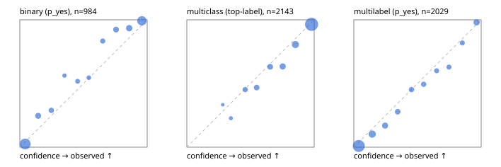

# Evaluation report

- model `Qwen/Qwen3.5-4B` @ `851bf6e806` (shared-prefix tree, forward only: text once per request, each question once, then each candidate), adapter/checkpoint `runs/selfjev_4b_v2/adapter`, prompt `challenger-state-first-v1` (6c9d8459ac44)
- data data/ova/hf.jsonl, data/ova/eval.jsonl; splits ['test']; n=3471; calibration `None`
- cuda / bfloat16; 2026-09-27T17:45:26+0000; wall 115.6s

## Overall

question accuracy 83.5%

**binary**: n 984, positives 475, accuracy 0.912, precision 0.939, recall 0.874, f1 0.905, auroc 0.973, brier 0.067, log_loss 0.231, ece 0.050

**multiclass**: n 2143, accuracy 0.852, macro_f1 0.923, log_loss 0.418, brier 0.214, ece_top_label 0.031

**multilabel**: n 344, labels 2029, exact_match 0.517, micro_f1 0.737, macro_f1 0.816, label_auroc 0.944, brier 0.077, log_loss 0.253, ece 0.038

## By family

| family | n | question acc % | details |
|---|---|---|---|
| eval_adversarial | 27 | 96.3 | bin acc 93.3 F1 90.9 AUROC 1.000 ECE 0.084; mc acc 100.0 mF1 100.0 ECE 0.010; ml EM 100.0 µF1 100.0 ECE 0.033 |
| eval_agent_output | 26 | 88.5 | bin acc 100.0 F1 100.0 AUROC 1.000 ECE 0.050; mc acc 85.7 mF1 86.7 ECE 0.185; ml EM 60.0 µF1 88.9 ECE 0.127 |
| eval_evidence | 17 | 94.1 | bin acc 100.0 F1 100.0 AUROC 1.000 ECE 0.028; ml EM 50.0 µF1 57.1 ECE 0.262 |
| eval_multilabel | 32 | 96.9 | bin acc 100.0 F1 100.0 AUROC 1.000 ECE 0.079; mc acc 100.0 mF1 100.0 ECE 0.008; ml EM 95.8 µF1 99.0 ECE 0.035 |
| eval_policy | 22 | 63.6 | bin acc 76.9 F1 76.9 AUROC 0.810 ECE 0.259; mc acc 60.0 mF1 42.9 ECE 0.323; ml EM 25.0 µF1 84.2 ECE 0.183 |
| eval_routing | 25 | 88.0 | bin acc 100.0 F1 100.0 AUROC 1.000 ECE 0.032; mc acc 84.6 mF1 81.8 ECE 0.116; ml EM 50.0 µF1 80.0 ECE 0.065 |
| eval_urgency_sentiment | 22 | 90.9 | bin acc 90.0 F1 92.3 AUROC 0.958 ECE 0.144; mc acc 90.0 mF1 75.0 ECE 0.073; ml EM 100.0 µF1 100.0 ECE 0.022 |
| heldout_boolq | 300 | 87.7 | bin acc 87.7 F1 89.4 AUROC 0.959 ECE 0.074 |
| heldout_emotion_multiclass | 300 | 57.0 | mc acc 57.0 mF1 44.2 ECE 0.150 |
| heldout_intent_clinc | 300 | 95.7 | mc acc 95.7 mF1 96.3 ECE 0.015 |
| heldout_question_type_trec | 300 | 91.3 | mc acc 91.3 mF1 91.1 ECE 0.052 |
| heldout_sentiment_sst2 | 300 | 90.3 | bin acc 90.3 F1 89.5 AUROC 0.974 ECE 0.087 |
| heldout_topic_dbpedia | 300 | 98.0 | mc acc 98.0 mF1 97.8 ECE 0.008 |
| hf_emotions_multilabel | 300 | 47.3 | ml EM 47.3 µF1 68.4 ECE 0.040 |
| hf_intent_banking77 | 300 | 97.7 | mc acc 97.7 mF1 97.6 ECE 0.021 |
| hf_nli | 300 | 94.7 | bin acc 94.7 F1 92.6 AUROC 0.986 ECE 0.069 |
| hf_sentiment_tweets | 300 | 67.0 | mc acc 67.0 mF1 68.0 ECE 0.099 |
| hf_topic_agnews | 300 | 89.3 | mc acc 89.3 mF1 89.3 ECE 0.046 |

## by hard case

| slice | n | question acc % |
|---|---|---|
| (none) | 3042 | 83.2 |
| contradiction | 107 | 100.0 |
| distractor | 33 | 72.7 |
| double_negation | 6 | 83.3 |
| evidence_end | 13 | 92.3 |
| evidence_middle | 11 | 81.8 |
| evidence_start | 9 | 100.0 |
| exception | 7 | 14.3 |
| hypothetical | 7 | 100.0 |
| injection | 10 | 90.0 |
| lexical_overlap | 20 | 100.0 |
| long_state | 50 | 86.0 |
| missing_evidence | 104 | 92.3 |
| multi_positive | 81 | 49.4 |
| multi_turn | 9 | 88.9 |
| negation | 30 | 100.0 |
| new_label_names | 3 | 100.0 |
| nota | 46 | 100.0 |
| numeric_reasoning | 16 | 75.0 |
| paraphrase | 22 | 86.4 |
| role_reversal | 15 | 86.7 |
| sarcasm | 12 | 100.0 |
| temporal_reasoning | 29 | 65.5 |
| zero_positive | 6 | 83.3 |

## by state tokens

| slice | n | question acc % |
|---|---|---|
| 00000-00127 | 3213 | 83.3 |
| 00128-00511 | 206 | 85.9 |
| 00512-02047 | 52 | 86.5 |

## by candidates

| slice | n | question acc % |
|---|---|---|
| 01 | 984 | 91.2 |
| 03 | 310 | 67.7 |
| 04 | 333 | 88.3 |
| 05 | 22 | 90.9 |
| 06 | 1218 | 73.5 |
| 07 | 49 | 100.0 |
| 08 | 555 | 96.4 |

## Paraphrase groups

11 groups; same prediction 72.7%; all correct 81.8%

## Multiclass abstention (coverage vs error on accepted)

| abstain_below | coverage % | error % |
|---|---|---|
| 0.0 | 100.0 | 14.8 |
| 0.4 | 98.7 | 14.0 |
| 0.5 | 95.3 | 12.6 |
| 0.6 | 90.1 | 10.3 |
| 0.7 | 84.4 | 8.5 |
| 0.8 | 77.3 | 5.9 |
| 0.9 | 66.0 | 3.5 |

## Reliability: binary

| bin | n | mean confidence | observed frequency |
|---|---|---|---|
| [0.0,0.1) | 398 | 0.042 | 0.025 |
| [0.1,0.2) | 61 | 0.144 | 0.246 |
| [0.2,0.3) | 38 | 0.247 | 0.289 |
| [0.3,0.4) | 16 | 0.351 | 0.562 |
| [0.4,0.5) | 29 | 0.454 | 0.517 |
| [0.5,0.6) | 22 | 0.542 | 0.545 |
| [0.6,0.7) | 36 | 0.651 | 0.833 |
| [0.7,0.8) | 52 | 0.756 | 0.923 |
| [0.8,0.9) | 76 | 0.859 | 0.934 |
| [0.9,1.0] | 256 | 0.958 | 0.992 |

## Reliability: multiclass

| bin | n | mean confidence | observed frequency |
|---|---|---|---|
| [0.2,0.3) | 6 | 0.282 | 0.333 |
| [0.3,0.4) | 22 | 0.346 | 0.227 |
| [0.4,0.5) | 73 | 0.458 | 0.452 |
| [0.5,0.6) | 111 | 0.548 | 0.468 |
| [0.6,0.7) | 122 | 0.654 | 0.631 |
| [0.7,0.8) | 153 | 0.753 | 0.634 |
| [0.8,0.9) | 242 | 0.853 | 0.806 |
| [0.9,1.0] | 1414 | 0.980 | 0.965 |

## Reliability: multilabel

| bin | n | mean confidence | observed frequency |
|---|---|---|---|
| [0.0,0.1) | 1058 | 0.039 | 0.009 |
| [0.1,0.2) | 234 | 0.145 | 0.103 |
| [0.2,0.3) | 130 | 0.245 | 0.169 |
| [0.3,0.4) | 97 | 0.345 | 0.278 |
| [0.4,0.5) | 84 | 0.453 | 0.452 |
| [0.5,0.6) | 85 | 0.549 | 0.494 |
| [0.6,0.7) | 65 | 0.650 | 0.600 |
| [0.7,0.8) | 62 | 0.747 | 0.629 |
| [0.8,0.9) | 66 | 0.852 | 0.818 |
| [0.9,1.0] | 148 | 0.964 | 0.980 |
