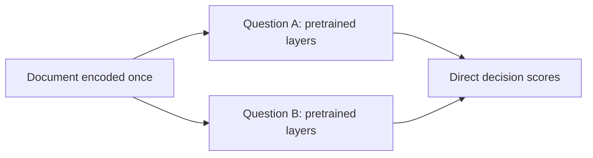

# SelfJev: quality and speed strategy

## A credible path toward Jev quality and speed

Recommendation: preserve pretrained judgment, share document computation, and train on evidence decisions. Treat the backbone and serving method as separate choices.

**I would stop making the current two-block cross-attention model the main investment.** It demonstrates that sharing the state can save a great deal of computation, but its trained similarity path largely carries multiclass performance while binary discrimination remains weak. That is sufficient reason to choose a better starting point. It is not proof that cross-attention is intrinsically unsuitable.

My primary bet is a capable pretrained model reading one shared document prefix, with short, independent decision branches processed together. Keep its pretrained layers and output readout. Establish quality at roughly the current 4B scale, then challenge it with smaller, more efficient backbones. In parallel as a research plan, screen an existing classification model; pursue a pretrained encoder-decoder if the first approach sacrifices too much judgment quality.

| Priority | What to build or test | Why it deserves the investment |
|---|---|---|
| 1 / Main path | Shared document prefix + pretrained decision branches | Removes repeated document processing while retaining a trained mechanism for reading evidence. |
| 2 / Cheap challenger | GLiClass-Instruct, using its native prompted classification interface | Tests whether an existing compact classification model can replace much of this project. |
| 3 / Structural alternative | T5Gemma 2 shared encoder + pretrained decoder branches | Preserves already-trained document-to-decision interaction with a genuinely separate encoder. |
| 4 / After quality | Smaller backbone, distillation and optimized execution | Makes a demonstrated decision model cheaper; avoids shrinking an already weak model. |

The target is a measured quality/latency tradeoff, not a particular architecture or a proof that Jev was easy to build. Your results show useful functionality is accessible with standard methods. Matching its behavior on unfamiliar criteria, calibrated uncertainty and cold-request speed together is still an open engineering problem.

> Planning assumption: a single NVIDIA GPU for a service comparable to Jev, with the M5 Pro assessed separately. No new training, paid calls, deployments or model downloads were performed for this memo. Current external information was checked on 23 September 2026. Proposed targets and experiment sizes are planning choices, not forecasts.

## The remaining gap is judgment

A larger reranker gives little aggregate improvement. A different starting objective already changes binary behavior substantially.

| Model / saved test run | Overall | Binary AUROC | Authored cases |
|---|---|---|---|
| 4B reranker, unmodified | 62.8% | 0.604 | - |
| 4B Instruct, unmodified (new) | 71.3% | 0.911 | - |
| 4B reranker + LoRA | 80.3% | 0.945 | 70.8% |
| 8B reranker + LoRA | 80.7% | 0.945 | 74.9% |
| Jev, cached API results | 82.7% | 0.981 | 94.7% |

All overall columns use the same 3,471 questions. The authored slice contains only 171 questions, so the exact percentages are uncertain. Nevertheless, the 24-point authored gap for 4B is more relevant to arbitrary rules and agent-output evaluation than the 2.4-point overall gap. The current mixture gives considerable weight to short topic/intent classification.

The newly completed instruction-model test strengthens the case for changing the pretrained objective: binary accuracy is 84.2% without adaptation. However, its multiclass accuracy is 73.5% and multilabel exact match 20.1%, both below the trained reranker. It is a candidate for fine-tuning, not an established replacement. This run also uses the reranker-style wrapper; a native instruction template needs a validation-only comparison.

### Why the custom model is a weak foundation today

Separating state and question through every Qwen layer prevents the pretrained model from performing their interaction. The system then asks two new, narrower blocks and new heads to learn that interaction from relatively limited supervision. Its strongest model also has a direct similarity bypass. In the review ablation, removing the head contribution changes validation multiclass accuracy from 82.3% to 82.1%; heads alone give 30.5%. This is post-training removal, not a separately trained control.

Binary test AUROC near 0.514 is the decisive warning: the ordering of examples is weak, not merely the threshold. Calibration can improve multilabel decisions, but a monotone score transform cannot repair a near-random ranking. I would allocate more compute to a better pretrained interaction before adding more blocks to this one.

> Sources: [new instruction-model test](../curve/instruct_zero/test/report.json), [4B LoRA test](../lora_4b/test/report.json), [review audit](../deep_review_2026-09-23/audit.json) and [component ablation](../deep_review_2026-09-23/component_ablation.json). The earlier test has already informed architecture choices; use it as a development benchmark, then create a fresh final holdout.

## Let a pretrained model read the shared state

A state-first decoder can reuse its document computation while each decision still reads document information through its pretrained layers.

Encode the document once and retain its per-layer keys and values. Append a question branch, then candidate-specific suffixes where needed. Batch these short branches, preserving their own positions and causal history. Read the final yes/no logits directly. Binary and multilabel use independent support scores; multiclass normalizes candidate scores within its question. Nothing requires generating JSON or explanatory text.

For multiclass, include the candidate bank in the shared question branch when the criterion is comparative or includes none of the above. Otherwise a candidate scorer cannot reliably know what the alternatives are. Keep different questions isolated. Within a question, alternative descriptions may be visible; answers from other questions should not become hidden evidence.

### The important architectural choice is where interaction happens

The document does not see future questions, but the question and answer suffixes can read document K/V through every pretrained layer. This retains much more trained interaction than independently encoding both sides and adding two new blocks at the end. The tree prototype already implements this general direction. It still needs a quality result; the existence of a cache is not evidence of retained accuracy.

### The control that determines whether to continue

Compare the original query-first scorer with a standalone state-first scorer on the same model and data. Then compare standalone state-first with shared-prefix execution. The latter pair should agree numerically; the former pair measures the quality cost of changing information flow. Fine-tune in the exact state-first format before rejecting it solely on zero-shot degradation.

For this architecture, prefer ordinary supported attention and verified branch cache semantics first. An arbitrary dense tree mask may disable fast kernels. Do not assume a generic inference server already exposes the required branch scores. A correct CUDA implementation must reuse root K/V, batch suffix work and avoid copying the entire prefix per candidate.

> FlashInfer documents shared-prefix and multilevel cascade attention, providing a relevant execution building block, not a turnkey SelfJev implementation. Its shared/unique attention pieces require correct normalization when combined. See [Cascade Attention](https://flashinfer.ai/2024/02/02/cascade-inference.html) and [current API documentation](https://docs.flashinfer.ai/api/cascade.html).

## Three challengers with different strengths

Model-card capabilities identify experiments worth running. They do not establish accuracy or latency on SelfJev.

### An existing classification model: GLiClass-Instruct

Screen [gliclass-instruct-large-v1.0](https://huggingface.co/knowledgator/gliclass-instruct-large-v1.0). It is about 0.4B parameters and exposes task prompts, label descriptions and multilabel classification. Its [architecture paper](https://arxiv.org/abs/2508.07662) describes jointly processing text and label representations. Start with native one-question inference; validate any multi-question adaptation separately. This could be a useful replacement for short classification workloads. Its standard context budget is a material limitation for 8K-32K documents, and classification benchmarks do not establish robust arbitrary-rule reasoning. Do not silently chunk or truncate to hide that limitation.

### A different structure: pretrained encoder-decoder

[T5Gemma 2 1B-1B](https://huggingface.co/google/t5gemma-2-1b-1b) provides pretrained encoder-decoder interaction, merged decoder self/cross-attention and a stated 128K input context. Proposed adaptation: document in the encoder; question/candidate prefixes in independent decoder branches; direct score readout after the known prefix. Share encoder outputs and reusable decoder-side projections. This moves the evidence-reading job into pretrained machinery. The released checkpoint is pretrained, so task adaptation is required, and moving questions to the decoder is itself a distribution change. Long-context support is not a claim of reliable reasoning throughout that window.

### A more efficient decoder backbone

Screen [Qwen3.5-2B](https://huggingface.co/Qwen/Qwen3.5-2B) for a smaller model with predominantly Gated DeltaNet layers and periodic full attention. Also consider [Gemma 4 E2B-it](https://huggingface.co/google/gemma-4-E2B-it), which combines sliding-window and global attention. E2B means about 2.3B effective parameters, but 5.1B including embeddings; it is not a 2B-memory model. Measure direct decisions with thinking disabled. Generative reasoning scores cannot predict one-forward-pass accuracy.

These are different engineering paths. Qwen3.5 branches require cloning recurrent/convolution state as well as attention K/V; a softmax tree mask alone is insufficient. Gemma branches must preserve local/global attention and its embedding behavior. Both may reduce long-document cost, but neither is a drop-in change to the Qwen3 tree implementation.

> Selection order: keep Qwen3-4B-Instruct-2507 and the trained 4B reranker as controls; run a small matched diagnostic for GLiClass and one modern small decoder; promote only a promising challenger to a full pilot. T5Gemma is the structural fallback, not a fourth expensive training run to launch immediately. GLiNER2 is relevant if extraction becomes central; it is not needed for the current decision-only goal.

## Teach evidence relationships, not more topic matching

The highest-value data change is controlled variation: almost the same words, but a different correct decision.

| Training group | What changes while most text stays the same |
|---|---|
| Support / contradiction / absent | Requested a refund; explicitly rejected a refund; discussed a refund without requesting one. |
| Role and time | Who approved what; before versus after the deadline; current versus superseded status. |
| Rules and exceptions | Same facts with a changed policy; same policy with one disqualifying exception. |
| Multiple evidence items | Two distant facts must both hold; remove either fact and the answer changes. |
| Candidate semantics | Rename IDs, paraphrase descriptions, permute options; include genuinely confusable alternatives. |
| Document robustness | Move evidence, add irrelevant text, quote hostile instructions, change the number of other questions. |

Generate underlying facts and rules with a small executable world first, derive answers programmatically, then render varied natural-language documents. Check that the rendering preserves those facts. Keep all variants of a source, rule template and paraphrase family together when splitting. Combine this with realistic, independently adjudicated examples; a synthetic grammar alone can teach another shortcut.

Use a stronger teacher for difficult interpretation, with audited answers and training-only evidence spans or brief explanations. The earlier custom distillation mostly added confident multiclass hard labels from the 0.6B teacher. That neither transfers a strong general reasoner nor directly repairs binary evidence learning. More providers broaden style but do not automatically improve label validity.

### Use richer supervision without requiring longer inference

Keep cross entropy for multiclass and BCE for binary/multilabel as the core objectives. Add a separate auxiliary support/contradiction/not-stated task where the criterion is evidence-grounded. Map it to the public answer according to the task contract; missing evidence is not universally equivalent to false. Add checked evidence/rationale supervision as a training ablation, not mandatory inference text. [Distilling Step-by-Step](https://arxiv.org/abs/2305.02301) demonstrates a multitask rationale approach that predicts labels without generating rationales at test time; it does not guarantee compression of arbitrary long reasoning.

Compare hard-label supervision with and without teacher-distribution distillation, using verified labels as the anchor. Teacher confidence is not automatically calibrated. Balance loss and sampling by question and task family, track positive/negative gradients, and retain ordinary examples to avoid becoming a hard-case specialist. Test broader LoRA targets, including MLP projections, only after a matched pilot shows the data change alone is insufficient.

> Proposed learning curve: 10K, 30K, then 100K questions only if held-out-template quality keeps improving. These are experiment sizes, not estimates of the data required to match Jev. Use question groups per shared state during training so the inference layout is represented.

## Remove duplicated work before shrinking quality

There are three different costs: encoding a new document, reading it for each decision, and executing the model efficiently on the target hardware.

Let S be document tokens, K candidate decisions, and b tokens in each short branch. Repeated full scoring processes roughly K(S+b) token positions through the backbone; a shared-prefix design processes S+Kb. With S=8,192, K=48 and b=64, that is 396,288 versus 11,264 positions, a **35.2x reduction in repeated token processing**. This is a simplified accounting example, not a 35.2x latency prediction: attention shapes, memory traffic and utilization differ.

| Measured A10G / bf16 case | Stock 0.6B LoRA | Custom shared state |
|---|---|---|
| 512 tokens / 1 question x 3 candidates | 96 ms | 95 ms |
| 2,048 tokens / 16 x 3 | 5,138 ms | 227 ms |
| 8,192 tokens / 16 x 3 | 24,024 ms | 626 ms |
| 32K tokens / 1 binary question | 3,362 ms | 3,428 ms |

Your own measurements support the mechanism: sharing helps most when the document is reused many times. The custom model is much weaker, so these are not speedups at equal quality. A first request with one binary question cannot benefit from eliminating 48 repeated encodings that never existed.

### Implementation changes with a clear purpose

Use a contiguous fused prefill for the root and batched short-branch execution. Cache per-layer K/V once, and reuse it without materializing one full copy per candidate. Remove the existing cached-tree T-by-T mask allocation; create only the required branch visibility or use an appropriate structured kernel. Merge LoRA for inference where supported and verified. Compute only the required output rows at score positions. Profile tokenization, root prefill, branch work and result assembly separately.

After the architecture passes quality gates, evaluate compilation/fused kernels and quantization on the exact hardware and shapes. Four-bit weights may save memory without making long-prefill computation faster. Flash attention addresses attention execution; it does not remove feed-forward work. Quantized calibration and close decision margins need their own check.

For repeated agent state, preserve an exact append-only prefix across calls and process only new tokens. Report this warm-prefix benefit separately from a new document. Inserting an earlier message or changing a policy can invalidate the cache; do not substitute semantic similarity for an exact cache key.

> TypeSafe reports 70-500 ms end-to-end in its [launch article](https://typesafe.ai/blog/introducing-system-one-models-and-jev), with workload and location qualifications. It is not a universal 100 ms specification for cold 32K input. SelfJev has no matched Jev latency study yet. Do not compare an M5 Pro PyTorch run with unspecified hosted hardware as if architecture were the only difference.

## The smallest sequence that can choose a winner

Each stage resolves one uncertainty. Advance a model because it passes a gate, not because its architecture sounds plausible.

| Stage | Experiment | Decision it enables |
|---|---|---|
| A / Fixed evidence | New source/template splits; 400-600 diagnostic questions balanced across evidence, rules, agent checks, ordinary tasks and lengths. Reserve a separate final test. | A cheap screen can reject weak ideas; it is too small to prove a 1-2 point win. |
| B / Starting model | Same diagnostic and validation protocol: current 4B LoRA; 4B Instruct; native GLiClass; one modern small decoder. No generated rationale at inference. | Choose the best starting representation for the difficult families. |
| C / Information flow | On the chosen decoder: query-first; state-first standalone; state-first cached. Include candidate permutations and unrelated questions. | Separate order/format damage from an implementation bug in sharing. |
| D / Matched training | Train query-first and state-first on the same verified data/exposure. Compare old versus improved data on a fixed format. Add a second seed for finalists. | Distinguish data improvement from architecture improvement. |
| E / Efficient student | Only after a quality winner: smaller model with hard labels, then hard labels + richer distillation. Assess the same families. | Find the smallest model that retains the capability we actually need. |
| F / Deployment | Same checkpoints and prompts; end-to-end p50/p95, concurrency, memory and cost on a named GPU; fresh final test once. | Determine whether quality and speed coexist in one real configuration. |

For C/D, set an initial engineering tolerance of no more than roughly 2 points below the same-data query-first model overall and 5 points on the hard-family diagnostic. These are screening thresholds, not statistical equivalence claims. Predefine margins and collect enough independent document groups before claiming a match. Do not let easy classification gains conceal a regression in evidence or policy decisions.

For service timing, use 512, 2K and 8K states; 1, 4 and 16 questions; several candidate counts; and actual evidence-bearing 16K/32K cases as a separate extension. Record warm model plus new prefix, warm prefix, and cold process startup separately. Use at least 100 varied requests per key cell for an initial p95 estimate, then more if tails are unstable. Measure Jev from the same client and question batches, with cache state stated as unknown when it cannot be controlled.

Success should mean a predeclared accuracy margin against Jev on a fresh, relevant mix, acceptable binary/multilabel calibration, and latency inside the desired band for specified workloads. Treat 100 ms as a stretch goal for short requests; first test a 500 ms target for 512-2K states with many questions on a named GPU. Neither number here is a prediction.

> The current instruction-model test is now complete. No tree-training or instruction-LoRA train_meta.json was present when this memo snapshot was taken. Reuse results from those ongoing experiments as they arrive; do not launch duplicate runs or interpret a missing result as failure.

## Have an architectural fallback, not an endless tuning loop

A controlled failure tells us what to change. It should not automatically trigger a larger dataset or another expensive backbone.

| Observed outcome | Next action |
|---|---|
| State-first loses badly; query-first succeeds on identical data | Test pretrained encoder-decoder interaction, or share only lower layers and keep a few upper layers jointly processing document and question. |
| Both formats fail to fit even a tiny verified training set | Check labels, masks, score positions, gradients and optimization. Permit broader adaptation in this diagnostic before blaming generalization. |
| Both fit; only familiar templates work | Improve source/template diversity, counterfactual training and independent labels. More repetitions of one synthetic style are unlikely to solve this. |
| Quality passes; many-question latency fails | Profile prefix copies, dense masks, branch batching and kernel dispatch. Do not reduce model capacity before locating the wasted work. |
| Quality passes; cold long-document latency fails | Test a more efficient backbone or explicit evidence selection. State the resulting limits and evaluate distributed evidence. |
| Only multilabel thresholds fail | Calibrate on a disjoint representative partition and inspect ranking first; do not retrain an architecture solely to fix an offset. |

### Partial sharing can trade some speed for better interaction

[PreTTR](https://arxiv.org/abs/2004.14255) trains separate processing in lower transformer layers, then allows joint interaction in upper layers. This suggests a fallback using pretrained upper layers rather than a new two-block reader. Its evidence is from retrieval with precomputed documents, not this online classification task. For a simplified 28-layer model sharing 24 layers across 48 decisions, state-token layer work drops from 48x28 to 24+48x4: about 6.2x. Actual speed must include attention and online state encoding. Adapting the idea to causal Qwen requires consistent positions and matching training masks.

### Two shortcuts I would keep out of the first claim

A small-model/large-model cascade can reduce average cost, but may miss the latency target. With independent 2% per-question deferral and 16 questions, 27.6% of requests invoke the slow path: 1 - 0.98^16. A fast average or median is not a fast p95. Measure routing by complete request and do not trust uncalibrated self-confidence.

Retrieving a few chunks or compressing the state can help local-evidence tasks, but may discard an exception, a distant second fact, or evidence of absence. If used, train and test evidence recall as well as final accuracy, preserve a full-document fallback, and disclose its cost. Deterministic tools for dates or arithmetic are useful in a product, but constitute a different system comparison.

> I would defer speculative latent reasoning blocks and a homemade RLCD objective. Supervised decision losses, strong supervision and representation preservation have not been exhausted. Jev's undisclosed training label does not establish that a new RL algorithm is necessary here.

## What I would commit to next

One main architecture, one inexpensive external baseline, and a clear point at which to switch approaches.

**Main implementation:** complete the shared-prefix experiment with a pretrained 4B model, correct branch batching and no quadratic root mask. Run the existing instruction-model adaptation as a controlled competitor to reranker adaptation. Use new evidence/rule data with trustworthy labels. Optimize a winner only after its difficult-family performance is established.

**First challenge:** native GLiClass-Instruct on short, difficult criteria. If it performs well, it may supply an efficient short-input product or student; if it only handles topic/intent, that is a useful boundary. Screen a newer small instruction model before committing to 0.6B as the required endpoint.

**Architectural switch:** if state-first adaptation cannot retain quality, move to pretrained encoder-decoder interaction, with partial lower-layer sharing as the less radical fallback. This directly tests whether the missing ingredient is query-conditioned document processing or trained interaction across inputs.

**Training strategy:** teach the decisions with verifiable counterfactual groups, realistic independent examples and a strong teacher. Distill evidence and reasoning only as checked auxiliary targets. Increase dataset size on a held-out-template learning curve. Measure calibration after learning discrimination, then after quantization.

The project can plausibly get much closer with these changes. The strongest evidence for that is already local: supervised adaptation produces large gains, the newer instruction base is much better at binary judgments before training, and sharing eliminates a substantial amount of repeated work. None of those results yet establishes the combination. The next experiments should be designed to establish exactly that.

### Evidence files and provenance

[Full project review](../deep_review_2026-09-23/review.md) records architecture details, 78 passing tests, saved metrics, data limitations and the new component ablation. [Latest instruction-model test](../curve/instruct_zero/test/report.json) is the main additional local result in this memo. [Memo snapshot](snapshot.json) records hashes of the source reports and the repository revision.

> External links throughout this memo are primary model cards, original research or implementer documentation. Public benchmark figures are deliberately not converted into SelfJev predictions. Model choices, training schedules, architectural transfers and screening thresholds are recommendations to test. The published Jev architecture, model size and training details remain undisclosed.
