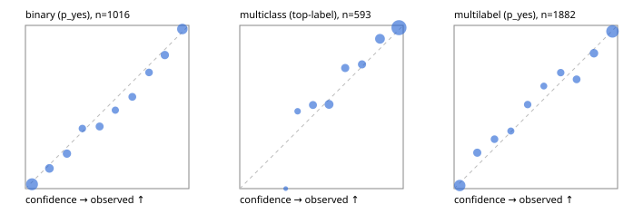

# Evaluation report

- model `google/t5gemma-2-1b-1b` @ `dd0a268322` (pretrained T5Gemma encoder/decoder; shared document cross-KV views), adapter/checkpoint `runs/t5gemma2_r2b/adapter`, prompt `challenger-state-first-v1` (6c9d8459ac44)
- data data/eval2.jsonl; splits ['test']; n=1991; calibration `None`
- cuda / bfloat16; 2026-09-24T07:54:22+0000; wall 79.4s

## Overall

question accuracy 76.8%

**binary**: n 1016, positives 435, accuracy 0.826, precision 0.792, recall 0.805, f1 0.798, auroc 0.913, brier 0.119, log_loss 0.369, ece 0.033

**multiclass**: n 593, accuracy 0.836, macro_f1 0.736, log_loss 0.442, brier 0.231, ece_top_label 0.036

**multilabel**: n 382, labels 1882, exact_match 0.508, micro_f1 0.852, macro_f1 0.745, label_auroc 0.923, brier 0.112, log_loss 0.349, ece 0.032

## By family

| family | n | question acc % | details |
|---|---|---|---|
| e2_hard | 673 | 74.7 | bin acc 81.0 F1 75.0 AUROC 0.890 ECE 0.066; mc acc 80.8 mF1 68.7 ECE 0.058; ml EM 49.2 µF1 82.3 ECE 0.054 |
| e2_simple | 664 | 85.1 | bin acc 90.1 F1 90.7 AUROC 0.964 ECE 0.053; mc acc 92.5 mF1 86.4 ECE 0.055; ml EM 58.3 µF1 89.2 ECE 0.054 |
| e2_very_hard | 654 | 70.5 | bin acc 76.2 F1 69.1 AUROC 0.861 ECE 0.056; mc acc 77.5 mF1 64.9 ECE 0.039; ml EM 45.4 µF1 84.3 ECE 0.036 |

## by hard case

| slice | n | question acc % |
|---|---|---|
| (none) | 569 | 86.8 |
| contradiction | 172 | 76.7 |
| distractor | 474 | 72.8 |
| double_negation | 126 | 65.9 |
| evidence_end | 57 | 80.7 |
| evidence_middle | 114 | 82.5 |
| evidence_start | 17 | 70.6 |
| exception | 213 | 71.8 |
| hypothetical | 128 | 81.2 |
| injection | 151 | 70.2 |
| lexical_overlap | 201 | 80.6 |
| long_state | 191 | 77.5 |
| missing_evidence | 141 | 82.3 |
| multi_positive | 322 | 57.5 |
| multi_turn | 149 | 77.9 |
| negation | 257 | 74.3 |
| nota | 118 | 72.0 |
| numeric_reasoning | 224 | 62.1 |
| paraphrase | 218 | 71.1 |
| role_reversal | 187 | 74.3 |
| sarcasm | 149 | 69.1 |
| temporal_reasoning | 203 | 62.1 |
| zero_positive | 73 | 79.5 |
| zero_positive_distractor | 1 | 0.0 |

## by state tokens

| slice | n | question acc % |
|---|---|---|
| 00000-00127 | 679 | 75.7 |
| 00128-00511 | 461 | 72.5 |
| 00512-02047 | 490 | 80.0 |
| 02048-08191 | 322 | 81.4 |
| 08192+ | 39 | 69.2 |

## by candidates

| slice | n | question acc % |
|---|---|---|
| 01 | 1016 | 82.6 |
| 03 | 128 | 78.1 |
| 04 | 515 | 77.5 |
| 05 | 224 | 60.3 |
| 06 | 86 | 54.7 |
| 07 | 18 | 44.4 |
| 08 | 4 | 25.0 |

## Paraphrase groups

76 groups; same prediction 72.4%; all correct 59.2%

## Multiclass abstention (coverage vs error on accepted)

| abstain_below | coverage % | error % |
|---|---|---|
| 0.0 | 100.0 | 16.4 |
| 0.4 | 96.3 | 14.7 |
| 0.5 | 89.4 | 12.1 |
| 0.6 | 78.9 | 7.3 |
| 0.7 | 71.2 | 5.2 |
| 0.8 | 63.4 | 2.9 |
| 0.9 | 49.1 | 1.4 |

## Reliability: binary

| bin | n | mean confidence | observed frequency |
|---|---|---|---|
| [0.0,0.1) | 265 | 0.040 | 0.026 |
| [0.1,0.2) | 97 | 0.147 | 0.124 |
| [0.2,0.3) | 84 | 0.254 | 0.214 |
| [0.3,0.4) | 57 | 0.348 | 0.368 |
| [0.4,0.5) | 71 | 0.454 | 0.380 |
| [0.5,0.6) | 52 | 0.550 | 0.481 |
| [0.6,0.7) | 64 | 0.654 | 0.562 |
| [0.7,0.8) | 59 | 0.756 | 0.712 |
| [0.8,0.9) | 88 | 0.853 | 0.818 |
| [0.9,1.0] | 179 | 0.960 | 0.978 |

## Reliability: multiclass

| bin | n | mean confidence | observed frequency |
|---|---|---|---|
| [0.2,0.3) | 3 | 0.281 | 0.000 |
| [0.3,0.4) | 19 | 0.354 | 0.474 |
| [0.4,0.5) | 41 | 0.448 | 0.512 |
| [0.5,0.6) | 62 | 0.546 | 0.516 |
| [0.6,0.7) | 46 | 0.645 | 0.739 |
| [0.7,0.8) | 46 | 0.748 | 0.761 |
| [0.8,0.9) | 85 | 0.858 | 0.918 |
| [0.9,1.0] | 291 | 0.974 | 0.986 |

## Reliability: multilabel

| bin | n | mean confidence | observed frequency |
|---|---|---|---|
| [0.0,0.1) | 427 | 0.034 | 0.019 |
| [0.1,0.2) | 141 | 0.142 | 0.220 |
| [0.2,0.3) | 109 | 0.247 | 0.303 |
| [0.3,0.4) | 85 | 0.347 | 0.353 |
| [0.4,0.5) | 99 | 0.450 | 0.515 |
| [0.5,0.6) | 78 | 0.549 | 0.628 |
| [0.6,0.7) | 107 | 0.652 | 0.710 |
| [0.7,0.8) | 124 | 0.749 | 0.669 |
| [0.8,0.9) | 164 | 0.856 | 0.829 |
| [0.9,1.0] | 548 | 0.969 | 0.964 |
