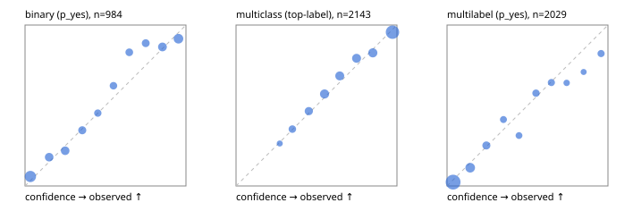

# Evaluation report

- model `google/t5gemma-2-1b-1b` @ `dd0a268322` (pretrained T5Gemma encoder/decoder; shared document cross-KV views), adapter/checkpoint `runs/t5gemma2_r2b/adapter`, prompt `challenger-state-first-v1` (6c9d8459ac44)
- data data/hf.jsonl, data/eval.jsonl; splits ['test']; n=3471; calibration `None`
- cuda / bfloat16; 2026-09-24T07:53:02+0000; wall 342.7s

## Overall

question accuracy 73.8%

**binary**: n 984, positives 475, accuracy 0.827, precision 0.846, recall 0.785, f1 0.814, auroc 0.893, brier 0.132, log_loss 0.421, ece 0.045

**multiclass**: n 2143, accuracy 0.751, macro_f1 0.763, log_loss 0.675, brier 0.344, ece_top_label 0.022

**multilabel**: n 344, labels 2029, exact_match 0.404, micro_f1 0.656, macro_f1 0.584, label_auroc 0.893, brier 0.105, log_loss 0.337, ece 0.035

## By family

| family | n | question acc % | details |
|---|---|---|---|
| eval_adversarial | 27 | 70.4 | bin acc 73.3 F1 71.4 AUROC 0.796 ECE 0.304; mc acc 85.7 mF1 77.8 ECE 0.186; ml EM 40.0 µF1 63.6 ECE 0.274 |
| eval_agent_output | 26 | 46.2 | bin acc 57.1 F1 57.1 AUROC 0.633 ECE 0.283; mc acc 42.9 mF1 29.2 ECE 0.259; ml EM 20.0 µF1 69.6 ECE 0.258 |
| eval_evidence | 17 | 82.4 | bin acc 93.3 F1 90.9 AUROC 1.000 ECE 0.137; ml EM 0.0 µF1 40.0 ECE 0.443 |
| eval_multilabel | 32 | 59.4 | bin acc 85.7 F1 80.0 AUROC 1.000 ECE 0.147; mc acc 0.0 mF1 0.0 ECE 0.456; ml EM 54.2 µF1 82.1 ECE 0.137 |
| eval_policy | 22 | 36.4 | bin acc 38.5 F1 33.3 AUROC 0.357 ECE 0.288; mc acc 60.0 mF1 42.9 ECE 0.099; ml EM 0.0 µF1 72.7 ECE 0.340 |
| eval_routing | 25 | 84.0 | bin acc 80.0 F1 75.0 AUROC 0.875 ECE 0.180; mc acc 92.3 mF1 81.8 ECE 0.031; ml EM 50.0 µF1 80.0 ECE 0.169 |
| eval_urgency_sentiment | 22 | 63.6 | bin acc 80.0 F1 85.7 AUROC 0.750 ECE 0.292; mc acc 50.0 mF1 26.7 ECE 0.310; ml EM 50.0 µF1 83.3 ECE 0.212 |
| heldout_boolq | 300 | 78.0 | bin acc 78.0 F1 80.2 AUROC 0.835 ECE 0.094 |
| heldout_emotion_multiclass | 300 | 50.0 | mc acc 50.0 mF1 43.5 ECE 0.075 |
| heldout_intent_clinc | 300 | 75.7 | mc acc 75.7 mF1 74.9 ECE 0.062 |
| heldout_question_type_trec | 300 | 61.0 | mc acc 61.0 mF1 62.6 ECE 0.140 |
| heldout_sentiment_sst2 | 300 | 85.3 | bin acc 85.3 F1 84.8 AUROC 0.922 ECE 0.109 |
| heldout_topic_dbpedia | 300 | 91.7 | mc acc 91.7 mF1 91.6 ECE 0.040 |
| hf_emotions_multilabel | 300 | 40.3 | ml EM 40.3 µF1 62.2 ECE 0.026 |
| hf_intent_banking77 | 300 | 92.7 | mc acc 92.7 mF1 92.3 ECE 0.038 |
| hf_nli | 300 | 88.0 | bin acc 88.0 F1 83.2 AUROC 0.948 ECE 0.036 |
| hf_sentiment_tweets | 300 | 65.7 | mc acc 65.7 mF1 65.0 ECE 0.056 |
| hf_topic_agnews | 300 | 90.3 | mc acc 90.3 mF1 90.4 ECE 0.025 |

## by hard case

| slice | n | question acc % |
|---|---|---|
| (none) | 3042 | 73.9 |
| contradiction | 107 | 96.3 |
| distractor | 33 | 51.5 |
| double_negation | 6 | 66.7 |
| evidence_end | 13 | 69.2 |
| evidence_middle | 11 | 45.5 |
| evidence_start | 9 | 66.7 |
| exception | 7 | 42.9 |
| hypothetical | 7 | 85.7 |
| injection | 10 | 40.0 |
| lexical_overlap | 20 | 75.0 |
| long_state | 50 | 56.0 |
| missing_evidence | 104 | 85.6 |
| multi_positive | 81 | 29.6 |
| multi_turn | 9 | 77.8 |
| negation | 30 | 73.3 |
| new_label_names | 3 | 33.3 |
| nota | 46 | 95.7 |
| numeric_reasoning | 16 | 43.8 |
| paraphrase | 22 | 63.6 |
| role_reversal | 15 | 60.0 |
| sarcasm | 12 | 58.3 |
| temporal_reasoning | 29 | 31.0 |
| zero_positive | 6 | 16.7 |

## by state tokens

| slice | n | question acc % |
|---|---|---|
| 00000-00127 | 3218 | 74.2 |
| 00128-00511 | 202 | 72.8 |
| 00512-02047 | 51 | 56.9 |

## by candidates

| slice | n | question acc % |
|---|---|---|
| 01 | 984 | 82.7 |
| 03 | 310 | 65.8 |
| 04 | 333 | 87.1 |
| 05 | 22 | 36.4 |
| 06 | 1218 | 60.9 |
| 07 | 49 | 89.8 |
| 08 | 555 | 83.1 |

## Paraphrase groups

11 groups; same prediction 72.7%; all correct 63.6%

## Multiclass abstention (coverage vs error on accepted)

| abstain_below | coverage % | error % |
|---|---|---|
| 0.0 | 100.0 | 24.9 |
| 0.4 | 91.3 | 20.8 |
| 0.5 | 82.7 | 17.4 |
| 0.6 | 70.9 | 13.2 |
| 0.7 | 60.0 | 9.9 |
| 0.8 | 49.2 | 7.5 |
| 0.9 | 37.6 | 4.5 |

## Reliability: binary

| bin | n | mean confidence | observed frequency |
|---|---|---|---|
| [0.0,0.1) | 221 | 0.034 | 0.059 |
| [0.1,0.2) | 95 | 0.150 | 0.179 |
| [0.2,0.3) | 96 | 0.250 | 0.219 |
| [0.3,0.4) | 78 | 0.355 | 0.346 |
| [0.4,0.5) | 53 | 0.452 | 0.453 |
| [0.5,0.6) | 61 | 0.550 | 0.623 |
| [0.6,0.7) | 65 | 0.648 | 0.831 |
| [0.7,0.8) | 71 | 0.750 | 0.887 |
| [0.8,0.9) | 103 | 0.854 | 0.864 |
| [0.9,1.0] | 141 | 0.953 | 0.915 |

## Reliability: multiclass

| bin | n | mean confidence | observed frequency |
|---|---|---|---|
| [0.2,0.3) | 53 | 0.272 | 0.264 |
| [0.3,0.4) | 133 | 0.350 | 0.353 |
| [0.4,0.5) | 185 | 0.452 | 0.465 |
| [0.5,0.6) | 252 | 0.550 | 0.571 |
| [0.6,0.7) | 234 | 0.645 | 0.684 |
| [0.7,0.8) | 232 | 0.749 | 0.793 |
| [0.8,0.9) | 249 | 0.850 | 0.827 |
| [0.9,1.0] | 805 | 0.972 | 0.955 |

## Reliability: multilabel

| bin | n | mean confidence | observed frequency |
|---|---|---|---|
| [0.0,0.1) | 999 | 0.038 | 0.024 |
| [0.1,0.2) | 283 | 0.144 | 0.113 |
| [0.2,0.3) | 155 | 0.245 | 0.252 |
| [0.3,0.4) | 92 | 0.351 | 0.413 |
| [0.4,0.5) | 83 | 0.447 | 0.313 |
| [0.5,0.6) | 111 | 0.553 | 0.577 |
| [0.6,0.7) | 98 | 0.648 | 0.643 |
| [0.7,0.8) | 64 | 0.743 | 0.641 |
| [0.8,0.9) | 48 | 0.849 | 0.708 |
| [0.9,1.0] | 96 | 0.957 | 0.823 |
