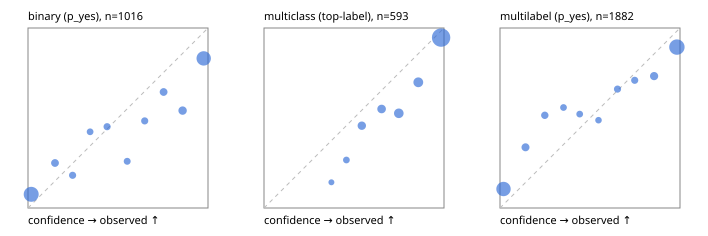

# Evaluation report

- model `google/t5gemma-2-1b-1b` @ `dd0a268322` (pretrained T5Gemma encoder/decoder; shared document cross-KV views), adapter/checkpoint `runs/t5gemma2_r1_reference/adapter`, prompt `challenger-state-first-v1` (6c9d8459ac44)
- data data/eval2.jsonl; splits ['test']; n=1991; calibration `None`
- cuda / bfloat16; 2026-09-24T08:03:22+0000; wall 87.3s

## Overall

question accuracy 73.0%

**binary**: n 1016, positives 435, accuracy 0.795, precision 0.727, recall 0.837, f1 0.778, auroc 0.884, brier 0.154, log_loss 0.550, ece 0.116

**multiclass**: n 593, accuracy 0.798, macro_f1 0.686, log_loss 0.588, brier 0.288, ece_top_label 0.081

**multilabel**: n 382, labels 1882, exact_match 0.450, micro_f1 0.832, macro_f1 0.719, label_auroc 0.900, brier 0.140, log_loss 0.498, ece 0.099

## By family

| family | n | question acc % | details |
|---|---|---|---|
| e2_hard | 673 | 68.2 | bin acc 75.3 F1 70.7 AUROC 0.850 ECE 0.172; mc acc 74.1 mF1 60.2 ECE 0.126; ml EM 40.9 µF1 79.2 ECE 0.133 |
| e2_simple | 664 | 83.4 | bin acc 87.2 F1 88.2 AUROC 0.941 ECE 0.054; mc acc 92.0 mF1 84.6 ECE 0.031; ml EM 58.3 µF1 89.8 ECE 0.083 |
| e2_very_hard | 654 | 67.3 | bin acc 75.9 F1 71.1 AUROC 0.856 ECE 0.144; mc acc 73.0 mF1 59.2 ECE 0.119; ml EM 36.9 µF1 80.6 ECE 0.111 |

## by hard case

| slice | n | question acc % |
|---|---|---|
| (none) | 569 | 85.6 |
| contradiction | 172 | 71.5 |
| distractor | 474 | 70.7 |
| double_negation | 126 | 59.5 |
| evidence_end | 57 | 77.2 |
| evidence_middle | 114 | 77.2 |
| evidence_start | 17 | 70.6 |
| exception | 213 | 68.5 |
| hypothetical | 128 | 74.2 |
| injection | 151 | 62.3 |
| lexical_overlap | 201 | 73.1 |
| long_state | 191 | 74.3 |
| missing_evidence | 141 | 77.3 |
| multi_positive | 322 | 51.9 |
| multi_turn | 149 | 69.1 |
| negation | 257 | 71.2 |
| nota | 118 | 66.9 |
| numeric_reasoning | 224 | 58.5 |
| paraphrase | 218 | 66.5 |
| role_reversal | 187 | 67.9 |
| sarcasm | 149 | 59.7 |
| temporal_reasoning | 203 | 59.6 |
| zero_positive | 73 | 68.5 |
| zero_positive_distractor | 1 | 100.0 |

## by state tokens

| slice | n | question acc % |
|---|---|---|
| 00000-00127 | 679 | 72.0 |
| 00128-00511 | 461 | 68.8 |
| 00512-02047 | 490 | 76.5 |
| 02048-08191 | 322 | 77.0 |
| 08192+ | 39 | 61.5 |

## by candidates

| slice | n | question acc % |
|---|---|---|
| 01 | 1016 | 79.5 |
| 03 | 128 | 75.0 |
| 04 | 515 | 73.8 |
| 05 | 224 | 53.6 |
| 06 | 86 | 46.5 |
| 07 | 18 | 44.4 |
| 08 | 4 | 25.0 |

## Paraphrase groups

76 groups; same prediction 65.8%; all correct 55.3%

## Multiclass abstention (coverage vs error on accepted)

| abstain_below | coverage % | error % |
|---|---|---|
| 0.0 | 100.0 | 20.2 |
| 0.4 | 98.8 | 19.5 |
| 0.5 | 96.3 | 18.0 |
| 0.6 | 90.4 | 15.7 |
| 0.7 | 83.6 | 13.3 |
| 0.8 | 74.0 | 8.9 |
| 0.9 | 63.4 | 5.3 |

## Reliability: binary

| bin | n | mean confidence | observed frequency |
|---|---|---|---|
| [0.0,0.1) | 381 | 0.018 | 0.076 |
| [0.1,0.2) | 44 | 0.150 | 0.250 |
| [0.2,0.3) | 33 | 0.248 | 0.182 |
| [0.3,0.4) | 26 | 0.345 | 0.423 |
| [0.4,0.5) | 31 | 0.439 | 0.452 |
| [0.5,0.6) | 27 | 0.551 | 0.259 |
| [0.6,0.7) | 31 | 0.648 | 0.484 |
| [0.7,0.8) | 45 | 0.753 | 0.644 |
| [0.8,0.9) | 61 | 0.859 | 0.541 |
| [0.9,1.0] | 337 | 0.976 | 0.831 |

## Reliability: multiclass

| bin | n | mean confidence | observed frequency |
|---|---|---|---|
| [0.3,0.4) | 7 | 0.375 | 0.143 |
| [0.4,0.5) | 15 | 0.458 | 0.267 |
| [0.5,0.6) | 35 | 0.543 | 0.457 |
| [0.6,0.7) | 40 | 0.653 | 0.550 |
| [0.7,0.8) | 57 | 0.749 | 0.526 |
| [0.8,0.9) | 63 | 0.857 | 0.698 |
| [0.9,1.0] | 376 | 0.984 | 0.947 |

## Reliability: multilabel

| bin | n | mean confidence | observed frequency |
|---|---|---|---|
| [0.0,0.1) | 626 | 0.019 | 0.105 |
| [0.1,0.2) | 89 | 0.142 | 0.337 |
| [0.2,0.3) | 66 | 0.249 | 0.515 |
| [0.3,0.4) | 43 | 0.353 | 0.558 |
| [0.4,0.5) | 46 | 0.443 | 0.522 |
| [0.5,0.6) | 41 | 0.547 | 0.488 |
| [0.6,0.7) | 56 | 0.653 | 0.661 |
| [0.7,0.8) | 62 | 0.748 | 0.710 |
| [0.8,0.9) | 101 | 0.856 | 0.733 |
| [0.9,1.0] | 752 | 0.983 | 0.894 |
