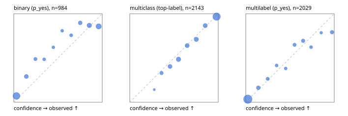

# Evaluation report

- model `google/t5gemma-2-1b-1b` @ `dd0a268322` (pretrained T5Gemma encoder/decoder; shared document cross-KV views), adapter/checkpoint `runs/t5gemma2_r1_reference/adapter`, prompt `challenger-state-first-v1` (6c9d8459ac44)
- data data/hf.jsonl, data/eval.jsonl; splits ['test']; n=3471; calibration `None`
- cuda / bfloat16; 2026-09-24T08:01:54+0000; wall 381.7s

## Overall

question accuracy 75.4%

**binary**: n 984, positives 475, accuracy 0.830, precision 0.855, recall 0.781, f1 0.816, auroc 0.887, brier 0.135, log_loss 0.466, ece 0.090

**multiclass**: n 2143, accuracy 0.766, macro_f1 0.813, log_loss 0.624, brier 0.314, ece_top_label 0.027

**multilabel**: n 344, labels 2029, exact_match 0.456, micro_f1 0.698, macro_f1 0.625, label_auroc 0.906, brier 0.098, log_loss 0.332, ece 0.036

## By family

| family | n | question acc % | details |
|---|---|---|---|
| eval_adversarial | 27 | 70.4 | bin acc 73.3 F1 71.4 AUROC 0.796 ECE 0.280; mc acc 85.7 mF1 81.0 ECE 0.131; ml EM 40.0 µF1 72.7 ECE 0.208 |
| eval_agent_output | 26 | 38.5 | bin acc 57.1 F1 62.5 AUROC 0.694 ECE 0.364; mc acc 14.3 mF1 5.6 ECE 0.484; ml EM 20.0 µF1 63.6 ECE 0.317 |
| eval_evidence | 17 | 82.4 | bin acc 93.3 F1 90.9 AUROC 1.000 ECE 0.122; ml EM 0.0 µF1 40.0 ECE 0.502 |
| eval_multilabel | 32 | 59.4 | bin acc 85.7 F1 80.0 AUROC 1.000 ECE 0.119; mc acc 0.0 mF1 0.0 ECE 0.819; ml EM 54.2 µF1 82.8 ECE 0.137 |
| eval_policy | 22 | 36.4 | bin acc 46.2 F1 53.3 AUROC 0.571 ECE 0.513; mc acc 40.0 mF1 23.8 ECE 0.456; ml EM 0.0 µF1 72.7 ECE 0.364 |
| eval_routing | 25 | 88.0 | bin acc 90.0 F1 88.9 AUROC 0.833 ECE 0.102; mc acc 92.3 mF1 81.8 ECE 0.069; ml EM 50.0 µF1 85.7 ECE 0.114 |
| eval_urgency_sentiment | 22 | 63.6 | bin acc 70.0 F1 76.9 AUROC 0.833 ECE 0.259; mc acc 50.0 mF1 25.5 ECE 0.458; ml EM 100.0 µF1 100.0 ECE 0.109 |
| heldout_boolq | 300 | 74.0 | bin acc 74.0 F1 75.8 AUROC 0.812 ECE 0.169 |
| heldout_emotion_multiclass | 300 | 51.0 | mc acc 51.0 mF1 43.2 ECE 0.115 |
| heldout_intent_clinc | 300 | 87.7 | mc acc 87.7 mF1 88.3 ECE 0.046 |
| heldout_question_type_trec | 300 | 55.7 | mc acc 55.7 mF1 59.0 ECE 0.093 |
| heldout_sentiment_sst2 | 300 | 90.3 | bin acc 90.3 F1 89.9 AUROC 0.962 ECE 0.097 |
| heldout_topic_dbpedia | 300 | 92.7 | mc acc 92.7 mF1 92.8 ECE 0.033 |
| hf_emotions_multilabel | 300 | 46.0 | ml EM 46.0 µF1 67.4 ECE 0.026 |
| hf_intent_banking77 | 300 | 94.3 | mc acc 94.3 mF1 92.8 ECE 0.026 |
| hf_nli | 300 | 87.7 | bin acc 87.7 F1 82.9 AUROC 0.948 ECE 0.056 |
| hf_sentiment_tweets | 300 | 66.7 | mc acc 66.7 mF1 65.9 ECE 0.032 |
| hf_topic_agnews | 300 | 90.7 | mc acc 90.7 mF1 90.7 ECE 0.040 |

## by hard case

| slice | n | question acc % |
|---|---|---|
| (none) | 3042 | 75.8 |
| contradiction | 107 | 93.5 |
| distractor | 33 | 42.4 |
| double_negation | 6 | 66.7 |
| evidence_end | 13 | 61.5 |
| evidence_middle | 11 | 45.5 |
| evidence_start | 9 | 66.7 |
| exception | 7 | 28.6 |
| hypothetical | 7 | 85.7 |
| injection | 10 | 20.0 |
| lexical_overlap | 20 | 75.0 |
| long_state | 50 | 54.0 |
| missing_evidence | 104 | 85.6 |
| multi_positive | 81 | 32.1 |
| multi_turn | 9 | 77.8 |
| negation | 30 | 70.0 |
| new_label_names | 3 | 33.3 |
| nota | 46 | 91.3 |
| numeric_reasoning | 16 | 62.5 |
| paraphrase | 22 | 59.1 |
| role_reversal | 15 | 60.0 |
| sarcasm | 12 | 66.7 |
| temporal_reasoning | 29 | 34.5 |
| zero_positive | 6 | 16.7 |

## by state tokens

| slice | n | question acc % |
|---|---|---|
| 00000-00127 | 3218 | 76.1 |
| 00128-00511 | 202 | 69.3 |
| 00512-02047 | 51 | 54.9 |

## by candidates

| slice | n | question acc % |
|---|---|---|
| 01 | 984 | 83.0 |
| 03 | 310 | 66.5 |
| 04 | 333 | 87.7 |
| 05 | 22 | 31.8 |
| 06 | 1218 | 61.4 |
| 07 | 49 | 85.7 |
| 08 | 555 | 90.8 |

## Paraphrase groups

11 groups; same prediction 54.5%; all correct 54.5%

## Multiclass abstention (coverage vs error on accepted)

| abstain_below | coverage % | error % |
|---|---|---|
| 0.0 | 100.0 | 23.4 |
| 0.4 | 94.5 | 20.7 |
| 0.5 | 86.5 | 17.1 |
| 0.6 | 74.9 | 11.8 |
| 0.7 | 66.3 | 8.7 |
| 0.8 | 55.9 | 4.9 |
| 0.9 | 46.5 | 3.2 |

## Reliability: binary

| bin | n | mean confidence | observed frequency |
|---|---|---|---|
| [0.0,0.1) | 366 | 0.031 | 0.071 |
| [0.1,0.2) | 79 | 0.142 | 0.291 |
| [0.2,0.3) | 43 | 0.245 | 0.488 |
| [0.3,0.4) | 33 | 0.344 | 0.485 |
| [0.4,0.5) | 29 | 0.447 | 0.621 |
| [0.5,0.6) | 26 | 0.547 | 0.808 |
| [0.6,0.7) | 37 | 0.649 | 0.757 |
| [0.7,0.8) | 68 | 0.751 | 0.897 |
| [0.8,0.9) | 114 | 0.853 | 0.868 |
| [0.9,1.0] | 189 | 0.959 | 0.857 |

## Reliability: multiclass

| bin | n | mean confidence | observed frequency |
|---|---|---|---|
| [0.2,0.3) | 14 | 0.277 | 0.143 |
| [0.3,0.4) | 103 | 0.359 | 0.330 |
| [0.4,0.5) | 173 | 0.455 | 0.405 |
| [0.5,0.6) | 247 | 0.551 | 0.486 |
| [0.6,0.7) | 186 | 0.649 | 0.640 |
| [0.7,0.8) | 221 | 0.752 | 0.710 |
| [0.8,0.9) | 202 | 0.853 | 0.866 |
| [0.9,1.0] | 997 | 0.981 | 0.968 |

## Reliability: multilabel

| bin | n | mean confidence | observed frequency |
|---|---|---|---|
| [0.0,0.1) | 1250 | 0.024 | 0.034 |
| [0.1,0.2) | 147 | 0.142 | 0.163 |
| [0.2,0.3) | 87 | 0.248 | 0.264 |
| [0.3,0.4) | 65 | 0.349 | 0.415 |
| [0.4,0.5) | 55 | 0.451 | 0.382 |
| [0.5,0.6) | 94 | 0.552 | 0.649 |
| [0.6,0.7) | 108 | 0.648 | 0.694 |
| [0.7,0.8) | 61 | 0.738 | 0.623 |
| [0.8,0.9) | 42 | 0.853 | 0.786 |
| [0.9,1.0] | 120 | 0.975 | 0.792 |
