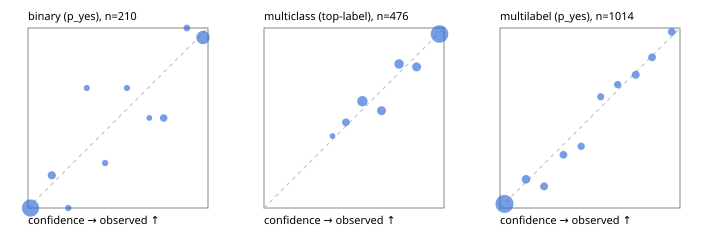

# Evaluation report

- model `Qwen/Qwen3-Reranker-4B` @ `22e683669b` (shared-prefix tree (tree-v1)), adapter/checkpoint `runs/tree_4b/adapter`, prompt `tree-v1` (bc025ae9f6bc)
- data data/hf.jsonl, data/eval.jsonl; splits ['calibration']; n=859; calibration `None`
- cuda / bfloat16; 2026-09-23T23:41:25+0000; wall 52.2s

## Overall

question accuracy 79.6%

**binary**: n 210, positives 71, accuracy 0.933, precision 0.880, recall 0.930, f1 0.904, auroc 0.982, brier 0.050, log_loss 0.168, ece 0.045

**multiclass**: n 476, accuracy 0.830, macro_f1 0.819, log_loss 0.409, brier 0.239, ece_top_label 0.030

**multilabel**: n 173, labels 1014, exact_match 0.538, micro_f1 0.763, macro_f1 0.671, label_auroc 0.927, brier 0.078, log_loss 0.265, ece 0.020

## By family

| family | n | question acc % | details |
|---|---|---|---|
| eval_adversarial | 19 | 100.0 | bin acc 100.0 F1 100.0 AUROC 1.000 ECE 0.036; mc acc 100.0 mF1 100.0 ECE 0.071; ml EM 100.0 µF1 100.0 ECE 0.011 |
| eval_agent_output | 9 | 66.7 | bin acc 80.0 F1 85.7 AUROC 1.000 ECE 0.221; mc acc 50.0 mF1 33.3 ECE 0.314; ml EM 50.0 µF1 40.0 ECE 0.331 |
| eval_evidence | 19 | 78.9 | bin acc 81.2 F1 76.9 AUROC 0.982 ECE 0.157; ml EM 66.7 µF1 92.3 ECE 0.144 |
| eval_multilabel | 12 | 75.0 | bin acc 100.0 F1 100.0 AUROC — ECE 0.044; mc acc 100.0 mF1 100.0 ECE 0.109; ml EM 62.5 µF1 85.7 ECE 0.110 |
| eval_policy | 16 | 62.5 | bin acc 87.5 F1 85.7 AUROC 1.000 ECE 0.204; mc acc 0.0 mF1 0.0 ECE 0.699; ml EM 75.0 µF1 88.9 ECE 0.080 |
| eval_routing | 15 | 93.3 | bin acc 100.0 F1 100.0 AUROC 1.000 ECE 0.064; mc acc 85.7 mF1 71.4 ECE 0.105; ml EM 100.0 µF1 100.0 ECE 0.041 |
| eval_urgency_sentiment | 19 | 89.5 | bin acc 87.5 F1 80.0 AUROC 1.000 ECE 0.121; mc acc 87.5 mF1 83.3 ECE 0.217; ml EM 100.0 µF1 100.0 ECE 0.043 |
| hf_emotions_multilabel | 150 | 50.7 | ml EM 50.7 µF1 74.0 ECE 0.021 |
| hf_intent_banking77 | 150 | 94.0 | mc acc 94.0 mF1 91.0 ECE 0.035 |
| hf_nli | 150 | 94.7 | bin acc 94.7 F1 91.1 AUROC 0.988 ECE 0.042 |
| hf_sentiment_tweets | 150 | 70.0 | mc acc 70.0 mF1 68.5 ECE 0.084 |
| hf_topic_agnews | 150 | 86.7 | mc acc 86.7 mF1 86.9 ECE 0.022 |

## by hard case

| slice | n | question acc % |
|---|---|---|
| (none) | 624 | 79.0 |
| contradiction | 58 | 96.6 |
| distractor | 25 | 76.0 |
| double_negation | 3 | 100.0 |
| evidence_end | 11 | 90.9 |
| evidence_middle | 6 | 66.7 |
| evidence_start | 7 | 85.7 |
| exception | 4 | 75.0 |
| hypothetical | 7 | 71.4 |
| injection | 6 | 83.3 |
| lexical_overlap | 16 | 93.8 |
| long_state | 42 | 78.6 |
| missing_evidence | 62 | 91.9 |
| multi_positive | 42 | 42.9 |
| multi_turn | 12 | 91.7 |
| negation | 12 | 83.3 |
| new_label_names | 5 | 80.0 |
| nota | 4 | 75.0 |
| numeric_reasoning | 15 | 40.0 |
| paraphrase | 10 | 80.0 |
| role_reversal | 13 | 76.9 |
| sarcasm | 1 | 0.0 |
| temporal_reasoning | 14 | 85.7 |
| zero_positive | 4 | 75.0 |

## by state tokens

| slice | n | question acc % |
|---|---|---|
| 00000-00127 | 780 | 79.2 |
| 00128-00511 | 37 | 89.2 |
| 00512-02047 | 42 | 78.6 |

## by candidates

| slice | n | question acc % |
|---|---|---|
| 01 | 210 | 93.3 |
| 03 | 158 | 69.6 |
| 04 | 168 | 85.7 |
| 05 | 15 | 80.0 |
| 06 | 157 | 51.0 |
| 07 | 1 | 100.0 |
| 08 | 150 | 94.0 |

## Paraphrase groups

5 groups; same prediction 60.0%; all correct 60.0%

## Multiclass abstention (coverage vs error on accepted)

| abstain_below | coverage % | error % |
|---|---|---|
| 0.0 | 100.0 | 17.0 |
| 0.4 | 98.9 | 16.6 |
| 0.5 | 94.5 | 14.9 |
| 0.6 | 82.1 | 11.0 |
| 0.7 | 74.4 | 7.3 |
| 0.8 | 64.9 | 5.5 |
| 0.9 | 57.1 | 3.3 |

## Reliability: binary

| bin | n | mean confidence | observed frequency |
|---|---|---|---|
| [0.0,0.1) | 113 | 0.014 | 0.000 |
| [0.1,0.2) | 11 | 0.132 | 0.182 |
| [0.2,0.3) | 4 | 0.224 | 0.000 |
| [0.3,0.4) | 3 | 0.327 | 0.667 |
| [0.4,0.5) | 4 | 0.428 | 0.250 |
| [0.5,0.6) | 3 | 0.550 | 0.667 |
| [0.6,0.7) | 2 | 0.674 | 0.500 |
| [0.7,0.8) | 8 | 0.754 | 0.500 |
| [0.8,0.9) | 5 | 0.883 | 1.000 |
| [0.9,1.0] | 57 | 0.972 | 0.947 |

## Reliability: multiclass

| bin | n | mean confidence | observed frequency |
|---|---|---|---|
| [0.3,0.4) | 5 | 0.381 | 0.400 |
| [0.4,0.5) | 21 | 0.455 | 0.476 |
| [0.5,0.6) | 59 | 0.547 | 0.593 |
| [0.6,0.7) | 37 | 0.653 | 0.541 |
| [0.7,0.8) | 45 | 0.751 | 0.800 |
| [0.8,0.9) | 37 | 0.848 | 0.784 |
| [0.9,1.0] | 272 | 0.975 | 0.967 |

## Reliability: multilabel

| bin | n | mean confidence | observed frequency |
|---|---|---|---|
| [0.0,0.1) | 608 | 0.025 | 0.023 |
| [0.1,0.2) | 69 | 0.144 | 0.159 |
| [0.2,0.3) | 50 | 0.245 | 0.120 |
| [0.3,0.4) | 44 | 0.352 | 0.295 |
| [0.4,0.5) | 35 | 0.451 | 0.343 |
| [0.5,0.6) | 34 | 0.559 | 0.618 |
| [0.6,0.7) | 35 | 0.654 | 0.686 |
| [0.7,0.8) | 50 | 0.754 | 0.740 |
| [0.8,0.9) | 43 | 0.845 | 0.837 |
| [0.9,1.0] | 46 | 0.954 | 0.978 |
