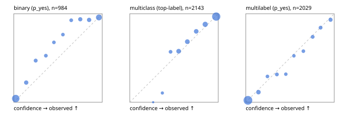

# Evaluation report

- model `Qwen/Qwen3-Reranker-4B` @ `22e683669b` (shared-prefix tree (tree-v1)), adapter/checkpoint `runs/tree_4b/adapter`, prompt `tree-v1` (bc025ae9f6bc)
- data data/hf.jsonl, data/eval.jsonl; splits ['test']; n=3471; calibration `None`
- cuda / bfloat16; 2026-09-23T23:44:52+0000; wall 198.8s

## Overall

question accuracy 81.6%

**binary**: n 984, positives 475, accuracy 0.871, precision 0.931, recall 0.792, f1 0.856, auroc 0.953, brier 0.096, log_loss 0.307, ece 0.077

**multiclass**: n 2143, accuracy 0.839, macro_f1 0.897, log_loss 0.465, brier 0.236, ece_top_label 0.029

**multilabel**: n 344, labels 2029, exact_match 0.517, micro_f1 0.749, macro_f1 0.742, label_auroc 0.938, brier 0.079, log_loss 0.256, ece 0.017

## By family

| family | n | question acc % | details |
|---|---|---|---|
| eval_adversarial | 27 | 96.3 | bin acc 93.3 F1 90.9 AUROC 1.000 ECE 0.087; mc acc 100.0 mF1 100.0 ECE 0.021; ml EM 100.0 µF1 100.0 ECE 0.086 |
| eval_agent_output | 26 | 61.5 | bin acc 85.7 F1 85.7 AUROC 0.918 ECE 0.161; mc acc 28.6 mF1 21.4 ECE 0.521; ml EM 40.0 µF1 71.4 ECE 0.140 |
| eval_evidence | 17 | 82.4 | bin acc 93.3 F1 90.9 AUROC 1.000 ECE 0.055; ml EM 0.0 µF1 57.1 ECE 0.254 |
| eval_multilabel | 32 | 81.2 | bin acc 100.0 F1 100.0 AUROC 1.000 ECE 0.039; mc acc 100.0 mF1 100.0 ECE 0.121; ml EM 75.0 µF1 93.2 ECE 0.027 |
| eval_policy | 22 | 50.0 | bin acc 61.5 F1 61.5 AUROC 0.643 ECE 0.357; mc acc 40.0 mF1 25.0 ECE 0.362; ml EM 25.0 µF1 80.0 ECE 0.270 |
| eval_routing | 25 | 84.0 | bin acc 90.0 F1 88.9 AUROC 0.917 ECE 0.119; mc acc 84.6 mF1 75.0 ECE 0.076; ml EM 50.0 µF1 80.0 ECE 0.064 |
| eval_urgency_sentiment | 22 | 90.9 | bin acc 80.0 F1 83.3 AUROC 0.917 ECE 0.237; mc acc 100.0 mF1 100.0 ECE 0.156; ml EM 100.0 µF1 100.0 ECE 0.043 |
| heldout_boolq | 300 | 83.3 | bin acc 83.3 F1 84.9 AUROC 0.927 ECE 0.098 |
| heldout_emotion_multiclass | 300 | 55.3 | mc acc 55.3 mF1 43.3 ECE 0.155 |
| heldout_intent_clinc | 300 | 94.7 | mc acc 94.7 mF1 96.3 ECE 0.066 |
| heldout_question_type_trec | 300 | 88.7 | mc acc 88.7 mF1 86.3 ECE 0.155 |
| heldout_sentiment_sst2 | 300 | 84.0 | bin acc 84.0 F1 81.1 AUROC 0.973 ECE 0.163 |
| heldout_topic_dbpedia | 300 | 96.7 | mc acc 96.7 mF1 96.3 ECE 0.015 |
| hf_emotions_multilabel | 300 | 49.7 | ml EM 49.7 µF1 71.2 ECE 0.017 |
| hf_intent_banking77 | 300 | 96.0 | mc acc 96.0 mF1 95.1 ECE 0.025 |
| hf_nli | 300 | 94.3 | bin acc 94.3 F1 92.2 AUROC 0.982 ECE 0.022 |
| hf_sentiment_tweets | 300 | 67.0 | mc acc 67.0 mF1 67.1 ECE 0.050 |
| hf_topic_agnews | 300 | 89.7 | mc acc 89.7 mF1 89.7 ECE 0.041 |

## by hard case

| slice | n | question acc % |
|---|---|---|
| (none) | 3042 | 81.5 |
| contradiction | 107 | 98.1 |
| distractor | 33 | 69.7 |
| double_negation | 6 | 100.0 |
| evidence_end | 13 | 92.3 |
| evidence_middle | 11 | 81.8 |
| evidence_start | 9 | 88.9 |
| exception | 7 | 28.6 |
| hypothetical | 7 | 100.0 |
| injection | 10 | 80.0 |
| lexical_overlap | 20 | 85.0 |
| long_state | 50 | 76.0 |
| missing_evidence | 104 | 91.3 |
| multi_positive | 81 | 44.4 |
| multi_turn | 9 | 77.8 |
| negation | 30 | 90.0 |
| new_label_names | 3 | 33.3 |
| nota | 46 | 97.8 |
| numeric_reasoning | 16 | 43.8 |
| paraphrase | 22 | 77.3 |
| role_reversal | 15 | 73.3 |
| sarcasm | 12 | 91.7 |
| temporal_reasoning | 29 | 51.7 |
| zero_positive | 6 | 66.7 |

## by state tokens

| slice | n | question acc % |
|---|---|---|
| 00000-00127 | 3211 | 81.7 |
| 00128-00511 | 208 | 81.7 |
| 00512-02047 | 52 | 76.9 |

## by candidates

| slice | n | question acc % |
|---|---|---|
| 01 | 984 | 87.1 |
| 03 | 310 | 67.7 |
| 04 | 333 | 87.7 |
| 05 | 22 | 63.6 |
| 06 | 1218 | 72.5 |
| 07 | 49 | 100.0 |
| 08 | 555 | 95.0 |

## Paraphrase groups

11 groups; same prediction 63.6%; all correct 72.7%

## Multiclass abstention (coverage vs error on accepted)

| abstain_below | coverage % | error % |
|---|---|---|
| 0.0 | 100.0 | 16.1 |
| 0.4 | 97.6 | 14.3 |
| 0.5 | 93.6 | 13.1 |
| 0.6 | 83.9 | 9.7 |
| 0.7 | 74.1 | 6.9 |
| 0.8 | 65.0 | 5.0 |
| 0.9 | 51.3 | 3.2 |

## Reliability: binary

| bin | n | mean confidence | observed frequency |
|---|---|---|---|
| [0.0,0.1) | 385 | 0.022 | 0.042 |
| [0.1,0.2) | 72 | 0.140 | 0.222 |
| [0.2,0.3) | 51 | 0.248 | 0.471 |
| [0.3,0.4) | 38 | 0.363 | 0.526 |
| [0.4,0.5) | 34 | 0.454 | 0.676 |
| [0.5,0.6) | 34 | 0.555 | 0.765 |
| [0.6,0.7) | 41 | 0.650 | 0.927 |
| [0.7,0.8) | 64 | 0.752 | 0.938 |
| [0.8,0.9) | 72 | 0.852 | 0.931 |
| [0.9,1.0] | 193 | 0.962 | 0.959 |

## Reliability: multiclass

| bin | n | mean confidence | observed frequency |
|---|---|---|---|
| [0.2,0.3) | 3 | 0.264 | 0.000 |
| [0.3,0.4) | 48 | 0.368 | 0.104 |
| [0.4,0.5) | 86 | 0.461 | 0.570 |
| [0.5,0.6) | 208 | 0.553 | 0.577 |
| [0.6,0.7) | 209 | 0.651 | 0.684 |
| [0.7,0.8) | 196 | 0.751 | 0.801 |
| [0.8,0.9) | 293 | 0.853 | 0.881 |
| [0.9,1.0] | 1100 | 0.977 | 0.968 |

## Reliability: multilabel

| bin | n | mean confidence | observed frequency |
|---|---|---|---|
| [0.0,0.1) | 1207 | 0.024 | 0.022 |
| [0.1,0.2) | 167 | 0.143 | 0.114 |
| [0.2,0.3) | 72 | 0.245 | 0.292 |
| [0.3,0.4) | 89 | 0.352 | 0.315 |
| [0.4,0.5) | 63 | 0.453 | 0.317 |
| [0.5,0.6) | 61 | 0.544 | 0.525 |
| [0.6,0.7) | 71 | 0.651 | 0.577 |
| [0.7,0.8) | 92 | 0.756 | 0.739 |
| [0.8,0.9) | 89 | 0.845 | 0.843 |
| [0.9,1.0] | 118 | 0.958 | 0.932 |
