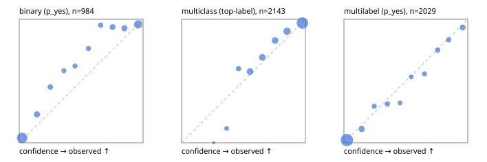

# Evaluation report

- model `Qwen/Qwen3-Reranker-4B` @ `22e683669b` (shared-prefix tree (tree-v1)), adapter/checkpoint `runs/tree_4b/adapter`, prompt `tree-v1` (bc025ae9f6bc)
- data data/hf.jsonl, data/eval.jsonl; splits ['test']; n=3471; calibration `{'method': 'temperature scaling per output type, grid search on NLL', 'min_n': 30, 'model': 'Qwen/Qwen3-Reranker-4B', 'revision': '22e683669bc0f0bd69640a1354a6d0aebcfeede5', 'adapter': 'runs/tree_4b/adapter', 'adapter_sha256': 'b7a2c5f8503918e723bb8ccbd19ae9f6da10d339f9fc7c7d205354dfb92e17f5', 'prompt_sha': 'bc025ae9f6bc', 'fit_report': 'reports/tree_4b/calibration/report.json', 'fit_report_sha256': 'cc5091bf6fed3227ffe13c7e4648437abc76516c4653d87eef410765ea7a1584', 'fit_data': [{'path': 'data/hf.jsonl', 'sha256': 'fe29b29286d5a372271e925825e8b9794f3f64be9a9fc04cad458b4b94ada510'}, {'path': 'data/eval.jsonl', 'sha256': 'be888eb38dcca063823924430e03985ddf2186b874e792d5734936ba93ba6910'}], 'created': '2026-09-23T23:44:57+0000', 'n': {'binary': 210, 'multiclass': 476, 'multilabel': 1014}, 'nll_before': {'binary': 0.16803693173592094, 'multiclass': 0.40921436313755044, 'multilabel': 0.2649878994426057}, 'nll_after': {'binary': 0.1679636505221189, 'multiclass': 0.40868489433674254, 'multilabel': 0.26496638825816143}, 'skipped': {}, 'threshold_report': 'reports/tree_4b/validation/report.json', 'threshold_report_sha256': 'd117effa04e20b5acf0a2e3387dcc478e3630ce7561f9760b74f83c257fd11a3', 'threshold_rule': 'max F1 on validation after temperature scaling', 'file': 'calib/tree_4b.json', 'file_sha256': '4bc0d8e74e90e2b767c89009769a717bb9c0b590906523e39a3367bd81a49333'}`
- cuda / bfloat16; 2026-09-23T23:48:25+0000; wall 198.8s

## Overall

question accuracy 79.3%

**binary**: n 984, positives 475, accuracy 0.797, precision 0.948, recall 0.613, f1 0.744, auroc 0.953, brier 0.096, log_loss 0.307, ece 0.076

**multiclass**: n 2143, accuracy 0.839, macro_f1 0.897, log_loss 0.465, brier 0.237, ece_top_label 0.036

**multilabel**: n 344, labels 2029, exact_match 0.497, micro_f1 0.745, macro_f1 0.724, label_auroc 0.938, brier 0.079, log_loss 0.256, ece 0.017

## By family

| family | n | question acc % | details |
|---|---|---|---|
| eval_adversarial | 27 | 88.9 | bin acc 93.3 F1 90.9 AUROC 1.000 ECE 0.089; mc acc 100.0 mF1 100.0 ECE 0.025; ml EM 60.0 µF1 90.0 ECE 0.085 |
| eval_agent_output | 26 | 57.7 | bin acc 85.7 F1 85.7 AUROC 0.918 ECE 0.162; mc acc 28.6 mF1 21.4 ECE 0.519; ml EM 20.0 µF1 66.7 ECE 0.141 |
| eval_evidence | 17 | 88.2 | bin acc 100.0 F1 100.0 AUROC 1.000 ECE 0.056; ml EM 0.0 µF1 57.1 ECE 0.254 |
| eval_multilabel | 32 | 81.2 | bin acc 100.0 F1 100.0 AUROC 1.000 ECE 0.041; mc acc 100.0 mF1 100.0 ECE 0.139; ml EM 75.0 µF1 93.2 ECE 0.027 |
| eval_policy | 22 | 45.5 | bin acc 53.8 F1 50.0 AUROC 0.643 ECE 0.293; mc acc 40.0 mF1 25.0 ECE 0.423; ml EM 25.0 µF1 76.2 ECE 0.271 |
| eval_routing | 25 | 84.0 | bin acc 90.0 F1 88.9 AUROC 0.917 ECE 0.119; mc acc 84.6 mF1 75.0 ECE 0.079; ml EM 50.0 µF1 80.0 ECE 0.064 |
| eval_urgency_sentiment | 22 | 86.4 | bin acc 70.0 F1 72.7 AUROC 0.917 ECE 0.239; mc acc 100.0 mF1 100.0 ECE 0.164; ml EM 100.0 µF1 100.0 ECE 0.042 |
| heldout_boolq | 300 | 78.0 | bin acc 78.0 F1 78.1 AUROC 0.927 ECE 0.098 |
| heldout_emotion_multiclass | 300 | 55.3 | mc acc 55.3 mF1 43.3 ECE 0.140 |
| heldout_intent_clinc | 300 | 94.7 | mc acc 94.7 mF1 96.3 ECE 0.075 |
| heldout_question_type_trec | 300 | 88.7 | mc acc 88.7 mF1 86.3 ECE 0.171 |
| heldout_sentiment_sst2 | 300 | 67.0 | bin acc 67.0 F1 50.7 AUROC 0.973 ECE 0.160 |
| heldout_topic_dbpedia | 300 | 96.7 | mc acc 96.7 mF1 96.3 ECE 0.011 |
| hf_emotions_multilabel | 300 | 48.3 | ml EM 48.3 µF1 71.4 ECE 0.017 |
| hf_intent_banking77 | 300 | 96.0 | mc acc 96.0 mF1 95.1 ECE 0.031 |
| hf_nli | 300 | 92.7 | bin acc 92.7 F1 89.3 AUROC 0.982 ECE 0.021 |
| hf_sentiment_tweets | 300 | 67.0 | mc acc 67.0 mF1 67.1 ECE 0.054 |
| hf_topic_agnews | 300 | 89.7 | mc acc 89.7 mF1 89.7 ECE 0.042 |

## by hard case

| slice | n | question acc % |
|---|---|---|
| (none) | 3042 | 78.6 |
| contradiction | 107 | 99.1 |
| distractor | 33 | 69.7 |
| double_negation | 6 | 100.0 |
| evidence_end | 13 | 92.3 |
| evidence_middle | 11 | 81.8 |
| evidence_start | 9 | 88.9 |
| exception | 7 | 28.6 |
| hypothetical | 7 | 100.0 |
| injection | 10 | 70.0 |
| lexical_overlap | 20 | 85.0 |
| long_state | 50 | 72.0 |
| missing_evidence | 104 | 94.2 |
| multi_positive | 81 | 53.1 |
| multi_turn | 9 | 77.8 |
| negation | 30 | 80.0 |
| new_label_names | 3 | 33.3 |
| nota | 46 | 97.8 |
| numeric_reasoning | 16 | 50.0 |
| paraphrase | 22 | 77.3 |
| role_reversal | 15 | 66.7 |
| sarcasm | 12 | 91.7 |
| temporal_reasoning | 29 | 44.8 |
| zero_positive | 6 | 50.0 |

## by state tokens

| slice | n | question acc % |
|---|---|---|
| 00000-00127 | 3211 | 79.5 |
| 00128-00511 | 208 | 77.4 |
| 00512-02047 | 52 | 73.1 |

## by candidates

| slice | n | question acc % |
|---|---|---|
| 01 | 984 | 79.7 |
| 03 | 310 | 67.7 |
| 04 | 333 | 87.4 |
| 05 | 22 | 54.5 |
| 06 | 1218 | 72.2 |
| 07 | 49 | 100.0 |
| 08 | 555 | 95.0 |

## Paraphrase groups

11 groups; same prediction 63.6%; all correct 72.7%

## Multiclass abstention (coverage vs error on accepted)

| abstain_below | coverage % | error % |
|---|---|---|
| 0.0 | 100.0 | 16.1 |
| 0.4 | 97.4 | 14.2 |
| 0.5 | 93.0 | 13.0 |
| 0.6 | 82.3 | 9.2 |
| 0.7 | 72.3 | 6.2 |
| 0.8 | 62.6 | 4.5 |
| 0.9 | 49.2 | 3.0 |

## Reliability: binary

| bin | n | mean confidence | observed frequency |
|---|---|---|---|
| [0.0,0.1) | 382 | 0.023 | 0.039 |
| [0.1,0.2) | 74 | 0.143 | 0.230 |
| [0.2,0.3) | 51 | 0.250 | 0.451 |
| [0.3,0.4) | 36 | 0.361 | 0.583 |
| [0.4,0.5) | 37 | 0.451 | 0.622 |
| [0.5,0.6) | 38 | 0.559 | 0.763 |
| [0.6,0.7) | 42 | 0.657 | 0.952 |
| [0.7,0.8) | 63 | 0.754 | 0.937 |
| [0.8,0.9) | 68 | 0.850 | 0.926 |
| [0.9,1.0] | 193 | 0.960 | 0.959 |

## Reliability: multiclass

| bin | n | mean confidence | observed frequency |
|---|---|---|---|
| [0.2,0.3) | 3 | 0.259 | 0.000 |
| [0.3,0.4) | 52 | 0.364 | 0.115 |
| [0.4,0.5) | 95 | 0.460 | 0.600 |
| [0.5,0.6) | 229 | 0.553 | 0.576 |
| [0.6,0.7) | 214 | 0.652 | 0.692 |
| [0.7,0.8) | 209 | 0.755 | 0.828 |
| [0.8,0.9) | 287 | 0.852 | 0.902 |
| [0.9,1.0] | 1054 | 0.976 | 0.970 |

## Reliability: multilabel

| bin | n | mean confidence | observed frequency |
|---|---|---|---|
| [0.0,0.1) | 1214 | 0.024 | 0.022 |
| [0.1,0.2) | 162 | 0.144 | 0.111 |
| [0.2,0.3) | 71 | 0.244 | 0.296 |
| [0.3,0.4) | 89 | 0.351 | 0.315 |
| [0.4,0.5) | 62 | 0.453 | 0.323 |
| [0.5,0.6) | 60 | 0.544 | 0.533 |
| [0.6,0.7) | 70 | 0.651 | 0.557 |
| [0.7,0.8) | 92 | 0.757 | 0.750 |
| [0.8,0.9) | 90 | 0.846 | 0.833 |
| [0.9,1.0] | 119 | 0.959 | 0.933 |
