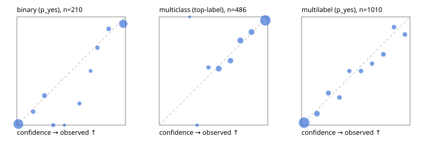

# Evaluation report

- model `Qwen/Qwen3-Reranker-4B` @ `22e683669b` (shared-prefix tree (tree-v1)), adapter/checkpoint `runs/tree_4b/adapter`, prompt `tree-v1` (bc025ae9f6bc)
- data data/hf.jsonl, data/eval.jsonl; splits ['validation']; n=868; calibration `None`
- cuda / bfloat16; 2026-09-23T23:40:25+0000; wall 50.6s

## Overall

question accuracy 78.0%

**binary**: n 210, positives 79, accuracy 0.914, precision 0.851, recall 0.937, f1 0.892, auroc 0.974, brier 0.063, log_loss 0.216, ece 0.042

**multiclass**: n 486, accuracy 0.840, macro_f1 0.744, log_loss 0.440, brier 0.225, ece_top_label 0.025

**multilabel**: n 172, labels 1010, exact_match 0.448, micro_f1 0.696, macro_f1 0.637, label_auroc 0.922, brier 0.089, log_loss 0.284, ece 0.029

## By family

| family | n | question acc % | details |
|---|---|---|---|
| eval_adversarial | 14 | 92.9 | bin acc 85.7 F1 90.9 AUROC 1.000 ECE 0.171; mc acc 100.0 mF1 100.0 ECE 0.025; ml EM 100.0 µF1 100.0 ECE 0.022 |
| eval_agent_output | 20 | 70.0 | bin acc 83.3 F1 85.7 AUROC 0.750 ECE 0.187; mc acc 60.0 mF1 33.3 ECE 0.457; ml EM 33.3 µF1 0.0 ECE 0.345 |
| eval_evidence | 17 | 94.1 | bin acc 92.9 F1 90.9 AUROC 1.000 ECE 0.064; ml EM 100.0 µF1 100.0 ECE 0.040 |
| eval_multilabel | 12 | 66.7 | bin acc 0.0 F1 0.0 AUROC — ECE 0.580; mc acc 100.0 mF1 100.0 ECE 0.111; ml EM 66.7 µF1 93.3 ECE 0.050 |
| eval_policy | 24 | 37.5 | bin acc 58.3 F1 61.5 AUROC 0.714 ECE 0.298; mc acc 18.2 mF1 10.5 ECE 0.503; ml EM 0.0 µF1 50.0 ECE 0.457 |
| eval_routing | 16 | 93.8 | bin acc 100.0 F1 100.0 AUROC 1.000 ECE 0.126; mc acc 100.0 mF1 100.0 ECE 0.117; ml EM 0.0 µF1 0.0 ECE 0.375 |
| eval_urgency_sentiment | 15 | 93.3 | bin acc 100.0 F1 100.0 AUROC 1.000 ECE 0.107; mc acc 80.0 mF1 66.7 ECE 0.059; ml EM 100.0 µF1 100.0 ECE 0.023 |
| hf_emotions_multilabel | 150 | 41.3 | ml EM 41.3 µF1 66.5 ECE 0.032 |
| hf_intent_banking77 | 150 | 94.7 | mc acc 94.7 mF1 93.6 ECE 0.037 |
| hf_nli | 150 | 94.7 | bin acc 94.7 F1 91.8 AUROC 0.990 ECE 0.032 |
| hf_sentiment_tweets | 150 | 74.0 | mc acc 74.0 mF1 69.8 ECE 0.044 |
| hf_topic_agnews | 150 | 87.3 | mc acc 87.3 mF1 87.6 ECE 0.048 |

## by hard case

| slice | n | question acc % |
|---|---|---|
| (none) | 634 | 78.4 |
| contradiction | 63 | 93.7 |
| distractor | 20 | 70.0 |
| double_negation | 3 | 100.0 |
| evidence_end | 4 | 50.0 |
| evidence_middle | 7 | 71.4 |
| evidence_start | 3 | 66.7 |
| exception | 7 | 71.4 |
| hypothetical | 6 | 83.3 |
| injection | 16 | 68.8 |
| lexical_overlap | 13 | 92.3 |
| long_state | 26 | 57.7 |
| missing_evidence | 59 | 91.5 |
| multi_positive | 40 | 32.5 |
| multi_turn | 21 | 76.2 |
| negation | 9 | 66.7 |
| new_label_names | 5 | 60.0 |
| nota | 4 | 100.0 |
| numeric_reasoning | 13 | 76.9 |
| paraphrase | 10 | 70.0 |
| role_reversal | 7 | 57.1 |
| sarcasm | 5 | 80.0 |
| temporal_reasoning | 15 | 40.0 |
| zero_positive | 7 | 57.1 |

## by state tokens

| slice | n | question acc % |
|---|---|---|
| 00000-00127 | 796 | 78.5 |
| 00128-00511 | 46 | 80.4 |
| 00512-02047 | 26 | 57.7 |

## by candidates

| slice | n | question acc % |
|---|---|---|
| 01 | 210 | 91.4 |
| 03 | 162 | 72.8 |
| 04 | 174 | 85.1 |
| 05 | 13 | 61.5 |
| 06 | 159 | 43.4 |
| 08 | 150 | 94.7 |

## Paraphrase groups

5 groups; same prediction 60.0%; all correct 60.0%

## Multiclass abstention (coverage vs error on accepted)

| abstain_below | coverage % | error % |
|---|---|---|
| 0.0 | 100.0 | 16.0 |
| 0.4 | 99.0 | 15.4 |
| 0.5 | 95.9 | 14.4 |
| 0.6 | 86.4 | 10.7 |
| 0.7 | 77.8 | 7.4 |
| 0.8 | 66.5 | 5.0 |
| 0.9 | 56.2 | 3.3 |

## Reliability: binary

| bin | n | mean confidence | observed frequency |
|---|---|---|---|
| [0.0,0.1) | 98 | 0.013 | 0.010 |
| [0.1,0.2) | 8 | 0.150 | 0.125 |
| [0.2,0.3) | 11 | 0.254 | 0.273 |
| [0.3,0.4) | 5 | 0.335 | 0.000 |
| [0.4,0.5) | 1 | 0.438 | 0.000 |
| [0.5,0.6) | 5 | 0.576 | 0.200 |
| [0.6,0.7) | 4 | 0.680 | 0.500 |
| [0.7,0.8) | 7 | 0.742 | 0.714 |
| [0.8,0.9) | 9 | 0.846 | 0.889 |
| [0.9,1.0] | 62 | 0.980 | 0.935 |

## Reliability: multiclass

| bin | n | mean confidence | observed frequency |
|---|---|---|---|
| [0.2,0.3) | 1 | 0.280 | 1.000 |
| [0.3,0.4) | 4 | 0.349 | 0.000 |
| [0.4,0.5) | 15 | 0.454 | 0.533 |
| [0.5,0.6) | 46 | 0.549 | 0.522 |
| [0.6,0.7) | 42 | 0.656 | 0.595 |
| [0.7,0.8) | 55 | 0.748 | 0.782 |
| [0.8,0.9) | 50 | 0.850 | 0.860 |
| [0.9,1.0] | 273 | 0.978 | 0.967 |

## Reliability: multilabel

| bin | n | mean confidence | observed frequency |
|---|---|---|---|
| [0.0,0.1) | 575 | 0.024 | 0.023 |
| [0.1,0.2) | 94 | 0.142 | 0.106 |
| [0.2,0.3) | 54 | 0.247 | 0.296 |
| [0.3,0.4) | 43 | 0.349 | 0.256 |
| [0.4,0.5) | 30 | 0.440 | 0.500 |
| [0.5,0.6) | 40 | 0.548 | 0.500 |
| [0.6,0.7) | 37 | 0.649 | 0.568 |
| [0.7,0.8) | 52 | 0.754 | 0.654 |
| [0.8,0.9) | 42 | 0.852 | 0.905 |
| [0.9,1.0] | 43 | 0.952 | 0.837 |
