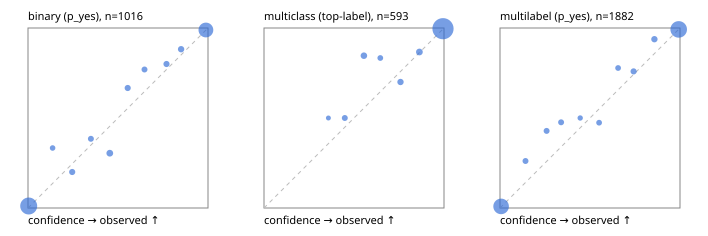

# Evaluation report

- model `Qwen/Qwen3-4B-Instruct-2507` @ `cdbee75f17` (shared-prefix tree (tree-v1)), adapter/checkpoint `runs/tree_4b_combo/adapter`, prompt `tree-v1` (c8963d819128)
- data data/ova/eval2.jsonl; splits ['test']; n=1991; calibration `None`
- cuda / bfloat16; 2026-09-25T06:32:25+0000; wall 247.9s

## Overall

question accuracy 94.5%

**binary**: n 1016, positives 435, accuracy 0.960, precision 0.960, recall 0.945, f1 0.952, auroc 0.992, brier 0.032, log_loss 0.112, ece 0.015

**multiclass**: n 593, accuracy 0.975, macro_f1 0.953, log_loss 0.083, brier 0.043, ece_top_label 0.012

**multilabel**: n 382, labels 1882, exact_match 0.859, micro_f1 0.967, macro_f1 0.937, label_auroc 0.995, brier 0.025, log_loss 0.087, ece 0.010

## By family

| family | n | question acc % | details |
|---|---|---|---|
| e2_hard | 673 | 93.8 | bin acc 96.8 F1 95.5 AUROC 0.988 ECE 0.035; mc acc 96.4 mF1 92.7 ECE 0.022; ml EM 81.8 µF1 95.1 ECE 0.021 |
| e2_simple | 664 | 96.8 | bin acc 96.2 F1 96.6 AUROC 0.997 ECE 0.019; mc acc 99.5 mF1 98.9 ECE 0.014; ml EM 94.2 µF1 98.7 ECE 0.015 |
| e2_very_hard | 654 | 92.8 | bin acc 94.8 F1 92.9 AUROC 0.990 ECE 0.024; mc acc 96.5 mF1 94.3 ECE 0.017; ml EM 82.3 µF1 96.1 ECE 0.015 |

## by hard case

| slice | n | question acc % |
|---|---|---|
| (none) | 569 | 97.4 |
| contradiction | 172 | 95.9 |
| distractor | 474 | 92.6 |
| double_negation | 126 | 96.0 |
| evidence_end | 57 | 94.7 |
| evidence_middle | 114 | 97.4 |
| evidence_start | 17 | 94.1 |
| exception | 213 | 91.1 |
| hypothetical | 128 | 93.8 |
| injection | 151 | 94.0 |
| lexical_overlap | 201 | 97.0 |
| long_state | 191 | 94.8 |
| missing_evidence | 141 | 97.9 |
| multi_positive | 322 | 87.0 |
| multi_turn | 149 | 94.0 |
| negation | 257 | 97.7 |
| nota | 118 | 94.1 |
| numeric_reasoning | 224 | 87.1 |
| paraphrase | 218 | 91.3 |
| role_reversal | 187 | 94.7 |
| sarcasm | 149 | 91.3 |
| temporal_reasoning | 203 | 85.2 |
| zero_positive | 73 | 95.9 |
| zero_positive_distractor | 1 | 100.0 |

## by state tokens

| slice | n | question acc % |
|---|---|---|
| 00000-00127 | 662 | 94.1 |
| 00128-00511 | 477 | 92.5 |
| 00512-02047 | 484 | 95.5 |
| 02048-08191 | 329 | 96.0 |
| 08192+ | 39 | 100.0 |

## by candidates

| slice | n | question acc % |
|---|---|---|
| 01 | 1016 | 96.0 |
| 03 | 128 | 97.7 |
| 04 | 515 | 94.6 |
| 05 | 224 | 90.6 |
| 06 | 86 | 83.7 |
| 07 | 18 | 88.9 |
| 08 | 4 | 75.0 |

## Paraphrase groups

76 groups; same prediction 75.0%; all correct 82.9%

## Multiclass abstention (coverage vs error on accepted)

| abstain_below | coverage % | error % |
|---|---|---|
| 0.0 | 100.0 | 2.5 |
| 0.4 | 99.7 | 2.4 |
| 0.5 | 98.3 | 1.7 |
| 0.6 | 96.1 | 1.4 |
| 0.7 | 95.1 | 1.2 |
| 0.8 | 93.4 | 0.7 |
| 0.9 | 90.9 | 0.4 |

## Reliability: binary

| bin | n | mean confidence | observed frequency |
|---|---|---|---|
| [0.0,0.1) | 528 | 0.004 | 0.011 |
| [0.1,0.2) | 9 | 0.137 | 0.333 |
| [0.2,0.3) | 15 | 0.246 | 0.200 |
| [0.3,0.4) | 13 | 0.349 | 0.385 |
| [0.4,0.5) | 23 | 0.455 | 0.304 |
| [0.5,0.6) | 15 | 0.554 | 0.667 |
| [0.6,0.7) | 13 | 0.647 | 0.769 |
| [0.7,0.8) | 15 | 0.770 | 0.800 |
| [0.8,0.9) | 17 | 0.850 | 0.882 |
| [0.9,1.0] | 368 | 0.988 | 0.989 |

## Reliability: multiclass

| bin | n | mean confidence | observed frequency |
|---|---|---|---|
| [0.3,0.4) | 2 | 0.358 | 0.500 |
| [0.4,0.5) | 8 | 0.449 | 0.500 |
| [0.5,0.6) | 13 | 0.555 | 0.846 |
| [0.6,0.7) | 6 | 0.646 | 0.833 |
| [0.7,0.8) | 10 | 0.758 | 0.700 |
| [0.8,0.9) | 15 | 0.863 | 0.867 |
| [0.9,1.0] | 539 | 0.995 | 0.996 |

## Reliability: multilabel

| bin | n | mean confidence | observed frequency |
|---|---|---|---|
| [0.0,0.1) | 788 | 0.006 | 0.009 |
| [0.1,0.2) | 23 | 0.141 | 0.261 |
| [0.2,0.3) | 21 | 0.259 | 0.429 |
| [0.3,0.4) | 21 | 0.339 | 0.476 |
| [0.4,0.5) | 12 | 0.445 | 0.500 |
| [0.5,0.6) | 19 | 0.550 | 0.474 |
| [0.6,0.7) | 18 | 0.656 | 0.778 |
| [0.7,0.8) | 29 | 0.742 | 0.759 |
| [0.8,0.9) | 32 | 0.858 | 0.938 |
| [0.9,1.0] | 919 | 0.993 | 0.992 |
