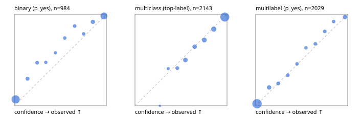

# Evaluation report

- model `Qwen/Qwen3-4B-Instruct-2507` @ `cdbee75f17` (shared-prefix tree (tree-v1)), adapter/checkpoint `runs/tree_4b_combo/adapter`, prompt `tree-v1` (c8963d819128)
- data data/ova/hf.jsonl, data/ova/eval.jsonl; splits ['test']; n=3471; calibration `None`
- cuda / bfloat16; 2026-09-25T06:28:09+0000; wall 244.8s

## Overall

question accuracy 82.7%

**binary**: n 984, positives 475, accuracy 0.891, precision 0.936, recall 0.832, f1 0.881, auroc 0.959, brier 0.086, log_loss 0.302, ece 0.064

**multiclass**: n 2143, accuracy 0.838, macro_f1 0.893, log_loss 0.439, brier 0.228, ece_top_label 0.016

**multilabel**: n 344, labels 2029, exact_match 0.576, micro_f1 0.771, macro_f1 0.805, label_auroc 0.952, brier 0.069, log_loss 0.227, ece 0.016

## By family

| family | n | question acc % | details |
|---|---|---|---|
| eval_adversarial | 27 | 96.3 | bin acc 93.3 F1 90.9 AUROC 0.981 ECE 0.064; mc acc 100.0 mF1 100.0 ECE 0.003; ml EM 100.0 µF1 100.0 ECE 0.010 |
| eval_agent_output | 26 | 57.7 | bin acc 78.6 F1 80.0 AUROC 0.959 ECE 0.171; mc acc 42.9 mF1 33.3 ECE 0.566; ml EM 20.0 µF1 66.7 ECE 0.171 |
| eval_evidence | 17 | 94.1 | bin acc 100.0 F1 100.0 AUROC 1.000 ECE 0.008; ml EM 50.0 µF1 57.1 ECE 0.243 |
| eval_multilabel | 32 | 93.8 | bin acc 100.0 F1 100.0 AUROC 1.000 ECE 0.057; mc acc 100.0 mF1 100.0 ECE 0.005; ml EM 91.7 µF1 98.0 ECE 0.015 |
| eval_policy | 22 | 68.2 | bin acc 76.9 F1 72.7 AUROC 0.810 ECE 0.257; mc acc 40.0 mF1 25.0 ECE 0.372; ml EM 75.0 µF1 94.1 ECE 0.091 |
| eval_routing | 25 | 92.0 | bin acc 90.0 F1 88.9 AUROC 0.958 ECE 0.100; mc acc 100.0 mF1 100.0 ECE 0.102; ml EM 50.0 µF1 80.0 ECE 0.137 |
| eval_urgency_sentiment | 22 | 100.0 | bin acc 100.0 F1 100.0 AUROC 1.000 ECE 0.093; mc acc 100.0 mF1 100.0 ECE 0.044; ml EM 100.0 µF1 100.0 ECE 0.003 |
| heldout_boolq | 300 | 83.3 | bin acc 83.3 F1 84.9 AUROC 0.929 ECE 0.101 |
| heldout_emotion_multiclass | 300 | 56.0 | mc acc 56.0 mF1 46.0 ECE 0.141 |
| heldout_intent_clinc | 300 | 90.3 | mc acc 90.3 mF1 92.6 ECE 0.036 |
| heldout_question_type_trec | 300 | 89.0 | mc acc 89.0 mF1 87.5 ECE 0.059 |
| heldout_sentiment_sst2 | 300 | 89.3 | bin acc 89.3 F1 88.3 AUROC 0.969 ECE 0.113 |
| heldout_topic_dbpedia | 300 | 96.0 | mc acc 96.0 mF1 95.7 ECE 0.011 |
| hf_emotions_multilabel | 300 | 54.3 | ml EM 54.3 µF1 72.9 ECE 0.017 |
| hf_intent_banking77 | 300 | 96.7 | mc acc 96.7 mF1 96.2 ECE 0.029 |
| hf_nli | 300 | 94.3 | bin acc 94.3 F1 92.2 AUROC 0.985 ECE 0.020 |
| hf_sentiment_tweets | 300 | 68.7 | mc acc 68.7 mF1 68.7 ECE 0.045 |
| hf_topic_agnews | 300 | 90.0 | mc acc 90.0 mF1 90.0 ECE 0.035 |

## by hard case

| slice | n | question acc % |
|---|---|---|
| (none) | 3042 | 82.5 |
| contradiction | 107 | 99.1 |
| distractor | 33 | 75.8 |
| double_negation | 6 | 100.0 |
| evidence_end | 13 | 92.3 |
| evidence_middle | 11 | 90.9 |
| evidence_start | 9 | 100.0 |
| exception | 7 | 71.4 |
| hypothetical | 7 | 100.0 |
| injection | 10 | 90.0 |
| lexical_overlap | 20 | 95.0 |
| long_state | 50 | 86.0 |
| missing_evidence | 104 | 91.3 |
| multi_positive | 81 | 42.0 |
| multi_turn | 9 | 88.9 |
| negation | 30 | 100.0 |
| new_label_names | 3 | 33.3 |
| nota | 46 | 100.0 |
| numeric_reasoning | 16 | 87.5 |
| paraphrase | 22 | 86.4 |
| role_reversal | 15 | 93.3 |
| sarcasm | 12 | 91.7 |
| temporal_reasoning | 29 | 75.9 |
| zero_positive | 6 | 100.0 |

## by state tokens

| slice | n | question acc % |
|---|---|---|
| 00000-00127 | 3211 | 82.7 |
| 00128-00511 | 208 | 82.2 |
| 00512-02047 | 52 | 86.5 |

## by candidates

| slice | n | question acc % |
|---|---|---|
| 01 | 984 | 89.1 |
| 03 | 310 | 69.7 |
| 04 | 333 | 88.9 |
| 05 | 22 | 72.7 |
| 06 | 1218 | 74.0 |
| 07 | 49 | 100.0 |
| 08 | 555 | 93.0 |

## Paraphrase groups

11 groups; same prediction 81.8%; all correct 81.8%

## Multiclass abstention (coverage vs error on accepted)

| abstain_below | coverage % | error % |
|---|---|---|
| 0.0 | 100.0 | 16.2 |
| 0.4 | 98.4 | 15.4 |
| 0.5 | 94.2 | 13.5 |
| 0.6 | 86.4 | 10.2 |
| 0.7 | 79.0 | 7.9 |
| 0.8 | 70.3 | 5.3 |
| 0.9 | 58.2 | 3.0 |

## Reliability: binary

| bin | n | mean confidence | observed frequency |
|---|---|---|---|
| [0.0,0.1) | 446 | 0.014 | 0.070 |
| [0.1,0.2) | 44 | 0.144 | 0.295 |
| [0.2,0.3) | 34 | 0.248 | 0.471 |
| [0.3,0.4) | 19 | 0.342 | 0.474 |
| [0.4,0.5) | 19 | 0.447 | 0.579 |
| [0.5,0.6) | 27 | 0.548 | 0.741 |
| [0.6,0.7) | 31 | 0.655 | 0.871 |
| [0.7,0.8) | 28 | 0.753 | 0.786 |
| [0.8,0.9) | 60 | 0.853 | 0.917 |
| [0.9,1.0] | 276 | 0.974 | 0.982 |

## Reliability: multiclass

| bin | n | mean confidence | observed frequency |
|---|---|---|---|
| [0.2,0.3) | 3 | 0.270 | 0.000 |
| [0.3,0.4) | 32 | 0.361 | 0.406 |
| [0.4,0.5) | 90 | 0.460 | 0.411 |
| [0.5,0.6) | 166 | 0.548 | 0.500 |
| [0.6,0.7) | 158 | 0.648 | 0.646 |
| [0.7,0.8) | 188 | 0.753 | 0.718 |
| [0.8,0.9) | 258 | 0.856 | 0.837 |
| [0.9,1.0] | 1248 | 0.976 | 0.970 |

## Reliability: multilabel

| bin | n | mean confidence | observed frequency |
|---|---|---|---|
| [0.0,0.1) | 1312 | 0.015 | 0.022 |
| [0.1,0.2) | 130 | 0.146 | 0.200 |
| [0.2,0.3) | 78 | 0.246 | 0.244 |
| [0.3,0.4) | 75 | 0.349 | 0.333 |
| [0.4,0.5) | 59 | 0.449 | 0.458 |
| [0.5,0.6) | 49 | 0.547 | 0.633 |
| [0.6,0.7) | 68 | 0.648 | 0.676 |
| [0.7,0.8) | 64 | 0.751 | 0.812 |
| [0.8,0.9) | 63 | 0.847 | 0.921 |
| [0.9,1.0] | 131 | 0.971 | 0.969 |
