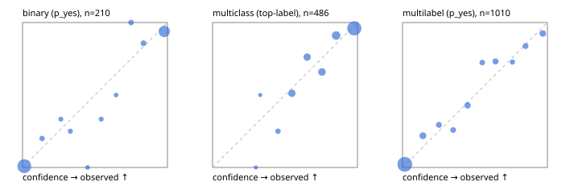

# Evaluation report

- model `Qwen/Qwen3-4B-Instruct-2507` @ `cdbee75f17` (shared-prefix tree (tree-v1)), adapter/checkpoint `runs/tree_4b_combo/adapter`, prompt `tree-v1` (c8963d819128)
- data data/ova/hf.jsonl, data/ova/eval.jsonl; splits ['validation']; n=868; calibration `None`
- cuda / bfloat16; 2026-09-25T06:23:55+0000; wall 64.7s

## Overall

question accuracy 81.1%

**binary**: n 210, positives 79, accuracy 0.943, precision 0.904, recall 0.949, f1 0.926, auroc 0.983, brier 0.047, log_loss 0.163, ece 0.035

**multiclass**: n 486, accuracy 0.848, macro_f1 0.867, log_loss 0.392, brier 0.214, ece_top_label 0.046

**multilabel**: n 172, labels 1010, exact_match 0.547, micro_f1 0.742, macro_f1 0.680, label_auroc 0.941, brier 0.077, log_loss 0.252, ece 0.026

## By family

| family | n | question acc % | details |
|---|---|---|---|
| eval_adversarial | 14 | 100.0 | bin acc 100.0 F1 100.0 AUROC 1.000 ECE 0.008; mc acc 100.0 mF1 100.0 ECE 0.004; ml EM 100.0 µF1 100.0 ECE 0.002 |
| eval_agent_output | 20 | 70.0 | bin acc 83.3 F1 85.7 AUROC 0.944 ECE 0.141; mc acc 60.0 mF1 33.3 ECE 0.339; ml EM 33.3 µF1 0.0 ECE 0.244 |
| eval_evidence | 17 | 100.0 | bin acc 100.0 F1 100.0 AUROC 1.000 ECE 0.006; ml EM 100.0 µF1 100.0 ECE 0.004 |
| eval_multilabel | 12 | 83.3 | bin acc 0.0 F1 0.0 AUROC — ECE 0.977; mc acc 100.0 mF1 100.0 ECE 0.000; ml EM 88.9 µF1 97.8 ECE 0.042 |
| eval_policy | 24 | 83.3 | bin acc 91.7 F1 92.3 AUROC 0.914 ECE 0.238; mc acc 81.8 mF1 69.2 ECE 0.298; ml EM 0.0 µF1 50.0 ECE 0.515 |
| eval_routing | 16 | 93.8 | bin acc 100.0 F1 100.0 AUROC 1.000 ECE 0.008; mc acc 100.0 mF1 100.0 ECE 0.003; ml EM 0.0 µF1 0.0 ECE 0.212 |
| eval_urgency_sentiment | 15 | 100.0 | bin acc 100.0 F1 100.0 AUROC 1.000 ECE 0.020; mc acc 100.0 mF1 100.0 ECE 0.004; ml EM 100.0 µF1 100.0 ECE 0.007 |
| hf_emotions_multilabel | 150 | 51.3 | ml EM 51.3 µF1 71.2 ECE 0.026 |
| hf_intent_banking77 | 150 | 94.7 | mc acc 94.7 mF1 93.0 ECE 0.048 |
| hf_nli | 150 | 94.7 | bin acc 94.7 F1 91.7 AUROC 0.985 ECE 0.022 |
| hf_sentiment_tweets | 150 | 70.0 | mc acc 70.0 mF1 66.7 ECE 0.055 |
| hf_topic_agnews | 150 | 88.7 | mc acc 88.7 mF1 88.8 ECE 0.087 |

## by hard case

| slice | n | question acc % |
|---|---|---|
| (none) | 634 | 80.1 |
| contradiction | 63 | 98.4 |
| distractor | 20 | 95.0 |
| double_negation | 3 | 100.0 |
| evidence_end | 4 | 75.0 |
| evidence_middle | 7 | 100.0 |
| evidence_start | 3 | 66.7 |
| exception | 7 | 100.0 |
| hypothetical | 6 | 100.0 |
| injection | 16 | 93.8 |
| lexical_overlap | 13 | 100.0 |
| long_state | 26 | 80.8 |
| missing_evidence | 59 | 93.2 |
| multi_positive | 40 | 35.0 |
| multi_turn | 21 | 81.0 |
| negation | 9 | 77.8 |
| new_label_names | 5 | 80.0 |
| nota | 4 | 100.0 |
| numeric_reasoning | 13 | 92.3 |
| paraphrase | 10 | 100.0 |
| role_reversal | 7 | 71.4 |
| sarcasm | 5 | 80.0 |
| temporal_reasoning | 15 | 80.0 |
| zero_positive | 7 | 71.4 |

## by state tokens

| slice | n | question acc % |
|---|---|---|
| 00000-00127 | 796 | 80.4 |
| 00128-00511 | 46 | 93.5 |
| 00512-02047 | 26 | 80.8 |

## by candidates

| slice | n | question acc % |
|---|---|---|
| 01 | 210 | 94.3 |
| 03 | 162 | 71.6 |
| 04 | 174 | 87.9 |
| 05 | 13 | 76.9 |
| 06 | 159 | 53.5 |
| 08 | 150 | 94.7 |

## Paraphrase groups

5 groups; same prediction 60.0%; all correct 100.0%

## Multiclass abstention (coverage vs error on accepted)

| abstain_below | coverage % | error % |
|---|---|---|
| 0.0 | 100.0 | 15.2 |
| 0.4 | 99.2 | 14.7 |
| 0.5 | 96.7 | 13.2 |
| 0.6 | 88.3 | 9.8 |
| 0.7 | 79.6 | 8.3 |
| 0.8 | 70.6 | 5.0 |
| 0.9 | 56.8 | 4.0 |

## Reliability: binary

| bin | n | mean confidence | observed frequency |
|---|---|---|---|
| [0.0,0.1) | 113 | 0.012 | 0.009 |
| [0.1,0.2) | 5 | 0.135 | 0.200 |
| [0.2,0.3) | 3 | 0.264 | 0.333 |
| [0.3,0.4) | 4 | 0.330 | 0.250 |
| [0.4,0.5) | 2 | 0.449 | 0.000 |
| [0.5,0.6) | 3 | 0.543 | 0.333 |
| [0.6,0.7) | 2 | 0.645 | 0.500 |
| [0.7,0.8) | 6 | 0.749 | 1.000 |
| [0.8,0.9) | 7 | 0.835 | 0.857 |
| [0.9,1.0] | 65 | 0.978 | 0.938 |

## Reliability: multiclass

| bin | n | mean confidence | observed frequency |
|---|---|---|---|
| [0.2,0.3) | 2 | 0.299 | 0.000 |
| [0.3,0.4) | 2 | 0.329 | 0.500 |
| [0.4,0.5) | 12 | 0.451 | 0.250 |
| [0.5,0.6) | 41 | 0.547 | 0.512 |
| [0.6,0.7) | 42 | 0.653 | 0.762 |
| [0.7,0.8) | 44 | 0.755 | 0.659 |
| [0.8,0.9) | 67 | 0.853 | 0.910 |
| [0.9,1.0] | 276 | 0.978 | 0.960 |

## Reliability: multilabel

| bin | n | mean confidence | observed frequency |
|---|---|---|---|
| [0.0,0.1) | 650 | 0.016 | 0.022 |
| [0.1,0.2) | 64 | 0.141 | 0.219 |
| [0.2,0.3) | 34 | 0.251 | 0.294 |
| [0.3,0.4) | 31 | 0.349 | 0.258 |
| [0.4,0.5) | 49 | 0.449 | 0.429 |
| [0.5,0.6) | 29 | 0.550 | 0.724 |
| [0.6,0.7) | 41 | 0.642 | 0.732 |
| [0.7,0.8) | 22 | 0.758 | 0.727 |
| [0.8,0.9) | 37 | 0.849 | 0.838 |
| [0.9,1.0] | 53 | 0.968 | 0.925 |
