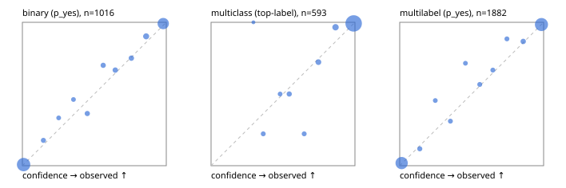

# Evaluation report

- model `Qwen/Qwen3-4B-Instruct-2507` @ `cdbee75f17` (shared-prefix tree (tree-v1)), adapter/checkpoint `runs/tree_4b_combo_ptr/adapter`, prompt `tree-v1` (c8963d819128)
- data data/ptr/eval2.jsonl; splits ['test']; n=1991; calibration `None`
- cuda / bfloat16; 2026-09-25T00:50:45+0000; wall 234.9s

## Overall

question accuracy 92.0%

**binary**: n 1016, positives 435, accuracy 0.949, precision 0.938, recall 0.943, f1 0.940, auroc 0.989, brier 0.038, log_loss 0.129, ece 0.014

**multiclass**: n 593, accuracy 0.943, macro_f1 0.905, log_loss 0.158, brier 0.079, ece_top_label 0.017

**multilabel**: n 382, labels 1882, exact_match 0.809, micro_f1 0.952, macro_f1 0.915, label_auroc 0.988, brier 0.038, log_loss 0.136, ece 0.011

## By family

| family | n | question acc % | details |
|---|---|---|---|
| e2_hard | 673 | 90.3 | bin acc 95.4 F1 93.7 AUROC 0.986 ECE 0.039; mc acc 91.2 mF1 85.0 ECE 0.037; ml EM 75.8 µF1 93.2 ECE 0.013 |
| e2_simple | 664 | 96.5 | bin acc 97.4 F1 97.6 AUROC 0.996 ECE 0.019; mc acc 98.0 mF1 96.5 ECE 0.016; ml EM 91.7 µF1 98.1 ECE 0.014 |
| e2_very_hard | 654 | 89.1 | bin acc 91.7 F1 88.9 AUROC 0.982 ECE 0.033; mc acc 93.5 mF1 89.4 ECE 0.030; ml EM 76.2 µF1 94.2 ECE 0.023 |

## by hard case

| slice | n | question acc % |
|---|---|---|
| (none) | 569 | 97.4 |
| contradiction | 172 | 94.2 |
| distractor | 474 | 90.1 |
| double_negation | 126 | 88.1 |
| evidence_end | 57 | 93.0 |
| evidence_middle | 114 | 94.7 |
| evidence_start | 17 | 100.0 |
| exception | 213 | 88.3 |
| hypothetical | 128 | 95.3 |
| injection | 151 | 86.8 |
| lexical_overlap | 201 | 94.5 |
| long_state | 191 | 92.7 |
| missing_evidence | 141 | 95.7 |
| multi_positive | 322 | 82.0 |
| multi_turn | 149 | 91.9 |
| negation | 257 | 92.2 |
| nota | 118 | 88.1 |
| numeric_reasoning | 224 | 80.4 |
| paraphrase | 218 | 87.6 |
| role_reversal | 187 | 89.3 |
| sarcasm | 149 | 91.9 |
| temporal_reasoning | 203 | 81.3 |
| zero_positive | 73 | 89.0 |
| zero_positive_distractor | 1 | 100.0 |

## by state tokens

| slice | n | question acc % |
|---|---|---|
| 00000-00127 | 662 | 90.8 |
| 00128-00511 | 477 | 88.9 |
| 00512-02047 | 484 | 94.8 |
| 02048-08191 | 329 | 94.8 |
| 08192+ | 39 | 92.3 |

## by candidates

| slice | n | question acc % |
|---|---|---|
| 01 | 1016 | 94.9 |
| 03 | 128 | 93.0 |
| 04 | 515 | 91.1 |
| 05 | 224 | 87.5 |
| 06 | 86 | 76.7 |
| 07 | 18 | 83.3 |
| 08 | 4 | 75.0 |

## Paraphrase groups

76 groups; same prediction 75.0%; all correct 77.6%

## Multiclass abstention (coverage vs error on accepted)

| abstain_below | coverage % | error % |
|---|---|---|
| 0.0 | 100.0 | 5.7 |
| 0.4 | 98.3 | 4.6 |
| 0.5 | 97.0 | 4.0 |
| 0.6 | 94.9 | 3.0 |
| 0.7 | 93.4 | 1.8 |
| 0.8 | 90.4 | 0.9 |
| 0.9 | 85.5 | 0.8 |

## Reliability: binary

| bin | n | mean confidence | observed frequency |
|---|---|---|---|
| [0.0,0.1) | 515 | 0.008 | 0.008 |
| [0.1,0.2) | 17 | 0.146 | 0.176 |
| [0.2,0.3) | 12 | 0.252 | 0.333 |
| [0.3,0.4) | 13 | 0.355 | 0.462 |
| [0.4,0.5) | 22 | 0.451 | 0.364 |
| [0.5,0.6) | 20 | 0.561 | 0.700 |
| [0.6,0.7) | 24 | 0.645 | 0.667 |
| [0.7,0.8) | 24 | 0.757 | 0.750 |
| [0.8,0.9) | 41 | 0.860 | 0.902 |
| [0.9,1.0] | 328 | 0.979 | 0.991 |

## Reliability: multiclass

| bin | n | mean confidence | observed frequency |
|---|---|---|---|
| [0.2,0.3) | 1 | 0.294 | 1.000 |
| [0.3,0.4) | 9 | 0.363 | 0.222 |
| [0.4,0.5) | 8 | 0.480 | 0.500 |
| [0.5,0.6) | 12 | 0.543 | 0.500 |
| [0.6,0.7) | 9 | 0.647 | 0.222 |
| [0.7,0.8) | 18 | 0.746 | 0.722 |
| [0.8,0.9) | 29 | 0.865 | 0.966 |
| [0.9,1.0] | 507 | 0.991 | 0.992 |

## Reliability: multilabel

| bin | n | mean confidence | observed frequency |
|---|---|---|---|
| [0.0,0.1) | 757 | 0.013 | 0.018 |
| [0.1,0.2) | 34 | 0.140 | 0.118 |
| [0.2,0.3) | 22 | 0.247 | 0.455 |
| [0.3,0.4) | 29 | 0.352 | 0.310 |
| [0.4,0.5) | 21 | 0.457 | 0.714 |
| [0.5,0.6) | 30 | 0.556 | 0.567 |
| [0.6,0.7) | 30 | 0.647 | 0.667 |
| [0.7,0.8) | 26 | 0.745 | 0.885 |
| [0.8,0.9) | 45 | 0.858 | 0.867 |
| [0.9,1.0] | 888 | 0.985 | 0.984 |
