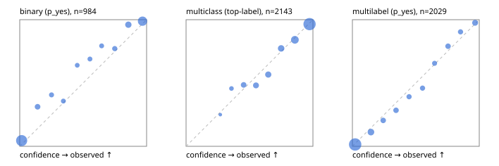

# Evaluation report

- model `Qwen/Qwen3-4B-Instruct-2507` @ `cdbee75f17` (shared-prefix tree (tree-v1)), adapter/checkpoint `runs/tree_4b_combo_ptr/adapter`, prompt `tree-v1` (c8963d819128)
- data data/ptr/hf.jsonl, data/ptr/eval.jsonl; splits ['test']; n=3471; calibration `None`
- cuda / bfloat16; 2026-09-25T00:46:41+0000; wall 211.4s

## Overall

question accuracy 82.7%

**binary**: n 984, positives 475, accuracy 0.896, precision 0.933, recall 0.846, f1 0.887, auroc 0.965, brier 0.077, log_loss 0.265, ece 0.054

**multiclass**: n 2143, accuracy 0.836, macro_f1 0.893, log_loss 0.472, brier 0.237, ece_top_label 0.023

**multilabel**: n 344, labels 2029, exact_match 0.570, micro_f1 0.765, macro_f1 0.780, label_auroc 0.951, brier 0.070, log_loss 0.230, ece 0.021

## By family

| family | n | question acc % | details |
|---|---|---|---|
| eval_adversarial | 27 | 92.6 | bin acc 93.3 F1 90.9 AUROC 0.907 ECE 0.082; mc acc 100.0 mF1 100.0 ECE 0.014; ml EM 80.0 µF1 94.1 ECE 0.050 |
| eval_agent_output | 26 | 53.8 | bin acc 71.4 F1 71.4 AUROC 0.878 ECE 0.220; mc acc 28.6 mF1 18.8 ECE 0.521; ml EM 40.0 µF1 71.4 ECE 0.155 |
| eval_evidence | 17 | 94.1 | bin acc 100.0 F1 100.0 AUROC 1.000 ECE 0.010; ml EM 50.0 µF1 66.7 ECE 0.174 |
| eval_multilabel | 32 | 87.5 | bin acc 100.0 F1 100.0 AUROC 1.000 ECE 0.027; mc acc 100.0 mF1 100.0 ECE 0.669; ml EM 83.3 µF1 94.9 ECE 0.034 |
| eval_policy | 22 | 59.1 | bin acc 69.2 F1 66.7 AUROC 0.810 ECE 0.181; mc acc 40.0 mF1 25.0 ECE 0.571; ml EM 50.0 µF1 87.5 ECE 0.223 |
| eval_routing | 25 | 88.0 | bin acc 90.0 F1 88.9 AUROC 0.917 ECE 0.098; mc acc 100.0 mF1 100.0 ECE 0.057; ml EM 0.0 µF1 66.7 ECE 0.168 |
| eval_urgency_sentiment | 22 | 95.5 | bin acc 90.0 F1 92.3 AUROC 0.958 ECE 0.052; mc acc 100.0 mF1 100.0 ECE 0.083; ml EM 100.0 µF1 100.0 ECE 0.008 |
| heldout_boolq | 300 | 86.0 | bin acc 86.0 F1 87.7 AUROC 0.942 ECE 0.085 |
| heldout_emotion_multiclass | 300 | 56.0 | mc acc 56.0 mF1 46.7 ECE 0.136 |
| heldout_intent_clinc | 300 | 95.7 | mc acc 95.7 mF1 96.5 ECE 0.068 |
| heldout_question_type_trec | 300 | 90.3 | mc acc 90.3 mF1 89.6 ECE 0.084 |
| heldout_sentiment_sst2 | 300 | 88.7 | bin acc 88.7 F1 87.5 AUROC 0.971 ECE 0.092 |
| heldout_topic_dbpedia | 300 | 96.0 | mc acc 96.0 mF1 95.6 ECE 0.013 |
| hf_emotions_multilabel | 300 | 55.0 | ml EM 55.0 µF1 73.1 ECE 0.027 |
| hf_intent_banking77 | 300 | 93.3 | mc acc 93.3 mF1 92.0 ECE 0.047 |
| hf_nli | 300 | 95.0 | bin acc 95.0 F1 93.1 AUROC 0.985 ECE 0.037 |
| hf_sentiment_tweets | 300 | 63.3 | mc acc 63.3 mF1 63.8 ECE 0.117 |
| hf_topic_agnews | 300 | 90.7 | mc acc 90.7 mF1 90.7 ECE 0.028 |

## by hard case

| slice | n | question acc % |
|---|---|---|
| (none) | 3042 | 82.5 |
| contradiction | 107 | 97.2 |
| distractor | 33 | 72.7 |
| double_negation | 6 | 100.0 |
| evidence_end | 13 | 92.3 |
| evidence_middle | 11 | 90.9 |
| evidence_start | 9 | 100.0 |
| exception | 7 | 71.4 |
| hypothetical | 7 | 85.7 |
| injection | 10 | 90.0 |
| lexical_overlap | 20 | 90.0 |
| long_state | 50 | 84.0 |
| missing_evidence | 104 | 93.3 |
| multi_positive | 81 | 44.4 |
| multi_turn | 9 | 88.9 |
| negation | 30 | 83.3 |
| new_label_names | 3 | 33.3 |
| nota | 46 | 97.8 |
| numeric_reasoning | 16 | 81.2 |
| paraphrase | 22 | 77.3 |
| role_reversal | 15 | 86.7 |
| sarcasm | 12 | 75.0 |
| temporal_reasoning | 29 | 65.5 |
| zero_positive | 6 | 100.0 |

## by state tokens

| slice | n | question acc % |
|---|---|---|
| 00000-00127 | 3211 | 82.5 |
| 00128-00511 | 208 | 84.1 |
| 00512-02047 | 52 | 84.6 |

## by candidates

| slice | n | question acc % |
|---|---|---|
| 01 | 984 | 89.6 |
| 03 | 310 | 64.2 |
| 04 | 333 | 89.2 |
| 05 | 22 | 63.6 |
| 06 | 1218 | 74.4 |
| 07 | 49 | 98.0 |
| 08 | 555 | 94.2 |

## Paraphrase groups

11 groups; same prediction 63.6%; all correct 72.7%

## Multiclass abstention (coverage vs error on accepted)

| abstain_below | coverage % | error % |
|---|---|---|
| 0.0 | 100.0 | 16.4 |
| 0.4 | 97.5 | 15.4 |
| 0.5 | 92.8 | 13.5 |
| 0.6 | 86.7 | 10.8 |
| 0.7 | 79.3 | 7.8 |
| 0.8 | 70.9 | 6.1 |
| 0.9 | 56.2 | 3.5 |

## Reliability: binary

| bin | n | mean confidence | observed frequency |
|---|---|---|---|
| [0.0,0.1) | 420 | 0.015 | 0.045 |
| [0.1,0.2) | 48 | 0.141 | 0.312 |
| [0.2,0.3) | 32 | 0.250 | 0.406 |
| [0.3,0.4) | 28 | 0.344 | 0.357 |
| [0.4,0.5) | 25 | 0.454 | 0.640 |
| [0.5,0.6) | 29 | 0.553 | 0.690 |
| [0.6,0.7) | 29 | 0.646 | 0.793 |
| [0.7,0.8) | 35 | 0.749 | 0.771 |
| [0.8,0.9) | 76 | 0.856 | 0.961 |
| [0.9,1.0] | 262 | 0.968 | 0.989 |

## Reliability: multiclass

| bin | n | mean confidence | observed frequency |
|---|---|---|---|
| [0.2,0.3) | 8 | 0.270 | 0.250 |
| [0.3,0.4) | 46 | 0.358 | 0.457 |
| [0.4,0.5) | 101 | 0.454 | 0.485 |
| [0.5,0.6) | 131 | 0.551 | 0.481 |
| [0.6,0.7) | 157 | 0.648 | 0.567 |
| [0.7,0.8) | 181 | 0.749 | 0.773 |
| [0.8,0.9) | 315 | 0.858 | 0.841 |
| [0.9,1.0] | 1204 | 0.974 | 0.965 |

## Reliability: multilabel

| bin | n | mean confidence | observed frequency |
|---|---|---|---|
| [0.0,0.1) | 1172 | 0.021 | 0.015 |
| [0.1,0.2) | 178 | 0.146 | 0.112 |
| [0.2,0.3) | 93 | 0.243 | 0.204 |
| [0.3,0.4) | 95 | 0.344 | 0.284 |
| [0.4,0.5) | 74 | 0.447 | 0.392 |
| [0.5,0.6) | 74 | 0.553 | 0.459 |
| [0.6,0.7) | 61 | 0.648 | 0.656 |
| [0.7,0.8) | 86 | 0.754 | 0.791 |
| [0.8,0.9) | 73 | 0.852 | 0.904 |
| [0.9,1.0] | 123 | 0.967 | 0.976 |
