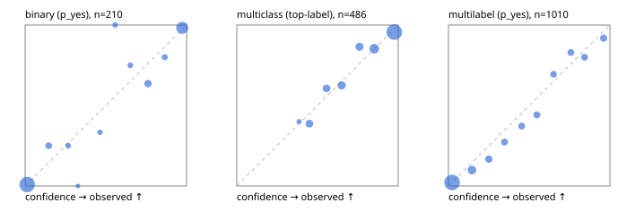

# Evaluation report

- model `Qwen/Qwen3-4B-Instruct-2507` @ `cdbee75f17` (shared-prefix tree (tree-v1)), adapter/checkpoint `runs/tree_4b_combo_ptr/adapter`, prompt `tree-v1` (c8963d819128)
- data data/ptr/hf.jsonl, data/ptr/eval.jsonl; splits ['validation']; n=868; calibration `None`
- cuda / bfloat16; 2026-09-25T00:43:01+0000; wall 53.6s

## Overall

question accuracy 80.8%

**binary**: n 210, positives 79, accuracy 0.943, precision 0.914, recall 0.937, f1 0.925, auroc 0.984, brier 0.049, log_loss 0.158, ece 0.029

**multiclass**: n 486, accuracy 0.842, macro_f1 0.808, log_loss 0.427, brier 0.226, ece_top_label 0.029

**multilabel**: n 172, labels 1010, exact_match 0.547, micro_f1 0.733, macro_f1 0.672, label_auroc 0.929, brier 0.082, log_loss 0.271, ece 0.029

## By family

| family | n | question acc % | details |
|---|---|---|---|
| eval_adversarial | 14 | 100.0 | bin acc 100.0 F1 100.0 AUROC 1.000 ECE 0.027; mc acc 100.0 mF1 100.0 ECE 0.014; ml EM 100.0 µF1 100.0 ECE 0.008 |
| eval_agent_output | 20 | 75.0 | bin acc 91.7 F1 92.3 AUROC 0.972 ECE 0.127; mc acc 60.0 mF1 33.3 ECE 0.177; ml EM 33.3 µF1 0.0 ECE 0.261 |
| eval_evidence | 17 | 100.0 | bin acc 100.0 F1 100.0 AUROC 1.000 ECE 0.007; ml EM 100.0 µF1 100.0 ECE 0.059 |
| eval_multilabel | 12 | 83.3 | bin acc 0.0 F1 0.0 AUROC — ECE 0.873; mc acc 100.0 mF1 100.0 ECE 0.002; ml EM 88.9 µF1 97.7 ECE 0.070 |
| eval_policy | 24 | 62.5 | bin acc 75.0 F1 76.9 AUROC 0.857 ECE 0.223; mc acc 54.5 mF1 37.5 ECE 0.325; ml EM 0.0 µF1 40.0 ECE 0.642 |
| eval_routing | 16 | 87.5 | bin acc 100.0 F1 100.0 AUROC 1.000 ECE 0.010; mc acc 87.5 mF1 88.9 ECE 0.083; ml EM 0.0 µF1 0.0 ECE 0.233 |
| eval_urgency_sentiment | 15 | 100.0 | bin acc 100.0 F1 100.0 AUROC 1.000 ECE 0.068; mc acc 100.0 mF1 100.0 ECE 0.133; ml EM 100.0 µF1 100.0 ECE 0.091 |
| hf_emotions_multilabel | 150 | 51.3 | ml EM 51.3 µF1 70.4 ECE 0.032 |
| hf_intent_banking77 | 150 | 94.0 | mc acc 94.0 mF1 92.5 ECE 0.055 |
| hf_nli | 150 | 95.3 | bin acc 95.3 F1 92.6 AUROC 0.986 ECE 0.026 |
| hf_sentiment_tweets | 150 | 72.0 | mc acc 72.0 mF1 68.4 ECE 0.076 |
| hf_topic_agnews | 150 | 88.0 | mc acc 88.0 mF1 88.2 ECE 0.046 |

## by hard case

| slice | n | question acc % |
|---|---|---|
| (none) | 634 | 79.7 |
| contradiction | 63 | 96.8 |
| distractor | 20 | 90.0 |
| double_negation | 3 | 100.0 |
| evidence_end | 4 | 75.0 |
| evidence_middle | 7 | 100.0 |
| evidence_start | 3 | 100.0 |
| exception | 7 | 100.0 |
| hypothetical | 6 | 100.0 |
| injection | 16 | 87.5 |
| lexical_overlap | 13 | 100.0 |
| long_state | 26 | 84.6 |
| missing_evidence | 59 | 94.9 |
| multi_positive | 40 | 42.5 |
| multi_turn | 21 | 90.5 |
| negation | 9 | 88.9 |
| new_label_names | 5 | 60.0 |
| nota | 4 | 75.0 |
| numeric_reasoning | 13 | 76.9 |
| paraphrase | 10 | 70.0 |
| role_reversal | 7 | 71.4 |
| sarcasm | 5 | 80.0 |
| temporal_reasoning | 15 | 66.7 |
| zero_positive | 7 | 71.4 |

## by state tokens

| slice | n | question acc % |
|---|---|---|
| 00000-00127 | 796 | 80.7 |
| 00128-00511 | 46 | 80.4 |
| 00512-02047 | 26 | 84.6 |

## by candidates

| slice | n | question acc % |
|---|---|---|
| 01 | 210 | 94.3 |
| 03 | 162 | 72.8 |
| 04 | 174 | 86.2 |
| 05 | 13 | 69.2 |
| 06 | 159 | 53.5 |
| 08 | 150 | 94.0 |

## Paraphrase groups

5 groups; same prediction 60.0%; all correct 60.0%

## Multiclass abstention (coverage vs error on accepted)

| abstain_below | coverage % | error % |
|---|---|---|
| 0.0 | 100.0 | 15.8 |
| 0.4 | 99.0 | 15.4 |
| 0.5 | 92.6 | 12.2 |
| 0.6 | 85.8 | 10.1 |
| 0.7 | 77.6 | 7.2 |
| 0.8 | 70.0 | 6.5 |
| 0.9 | 56.0 | 4.4 |

## Reliability: binary

| bin | n | mean confidence | observed frequency |
|---|---|---|---|
| [0.0,0.1) | 113 | 0.013 | 0.009 |
| [0.1,0.2) | 8 | 0.146 | 0.250 |
| [0.2,0.3) | 4 | 0.267 | 0.250 |
| [0.3,0.4) | 1 | 0.327 | 0.000 |
| [0.4,0.5) | 3 | 0.464 | 0.333 |
| [0.5,0.6) | 3 | 0.558 | 1.000 |
| [0.6,0.7) | 4 | 0.652 | 0.750 |
| [0.7,0.8) | 11 | 0.761 | 0.636 |
| [0.8,0.9) | 5 | 0.865 | 0.800 |
| [0.9,1.0] | 58 | 0.973 | 0.983 |

## Reliability: multiclass

| bin | n | mean confidence | observed frequency |
|---|---|---|---|
| [0.3,0.4) | 5 | 0.385 | 0.400 |
| [0.4,0.5) | 31 | 0.450 | 0.387 |
| [0.5,0.6) | 33 | 0.556 | 0.606 |
| [0.6,0.7) | 40 | 0.650 | 0.625 |
| [0.7,0.8) | 37 | 0.760 | 0.865 |
| [0.8,0.9) | 68 | 0.852 | 0.853 |
| [0.9,1.0] | 272 | 0.976 | 0.956 |

## Reliability: multilabel

| bin | n | mean confidence | observed frequency |
|---|---|---|---|
| [0.0,0.1) | 559 | 0.023 | 0.021 |
| [0.1,0.2) | 101 | 0.146 | 0.099 |
| [0.2,0.3) | 54 | 0.250 | 0.167 |
| [0.3,0.4) | 44 | 0.347 | 0.273 |
| [0.4,0.5) | 43 | 0.454 | 0.372 |
| [0.5,0.6) | 43 | 0.548 | 0.442 |
| [0.6,0.7) | 36 | 0.651 | 0.694 |
| [0.7,0.8) | 41 | 0.758 | 0.829 |
| [0.8,0.9) | 40 | 0.843 | 0.800 |
| [0.9,1.0] | 49 | 0.961 | 0.918 |
