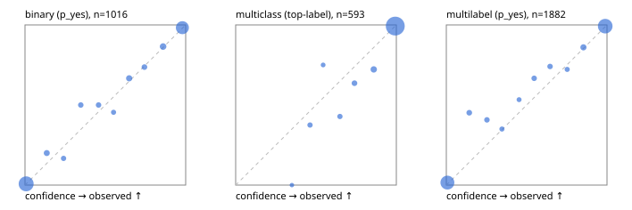

# Evaluation report

- model `Qwen/Qwen3-4B-Instruct-2507` @ `cdbee75f17` (shared-prefix tree (tree-v1)), adapter/checkpoint `runs/tree_4b_combo_r2/adapter`, prompt `tree-v1` (c8963d819128)
- data data/ova/eval2.jsonl; splits ['test']; n=1991; calibration `None`
- cuda / bfloat16; 2026-09-24T21:44:05+0000; wall 248.1s

## Overall

question accuracy 92.9%

**binary**: n 1016, positives 435, accuracy 0.944, precision 0.930, recall 0.940, f1 0.935, auroc 0.989, brier 0.039, log_loss 0.132, ece 0.008

**multiclass**: n 593, accuracy 0.958, macro_f1 0.931, log_loss 0.119, brier 0.062, ece_top_label 0.013

**multilabel**: n 382, labels 1882, exact_match 0.843, micro_f1 0.957, macro_f1 0.923, label_auroc 0.993, brier 0.034, log_loss 0.115, ece 0.017

## By family

| family | n | question acc % | details |
|---|---|---|---|
| e2_hard | 673 | 90.6 | bin acc 93.4 F1 91.1 AUROC 0.981 ECE 0.019; mc acc 94.3 mF1 89.2 ECE 0.023; ml EM 78.0 µF1 93.1 ECE 0.032 |
| e2_simple | 664 | 97.3 | bin acc 97.1 F1 97.3 AUROC 0.996 ECE 0.011; mc acc 100.0 mF1 100.0 ECE 0.012; ml EM 93.3 µF1 98.7 ECE 0.016 |
| e2_very_hard | 654 | 90.7 | bin acc 92.6 F1 90.1 AUROC 0.986 ECE 0.027; mc acc 93.0 mF1 90.0 ECE 0.035; ml EM 82.3 µF1 95.3 ECE 0.017 |

## by hard case

| slice | n | question acc % |
|---|---|---|
| (none) | 569 | 97.7 |
| contradiction | 172 | 95.3 |
| distractor | 474 | 90.7 |
| double_negation | 126 | 92.9 |
| evidence_end | 57 | 94.7 |
| evidence_middle | 114 | 96.5 |
| evidence_start | 17 | 100.0 |
| exception | 213 | 89.7 |
| hypothetical | 128 | 92.2 |
| injection | 151 | 87.4 |
| lexical_overlap | 201 | 96.0 |
| long_state | 191 | 94.8 |
| missing_evidence | 141 | 97.2 |
| multi_positive | 322 | 85.4 |
| multi_turn | 149 | 93.3 |
| negation | 257 | 96.5 |
| nota | 118 | 89.8 |
| numeric_reasoning | 224 | 82.1 |
| paraphrase | 218 | 86.2 |
| role_reversal | 187 | 93.0 |
| sarcasm | 149 | 91.3 |
| temporal_reasoning | 203 | 76.4 |
| zero_positive | 73 | 91.8 |
| zero_positive_distractor | 1 | 100.0 |

## by state tokens

| slice | n | question acc % |
|---|---|---|
| 00000-00127 | 662 | 92.3 |
| 00128-00511 | 477 | 88.3 |
| 00512-02047 | 484 | 95.7 |
| 02048-08191 | 329 | 95.7 |
| 08192+ | 39 | 100.0 |

## by candidates

| slice | n | question acc % |
|---|---|---|
| 01 | 1016 | 94.4 |
| 03 | 128 | 94.5 |
| 04 | 515 | 93.8 |
| 05 | 224 | 86.2 |
| 06 | 86 | 82.6 |
| 07 | 18 | 100.0 |
| 08 | 4 | 100.0 |

## Paraphrase groups

76 groups; same prediction 73.7%; all correct 78.9%

## Multiclass abstention (coverage vs error on accepted)

| abstain_below | coverage % | error % |
|---|---|---|
| 0.0 | 100.0 | 4.2 |
| 0.4 | 99.7 | 3.9 |
| 0.5 | 98.3 | 3.1 |
| 0.6 | 97.6 | 2.9 |
| 0.7 | 96.5 | 2.3 |
| 0.8 | 94.6 | 1.6 |
| 0.9 | 91.6 | 0.7 |

## Reliability: binary

| bin | n | mean confidence | observed frequency |
|---|---|---|---|
| [0.0,0.1) | 509 | 0.007 | 0.008 |
| [0.1,0.2) | 25 | 0.135 | 0.200 |
| [0.2,0.3) | 12 | 0.240 | 0.167 |
| [0.3,0.4) | 14 | 0.347 | 0.500 |
| [0.4,0.5) | 16 | 0.458 | 0.500 |
| [0.5,0.6) | 11 | 0.551 | 0.455 |
| [0.6,0.7) | 27 | 0.648 | 0.667 |
| [0.7,0.8) | 19 | 0.744 | 0.737 |
| [0.8,0.9) | 37 | 0.859 | 0.865 |
| [0.9,1.0] | 346 | 0.980 | 0.983 |

## Reliability: multiclass

| bin | n | mean confidence | observed frequency |
|---|---|---|---|
| [0.3,0.4) | 2 | 0.350 | 0.000 |
| [0.4,0.5) | 8 | 0.463 | 0.375 |
| [0.5,0.6) | 4 | 0.544 | 0.750 |
| [0.6,0.7) | 7 | 0.649 | 0.429 |
| [0.7,0.8) | 11 | 0.740 | 0.636 |
| [0.8,0.9) | 18 | 0.859 | 0.722 |
| [0.9,1.0] | 543 | 0.993 | 0.993 |

## Reliability: multilabel

| bin | n | mean confidence | observed frequency |
|---|---|---|---|
| [0.0,0.1) | 781 | 0.007 | 0.015 |
| [0.1,0.2) | 31 | 0.143 | 0.452 |
| [0.2,0.3) | 27 | 0.253 | 0.407 |
| [0.3,0.4) | 20 | 0.346 | 0.350 |
| [0.4,0.5) | 15 | 0.453 | 0.533 |
| [0.5,0.6) | 27 | 0.546 | 0.667 |
| [0.6,0.7) | 27 | 0.645 | 0.741 |
| [0.7,0.8) | 18 | 0.752 | 0.722 |
| [0.8,0.9) | 50 | 0.853 | 0.860 |
| [0.9,1.0] | 886 | 0.989 | 0.992 |
