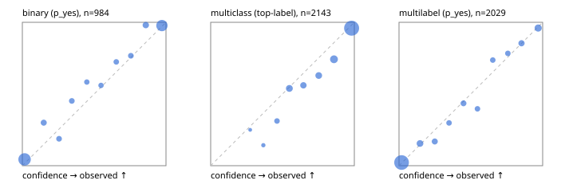

# Evaluation report

- model `Qwen/Qwen3-4B-Instruct-2507` @ `cdbee75f17` (shared-prefix tree (tree-v1)), adapter/checkpoint `runs/tree_4b_combo_r2/adapter`, prompt `tree-v1` (c8963d819128)
- data data/ova/hf.jsonl, data/ova/eval.jsonl; splits ['test']; n=3471; calibration `None`
- cuda / bfloat16; 2026-09-24T21:39:48+0000; wall 244.8s

## Overall

question accuracy 83.5%

**binary**: n 984, positives 475, accuracy 0.900, precision 0.924, recall 0.865, f1 0.893, auroc 0.966, brier 0.072, log_loss 0.247, ece 0.038

**multiclass**: n 2143, accuracy 0.844, macro_f1 0.893, log_loss 0.454, brier 0.225, ece_top_label 0.045

**multilabel**: n 344, labels 2029, exact_match 0.590, micro_f1 0.779, macro_f1 0.808, label_auroc 0.954, brier 0.067, log_loss 0.222, ece 0.017

## By family

| family | n | question acc % | details |
|---|---|---|---|
| eval_adversarial | 27 | 96.3 | bin acc 93.3 F1 90.9 AUROC 0.907 ECE 0.086; mc acc 100.0 mF1 100.0 ECE 0.002; ml EM 100.0 µF1 100.0 ECE 0.012 |
| eval_agent_output | 26 | 61.5 | bin acc 85.7 F1 85.7 AUROC 0.918 ECE 0.160; mc acc 42.9 mF1 31.0 ECE 0.484; ml EM 20.0 µF1 66.7 ECE 0.196 |
| eval_evidence | 17 | 94.1 | bin acc 100.0 F1 100.0 AUROC 1.000 ECE 0.018; ml EM 50.0 µF1 57.1 ECE 0.248 |
| eval_multilabel | 32 | 93.8 | bin acc 100.0 F1 100.0 AUROC 1.000 ECE 0.026; mc acc 0.0 mF1 0.0 ECE 0.576; ml EM 95.8 µF1 98.0 ECE 0.020 |
| eval_policy | 22 | 63.6 | bin acc 69.2 F1 71.4 AUROC 0.762 ECE 0.245; mc acc 40.0 mF1 25.0 ECE 0.504; ml EM 75.0 µF1 94.1 ECE 0.146 |
| eval_routing | 25 | 88.0 | bin acc 90.0 F1 88.9 AUROC 0.958 ECE 0.115; mc acc 92.3 mF1 81.8 ECE 0.074; ml EM 50.0 µF1 80.0 ECE 0.087 |
| eval_urgency_sentiment | 22 | 95.5 | bin acc 90.0 F1 92.3 AUROC 0.958 ECE 0.147; mc acc 100.0 mF1 100.0 ECE 0.036; ml EM 100.0 µF1 100.0 ECE 0.004 |
| heldout_boolq | 300 | 85.7 | bin acc 85.7 F1 87.2 AUROC 0.949 ECE 0.074 |
| heldout_emotion_multiclass | 300 | 54.7 | mc acc 54.7 mF1 43.8 ECE 0.229 |
| heldout_intent_clinc | 300 | 95.7 | mc acc 95.7 mF1 97.1 ECE 0.029 |
| heldout_question_type_trec | 300 | 93.3 | mc acc 93.3 mF1 92.9 ECE 0.049 |
| heldout_sentiment_sst2 | 300 | 90.7 | bin acc 90.7 F1 90.2 AUROC 0.970 ECE 0.051 |
| heldout_topic_dbpedia | 300 | 96.7 | mc acc 96.7 mF1 96.3 ECE 0.020 |
| hf_emotions_multilabel | 300 | 55.7 | ml EM 55.7 µF1 74.1 ECE 0.015 |
| hf_intent_banking77 | 300 | 94.3 | mc acc 94.3 mF1 93.3 ECE 0.018 |
| hf_nli | 300 | 94.0 | bin acc 94.0 F1 91.8 AUROC 0.986 ECE 0.029 |
| hf_sentiment_tweets | 300 | 67.0 | mc acc 67.0 mF1 67.6 ECE 0.080 |
| hf_topic_agnews | 300 | 89.7 | mc acc 89.7 mF1 89.7 ECE 0.049 |

## by hard case

| slice | n | question acc % |
|---|---|---|
| (none) | 3042 | 83.4 |
| contradiction | 107 | 99.1 |
| distractor | 33 | 69.7 |
| double_negation | 6 | 83.3 |
| evidence_end | 13 | 84.6 |
| evidence_middle | 11 | 81.8 |
| evidence_start | 9 | 88.9 |
| exception | 7 | 57.1 |
| hypothetical | 7 | 100.0 |
| injection | 10 | 90.0 |
| lexical_overlap | 20 | 95.0 |
| long_state | 50 | 82.0 |
| missing_evidence | 104 | 90.4 |
| multi_positive | 81 | 48.1 |
| multi_turn | 9 | 88.9 |
| negation | 30 | 96.7 |
| new_label_names | 3 | 66.7 |
| nota | 46 | 97.8 |
| numeric_reasoning | 16 | 81.2 |
| paraphrase | 22 | 95.5 |
| role_reversal | 15 | 93.3 |
| sarcasm | 12 | 100.0 |
| temporal_reasoning | 29 | 65.5 |
| zero_positive | 6 | 100.0 |

## by state tokens

| slice | n | question acc % |
|---|---|---|
| 00000-00127 | 3211 | 83.4 |
| 00128-00511 | 208 | 84.1 |
| 00512-02047 | 52 | 82.7 |

## by candidates

| slice | n | question acc % |
|---|---|---|
| 01 | 984 | 90.0 |
| 03 | 310 | 67.7 |
| 04 | 333 | 88.6 |
| 05 | 22 | 72.7 |
| 06 | 1218 | 75.2 |
| 07 | 49 | 98.0 |
| 08 | 555 | 94.8 |

## Paraphrase groups

11 groups; same prediction 72.7%; all correct 90.9%

## Multiclass abstention (coverage vs error on accepted)

| abstain_below | coverage % | error % |
|---|---|---|
| 0.0 | 100.0 | 15.6 |
| 0.4 | 99.2 | 15.1 |
| 0.5 | 96.3 | 13.5 |
| 0.6 | 89.7 | 11.1 |
| 0.7 | 84.7 | 9.1 |
| 0.8 | 78.6 | 6.9 |
| 0.9 | 68.3 | 4.1 |

## Reliability: binary

| bin | n | mean confidence | observed frequency |
|---|---|---|---|
| [0.0,0.1) | 412 | 0.016 | 0.044 |
| [0.1,0.2) | 40 | 0.149 | 0.300 |
| [0.2,0.3) | 32 | 0.256 | 0.188 |
| [0.3,0.4) | 31 | 0.344 | 0.452 |
| [0.4,0.5) | 24 | 0.449 | 0.583 |
| [0.5,0.6) | 25 | 0.548 | 0.560 |
| [0.6,0.7) | 29 | 0.654 | 0.724 |
| [0.7,0.8) | 30 | 0.756 | 0.767 |
| [0.8,0.9) | 51 | 0.859 | 0.980 |
| [0.9,1.0] | 310 | 0.972 | 0.977 |

## Reliability: multiclass

| bin | n | mean confidence | observed frequency |
|---|---|---|---|
| [0.2,0.3) | 4 | 0.275 | 0.250 |
| [0.3,0.4) | 14 | 0.367 | 0.143 |
| [0.4,0.5) | 61 | 0.462 | 0.311 |
| [0.5,0.6) | 141 | 0.548 | 0.539 |
| [0.6,0.7) | 107 | 0.646 | 0.561 |
| [0.7,0.8) | 132 | 0.752 | 0.629 |
| [0.8,0.9) | 221 | 0.858 | 0.742 |
| [0.9,1.0] | 1463 | 0.981 | 0.959 |

## Reliability: multilabel

| bin | n | mean confidence | observed frequency |
|---|---|---|---|
| [0.0,0.1) | 1295 | 0.018 | 0.022 |
| [0.1,0.2) | 116 | 0.146 | 0.155 |
| [0.2,0.3) | 77 | 0.249 | 0.169 |
| [0.3,0.4) | 57 | 0.348 | 0.298 |
| [0.4,0.5) | 69 | 0.449 | 0.435 |
| [0.5,0.6) | 58 | 0.546 | 0.397 |
| [0.6,0.7) | 57 | 0.653 | 0.737 |
| [0.7,0.8) | 60 | 0.758 | 0.783 |
| [0.8,0.9) | 89 | 0.853 | 0.854 |
| [0.9,1.0] | 151 | 0.969 | 0.960 |
