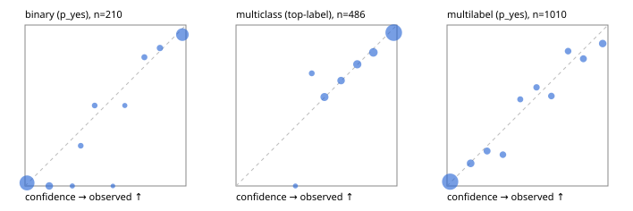

# Evaluation report

- model `Qwen/Qwen3-4B-Instruct-2507` @ `cdbee75f17` (shared-prefix tree (tree-v1)), adapter/checkpoint `runs/tree_4b_combo_r2/adapter`, prompt `tree-v1` (c8963d819128)
- data data/ova/hf.jsonl, data/ova/eval.jsonl; splits ['validation']; n=868; calibration `None`
- cuda / bfloat16; 2026-09-24T21:35:34+0000; wall 62.6s

## Overall

question accuracy 81.9%

**binary**: n 210, positives 79, accuracy 0.938, precision 0.902, recall 0.937, f1 0.919, auroc 0.981, brier 0.049, log_loss 0.177, ece 0.036

**multiclass**: n 486, accuracy 0.862, macro_f1 0.832, log_loss 0.398, brier 0.210, ece_top_label 0.028

**multilabel**: n 172, labels 1010, exact_match 0.552, micro_f1 0.748, macro_f1 0.677, label_auroc 0.936, brier 0.078, log_loss 0.260, ece 0.029

## By family

| family | n | question acc % | details |
|---|---|---|---|
| eval_adversarial | 14 | 100.0 | bin acc 100.0 F1 100.0 AUROC 1.000 ECE 0.036; mc acc 100.0 mF1 100.0 ECE 0.004; ml EM 100.0 µF1 100.0 ECE 0.003 |
| eval_agent_output | 20 | 80.0 | bin acc 91.7 F1 92.3 AUROC 0.972 ECE 0.114; mc acc 60.0 mF1 33.3 ECE 0.312; ml EM 66.7 µF1 0.0 ECE 0.202 |
| eval_evidence | 17 | 100.0 | bin acc 100.0 F1 100.0 AUROC 1.000 ECE 0.009; ml EM 100.0 µF1 100.0 ECE 0.006 |
| eval_multilabel | 12 | 66.7 | bin acc 0.0 F1 0.0 AUROC — ECE 0.980; mc acc 100.0 mF1 100.0 ECE 0.000; ml EM 66.7 µF1 93.3 ECE 0.065 |
| eval_policy | 24 | 66.7 | bin acc 75.0 F1 76.9 AUROC 0.914 ECE 0.140; mc acc 63.6 mF1 46.7 ECE 0.383; ml EM 0.0 µF1 50.0 ECE 0.613 |
| eval_routing | 16 | 87.5 | bin acc 100.0 F1 100.0 AUROC 1.000 ECE 0.013; mc acc 87.5 mF1 88.9 ECE 0.066; ml EM 0.0 µF1 0.0 ECE 0.251 |
| eval_urgency_sentiment | 15 | 100.0 | bin acc 100.0 F1 100.0 AUROC 1.000 ECE 0.044; mc acc 100.0 mF1 100.0 ECE 0.076; ml EM 100.0 µF1 100.0 ECE 0.028 |
| hf_emotions_multilabel | 150 | 52.7 | ml EM 52.7 µF1 72.2 ECE 0.030 |
| hf_intent_banking77 | 150 | 95.3 | mc acc 95.3 mF1 93.5 ECE 0.030 |
| hf_nli | 150 | 94.7 | bin acc 94.7 F1 91.7 AUROC 0.980 ECE 0.042 |
| hf_sentiment_tweets | 150 | 76.7 | mc acc 76.7 mF1 73.1 ECE 0.058 |
| hf_topic_agnews | 150 | 88.0 | mc acc 88.0 mF1 88.2 ECE 0.075 |

## by hard case

| slice | n | question acc % |
|---|---|---|
| (none) | 634 | 81.5 |
| contradiction | 63 | 96.8 |
| distractor | 20 | 90.0 |
| double_negation | 3 | 100.0 |
| evidence_end | 4 | 75.0 |
| evidence_middle | 7 | 100.0 |
| evidence_start | 3 | 100.0 |
| exception | 7 | 100.0 |
| hypothetical | 6 | 100.0 |
| injection | 16 | 87.5 |
| lexical_overlap | 13 | 92.3 |
| long_state | 26 | 84.6 |
| missing_evidence | 59 | 91.5 |
| multi_positive | 40 | 37.5 |
| multi_turn | 21 | 90.5 |
| negation | 9 | 77.8 |
| new_label_names | 5 | 60.0 |
| nota | 4 | 75.0 |
| numeric_reasoning | 13 | 84.6 |
| paraphrase | 10 | 60.0 |
| role_reversal | 7 | 71.4 |
| sarcasm | 5 | 100.0 |
| temporal_reasoning | 15 | 60.0 |
| zero_positive | 7 | 71.4 |

## by state tokens

| slice | n | question acc % |
|---|---|---|
| 00000-00127 | 796 | 81.9 |
| 00128-00511 | 46 | 80.4 |
| 00512-02047 | 26 | 84.6 |

## by candidates

| slice | n | question acc % |
|---|---|---|
| 01 | 210 | 93.8 |
| 03 | 162 | 77.8 |
| 04 | 174 | 86.2 |
| 05 | 13 | 69.2 |
| 06 | 159 | 54.1 |
| 08 | 150 | 95.3 |

## Paraphrase groups

5 groups; same prediction 60.0%; all correct 40.0%

## Multiclass abstention (coverage vs error on accepted)

| abstain_below | coverage % | error % |
|---|---|---|
| 0.0 | 100.0 | 13.8 |
| 0.4 | 99.2 | 13.1 |
| 0.5 | 97.1 | 12.7 |
| 0.6 | 89.3 | 9.9 |
| 0.7 | 83.3 | 8.1 |
| 0.8 | 74.9 | 6.3 |
| 0.9 | 65.2 | 4.7 |

## Reliability: binary

| bin | n | mean confidence | observed frequency |
|---|---|---|---|
| [0.0,0.1) | 105 | 0.012 | 0.019 |
| [0.1,0.2) | 13 | 0.151 | 0.000 |
| [0.2,0.3) | 2 | 0.294 | 0.000 |
| [0.3,0.4) | 4 | 0.346 | 0.250 |
| [0.4,0.5) | 4 | 0.433 | 0.500 |
| [0.5,0.6) | 1 | 0.546 | 0.000 |
| [0.6,0.7) | 2 | 0.620 | 0.500 |
| [0.7,0.8) | 5 | 0.742 | 0.800 |
| [0.8,0.9) | 7 | 0.838 | 0.857 |
| [0.9,1.0] | 67 | 0.978 | 0.940 |

## Reliability: multiclass

| bin | n | mean confidence | observed frequency |
|---|---|---|---|
| [0.3,0.4) | 4 | 0.369 | 0.000 |
| [0.4,0.5) | 10 | 0.471 | 0.700 |
| [0.5,0.6) | 38 | 0.550 | 0.553 |
| [0.6,0.7) | 29 | 0.653 | 0.655 |
| [0.7,0.8) | 41 | 0.753 | 0.756 |
| [0.8,0.9) | 47 | 0.854 | 0.830 |
| [0.9,1.0] | 317 | 0.980 | 0.953 |

## Reliability: multilabel

| bin | n | mean confidence | observed frequency |
|---|---|---|---|
| [0.0,0.1) | 632 | 0.019 | 0.027 |
| [0.1,0.2) | 64 | 0.146 | 0.141 |
| [0.2,0.3) | 46 | 0.249 | 0.217 |
| [0.3,0.4) | 36 | 0.347 | 0.194 |
| [0.4,0.5) | 26 | 0.455 | 0.538 |
| [0.5,0.6) | 31 | 0.556 | 0.613 |
| [0.6,0.7) | 34 | 0.648 | 0.559 |
| [0.7,0.8) | 37 | 0.752 | 0.838 |
| [0.8,0.9) | 43 | 0.847 | 0.791 |
| [0.9,1.0] | 61 | 0.967 | 0.885 |
