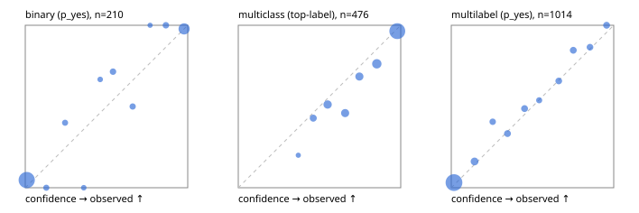

# Evaluation report

- model `Qwen/Qwen3-4B-Instruct-2507` @ `cdbee75f17` (shared-prefix tree (tree-v1)), adapter/checkpoint `runs/tree_4b_instruct/adapter`, prompt `tree-v1` (c8963d819128)
- data data/hf.jsonl, data/eval.jsonl; splits ['calibration']; n=859; calibration `None`
- cuda / bfloat16; 2026-09-24T00:25:08+0000; wall 46.8s

## Overall

question accuracy 77.6%

**binary**: n 210, positives 71, accuracy 0.924, precision 0.910, recall 0.859, f1 0.884, auroc 0.972, brier 0.060, log_loss 0.223, ece 0.055

**multiclass**: n 476, accuracy 0.807, macro_f1 0.797, log_loss 0.429, brier 0.254, ece_top_label 0.047

**multilabel**: n 173, labels 1014, exact_match 0.514, micro_f1 0.717, macro_f1 0.674, label_auroc 0.932, brier 0.079, log_loss 0.265, ece 0.024

## By family

| family | n | question acc % | details |
|---|---|---|---|
| eval_adversarial | 19 | 100.0 | bin acc 100.0 F1 100.0 AUROC 1.000 ECE 0.077; mc acc 100.0 mF1 100.0 ECE 0.049; ml EM 100.0 µF1 100.0 ECE 0.017 |
| eval_agent_output | 9 | 88.9 | bin acc 100.0 F1 100.0 AUROC 1.000 ECE 0.044; mc acc 100.0 mF1 100.0 ECE 0.063; ml EM 50.0 µF1 66.7 ECE 0.227 |
| eval_evidence | 19 | 94.7 | bin acc 100.0 F1 100.0 AUROC 1.000 ECE 0.060; ml EM 66.7 µF1 92.3 ECE 0.110 |
| eval_multilabel | 12 | 83.3 | bin acc 100.0 F1 100.0 AUROC — ECE 0.002; mc acc 100.0 mF1 100.0 ECE 0.067; ml EM 75.0 µF1 92.3 ECE 0.069 |
| eval_policy | 16 | 68.8 | bin acc 87.5 F1 85.7 AUROC 1.000 ECE 0.070; mc acc 25.0 mF1 11.1 ECE 0.578; ml EM 75.0 µF1 75.0 ECE 0.157 |
| eval_routing | 15 | 93.3 | bin acc 100.0 F1 100.0 AUROC 1.000 ECE 0.026; mc acc 85.7 mF1 71.4 ECE 0.113; ml EM 100.0 µF1 100.0 ECE 0.067 |
| eval_urgency_sentiment | 19 | 84.2 | bin acc 87.5 F1 80.0 AUROC 0.917 ECE 0.137; mc acc 75.0 mF1 63.0 ECE 0.170; ml EM 100.0 µF1 100.0 ECE 0.022 |
| hf_emotions_multilabel | 150 | 47.3 | ml EM 47.3 µF1 67.7 ECE 0.029 |
| hf_intent_banking77 | 150 | 92.0 | mc acc 92.0 mF1 86.5 ECE 0.023 |
| hf_nli | 150 | 90.7 | bin acc 90.7 F1 83.7 AUROC 0.973 ECE 0.077 |
| hf_sentiment_tweets | 150 | 66.0 | mc acc 66.0 mF1 63.2 ECE 0.097 |
| hf_topic_agnews | 150 | 84.7 | mc acc 84.7 mF1 84.8 ECE 0.051 |

## by hard case

| slice | n | question acc % |
|---|---|---|
| (none) | 624 | 76.0 |
| contradiction | 58 | 100.0 |
| distractor | 25 | 84.0 |
| double_negation | 3 | 100.0 |
| evidence_end | 11 | 100.0 |
| evidence_middle | 6 | 83.3 |
| evidence_start | 7 | 85.7 |
| exception | 4 | 75.0 |
| hypothetical | 7 | 85.7 |
| injection | 6 | 83.3 |
| lexical_overlap | 16 | 87.5 |
| long_state | 42 | 85.7 |
| missing_evidence | 62 | 93.5 |
| multi_positive | 42 | 35.7 |
| multi_turn | 12 | 83.3 |
| negation | 12 | 83.3 |
| new_label_names | 5 | 80.0 |
| nota | 4 | 100.0 |
| numeric_reasoning | 15 | 60.0 |
| paraphrase | 10 | 80.0 |
| role_reversal | 13 | 92.3 |
| sarcasm | 1 | 0.0 |
| temporal_reasoning | 14 | 92.9 |
| zero_positive | 4 | 75.0 |

## by state tokens

| slice | n | question acc % |
|---|---|---|
| 00000-00127 | 780 | 76.3 |
| 00128-00511 | 37 | 97.3 |
| 00512-02047 | 42 | 85.7 |

## by candidates

| slice | n | question acc % |
|---|---|---|
| 01 | 210 | 92.4 |
| 03 | 158 | 66.5 |
| 04 | 168 | 83.9 |
| 05 | 15 | 80.0 |
| 06 | 157 | 48.4 |
| 07 | 1 | 100.0 |
| 08 | 150 | 92.0 |

## Paraphrase groups

5 groups; same prediction 60.0%; all correct 60.0%

## Multiclass abstention (coverage vs error on accepted)

| abstain_below | coverage % | error % |
|---|---|---|
| 0.0 | 100.0 | 19.3 |
| 0.4 | 98.9 | 18.7 |
| 0.5 | 94.5 | 16.9 |
| 0.6 | 85.9 | 13.7 |
| 0.7 | 78.2 | 9.7 |
| 0.8 | 70.2 | 7.2 |
| 0.9 | 57.8 | 3.6 |

## Reliability: binary

| bin | n | mean confidence | observed frequency |
|---|---|---|---|
| [0.0,0.1) | 127 | 0.009 | 0.047 |
| [0.1,0.2) | 5 | 0.130 | 0.000 |
| [0.2,0.3) | 5 | 0.245 | 0.400 |
| [0.3,0.4) | 3 | 0.360 | 0.000 |
| [0.4,0.5) | 3 | 0.461 | 0.667 |
| [0.5,0.6) | 7 | 0.540 | 0.714 |
| [0.6,0.7) | 6 | 0.661 | 0.500 |
| [0.7,0.8) | 2 | 0.768 | 1.000 |
| [0.8,0.9) | 7 | 0.866 | 1.000 |
| [0.9,1.0] | 45 | 0.978 | 0.978 |

## Reliability: multiclass

| bin | n | mean confidence | observed frequency |
|---|---|---|---|
| [0.3,0.4) | 5 | 0.369 | 0.200 |
| [0.4,0.5) | 21 | 0.462 | 0.429 |
| [0.5,0.6) | 41 | 0.550 | 0.512 |
| [0.6,0.7) | 37 | 0.658 | 0.459 |
| [0.7,0.8) | 38 | 0.745 | 0.684 |
| [0.8,0.9) | 59 | 0.853 | 0.763 |
| [0.9,1.0] | 275 | 0.979 | 0.964 |

## Reliability: multilabel

| bin | n | mean confidence | observed frequency |
|---|---|---|---|
| [0.0,0.1) | 659 | 0.017 | 0.032 |
| [0.1,0.2) | 68 | 0.143 | 0.162 |
| [0.2,0.3) | 32 | 0.255 | 0.406 |
| [0.3,0.4) | 39 | 0.346 | 0.333 |
| [0.4,0.5) | 39 | 0.451 | 0.487 |
| [0.5,0.6) | 26 | 0.541 | 0.538 |
| [0.6,0.7) | 35 | 0.661 | 0.657 |
| [0.7,0.8) | 39 | 0.751 | 0.846 |
| [0.8,0.9) | 37 | 0.854 | 0.865 |
| [0.9,1.0] | 40 | 0.956 | 1.000 |
