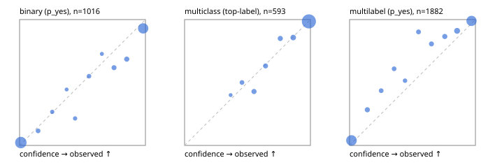

# Evaluation report

- model `Qwen/Qwen3-4B-Instruct-2507` @ `cdbee75f17` (shared-prefix tree (tree-v1)), adapter/checkpoint `runs/tree_4b_instruct/adapter`, prompt `tree-v1` (c8963d819128)
- data data/eval2.jsonl; splits ['test']; n=1991; calibration `None`
- cuda / bfloat16; 2026-09-24T07:13:57+0000; wall 224.2s

## Overall

question accuracy 88.1%

**binary**: n 1016, positives 435, accuracy 0.914, precision 0.869, recall 0.943, f1 0.904, auroc 0.969, brier 0.069, log_loss 0.244, ece 0.041

**multiclass**: n 593, accuracy 0.927, macro_f1 0.883, log_loss 0.208, brier 0.104, ece_top_label 0.011

**multilabel**: n 382, labels 1882, exact_match 0.723, micro_f1 0.921, macro_f1 0.861, label_auroc 0.974, brier 0.067, log_loss 0.229, ece 0.056

## By family

| family | n | question acc % | details |
|---|---|---|---|
| e2_hard | 673 | 85.6 | bin acc 88.8 F1 85.5 AUROC 0.956 ECE 0.066; mc acc 90.2 mF1 83.5 ECE 0.040; ml EM 70.5 µF1 91.0 ECE 0.044 |
| e2_simple | 664 | 92.8 | bin acc 95.6 F1 96.0 AUROC 0.981 ECE 0.025; mc acc 98.0 mF1 97.2 ECE 0.022; ml EM 75.8 µF1 93.4 ECE 0.087 |
| e2_very_hard | 654 | 86.1 | bin acc 89.8 F1 87.4 AUROC 0.956 ECE 0.067; mc acc 90.0 mF1 83.4 ECE 0.026; ml EM 70.8 µF1 91.8 ECE 0.048 |

## by hard case

| slice | n | question acc % |
|---|---|---|
| (none) | 569 | 94.4 |
| contradiction | 172 | 91.9 |
| distractor | 474 | 87.1 |
| double_negation | 126 | 88.1 |
| evidence_end | 57 | 86.0 |
| evidence_middle | 114 | 93.9 |
| evidence_start | 17 | 94.1 |
| exception | 213 | 85.9 |
| hypothetical | 128 | 89.1 |
| injection | 151 | 79.5 |
| lexical_overlap | 201 | 91.5 |
| long_state | 191 | 90.6 |
| missing_evidence | 141 | 89.4 |
| multi_positive | 322 | 75.8 |
| multi_turn | 149 | 87.2 |
| negation | 257 | 89.9 |
| nota | 118 | 89.0 |
| numeric_reasoning | 224 | 79.5 |
| paraphrase | 218 | 83.5 |
| role_reversal | 187 | 88.8 |
| sarcasm | 149 | 76.5 |
| temporal_reasoning | 203 | 74.9 |
| zero_positive | 73 | 87.7 |
| zero_positive_distractor | 1 | 100.0 |

## by state tokens

| slice | n | question acc % |
|---|---|---|
| 00000-00127 | 662 | 87.0 |
| 00128-00511 | 477 | 83.9 |
| 00512-02047 | 484 | 91.3 |
| 02048-08191 | 329 | 90.6 |
| 08192+ | 39 | 100.0 |

## by candidates

| slice | n | question acc % |
|---|---|---|
| 01 | 1016 | 91.4 |
| 03 | 128 | 89.1 |
| 04 | 515 | 89.7 |
| 05 | 224 | 74.1 |
| 06 | 86 | 80.2 |
| 07 | 18 | 66.7 |
| 08 | 4 | 75.0 |

## Paraphrase groups

76 groups; same prediction 72.4%; all correct 76.3%

## Multiclass abstention (coverage vs error on accepted)

| abstain_below | coverage % | error % |
|---|---|---|
| 0.0 | 100.0 | 7.3 |
| 0.4 | 99.2 | 6.8 |
| 0.5 | 96.8 | 5.7 |
| 0.6 | 93.3 | 3.8 |
| 0.7 | 90.1 | 2.6 |
| 0.8 | 86.7 | 2.1 |
| 0.9 | 82.0 | 1.4 |

## Reliability: binary

| bin | n | mean confidence | observed frequency |
|---|---|---|---|
| [0.0,0.1) | 480 | 0.010 | 0.023 |
| [0.1,0.2) | 26 | 0.147 | 0.115 |
| [0.2,0.3) | 15 | 0.260 | 0.267 |
| [0.3,0.4) | 9 | 0.374 | 0.444 |
| [0.4,0.5) | 14 | 0.441 | 0.214 |
| [0.5,0.6) | 20 | 0.552 | 0.550 |
| [0.6,0.7) | 11 | 0.654 | 0.727 |
| [0.7,0.8) | 34 | 0.751 | 0.618 |
| [0.8,0.9) | 35 | 0.852 | 0.686 |
| [0.9,1.0] | 372 | 0.982 | 0.930 |

## Reliability: multiclass

| bin | n | mean confidence | observed frequency |
|---|---|---|---|
| [0.3,0.4) | 5 | 0.366 | 0.400 |
| [0.4,0.5) | 14 | 0.456 | 0.500 |
| [0.5,0.6) | 21 | 0.552 | 0.429 |
| [0.6,0.7) | 19 | 0.644 | 0.632 |
| [0.7,0.8) | 20 | 0.761 | 0.850 |
| [0.8,0.9) | 28 | 0.863 | 0.857 |
| [0.9,1.0] | 486 | 0.988 | 0.986 |

## Reliability: multilabel

| bin | n | mean confidence | observed frequency |
|---|---|---|---|
| [0.0,0.1) | 734 | 0.015 | 0.040 |
| [0.1,0.2) | 67 | 0.141 | 0.284 |
| [0.2,0.3) | 46 | 0.251 | 0.435 |
| [0.3,0.4) | 46 | 0.354 | 0.609 |
| [0.4,0.5) | 35 | 0.440 | 0.514 |
| [0.5,0.6) | 51 | 0.548 | 0.902 |
| [0.6,0.7) | 62 | 0.651 | 0.806 |
| [0.7,0.8) | 67 | 0.757 | 0.866 |
| [0.8,0.9) | 112 | 0.854 | 0.911 |
| [0.9,1.0] | 662 | 0.969 | 0.989 |
