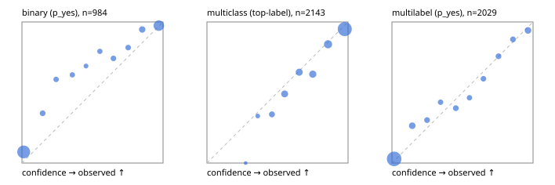

# Evaluation report

- model `Qwen/Qwen3-4B-Instruct-2507` @ `cdbee75f17` (shared-prefix tree (tree-v1)), adapter/checkpoint `runs/tree_4b_instruct/adapter`, prompt `tree-v1` (c8963d819128)
- data data/hf.jsonl, data/eval.jsonl; splits ['test']; n=3471; calibration `None`
- cuda / bfloat16; 2026-09-24T00:28:16+0000; wall 178.9s

## Overall

question accuracy 80.4%

**binary**: n 984, positives 475, accuracy 0.878, precision 0.930, recall 0.808, f1 0.865, auroc 0.958, brier 0.094, log_loss 0.330, ece 0.076

**multiclass**: n 2143, accuracy 0.823, macro_f1 0.871, log_loss 0.526, brier 0.253, ece_top_label 0.038

**multilabel**: n 344, labels 2029, exact_match 0.468, micro_f1 0.715, macro_f1 0.745, label_auroc 0.933, brier 0.082, log_loss 0.269, ece 0.029

## By family

| family | n | question acc % | details |
|---|---|---|---|
| eval_adversarial | 27 | 81.5 | bin acc 93.3 F1 90.9 AUROC 0.944 ECE 0.099; mc acc 71.4 mF1 62.5 ECE 0.141; ml EM 60.0 µF1 90.0 ECE 0.102 |
| eval_agent_output | 26 | 57.7 | bin acc 85.7 F1 87.5 AUROC 0.898 ECE 0.156; mc acc 14.3 mF1 6.2 ECE 0.577; ml EM 40.0 µF1 75.0 ECE 0.198 |
| eval_evidence | 17 | 94.1 | bin acc 100.0 F1 100.0 AUROC 1.000 ECE 0.034; ml EM 50.0 µF1 66.7 ECE 0.202 |
| eval_multilabel | 32 | 87.5 | bin acc 100.0 F1 100.0 AUROC 1.000 ECE 0.051; mc acc 100.0 mF1 100.0 ECE 0.042; ml EM 83.3 µF1 95.0 ECE 0.033 |
| eval_policy | 22 | 63.6 | bin acc 69.2 F1 75.0 AUROC 0.833 ECE 0.258; mc acc 60.0 mF1 42.9 ECE 0.463; ml EM 50.0 µF1 84.2 ECE 0.191 |
| eval_routing | 25 | 92.0 | bin acc 90.0 F1 88.9 AUROC 0.917 ECE 0.091; mc acc 100.0 mF1 100.0 ECE 0.107; ml EM 50.0 µF1 85.7 ECE 0.085 |
| eval_urgency_sentiment | 22 | 81.8 | bin acc 80.0 F1 83.3 AUROC 0.917 ECE 0.055; mc acc 80.0 mF1 75.2 ECE 0.253; ml EM 100.0 µF1 100.0 ECE 0.024 |
| heldout_boolq | 300 | 83.0 | bin acc 83.0 F1 84.8 AUROC 0.926 ECE 0.095 |
| heldout_emotion_multiclass | 300 | 53.0 | mc acc 53.0 mF1 44.8 ECE 0.226 |
| heldout_intent_clinc | 300 | 91.3 | mc acc 91.3 mF1 93.2 ECE 0.036 |
| heldout_question_type_trec | 300 | 90.3 | mc acc 90.3 mF1 89.1 ECE 0.083 |
| heldout_sentiment_sst2 | 300 | 86.0 | bin acc 86.0 F1 84.1 AUROC 0.973 ECE 0.138 |
| heldout_topic_dbpedia | 300 | 95.3 | mc acc 95.3 mF1 95.0 ECE 0.022 |
| hf_emotions_multilabel | 300 | 43.3 | ml EM 43.3 µF1 66.3 ECE 0.030 |
| hf_intent_banking77 | 300 | 93.3 | mc acc 93.3 mF1 92.6 ECE 0.020 |
| hf_nli | 300 | 94.3 | bin acc 94.3 F1 91.9 AUROC 0.987 ECE 0.049 |
| hf_sentiment_tweets | 300 | 66.3 | mc acc 66.3 mF1 66.9 ECE 0.076 |
| hf_topic_agnews | 300 | 88.0 | mc acc 88.0 mF1 88.1 ECE 0.047 |

## by hard case

| slice | n | question acc % |
|---|---|---|
| (none) | 3042 | 79.9 |
| contradiction | 107 | 100.0 |
| distractor | 33 | 69.7 |
| double_negation | 6 | 83.3 |
| evidence_end | 13 | 100.0 |
| evidence_middle | 11 | 81.8 |
| evidence_start | 9 | 88.9 |
| exception | 7 | 42.9 |
| hypothetical | 7 | 100.0 |
| injection | 10 | 50.0 |
| lexical_overlap | 20 | 85.0 |
| long_state | 50 | 84.0 |
| missing_evidence | 104 | 95.2 |
| multi_positive | 81 | 39.5 |
| multi_turn | 9 | 77.8 |
| negation | 30 | 83.3 |
| new_label_names | 3 | 33.3 |
| nota | 46 | 97.8 |
| numeric_reasoning | 16 | 75.0 |
| paraphrase | 22 | 72.7 |
| role_reversal | 15 | 80.0 |
| sarcasm | 12 | 75.0 |
| temporal_reasoning | 29 | 69.0 |
| zero_positive | 6 | 100.0 |

## by state tokens

| slice | n | question acc % |
|---|---|---|
| 00000-00127 | 3211 | 80.3 |
| 00128-00511 | 208 | 80.8 |
| 00512-02047 | 52 | 84.6 |

## by candidates

| slice | n | question acc % |
|---|---|---|
| 01 | 984 | 87.8 |
| 03 | 310 | 66.1 |
| 04 | 333 | 86.8 |
| 05 | 22 | 59.1 |
| 06 | 1218 | 70.6 |
| 07 | 49 | 100.0 |
| 08 | 555 | 91.7 |

## Paraphrase groups

11 groups; same prediction 54.5%; all correct 63.6%

## Multiclass abstention (coverage vs error on accepted)

| abstain_below | coverage % | error % |
|---|---|---|
| 0.0 | 100.0 | 17.7 |
| 0.4 | 98.7 | 17.0 |
| 0.5 | 94.8 | 15.0 |
| 0.6 | 87.9 | 12.2 |
| 0.7 | 80.4 | 10.0 |
| 0.8 | 72.4 | 7.0 |
| 0.9 | 59.7 | 5.1 |

## Reliability: binary

| bin | n | mean confidence | observed frequency |
|---|---|---|---|
| [0.0,0.1) | 470 | 0.012 | 0.079 |
| [0.1,0.2) | 34 | 0.146 | 0.353 |
| [0.2,0.3) | 27 | 0.242 | 0.593 |
| [0.3,0.4) | 24 | 0.357 | 0.625 |
| [0.4,0.5) | 16 | 0.454 | 0.688 |
| [0.5,0.6) | 24 | 0.552 | 0.792 |
| [0.6,0.7) | 31 | 0.648 | 0.742 |
| [0.7,0.8) | 33 | 0.753 | 0.818 |
| [0.8,0.9) | 56 | 0.852 | 0.946 |
| [0.9,1.0] | 269 | 0.970 | 0.974 |

## Reliability: multiclass

| bin | n | mean confidence | observed frequency |
|---|---|---|---|
| [0.2,0.3) | 4 | 0.274 | 0.000 |
| [0.3,0.4) | 24 | 0.360 | 0.333 |
| [0.4,0.5) | 84 | 0.460 | 0.345 |
| [0.5,0.6) | 147 | 0.551 | 0.490 |
| [0.6,0.7) | 160 | 0.654 | 0.644 |
| [0.7,0.8) | 173 | 0.750 | 0.630 |
| [0.8,0.9) | 272 | 0.858 | 0.842 |
| [0.9,1.0] | 1279 | 0.977 | 0.949 |

## Reliability: multilabel

| bin | n | mean confidence | observed frequency |
|---|---|---|---|
| [0.0,0.1) | 1324 | 0.016 | 0.029 |
| [0.1,0.2) | 121 | 0.144 | 0.264 |
| [0.2,0.3) | 69 | 0.249 | 0.304 |
| [0.3,0.4) | 58 | 0.345 | 0.431 |
| [0.4,0.5) | 72 | 0.453 | 0.389 |
| [0.5,0.6) | 54 | 0.550 | 0.463 |
| [0.6,0.7) | 67 | 0.648 | 0.597 |
| [0.7,0.8) | 74 | 0.755 | 0.757 |
| [0.8,0.9) | 73 | 0.858 | 0.877 |
| [0.9,1.0] | 117 | 0.964 | 0.940 |
