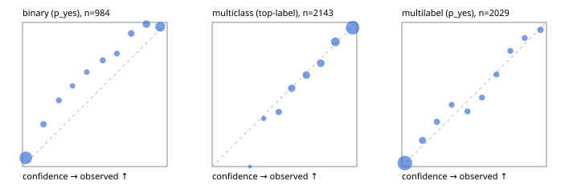

# Evaluation report

- model `Qwen/Qwen3-4B-Instruct-2507` @ `cdbee75f17` (shared-prefix tree (tree-v1)), adapter/checkpoint `runs/tree_4b_instruct/adapter`, prompt `tree-v1` (c8963d819128)
- data data/hf.jsonl, data/eval.jsonl; splits ['test']; n=3471; calibration `{'method': 'temperature scaling per output type, grid search on NLL', 'min_n': 30, 'model': 'Qwen/Qwen3-4B-Instruct-2507', 'revision': 'cdbee75f17c01a7cc42f958dc650907174af0554', 'adapter': 'runs/tree_4b_instruct/adapter', 'adapter_sha256': '22471d66d46546b61a7bbb5820f37e6efd540d36c61145d42de3f2bc56acf910', 'prompt_sha': 'c8963d819128', 'fit_report': 'reports/tree_4b_instruct/calibration/report.json', 'fit_report_sha256': 'a2a0b62a57a777183c057e79a5c0e682f5c1fdddb9b66b62f2e4d5f8ecf3b2ac', 'fit_data': [{'path': 'data/hf.jsonl', 'sha256': 'fe29b29286d5a372271e925825e8b9794f3f64be9a9fc04cad458b4b94ada510'}, {'path': 'data/eval.jsonl', 'sha256': 'be888eb38dcca063823924430e03985ddf2186b874e792d5734936ba93ba6910'}], 'created': '2026-09-24T00:28:21+0000', 'n': {'binary': 210, 'multiclass': 476, 'multilabel': 1014}, 'nll_before': {'binary': 0.22260163662190757, 'multiclass': 0.4286538226279252, 'multilabel': 0.26500438617175975}, 'nll_after': {'binary': 0.20992239348053232, 'multiclass': 0.4227287779972683, 'multilabel': 0.26196943420359226}, 'skipped': {}, 'threshold_report': 'reports/tree_4b_instruct/validation/report.json', 'threshold_report_sha256': '5675806bfc8202a76078cebc8bbfad9334371f79c88e676c48b93085ae33c6ee', 'threshold_rule': 'max F1 on validation after temperature scaling', 'file': 'calib/tree_4b_instruct.json', 'file_sha256': 'f79c2cb28f074f95fe7c6504979bef556974d0998aeb0090aca9adc997533b71'}`
- cuda / bfloat16; 2026-09-24T00:31:28+0000; wall 178.9s

## Overall

question accuracy 80.4%

**binary**: n 984, positives 475, accuracy 0.881, precision 0.926, recall 0.819, f1 0.869, auroc 0.958, brier 0.092, log_loss 0.303, ece 0.080

**multiclass**: n 2143, accuracy 0.823, macro_f1 0.871, log_loss 0.509, brier 0.251, ece_top_label 0.016

**multilabel**: n 344, labels 2029, exact_match 0.468, micro_f1 0.729, macro_f1 0.759, label_auroc 0.933, brier 0.081, log_loss 0.264, ece 0.020

## By family

| family | n | question acc % | details |
|---|---|---|---|
| eval_adversarial | 27 | 81.5 | bin acc 93.3 F1 90.9 AUROC 0.944 ECE 0.105; mc acc 71.4 mF1 62.5 ECE 0.141; ml EM 60.0 µF1 90.0 ECE 0.119 |
| eval_agent_output | 26 | 53.8 | bin acc 85.7 F1 87.5 AUROC 0.898 ECE 0.123; mc acc 14.3 mF1 6.2 ECE 0.547; ml EM 20.0 µF1 63.2 ECE 0.259 |
| eval_evidence | 17 | 94.1 | bin acc 100.0 F1 100.0 AUROC 1.000 ECE 0.054; ml EM 50.0 µF1 57.1 ECE 0.191 |
| eval_multilabel | 32 | 90.6 | bin acc 100.0 F1 100.0 AUROC 1.000 ECE 0.074; mc acc 100.0 mF1 100.0 ECE 0.072; ml EM 87.5 µF1 97.1 ECE 0.048 |
| eval_policy | 22 | 63.6 | bin acc 69.2 F1 75.0 AUROC 0.833 ECE 0.250; mc acc 60.0 mF1 42.9 ECE 0.444; ml EM 50.0 µF1 84.2 ECE 0.171 |
| eval_routing | 25 | 92.0 | bin acc 90.0 F1 88.9 AUROC 0.917 ECE 0.127; mc acc 100.0 mF1 100.0 ECE 0.131; ml EM 50.0 µF1 85.7 ECE 0.143 |
| eval_urgency_sentiment | 22 | 81.8 | bin acc 80.0 F1 85.7 AUROC 0.917 ECE 0.056; mc acc 80.0 mF1 75.2 ECE 0.166; ml EM 100.0 µF1 100.0 ECE 0.038 |
| heldout_boolq | 300 | 83.3 | bin acc 83.3 F1 85.1 AUROC 0.926 ECE 0.091 |
| heldout_emotion_multiclass | 300 | 53.0 | mc acc 53.0 mF1 44.8 ECE 0.186 |
| heldout_intent_clinc | 300 | 91.3 | mc acc 91.3 mF1 93.2 ECE 0.055 |
| heldout_question_type_trec | 300 | 90.3 | mc acc 90.3 mF1 89.1 ECE 0.127 |
| heldout_sentiment_sst2 | 300 | 86.7 | bin acc 86.7 F1 85.0 AUROC 0.973 ECE 0.141 |
| heldout_topic_dbpedia | 300 | 95.3 | mc acc 95.3 mF1 95.0 ECE 0.025 |
| hf_emotions_multilabel | 300 | 43.3 | ml EM 43.3 µF1 68.9 ECE 0.022 |
| hf_intent_banking77 | 300 | 93.3 | mc acc 93.3 mF1 92.6 ECE 0.032 |
| hf_nli | 300 | 94.3 | bin acc 94.3 F1 91.9 AUROC 0.987 ECE 0.065 |
| hf_sentiment_tweets | 300 | 66.3 | mc acc 66.3 mF1 66.9 ECE 0.040 |
| hf_topic_agnews | 300 | 88.0 | mc acc 88.0 mF1 88.1 ECE 0.029 |

## by hard case

| slice | n | question acc % |
|---|---|---|
| (none) | 3042 | 79.9 |
| contradiction | 107 | 100.0 |
| distractor | 33 | 69.7 |
| double_negation | 6 | 83.3 |
| evidence_end | 13 | 100.0 |
| evidence_middle | 11 | 81.8 |
| evidence_start | 9 | 88.9 |
| exception | 7 | 42.9 |
| hypothetical | 7 | 100.0 |
| injection | 10 | 50.0 |
| lexical_overlap | 20 | 85.0 |
| long_state | 50 | 84.0 |
| missing_evidence | 104 | 94.2 |
| multi_positive | 81 | 48.1 |
| multi_turn | 9 | 88.9 |
| negation | 30 | 83.3 |
| new_label_names | 3 | 33.3 |
| nota | 46 | 97.8 |
| numeric_reasoning | 16 | 75.0 |
| paraphrase | 22 | 72.7 |
| role_reversal | 15 | 86.7 |
| sarcasm | 12 | 75.0 |
| temporal_reasoning | 29 | 65.5 |
| zero_positive | 6 | 83.3 |

## by state tokens

| slice | n | question acc % |
|---|---|---|
| 00000-00127 | 3211 | 80.3 |
| 00128-00511 | 208 | 80.8 |
| 00512-02047 | 52 | 84.6 |

## by candidates

| slice | n | question acc % |
|---|---|---|
| 01 | 984 | 88.1 |
| 03 | 310 | 66.1 |
| 04 | 333 | 86.5 |
| 05 | 22 | 59.1 |
| 06 | 1218 | 70.7 |
| 07 | 49 | 100.0 |
| 08 | 555 | 91.7 |

## Paraphrase groups

11 groups; same prediction 54.5%; all correct 63.6%

## Multiclass abstention (coverage vs error on accepted)

| abstain_below | coverage % | error % |
|---|---|---|
| 0.0 | 100.0 | 17.7 |
| 0.4 | 98.0 | 16.6 |
| 0.5 | 93.2 | 14.3 |
| 0.6 | 85.1 | 11.3 |
| 0.7 | 76.4 | 8.4 |
| 0.8 | 67.7 | 5.9 |
| 0.9 | 52.5 | 3.6 |

## Reliability: binary

| bin | n | mean confidence | observed frequency |
|---|---|---|---|
| [0.0,0.1) | 429 | 0.023 | 0.061 |
| [0.1,0.2) | 51 | 0.145 | 0.294 |
| [0.2,0.3) | 37 | 0.251 | 0.459 |
| [0.3,0.4) | 25 | 0.346 | 0.560 |
| [0.4,0.5) | 29 | 0.444 | 0.655 |
| [0.5,0.6) | 38 | 0.555 | 0.737 |
| [0.6,0.7) | 37 | 0.652 | 0.784 |
| [0.7,0.8) | 52 | 0.752 | 0.923 |
| [0.8,0.9) | 86 | 0.857 | 0.988 |
| [0.9,1.0] | 200 | 0.952 | 0.970 |

## Reliability: multiclass

| bin | n | mean confidence | observed frequency |
|---|---|---|---|
| [0.2,0.3) | 4 | 0.261 | 0.000 |
| [0.3,0.4) | 39 | 0.357 | 0.333 |
| [0.4,0.5) | 103 | 0.460 | 0.379 |
| [0.5,0.6) | 173 | 0.550 | 0.543 |
| [0.6,0.7) | 186 | 0.651 | 0.634 |
| [0.7,0.8) | 187 | 0.751 | 0.717 |
| [0.8,0.9) | 326 | 0.852 | 0.865 |
| [0.9,1.0] | 1125 | 0.971 | 0.964 |

## Reliability: multilabel

| bin | n | mean confidence | observed frequency |
|---|---|---|---|
| [0.0,0.1) | 1263 | 0.021 | 0.025 |
| [0.1,0.2) | 143 | 0.143 | 0.182 |
| [0.2,0.3) | 87 | 0.242 | 0.310 |
| [0.3,0.4) | 70 | 0.345 | 0.429 |
| [0.4,0.5) | 81 | 0.454 | 0.383 |
| [0.5,0.6) | 71 | 0.554 | 0.479 |
| [0.6,0.7) | 72 | 0.655 | 0.639 |
| [0.7,0.8) | 71 | 0.750 | 0.803 |
| [0.8,0.9) | 74 | 0.849 | 0.892 |
| [0.9,1.0] | 97 | 0.959 | 0.948 |
