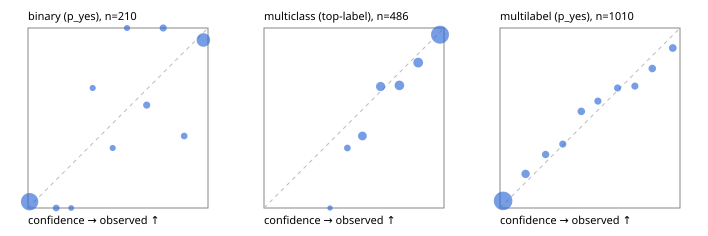

# Evaluation report

- model `Qwen/Qwen3-4B-Instruct-2507` @ `cdbee75f17` (shared-prefix tree (tree-v1)), adapter/checkpoint `runs/tree_4b_instruct/adapter`, prompt `tree-v1` (c8963d819128)
- data data/hf.jsonl, data/eval.jsonl; splits ['validation']; n=868; calibration `None`
- cuda / bfloat16; 2026-09-24T00:24:13+0000; wall 45.4s

## Overall

question accuracy 77.9%

**binary**: n 210, positives 79, accuracy 0.919, precision 0.878, recall 0.911, f1 0.894, auroc 0.957, brier 0.071, log_loss 0.286, ece 0.067

**multiclass**: n 486, accuracy 0.833, macro_f1 0.762, log_loss 0.435, brier 0.229, ece_top_label 0.039

**multilabel**: n 172, labels 1010, exact_match 0.453, micro_f1 0.673, macro_f1 0.621, label_auroc 0.917, brier 0.092, log_loss 0.300, ece 0.032

## By family

| family | n | question acc % | details |
|---|---|---|---|
| eval_adversarial | 14 | 100.0 | bin acc 100.0 F1 100.0 AUROC 1.000 ECE 0.039; mc acc 100.0 mF1 100.0 ECE 0.006; ml EM 100.0 µF1 100.0 ECE 0.010 |
| eval_agent_output | 20 | 70.0 | bin acc 83.3 F1 85.7 AUROC 0.889 ECE 0.217; mc acc 60.0 mF1 33.3 ECE 0.345; ml EM 33.3 µF1 0.0 ECE 0.266 |
| eval_evidence | 17 | 94.1 | bin acc 92.9 F1 90.9 AUROC 1.000 ECE 0.052; ml EM 100.0 µF1 100.0 ECE 0.017 |
| eval_multilabel | 12 | 58.3 | bin acc 0.0 F1 0.0 AUROC — ECE 0.958; mc acc 100.0 mF1 100.0 ECE 0.063; ml EM 55.6 µF1 91.3 ECE 0.074 |
| eval_policy | 24 | 58.3 | bin acc 75.0 F1 76.9 AUROC 0.686 ECE 0.330; mc acc 45.5 mF1 29.4 ECE 0.411; ml EM 0.0 µF1 50.0 ECE 0.585 |
| eval_routing | 16 | 93.8 | bin acc 100.0 F1 100.0 AUROC 1.000 ECE 0.027; mc acc 100.0 mF1 100.0 ECE 0.022; ml EM 0.0 µF1 0.0 ECE 0.285 |
| eval_urgency_sentiment | 15 | 80.0 | bin acc 85.7 F1 88.9 AUROC 1.000 ECE 0.136; mc acc 60.0 mF1 42.9 ECE 0.338; ml EM 100.0 µF1 100.0 ECE 0.059 |
| hf_emotions_multilabel | 150 | 42.7 | ml EM 42.7 µF1 63.6 ECE 0.035 |
| hf_intent_banking77 | 150 | 93.3 | mc acc 93.3 mF1 92.6 ECE 0.033 |
| hf_nli | 150 | 94.0 | bin acc 94.0 F1 90.3 AUROC 0.977 ECE 0.063 |
| hf_sentiment_tweets | 150 | 71.3 | mc acc 71.3 mF1 67.2 ECE 0.078 |
| hf_topic_agnews | 150 | 88.0 | mc acc 88.0 mF1 88.2 ECE 0.060 |

## by hard case

| slice | n | question acc % |
|---|---|---|
| (none) | 634 | 77.4 |
| contradiction | 63 | 93.7 |
| distractor | 20 | 80.0 |
| double_negation | 3 | 100.0 |
| evidence_end | 4 | 75.0 |
| evidence_middle | 7 | 85.7 |
| evidence_start | 3 | 66.7 |
| exception | 7 | 100.0 |
| hypothetical | 6 | 100.0 |
| injection | 16 | 68.8 |
| lexical_overlap | 13 | 84.6 |
| long_state | 26 | 73.1 |
| missing_evidence | 59 | 93.2 |
| multi_positive | 40 | 30.0 |
| multi_turn | 21 | 76.2 |
| negation | 9 | 66.7 |
| new_label_names | 5 | 60.0 |
| nota | 4 | 100.0 |
| numeric_reasoning | 13 | 69.2 |
| paraphrase | 10 | 50.0 |
| role_reversal | 7 | 71.4 |
| sarcasm | 5 | 80.0 |
| temporal_reasoning | 15 | 53.3 |
| zero_positive | 7 | 57.1 |

## by state tokens

| slice | n | question acc % |
|---|---|---|
| 00000-00127 | 796 | 78.0 |
| 00128-00511 | 46 | 78.3 |
| 00512-02047 | 26 | 73.1 |

## by candidates

| slice | n | question acc % |
|---|---|---|
| 01 | 210 | 91.9 |
| 03 | 162 | 71.0 |
| 04 | 174 | 86.2 |
| 05 | 13 | 61.5 |
| 06 | 159 | 44.0 |
| 08 | 150 | 93.3 |

## Paraphrase groups

5 groups; same prediction 60.0%; all correct 40.0%

## Multiclass abstention (coverage vs error on accepted)

| abstain_below | coverage % | error % |
|---|---|---|
| 0.0 | 100.0 | 16.7 |
| 0.4 | 99.4 | 16.1 |
| 0.5 | 96.9 | 14.9 |
| 0.6 | 89.7 | 11.2 |
| 0.7 | 81.5 | 9.1 |
| 0.8 | 71.8 | 6.0 |
| 0.9 | 61.1 | 3.7 |

## Reliability: binary

| bin | n | mean confidence | observed frequency |
|---|---|---|---|
| [0.0,0.1) | 115 | 0.009 | 0.035 |
| [0.1,0.2) | 5 | 0.157 | 0.000 |
| [0.2,0.3) | 2 | 0.240 | 0.000 |
| [0.3,0.4) | 3 | 0.359 | 0.667 |
| [0.4,0.5) | 3 | 0.470 | 0.333 |
| [0.5,0.6) | 3 | 0.550 | 1.000 |
| [0.6,0.7) | 7 | 0.660 | 0.571 |
| [0.7,0.8) | 7 | 0.751 | 1.000 |
| [0.8,0.9) | 5 | 0.868 | 0.400 |
| [0.9,1.0] | 60 | 0.974 | 0.933 |

## Reliability: multiclass

| bin | n | mean confidence | observed frequency |
|---|---|---|---|
| [0.3,0.4) | 3 | 0.367 | 0.000 |
| [0.4,0.5) | 12 | 0.463 | 0.333 |
| [0.5,0.6) | 35 | 0.547 | 0.400 |
| [0.6,0.7) | 40 | 0.648 | 0.675 |
| [0.7,0.8) | 47 | 0.752 | 0.681 |
| [0.8,0.9) | 52 | 0.857 | 0.808 |
| [0.9,1.0] | 297 | 0.978 | 0.963 |

## Reliability: multilabel

| bin | n | mean confidence | observed frequency |
|---|---|---|---|
| [0.0,0.1) | 662 | 0.017 | 0.039 |
| [0.1,0.2) | 58 | 0.142 | 0.190 |
| [0.2,0.3) | 37 | 0.253 | 0.297 |
| [0.3,0.4) | 31 | 0.349 | 0.355 |
| [0.4,0.5) | 41 | 0.452 | 0.537 |
| [0.5,0.6) | 32 | 0.544 | 0.594 |
| [0.6,0.7) | 33 | 0.653 | 0.667 |
| [0.7,0.8) | 31 | 0.750 | 0.677 |
| [0.8,0.9) | 40 | 0.846 | 0.775 |
| [0.9,1.0] | 45 | 0.960 | 0.889 |
