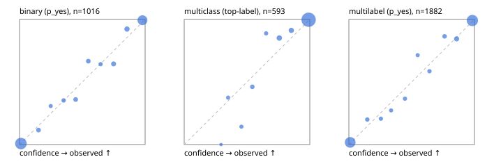

# Evaluation report

- model `Qwen/Qwen3-4B-Instruct-2507` @ `cdbee75f17` (shared-prefix tree (tree-v1)), adapter/checkpoint `runs/tree_4b_instruct_r2x64/adapter`, prompt `tree-v1` (c8963d819128)
- data data/eval2.jsonl; splits ['test']; n=1991; calibration `None`
- cuda / bfloat16; 2026-09-24T10:34:35+0000; wall 224.9s

## Overall

question accuracy 92.7%

**binary**: n 1016, positives 435, accuracy 0.946, precision 0.934, recall 0.940, f1 0.937, auroc 0.989, brier 0.039, log_loss 0.133, ece 0.019

**multiclass**: n 593, accuracy 0.954, macro_f1 0.923, log_loss 0.120, brier 0.061, ece_top_label 0.023

**multilabel**: n 382, labels 1882, exact_match 0.835, micro_f1 0.959, macro_f1 0.924, label_auroc 0.990, brier 0.036, log_loss 0.128, ece 0.016

## By family

| family | n | question acc % | details |
|---|---|---|---|
| e2_hard | 673 | 90.5 | bin acc 93.7 F1 91.3 AUROC 0.987 ECE 0.025; mc acc 94.3 mF1 89.9 ECE 0.027; ml EM 76.5 µF1 93.4 ECE 0.017 |
| e2_simple | 664 | 96.8 | bin acc 97.1 F1 97.3 AUROC 0.995 ECE 0.020; mc acc 99.0 mF1 97.8 ECE 0.018; ml EM 92.5 µF1 98.2 ECE 0.027 |
| e2_very_hard | 654 | 90.8 | bin acc 92.9 F1 90.5 AUROC 0.982 ECE 0.050; mc acc 93.0 mF1 88.9 ECE 0.027; ml EM 82.3 µF1 96.0 ECE 0.027 |

## by hard case

| slice | n | question acc % |
|---|---|---|
| (none) | 569 | 97.4 |
| contradiction | 172 | 95.3 |
| distractor | 474 | 91.1 |
| double_negation | 126 | 90.5 |
| evidence_end | 57 | 91.2 |
| evidence_middle | 114 | 97.4 |
| evidence_start | 17 | 100.0 |
| exception | 213 | 92.0 |
| hypothetical | 128 | 93.0 |
| injection | 151 | 88.7 |
| lexical_overlap | 201 | 94.5 |
| long_state | 191 | 92.7 |
| missing_evidence | 141 | 95.0 |
| multi_positive | 322 | 86.3 |
| multi_turn | 149 | 92.6 |
| negation | 257 | 94.9 |
| nota | 118 | 89.8 |
| numeric_reasoning | 224 | 82.1 |
| paraphrase | 218 | 88.1 |
| role_reversal | 187 | 91.4 |
| sarcasm | 149 | 86.6 |
| temporal_reasoning | 203 | 82.8 |
| zero_positive | 73 | 87.7 |
| zero_positive_distractor | 1 | 100.0 |

## by state tokens

| slice | n | question acc % |
|---|---|---|
| 00000-00127 | 662 | 91.2 |
| 00128-00511 | 477 | 90.1 |
| 00512-02047 | 484 | 95.0 |
| 02048-08191 | 329 | 95.4 |
| 08192+ | 39 | 97.4 |

## by candidates

| slice | n | question acc % |
|---|---|---|
| 01 | 1016 | 94.6 |
| 03 | 128 | 92.2 |
| 04 | 515 | 93.2 |
| 05 | 224 | 87.1 |
| 06 | 86 | 86.0 |
| 07 | 18 | 83.3 |
| 08 | 4 | 75.0 |

## Paraphrase groups

76 groups; same prediction 76.3%; all correct 81.6%

## Multiclass abstention (coverage vs error on accepted)

| abstain_below | coverage % | error % |
|---|---|---|
| 0.0 | 100.0 | 4.6 |
| 0.4 | 98.5 | 3.6 |
| 0.5 | 97.3 | 2.6 |
| 0.6 | 95.1 | 1.4 |
| 0.7 | 93.6 | 1.3 |
| 0.8 | 89.0 | 0.6 |
| 0.9 | 85.2 | 0.2 |

## Reliability: binary

| bin | n | mean confidence | observed frequency |
|---|---|---|---|
| [0.0,0.1) | 497 | 0.011 | 0.008 |
| [0.1,0.2) | 26 | 0.151 | 0.115 |
| [0.2,0.3) | 13 | 0.248 | 0.308 |
| [0.3,0.4) | 17 | 0.351 | 0.353 |
| [0.4,0.5) | 25 | 0.447 | 0.360 |
| [0.5,0.6) | 24 | 0.548 | 0.667 |
| [0.6,0.7) | 14 | 0.646 | 0.643 |
| [0.7,0.8) | 31 | 0.749 | 0.645 |
| [0.8,0.9) | 39 | 0.855 | 0.923 |
| [0.9,1.0] | 330 | 0.979 | 0.994 |

## Reliability: multiclass

| bin | n | mean confidence | observed frequency |
|---|---|---|---|
| [0.2,0.3) | 1 | 0.293 | 0.000 |
| [0.3,0.4) | 8 | 0.349 | 0.375 |
| [0.4,0.5) | 7 | 0.456 | 0.143 |
| [0.5,0.6) | 13 | 0.542 | 0.462 |
| [0.6,0.7) | 9 | 0.652 | 0.889 |
| [0.7,0.8) | 27 | 0.757 | 0.852 |
| [0.8,0.9) | 23 | 0.853 | 0.913 |
| [0.9,1.0] | 505 | 0.990 | 0.998 |

## Reliability: multilabel

| bin | n | mean confidence | observed frequency |
|---|---|---|---|
| [0.0,0.1) | 743 | 0.011 | 0.017 |
| [0.1,0.2) | 35 | 0.147 | 0.200 |
| [0.2,0.3) | 29 | 0.255 | 0.207 |
| [0.3,0.4) | 22 | 0.336 | 0.273 |
| [0.4,0.5) | 30 | 0.447 | 0.367 |
| [0.5,0.6) | 21 | 0.548 | 0.714 |
| [0.6,0.7) | 29 | 0.641 | 0.586 |
| [0.7,0.8) | 37 | 0.762 | 0.865 |
| [0.8,0.9) | 71 | 0.858 | 0.845 |
| [0.9,1.0] | 865 | 0.984 | 0.992 |
