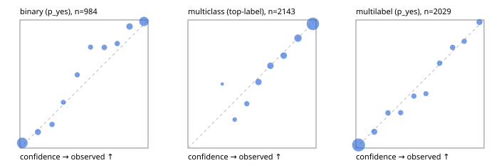

# Evaluation report

- model `Qwen/Qwen3-4B-Instruct-2507` @ `cdbee75f17` (shared-prefix tree (tree-v1)), adapter/checkpoint `runs/tree_4b_instruct_r2x64/adapter`, prompt `tree-v1` (c8963d819128)
- data data/hf.jsonl, data/eval.jsonl; splits ['test']; n=3471; calibration `None`
- cuda / bfloat16; 2026-09-24T10:30:42+0000; wall 180.1s

## Overall

question accuracy 82.7%

**binary**: n 984, positives 475, accuracy 0.909, precision 0.933, recall 0.874, f1 0.902, auroc 0.965, brier 0.072, log_loss 0.250, ece 0.045

**multiclass**: n 2143, accuracy 0.837, macro_f1 0.880, log_loss 0.450, brier 0.228, ece_top_label 0.016

**multilabel**: n 344, labels 2029, exact_match 0.529, micro_f1 0.753, macro_f1 0.788, label_auroc 0.944, brier 0.074, log_loss 0.241, ece 0.015

## By family

| family | n | question acc % | details |
|---|---|---|---|
| eval_adversarial | 27 | 96.3 | bin acc 93.3 F1 90.9 AUROC 0.981 ECE 0.060; mc acc 100.0 mF1 100.0 ECE 0.012; ml EM 100.0 µF1 100.0 ECE 0.035 |
| eval_agent_output | 26 | 53.8 | bin acc 78.6 F1 76.9 AUROC 0.837 ECE 0.149; mc acc 28.6 mF1 21.4 ECE 0.534; ml EM 20.0 µF1 66.7 ECE 0.248 |
| eval_evidence | 17 | 94.1 | bin acc 100.0 F1 100.0 AUROC 1.000 ECE 0.017; ml EM 50.0 µF1 40.0 ECE 0.212 |
| eval_multilabel | 32 | 93.8 | bin acc 100.0 F1 100.0 AUROC 1.000 ECE 0.041; mc acc 100.0 mF1 100.0 ECE 0.261; ml EM 91.7 µF1 97.0 ECE 0.027 |
| eval_policy | 22 | 63.6 | bin acc 69.2 F1 71.4 AUROC 0.810 ECE 0.138; mc acc 40.0 mF1 25.0 ECE 0.470; ml EM 75.0 µF1 94.1 ECE 0.140 |
| eval_routing | 25 | 80.0 | bin acc 90.0 F1 88.9 AUROC 0.958 ECE 0.096; mc acc 76.9 mF1 66.7 ECE 0.102; ml EM 50.0 µF1 80.0 ECE 0.084 |
| eval_urgency_sentiment | 22 | 90.9 | bin acc 90.0 F1 92.3 AUROC 1.000 ECE 0.083; mc acc 90.0 mF1 82.9 ECE 0.124; ml EM 100.0 µF1 100.0 ECE 0.006 |
| heldout_boolq | 300 | 88.3 | bin acc 88.3 F1 89.8 AUROC 0.947 ECE 0.073 |
| heldout_emotion_multiclass | 300 | 54.7 | mc acc 54.7 mF1 45.4 ECE 0.162 |
| heldout_intent_clinc | 300 | 94.7 | mc acc 94.7 mF1 95.4 ECE 0.049 |
| heldout_question_type_trec | 300 | 93.3 | mc acc 93.3 mF1 92.7 ECE 0.095 |
| heldout_sentiment_sst2 | 300 | 90.0 | bin acc 90.0 F1 89.4 AUROC 0.976 ECE 0.090 |
| heldout_topic_dbpedia | 300 | 95.7 | mc acc 95.7 mF1 95.4 ECE 0.018 |
| hf_emotions_multilabel | 300 | 49.0 | ml EM 49.0 µF1 71.1 ECE 0.018 |
| hf_intent_banking77 | 300 | 95.3 | mc acc 95.3 mF1 94.4 ECE 0.019 |
| hf_nli | 300 | 95.0 | bin acc 95.0 F1 93.2 AUROC 0.986 ECE 0.036 |
| hf_sentiment_tweets | 300 | 64.7 | mc acc 64.7 mF1 64.8 ECE 0.050 |
| hf_topic_agnews | 300 | 89.3 | mc acc 89.3 mF1 89.4 ECE 0.040 |

## by hard case

| slice | n | question acc % |
|---|---|---|
| (none) | 3042 | 82.5 |
| contradiction | 107 | 100.0 |
| distractor | 33 | 63.6 |
| double_negation | 6 | 83.3 |
| evidence_end | 13 | 84.6 |
| evidence_middle | 11 | 72.7 |
| evidence_start | 9 | 100.0 |
| exception | 7 | 28.6 |
| hypothetical | 7 | 100.0 |
| injection | 10 | 90.0 |
| lexical_overlap | 20 | 95.0 |
| long_state | 50 | 78.0 |
| missing_evidence | 104 | 91.3 |
| multi_positive | 81 | 49.4 |
| multi_turn | 9 | 88.9 |
| negation | 30 | 96.7 |
| new_label_names | 3 | 33.3 |
| nota | 46 | 97.8 |
| numeric_reasoning | 16 | 68.8 |
| paraphrase | 22 | 81.8 |
| role_reversal | 15 | 93.3 |
| sarcasm | 12 | 100.0 |
| temporal_reasoning | 29 | 58.6 |
| zero_positive | 6 | 83.3 |

## by state tokens

| slice | n | question acc % |
|---|---|---|
| 00000-00127 | 3211 | 82.6 |
| 00128-00511 | 208 | 85.6 |
| 00512-02047 | 52 | 78.8 |

## by candidates

| slice | n | question acc % |
|---|---|---|
| 01 | 984 | 90.9 |
| 03 | 310 | 65.2 |
| 04 | 333 | 88.3 |
| 05 | 22 | 72.7 |
| 06 | 1218 | 73.2 |
| 07 | 49 | 95.9 |
| 08 | 555 | 94.8 |

## Paraphrase groups

11 groups; same prediction 81.8%; all correct 81.8%

## Multiclass abstention (coverage vs error on accepted)

| abstain_below | coverage % | error % |
|---|---|---|
| 0.0 | 100.0 | 16.3 |
| 0.4 | 98.1 | 15.2 |
| 0.5 | 94.5 | 13.2 |
| 0.6 | 86.9 | 10.2 |
| 0.7 | 78.7 | 7.5 |
| 0.8 | 70.5 | 5.1 |
| 0.9 | 57.7 | 3.1 |

## Reliability: binary

| bin | n | mean confidence | observed frequency |
|---|---|---|---|
| [0.0,0.1) | 374 | 0.019 | 0.040 |
| [0.1,0.2) | 64 | 0.140 | 0.125 |
| [0.2,0.3) | 38 | 0.250 | 0.184 |
| [0.3,0.4) | 28 | 0.339 | 0.357 |
| [0.4,0.5) | 35 | 0.447 | 0.571 |
| [0.5,0.6) | 33 | 0.551 | 0.788 |
| [0.6,0.7) | 42 | 0.658 | 0.786 |
| [0.7,0.8) | 38 | 0.759 | 0.816 |
| [0.8,0.9) | 78 | 0.856 | 0.949 |
| [0.9,1.0] | 254 | 0.968 | 0.988 |

## Reliability: multiclass

| bin | n | mean confidence | observed frequency |
|---|---|---|---|
| [0.2,0.3) | 4 | 0.268 | 0.500 |
| [0.3,0.4) | 36 | 0.365 | 0.222 |
| [0.4,0.5) | 78 | 0.459 | 0.346 |
| [0.5,0.6) | 163 | 0.551 | 0.515 |
| [0.6,0.7) | 176 | 0.644 | 0.642 |
| [0.7,0.8) | 176 | 0.748 | 0.722 |
| [0.8,0.9) | 274 | 0.859 | 0.858 |
| [0.9,1.0] | 1236 | 0.975 | 0.969 |

## Reliability: multilabel

| bin | n | mean confidence | observed frequency |
|---|---|---|---|
| [0.0,0.1) | 1266 | 0.021 | 0.024 |
| [0.1,0.2) | 118 | 0.143 | 0.127 |
| [0.2,0.3) | 80 | 0.250 | 0.275 |
| [0.3,0.4) | 76 | 0.349 | 0.276 |
| [0.4,0.5) | 69 | 0.452 | 0.406 |
| [0.5,0.6) | 66 | 0.546 | 0.424 |
| [0.6,0.7) | 77 | 0.653 | 0.662 |
| [0.7,0.8) | 84 | 0.755 | 0.786 |
| [0.8,0.9) | 72 | 0.845 | 0.833 |
| [0.9,1.0] | 121 | 0.964 | 0.983 |
