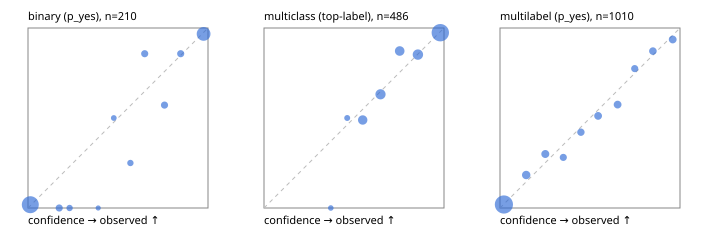

# Evaluation report

- model `Qwen/Qwen3-4B-Instruct-2507` @ `cdbee75f17` (shared-prefix tree (tree-v1)), adapter/checkpoint `runs/tree_4b_instruct_r2x64/adapter`, prompt `tree-v1` (c8963d819128)
- data data/hf.jsonl, data/eval.jsonl; splits ['validation']; n=868; calibration `None`
- cuda / bfloat16; 2026-09-24T10:27:33+0000; wall 45.7s

## Overall

question accuracy 80.1%

**binary**: n 210, positives 79, accuracy 0.938, precision 0.884, recall 0.962, f1 0.921, auroc 0.984, brier 0.048, log_loss 0.162, ece 0.037

**multiclass**: n 486, accuracy 0.850, macro_f1 0.824, log_loss 0.387, brier 0.209, ece_top_label 0.026

**multilabel**: n 172, labels 1010, exact_match 0.494, micro_f1 0.717, macro_f1 0.647, label_auroc 0.933, brier 0.082, log_loss 0.262, ece 0.017

## By family

| family | n | question acc % | details |
|---|---|---|---|
| eval_adversarial | 14 | 100.0 | bin acc 100.0 F1 100.0 AUROC 1.000 ECE 0.041; mc acc 100.0 mF1 100.0 ECE 0.032; ml EM 100.0 µF1 100.0 ECE 0.008 |
| eval_agent_output | 20 | 75.0 | bin acc 83.3 F1 85.7 AUROC 0.972 ECE 0.147; mc acc 60.0 mF1 33.3 ECE 0.401; ml EM 66.7 µF1 0.0 ECE 0.111 |
| eval_evidence | 17 | 100.0 | bin acc 100.0 F1 100.0 AUROC 1.000 ECE 0.019; ml EM 100.0 µF1 100.0 ECE 0.029 |
| eval_multilabel | 12 | 66.7 | bin acc 0.0 F1 0.0 AUROC — ECE 0.957; mc acc 100.0 mF1 100.0 ECE 0.047; ml EM 66.7 µF1 93.6 ECE 0.074 |
| eval_policy | 24 | 70.8 | bin acc 91.7 F1 93.3 AUROC 0.943 ECE 0.166; mc acc 54.5 mF1 37.5 ECE 0.299; ml EM 0.0 µF1 40.0 ECE 0.626 |
| eval_routing | 16 | 93.8 | bin acc 100.0 F1 100.0 AUROC 1.000 ECE 0.015; mc acc 100.0 mF1 100.0 ECE 0.023; ml EM 0.0 µF1 0.0 ECE 0.240 |
| eval_urgency_sentiment | 15 | 100.0 | bin acc 100.0 F1 100.0 AUROC 1.000 ECE 0.049; mc acc 100.0 mF1 100.0 ECE 0.029; ml EM 100.0 µF1 100.0 ECE 0.045 |
| hf_emotions_multilabel | 150 | 46.0 | ml EM 46.0 µF1 68.6 ECE 0.017 |
| hf_intent_banking77 | 150 | 94.7 | mc acc 94.7 mF1 94.7 ECE 0.031 |
| hf_nli | 150 | 94.0 | bin acc 94.0 F1 90.7 AUROC 0.984 ECE 0.061 |
| hf_sentiment_tweets | 150 | 72.7 | mc acc 72.7 mF1 69.2 ECE 0.049 |
| hf_topic_agnews | 150 | 88.7 | mc acc 88.7 mF1 88.9 ECE 0.044 |

## by hard case

| slice | n | question acc % |
|---|---|---|
| (none) | 634 | 79.3 |
| contradiction | 63 | 95.2 |
| distractor | 20 | 90.0 |
| double_negation | 3 | 100.0 |
| evidence_end | 4 | 75.0 |
| evidence_middle | 7 | 100.0 |
| evidence_start | 3 | 66.7 |
| exception | 7 | 100.0 |
| hypothetical | 6 | 100.0 |
| injection | 16 | 93.8 |
| lexical_overlap | 13 | 84.6 |
| long_state | 26 | 80.8 |
| missing_evidence | 59 | 91.5 |
| multi_positive | 40 | 32.5 |
| multi_turn | 21 | 85.7 |
| negation | 9 | 66.7 |
| new_label_names | 5 | 80.0 |
| nota | 4 | 100.0 |
| numeric_reasoning | 13 | 84.6 |
| paraphrase | 10 | 80.0 |
| role_reversal | 7 | 85.7 |
| sarcasm | 5 | 100.0 |
| temporal_reasoning | 15 | 73.3 |
| zero_positive | 7 | 71.4 |

## by state tokens

| slice | n | question acc % |
|---|---|---|
| 00000-00127 | 796 | 79.5 |
| 00128-00511 | 46 | 89.1 |
| 00512-02047 | 26 | 80.8 |

## by candidates

| slice | n | question acc % |
|---|---|---|
| 01 | 210 | 93.8 |
| 03 | 162 | 74.1 |
| 04 | 174 | 87.4 |
| 05 | 13 | 61.5 |
| 06 | 159 | 47.8 |
| 08 | 150 | 94.7 |

## Paraphrase groups

5 groups; same prediction 60.0%; all correct 80.0%

## Multiclass abstention (coverage vs error on accepted)

| abstain_below | coverage % | error % |
|---|---|---|
| 0.0 | 100.0 | 15.0 |
| 0.4 | 99.2 | 14.3 |
| 0.5 | 97.9 | 13.9 |
| 0.6 | 88.7 | 10.0 |
| 0.7 | 77.0 | 5.9 |
| 0.8 | 67.3 | 4.9 |
| 0.9 | 54.7 | 2.6 |

## Reliability: binary

| bin | n | mean confidence | observed frequency |
|---|---|---|---|
| [0.0,0.1) | 110 | 0.013 | 0.018 |
| [0.1,0.2) | 7 | 0.174 | 0.000 |
| [0.2,0.3) | 4 | 0.231 | 0.000 |
| [0.3,0.4) | 1 | 0.390 | 0.000 |
| [0.4,0.5) | 2 | 0.476 | 0.500 |
| [0.5,0.6) | 4 | 0.569 | 0.250 |
| [0.6,0.7) | 7 | 0.648 | 0.857 |
| [0.7,0.8) | 7 | 0.758 | 0.571 |
| [0.8,0.9) | 7 | 0.848 | 0.857 |
| [0.9,1.0] | 61 | 0.975 | 0.967 |

## Reliability: multiclass

| bin | n | mean confidence | observed frequency |
|---|---|---|---|
| [0.3,0.4) | 4 | 0.371 | 0.000 |
| [0.4,0.5) | 6 | 0.462 | 0.500 |
| [0.5,0.6) | 45 | 0.549 | 0.489 |
| [0.6,0.7) | 57 | 0.647 | 0.632 |
| [0.7,0.8) | 47 | 0.754 | 0.872 |
| [0.8,0.9) | 61 | 0.855 | 0.852 |
| [0.9,1.0] | 266 | 0.980 | 0.974 |

## Reliability: multilabel

| bin | n | mean confidence | observed frequency |
|---|---|---|---|
| [0.0,0.1) | 623 | 0.022 | 0.019 |
| [0.1,0.2) | 60 | 0.146 | 0.183 |
| [0.2,0.3) | 50 | 0.252 | 0.300 |
| [0.3,0.4) | 32 | 0.351 | 0.281 |
| [0.4,0.5) | 38 | 0.450 | 0.421 |
| [0.5,0.6) | 43 | 0.545 | 0.512 |
| [0.6,0.7) | 47 | 0.653 | 0.574 |
| [0.7,0.8) | 31 | 0.748 | 0.774 |
| [0.8,0.9) | 39 | 0.849 | 0.872 |
| [0.9,1.0] | 47 | 0.959 | 0.936 |
