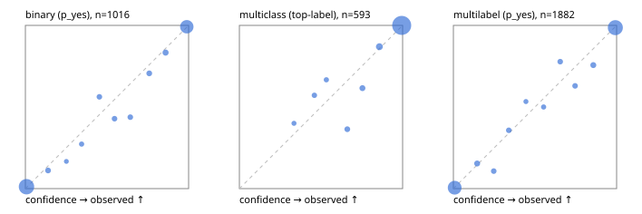

# Evaluation report

- model `Qwen/Qwen3-4B-Instruct-2507` @ `cdbee75f17` (shared-prefix tree (tree-v1)), adapter/checkpoint `runs/tree_4b_instruct_r3/adapter`, prompt `tree-v1` (c8963d819128)
- data data/eval2.jsonl; splits ['test']; n=1991; calibration `None`
- cuda / bfloat16; 2026-09-24T22:31:15+0000; wall 92.0s

## Overall

question accuracy 93.3%

**binary**: n 1016, positives 435, accuracy 0.951, precision 0.935, recall 0.952, f1 0.943, auroc 0.992, brier 0.032, log_loss 0.110, ece 0.013

**multiclass**: n 593, accuracy 0.961, macro_f1 0.928, log_loss 0.097, brier 0.053, ece_top_label 0.017

**multilabel**: n 382, labels 1882, exact_match 0.843, micro_f1 0.962, macro_f1 0.930, label_auroc 0.993, brier 0.031, log_loss 0.109, ece 0.013

## By family

| family | n | question acc % | details |
|---|---|---|---|
| e2_hard | 673 | 92.3 | bin acc 94.3 F1 92.1 AUROC 0.986 ECE 0.023; mc acc 95.9 mF1 91.7 ECE 0.028; ml EM 81.8 µF1 94.3 ECE 0.030 |
| e2_simple | 664 | 96.8 | bin acc 97.4 F1 97.6 AUROC 0.997 ECE 0.012; mc acc 98.5 mF1 96.8 ECE 0.020; ml EM 92.5 µF1 98.5 ECE 0.013 |
| e2_very_hard | 654 | 90.8 | bin acc 93.5 F1 91.6 AUROC 0.990 ECE 0.019; mc acc 94.0 mF1 90.0 ECE 0.019; ml EM 79.2 µF1 95.6 ECE 0.014 |

## by hard case

| slice | n | question acc % |
|---|---|---|
| (none) | 569 | 97.5 |
| contradiction | 172 | 94.8 |
| distractor | 474 | 91.1 |
| double_negation | 126 | 94.4 |
| evidence_end | 57 | 93.0 |
| evidence_middle | 114 | 96.5 |
| evidence_start | 17 | 100.0 |
| exception | 213 | 90.6 |
| hypothetical | 128 | 93.8 |
| injection | 151 | 92.1 |
| lexical_overlap | 201 | 97.0 |
| long_state | 191 | 94.8 |
| missing_evidence | 141 | 97.9 |
| multi_positive | 322 | 84.8 |
| multi_turn | 149 | 90.6 |
| negation | 257 | 96.5 |
| nota | 118 | 92.4 |
| numeric_reasoning | 224 | 80.4 |
| paraphrase | 218 | 89.9 |
| role_reversal | 187 | 95.2 |
| sarcasm | 149 | 91.9 |
| temporal_reasoning | 203 | 81.8 |
| zero_positive | 73 | 87.7 |
| zero_positive_distractor | 1 | 100.0 |

## by state tokens

| slice | n | question acc % |
|---|---|---|
| 00000-00127 | 662 | 91.7 |
| 00128-00511 | 477 | 90.8 |
| 00512-02047 | 484 | 96.1 |
| 02048-08191 | 329 | 95.7 |
| 08192+ | 39 | 97.4 |

## by candidates

| slice | n | question acc % |
|---|---|---|
| 01 | 1016 | 95.1 |
| 03 | 128 | 93.8 |
| 04 | 515 | 94.0 |
| 05 | 224 | 87.1 |
| 06 | 86 | 84.9 |
| 07 | 18 | 94.4 |
| 08 | 4 | 75.0 |

## Paraphrase groups

76 groups; same prediction 75.0%; all correct 80.3%

## Multiclass abstention (coverage vs error on accepted)

| abstain_below | coverage % | error % |
|---|---|---|
| 0.0 | 100.0 | 3.9 |
| 0.4 | 99.2 | 3.4 |
| 0.5 | 98.0 | 2.9 |
| 0.6 | 97.0 | 2.6 |
| 0.7 | 95.1 | 1.4 |
| 0.8 | 92.9 | 0.5 |
| 0.9 | 89.0 | 0.0 |

## Reliability: binary

| bin | n | mean confidence | observed frequency |
|---|---|---|---|
| [0.0,0.1) | 522 | 0.006 | 0.011 |
| [0.1,0.2) | 18 | 0.139 | 0.111 |
| [0.2,0.3) | 6 | 0.251 | 0.167 |
| [0.3,0.4) | 11 | 0.344 | 0.273 |
| [0.4,0.5) | 16 | 0.453 | 0.562 |
| [0.5,0.6) | 14 | 0.546 | 0.429 |
| [0.6,0.7) | 16 | 0.643 | 0.438 |
| [0.7,0.8) | 17 | 0.759 | 0.706 |
| [0.8,0.9) | 24 | 0.859 | 0.833 |
| [0.9,1.0] | 372 | 0.989 | 0.992 |

## Reliability: multiclass

| bin | n | mean confidence | observed frequency |
|---|---|---|---|
| [0.3,0.4) | 5 | 0.334 | 0.400 |
| [0.4,0.5) | 7 | 0.459 | 0.571 |
| [0.5,0.6) | 6 | 0.533 | 0.667 |
| [0.6,0.7) | 11 | 0.661 | 0.364 |
| [0.7,0.8) | 13 | 0.754 | 0.615 |
| [0.8,0.9) | 23 | 0.858 | 0.870 |
| [0.9,1.0] | 528 | 0.994 | 1.000 |

## Reliability: multilabel

| bin | n | mean confidence | observed frequency |
|---|---|---|---|
| [0.0,0.1) | 730 | 0.008 | 0.005 |
| [0.1,0.2) | 39 | 0.146 | 0.154 |
| [0.2,0.3) | 28 | 0.247 | 0.107 |
| [0.3,0.4) | 28 | 0.340 | 0.357 |
| [0.4,0.5) | 15 | 0.445 | 0.533 |
| [0.5,0.6) | 20 | 0.553 | 0.500 |
| [0.6,0.7) | 27 | 0.655 | 0.778 |
| [0.7,0.8) | 27 | 0.746 | 0.630 |
| [0.8,0.9) | 37 | 0.857 | 0.757 |
| [0.9,1.0] | 931 | 0.992 | 0.986 |
