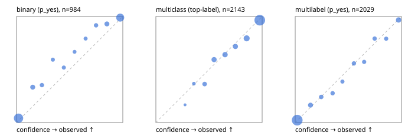

# Evaluation report

- model `Qwen/Qwen3-4B-Instruct-2507` @ `cdbee75f17` (shared-prefix tree (tree-v1)), adapter/checkpoint `runs/tree_4b_instruct_r3/adapter`, prompt `tree-v1` (c8963d819128)
- data data/hf.jsonl, data/eval.jsonl; splits ['test']; n=3471; calibration `None`
- cuda / bfloat16; 2026-09-24T22:29:36+0000; wall 73.9s

## Overall

question accuracy 82.8%

**binary**: n 984, positives 475, accuracy 0.898, precision 0.947, recall 0.836, f1 0.888, auroc 0.966, brier 0.075, log_loss 0.256, ece 0.053

**multiclass**: n 2143, accuracy 0.839, macro_f1 0.897, log_loss 0.460, brier 0.234, ece_top_label 0.026

**multilabel**: n 344, labels 2029, exact_match 0.561, micro_f1 0.765, macro_f1 0.792, label_auroc 0.946, brier 0.073, log_loss 0.239, ece 0.014

## By family

| family | n | question acc % | details |
|---|---|---|---|
| eval_adversarial | 27 | 96.3 | bin acc 93.3 F1 90.9 AUROC 0.981 ECE 0.058; mc acc 100.0 mF1 100.0 ECE 0.004; ml EM 100.0 µF1 100.0 ECE 0.012 |
| eval_agent_output | 26 | 53.8 | bin acc 78.6 F1 76.9 AUROC 0.898 ECE 0.135; mc acc 28.6 mF1 21.4 ECE 0.481; ml EM 20.0 µF1 66.7 ECE 0.276 |
| eval_evidence | 17 | 94.1 | bin acc 100.0 F1 100.0 AUROC 1.000 ECE 0.028; ml EM 50.0 µF1 57.1 ECE 0.216 |
| eval_multilabel | 32 | 93.8 | bin acc 100.0 F1 100.0 AUROC 1.000 ECE 0.044; mc acc 100.0 mF1 100.0 ECE 0.015; ml EM 91.7 µF1 97.0 ECE 0.019 |
| eval_policy | 22 | 68.2 | bin acc 84.6 F1 83.3 AUROC 0.833 ECE 0.193; mc acc 60.0 mF1 42.9 ECE 0.396; ml EM 25.0 µF1 84.2 ECE 0.203 |
| eval_routing | 25 | 96.0 | bin acc 90.0 F1 88.9 AUROC 0.958 ECE 0.108; mc acc 100.0 mF1 100.0 ECE 0.108; ml EM 100.0 µF1 100.0 ECE 0.074 |
| eval_urgency_sentiment | 22 | 95.5 | bin acc 90.0 F1 92.3 AUROC 0.958 ECE 0.115; mc acc 100.0 mF1 100.0 ECE 0.036; ml EM 100.0 µF1 100.0 ECE 0.004 |
| heldout_boolq | 300 | 85.0 | bin acc 85.0 F1 86.4 AUROC 0.943 ECE 0.085 |
| heldout_emotion_multiclass | 300 | 55.3 | mc acc 55.3 mF1 44.9 ECE 0.164 |
| heldout_intent_clinc | 300 | 93.7 | mc acc 93.7 mF1 94.4 ECE 0.039 |
| heldout_question_type_trec | 300 | 92.0 | mc acc 92.0 mF1 91.6 ECE 0.095 |
| heldout_sentiment_sst2 | 300 | 90.0 | bin acc 90.0 F1 89.3 AUROC 0.972 ECE 0.074 |
| heldout_topic_dbpedia | 300 | 94.7 | mc acc 94.7 mF1 94.3 ECE 0.031 |
| hf_emotions_multilabel | 300 | 53.0 | ml EM 53.0 µF1 72.5 ECE 0.018 |
| hf_intent_banking77 | 300 | 94.3 | mc acc 94.3 mF1 93.2 ECE 0.015 |
| hf_nli | 300 | 94.3 | bin acc 94.3 F1 91.9 AUROC 0.988 ECE 0.033 |
| hf_sentiment_tweets | 300 | 66.7 | mc acc 66.7 mF1 67.5 ECE 0.078 |
| hf_topic_agnews | 300 | 90.7 | mc acc 90.7 mF1 90.7 ECE 0.041 |

## by hard case

| slice | n | question acc % |
|---|---|---|
| (none) | 3042 | 82.2 |
| contradiction | 107 | 100.0 |
| distractor | 33 | 75.8 |
| double_negation | 6 | 100.0 |
| evidence_end | 13 | 100.0 |
| evidence_middle | 11 | 90.9 |
| evidence_start | 9 | 88.9 |
| exception | 7 | 71.4 |
| hypothetical | 7 | 100.0 |
| injection | 10 | 90.0 |
| lexical_overlap | 20 | 90.0 |
| long_state | 50 | 90.0 |
| missing_evidence | 104 | 95.2 |
| multi_positive | 81 | 50.6 |
| multi_turn | 9 | 100.0 |
| negation | 30 | 96.7 |
| new_label_names | 3 | 33.3 |
| nota | 46 | 100.0 |
| numeric_reasoning | 16 | 81.2 |
| paraphrase | 22 | 81.8 |
| role_reversal | 15 | 93.3 |
| sarcasm | 12 | 100.0 |
| temporal_reasoning | 29 | 75.9 |
| zero_positive | 6 | 100.0 |

## by state tokens

| slice | n | question acc % |
|---|---|---|
| 00000-00127 | 3211 | 82.7 |
| 00128-00511 | 208 | 82.7 |
| 00512-02047 | 52 | 90.4 |

## by candidates

| slice | n | question acc % |
|---|---|---|
| 01 | 984 | 89.8 |
| 03 | 310 | 67.7 |
| 04 | 333 | 89.2 |
| 05 | 22 | 72.7 |
| 06 | 1218 | 73.9 |
| 07 | 49 | 100.0 |
| 08 | 555 | 93.5 |

## Paraphrase groups

11 groups; same prediction 81.8%; all correct 81.8%

## Multiclass abstention (coverage vs error on accepted)

| abstain_below | coverage % | error % |
|---|---|---|
| 0.0 | 100.0 | 16.1 |
| 0.4 | 98.3 | 15.2 |
| 0.5 | 94.1 | 13.0 |
| 0.6 | 86.8 | 10.7 |
| 0.7 | 79.3 | 8.4 |
| 0.8 | 72.2 | 6.4 |
| 0.9 | 60.0 | 3.5 |

## Reliability: binary

| bin | n | mean confidence | observed frequency |
|---|---|---|---|
| [0.0,0.1) | 420 | 0.019 | 0.040 |
| [0.1,0.2) | 57 | 0.152 | 0.333 |
| [0.2,0.3) | 34 | 0.239 | 0.353 |
| [0.3,0.4) | 27 | 0.342 | 0.593 |
| [0.4,0.5) | 27 | 0.445 | 0.519 |
| [0.5,0.6) | 21 | 0.546 | 0.667 |
| [0.6,0.7) | 24 | 0.650 | 0.792 |
| [0.7,0.8) | 36 | 0.748 | 0.917 |
| [0.8,0.9) | 57 | 0.851 | 0.930 |
| [0.9,1.0] | 281 | 0.975 | 0.989 |

## Reliability: multiclass

| bin | n | mean confidence | observed frequency |
|---|---|---|---|
| [0.2,0.3) | 6 | 0.275 | 0.167 |
| [0.3,0.4) | 30 | 0.358 | 0.367 |
| [0.4,0.5) | 91 | 0.459 | 0.363 |
| [0.5,0.6) | 155 | 0.548 | 0.594 |
| [0.6,0.7) | 161 | 0.651 | 0.640 |
| [0.7,0.8) | 152 | 0.748 | 0.717 |
| [0.8,0.9) | 262 | 0.855 | 0.794 |
| [0.9,1.0] | 1286 | 0.978 | 0.965 |

## Reliability: multilabel

| bin | n | mean confidence | observed frequency |
|---|---|---|---|
| [0.0,0.1) | 1271 | 0.019 | 0.022 |
| [0.1,0.2) | 122 | 0.144 | 0.164 |
| [0.2,0.3) | 83 | 0.245 | 0.241 |
| [0.3,0.4) | 76 | 0.352 | 0.276 |
| [0.4,0.5) | 57 | 0.444 | 0.386 |
| [0.5,0.6) | 70 | 0.552 | 0.557 |
| [0.6,0.7) | 63 | 0.649 | 0.571 |
| [0.7,0.8) | 72 | 0.748 | 0.792 |
| [0.8,0.9) | 62 | 0.856 | 0.790 |
| [0.9,1.0] | 153 | 0.973 | 0.967 |
