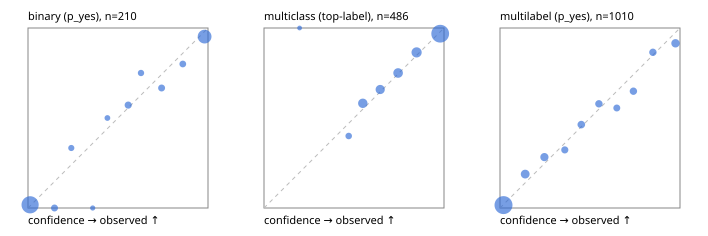

# Evaluation report

- model `Qwen/Qwen3-4B-Instruct-2507` @ `cdbee75f17` (shared-prefix tree (tree-v1)), adapter/checkpoint `runs/tree_4b_instruct_r3/adapter`, prompt `tree-v1` (c8963d819128)
- data data/hf.jsonl, data/eval.jsonl; splits ['validation']; n=868; calibration `None`
- cuda / bfloat16; 2026-09-24T22:28:15+0000; wall 19.2s

## Overall

question accuracy 80.5%

**binary**: n 210, positives 79, accuracy 0.933, precision 0.882, recall 0.949, f1 0.915, auroc 0.979, brier 0.053, log_loss 0.183, ece 0.026

**multiclass**: n 486, accuracy 0.862, macro_f1 0.826, log_loss 0.400, brier 0.207, ece_top_label 0.016

**multilabel**: n 172, labels 1010, exact_match 0.488, micro_f1 0.714, macro_f1 0.680, label_auroc 0.935, brier 0.081, log_loss 0.259, ece 0.020

## By family

| family | n | question acc % | details |
|---|---|---|---|
| eval_adversarial | 14 | 100.0 | bin acc 100.0 F1 100.0 AUROC 1.000 ECE 0.018; mc acc 100.0 mF1 100.0 ECE 0.006; ml EM 100.0 µF1 100.0 ECE 0.003 |
| eval_agent_output | 20 | 75.0 | bin acc 83.3 F1 85.7 AUROC 0.944 ECE 0.174; mc acc 60.0 mF1 33.3 ECE 0.243; ml EM 66.7 µF1 0.0 ECE 0.192 |
| eval_evidence | 17 | 100.0 | bin acc 100.0 F1 100.0 AUROC 1.000 ECE 0.014; ml EM 100.0 µF1 100.0 ECE 0.026 |
| eval_multilabel | 12 | 83.3 | bin acc 0.0 F1 0.0 AUROC — ECE 0.980; mc acc 100.0 mF1 100.0 ECE 0.002; ml EM 88.9 µF1 97.8 ECE 0.049 |
| eval_policy | 24 | 62.5 | bin acc 75.0 F1 80.0 AUROC 0.829 ECE 0.192; mc acc 54.5 mF1 37.5 ECE 0.287; ml EM 0.0 µF1 50.0 ECE 0.359 |
| eval_routing | 16 | 93.8 | bin acc 100.0 F1 100.0 AUROC 1.000 ECE 0.007; mc acc 100.0 mF1 100.0 ECE 0.011; ml EM 0.0 µF1 0.0 ECE 0.198 |
| eval_urgency_sentiment | 15 | 100.0 | bin acc 100.0 F1 100.0 AUROC 1.000 ECE 0.019; mc acc 100.0 mF1 100.0 ECE 0.002; ml EM 100.0 µF1 100.0 ECE 0.009 |
| hf_emotions_multilabel | 150 | 44.0 | ml EM 44.0 µF1 67.6 ECE 0.021 |
| hf_intent_banking77 | 150 | 95.3 | mc acc 95.3 mF1 94.7 ECE 0.039 |
| hf_nli | 150 | 94.7 | bin acc 94.7 F1 91.7 AUROC 0.982 ECE 0.025 |
| hf_sentiment_tweets | 150 | 76.0 | mc acc 76.0 mF1 71.0 ECE 0.039 |
| hf_topic_agnews | 150 | 88.7 | mc acc 88.7 mF1 88.9 ECE 0.065 |

## by hard case

| slice | n | question acc % |
|---|---|---|
| (none) | 634 | 79.7 |
| contradiction | 63 | 96.8 |
| distractor | 20 | 90.0 |
| double_negation | 3 | 100.0 |
| evidence_end | 4 | 50.0 |
| evidence_middle | 7 | 100.0 |
| evidence_start | 3 | 66.7 |
| exception | 7 | 100.0 |
| hypothetical | 6 | 100.0 |
| injection | 16 | 93.8 |
| lexical_overlap | 13 | 92.3 |
| long_state | 26 | 76.9 |
| missing_evidence | 59 | 93.2 |
| multi_positive | 40 | 37.5 |
| multi_turn | 21 | 85.7 |
| negation | 9 | 77.8 |
| new_label_names | 5 | 80.0 |
| nota | 4 | 100.0 |
| numeric_reasoning | 13 | 84.6 |
| paraphrase | 10 | 90.0 |
| role_reversal | 7 | 85.7 |
| sarcasm | 5 | 100.0 |
| temporal_reasoning | 15 | 66.7 |
| zero_positive | 7 | 85.7 |

## by state tokens

| slice | n | question acc % |
|---|---|---|
| 00000-00127 | 796 | 80.2 |
| 00128-00511 | 46 | 89.1 |
| 00512-02047 | 26 | 76.9 |

## by candidates

| slice | n | question acc % |
|---|---|---|
| 01 | 210 | 93.3 |
| 03 | 162 | 77.2 |
| 04 | 174 | 87.4 |
| 05 | 13 | 69.2 |
| 06 | 159 | 46.5 |
| 08 | 150 | 95.3 |

## Paraphrase groups

5 groups; same prediction 60.0%; all correct 80.0%

## Multiclass abstention (coverage vs error on accepted)

| abstain_below | coverage % | error % |
|---|---|---|
| 0.0 | 100.0 | 13.8 |
| 0.4 | 99.8 | 13.8 |
| 0.5 | 97.7 | 12.8 |
| 0.6 | 88.9 | 10.0 |
| 0.7 | 80.5 | 7.4 |
| 0.8 | 70.6 | 5.0 |
| 0.9 | 58.4 | 3.2 |

## Reliability: binary

| bin | n | mean confidence | observed frequency |
|---|---|---|---|
| [0.0,0.1) | 113 | 0.012 | 0.018 |
| [0.1,0.2) | 6 | 0.147 | 0.000 |
| [0.2,0.3) | 3 | 0.240 | 0.333 |
| [0.3,0.4) | 1 | 0.359 | 0.000 |
| [0.4,0.5) | 2 | 0.441 | 0.500 |
| [0.5,0.6) | 7 | 0.556 | 0.571 |
| [0.6,0.7) | 4 | 0.628 | 0.750 |
| [0.7,0.8) | 6 | 0.742 | 0.667 |
| [0.8,0.9) | 5 | 0.860 | 0.800 |
| [0.9,1.0] | 63 | 0.981 | 0.952 |

## Reliability: multiclass

| bin | n | mean confidence | observed frequency |
|---|---|---|---|
| [0.1,0.2) | 1 | 0.198 | 1.000 |
| [0.4,0.5) | 10 | 0.470 | 0.400 |
| [0.5,0.6) | 43 | 0.549 | 0.581 |
| [0.6,0.7) | 41 | 0.646 | 0.659 |
| [0.7,0.8) | 48 | 0.745 | 0.750 |
| [0.8,0.9) | 59 | 0.848 | 0.864 |
| [0.9,1.0] | 284 | 0.979 | 0.968 |

## Reliability: multilabel

| bin | n | mean confidence | observed frequency |
|---|---|---|---|
| [0.0,0.1) | 618 | 0.019 | 0.016 |
| [0.1,0.2) | 69 | 0.140 | 0.188 |
| [0.2,0.3) | 53 | 0.246 | 0.283 |
| [0.3,0.4) | 31 | 0.360 | 0.323 |
| [0.4,0.5) | 41 | 0.452 | 0.463 |
| [0.5,0.6) | 38 | 0.549 | 0.579 |
| [0.6,0.7) | 27 | 0.649 | 0.556 |
| [0.7,0.8) | 37 | 0.741 | 0.649 |
| [0.8,0.9) | 37 | 0.849 | 0.865 |
| [0.9,1.0] | 59 | 0.975 | 0.915 |
