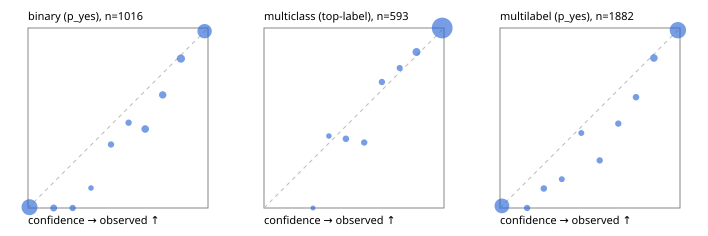

# Evaluation report

- model `Qwen/Qwen3-4B-Instruct-2507` @ `cdbee75f17` (shared-prefix tree (tree-v1)), adapter/checkpoint `runs/tree_4b_instruct_r3_step300/adapter`, prompt `tree-v1` (c8963d819128)
- data data/eval2.jsonl; splits ['test']; n=1991; calibration `None`
- cuda / bfloat16; 2026-09-24T17:39:17+0000; wall 226.4s

## Overall

question accuracy 90.8%

**binary**: n 1016, positives 435, accuracy 0.931, precision 0.875, recall 0.979, f1 0.924, auroc 0.986, brier 0.047, log_loss 0.161, ece 0.030

**multiclass**: n 593, accuracy 0.951, macro_f1 0.917, log_loss 0.122, brier 0.063, ece_top_label 0.017

**multilabel**: n 382, labels 1882, exact_match 0.780, micro_f1 0.949, macro_f1 0.907, label_auroc 0.990, brier 0.039, log_loss 0.134, ece 0.021

## By family

| family | n | question acc % | details |
|---|---|---|---|
| e2_hard | 673 | 89.0 | bin acc 91.1 F1 88.6 AUROC 0.976 ECE 0.041; mc acc 94.3 mF1 89.6 ECE 0.033; ml EM 75.8 µF1 93.2 ECE 0.031 |
| e2_simple | 664 | 95.9 | bin acc 96.8 F1 97.1 AUROC 0.992 ECE 0.020; mc acc 98.0 mF1 96.2 ECE 0.014; ml EM 90.0 µF1 97.8 ECE 0.015 |
| e2_very_hard | 654 | 87.5 | bin acc 91.4 F1 89.6 AUROC 0.984 ECE 0.052; mc acc 93.0 mF1 89.5 ECE 0.030; ml EM 69.2 µF1 93.7 ECE 0.032 |

## by hard case

| slice | n | question acc % |
|---|---|---|
| (none) | 569 | 96.7 |
| contradiction | 172 | 91.3 |
| distractor | 474 | 88.8 |
| double_negation | 126 | 92.9 |
| evidence_end | 57 | 94.7 |
| evidence_middle | 114 | 91.2 |
| evidence_start | 17 | 88.2 |
| exception | 213 | 86.4 |
| hypothetical | 128 | 90.6 |
| injection | 151 | 88.7 |
| lexical_overlap | 201 | 91.5 |
| long_state | 191 | 89.5 |
| missing_evidence | 141 | 96.5 |
| multi_positive | 322 | 81.1 |
| multi_turn | 149 | 85.2 |
| negation | 257 | 91.8 |
| nota | 118 | 89.8 |
| numeric_reasoning | 224 | 78.6 |
| paraphrase | 218 | 86.7 |
| role_reversal | 187 | 90.9 |
| sarcasm | 149 | 86.6 |
| temporal_reasoning | 203 | 74.9 |
| zero_positive | 73 | 82.2 |
| zero_positive_distractor | 1 | 100.0 |

## by state tokens

| slice | n | question acc % |
|---|---|---|
| 00000-00127 | 662 | 90.0 |
| 00128-00511 | 477 | 87.6 |
| 00512-02047 | 484 | 94.2 |
| 02048-08191 | 329 | 91.5 |
| 08192+ | 39 | 94.9 |

## by candidates

| slice | n | question acc % |
|---|---|---|
| 01 | 1016 | 93.1 |
| 03 | 128 | 91.4 |
| 04 | 515 | 92.2 |
| 05 | 224 | 83.9 |
| 06 | 86 | 73.3 |
| 07 | 18 | 88.9 |
| 08 | 4 | 75.0 |

## Paraphrase groups

76 groups; same prediction 78.9%; all correct 81.6%

## Multiclass abstention (coverage vs error on accepted)

| abstain_below | coverage % | error % |
|---|---|---|
| 0.0 | 100.0 | 4.9 |
| 0.4 | 98.8 | 4.1 |
| 0.5 | 96.6 | 2.8 |
| 0.6 | 94.8 | 1.6 |
| 0.7 | 93.1 | 1.1 |
| 0.8 | 91.6 | 0.7 |
| 0.9 | 86.5 | 0.0 |

## Reliability: binary

| bin | n | mean confidence | observed frequency |
|---|---|---|---|
| [0.0,0.1) | 457 | 0.009 | 0.004 |
| [0.1,0.2) | 28 | 0.143 | 0.000 |
| [0.2,0.3) | 18 | 0.248 | 0.000 |
| [0.3,0.4) | 9 | 0.350 | 0.111 |
| [0.4,0.5) | 17 | 0.461 | 0.353 |
| [0.5,0.6) | 19 | 0.559 | 0.474 |
| [0.6,0.7) | 41 | 0.651 | 0.439 |
| [0.7,0.8) | 35 | 0.749 | 0.629 |
| [0.8,0.9) | 53 | 0.849 | 0.830 |
| [0.9,1.0] | 339 | 0.981 | 0.982 |

## Reliability: multiclass

| bin | n | mean confidence | observed frequency |
|---|---|---|---|
| [0.2,0.3) | 2 | 0.272 | 0.000 |
| [0.3,0.4) | 5 | 0.361 | 0.400 |
| [0.4,0.5) | 13 | 0.455 | 0.385 |
| [0.5,0.6) | 11 | 0.556 | 0.364 |
| [0.6,0.7) | 10 | 0.655 | 0.700 |
| [0.7,0.8) | 9 | 0.754 | 0.778 |
| [0.8,0.9) | 30 | 0.847 | 0.867 |
| [0.9,1.0] | 513 | 0.990 | 1.000 |

## Reliability: multilabel

| bin | n | mean confidence | observed frequency |
|---|---|---|---|
| [0.0,0.1) | 681 | 0.011 | 0.012 |
| [0.1,0.2) | 35 | 0.151 | 0.000 |
| [0.2,0.3) | 37 | 0.243 | 0.108 |
| [0.3,0.4) | 25 | 0.343 | 0.160 |
| [0.4,0.5) | 24 | 0.451 | 0.417 |
| [0.5,0.6) | 34 | 0.554 | 0.265 |
| [0.6,0.7) | 32 | 0.657 | 0.469 |
| [0.7,0.8) | 39 | 0.756 | 0.615 |
| [0.8,0.9) | 78 | 0.855 | 0.833 |
| [0.9,1.0] | 897 | 0.988 | 0.988 |
