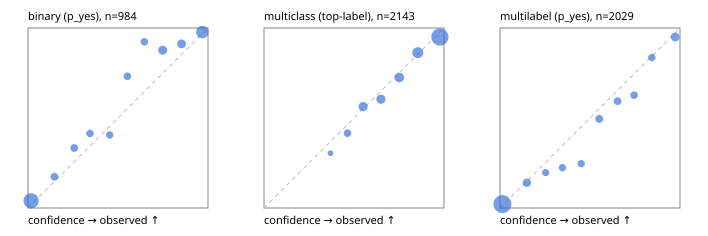

# Evaluation report

- model `Qwen/Qwen3-4B-Instruct-2507` @ `cdbee75f17` (shared-prefix tree (tree-v1)), adapter/checkpoint `runs/tree_4b_instruct_r3_step300/adapter`, prompt `tree-v1` (c8963d819128)
- data data/hf.jsonl, data/eval.jsonl; splits ['test']; n=3471; calibration `None`
- cuda / bfloat16; 2026-09-24T17:42:26+0000; wall 179.7s

## Overall

question accuracy 81.5%

**binary**: n 984, positives 475, accuracy 0.894, precision 0.923, recall 0.853, f1 0.886, auroc 0.954, brier 0.086, log_loss 0.290, ece 0.052

**multiclass**: n 2143, accuracy 0.825, macro_f1 0.874, log_loss 0.536, brier 0.257, ece_top_label 0.026

**multilabel**: n 344, labels 2029, exact_match 0.526, micro_f1 0.755, macro_f1 0.763, label_auroc 0.938, brier 0.081, log_loss 0.260, ece 0.031

## By family

| family | n | question acc % | details |
|---|---|---|---|
| eval_adversarial | 27 | 85.2 | bin acc 86.7 F1 83.3 AUROC 0.981 ECE 0.099; mc acc 100.0 mF1 100.0 ECE 0.006; ml EM 60.0 µF1 90.0 ECE 0.083 |
| eval_agent_output | 26 | 53.8 | bin acc 78.6 F1 80.0 AUROC 0.878 ECE 0.213; mc acc 42.9 mF1 41.7 ECE 0.344; ml EM 0.0 µF1 62.5 ECE 0.243 |
| eval_evidence | 17 | 82.4 | bin acc 93.3 F1 90.9 AUROC 1.000 ECE 0.069; ml EM 0.0 µF1 50.0 ECE 0.363 |
| eval_multilabel | 32 | 90.6 | bin acc 100.0 F1 100.0 AUROC 1.000 ECE 0.037; mc acc 100.0 mF1 100.0 ECE 0.186; ml EM 87.5 µF1 96.1 ECE 0.037 |
| eval_policy | 22 | 68.2 | bin acc 76.9 F1 76.9 AUROC 0.714 ECE 0.369; mc acc 40.0 mF1 23.8 ECE 0.406; ml EM 75.0 µF1 88.9 ECE 0.210 |
| eval_routing | 25 | 96.0 | bin acc 90.0 F1 88.9 AUROC 0.917 ECE 0.125; mc acc 100.0 mF1 100.0 ECE 0.071; ml EM 100.0 µF1 100.0 ECE 0.106 |
| eval_urgency_sentiment | 22 | 90.9 | bin acc 80.0 F1 85.7 AUROC 0.958 ECE 0.107; mc acc 100.0 mF1 100.0 ECE 0.043; ml EM 100.0 µF1 100.0 ECE 0.004 |
| heldout_boolq | 300 | 86.3 | bin acc 86.3 F1 88.1 AUROC 0.936 ECE 0.065 |
| heldout_emotion_multiclass | 300 | 52.7 | mc acc 52.7 mF1 43.6 ECE 0.262 |
| heldout_intent_clinc | 300 | 86.3 | mc acc 86.3 mF1 87.4 ECE 0.044 |
| heldout_question_type_trec | 300 | 92.0 | mc acc 92.0 mF1 91.6 ECE 0.119 |
| heldout_sentiment_sst2 | 300 | 88.0 | bin acc 88.0 F1 86.6 AUROC 0.954 ECE 0.112 |
| heldout_topic_dbpedia | 300 | 96.3 | mc acc 96.3 mF1 96.2 ECE 0.021 |
| hf_emotions_multilabel | 300 | 50.0 | ml EM 50.0 µF1 72.0 ECE 0.030 |
| hf_intent_banking77 | 300 | 95.7 | mc acc 95.7 mF1 95.7 ECE 0.024 |
| hf_nli | 300 | 95.0 | bin acc 95.0 F1 93.2 AUROC 0.982 ECE 0.039 |
| hf_sentiment_tweets | 300 | 63.3 | mc acc 63.3 mF1 64.3 ECE 0.030 |
| hf_topic_agnews | 300 | 90.7 | mc acc 90.7 mF1 90.7 ECE 0.062 |

## by hard case

| slice | n | question acc % |
|---|---|---|
| (none) | 3042 | 81.0 |
| contradiction | 107 | 99.1 |
| distractor | 33 | 72.7 |
| double_negation | 6 | 66.7 |
| evidence_end | 13 | 100.0 |
| evidence_middle | 11 | 72.7 |
| evidence_start | 9 | 88.9 |
| exception | 7 | 57.1 |
| hypothetical | 7 | 85.7 |
| injection | 10 | 80.0 |
| lexical_overlap | 20 | 85.0 |
| long_state | 50 | 82.0 |
| missing_evidence | 104 | 90.4 |
| multi_positive | 81 | 53.1 |
| multi_turn | 9 | 100.0 |
| negation | 30 | 86.7 |
| new_label_names | 3 | 33.3 |
| nota | 46 | 100.0 |
| numeric_reasoning | 16 | 68.8 |
| paraphrase | 22 | 90.9 |
| role_reversal | 15 | 86.7 |
| sarcasm | 12 | 100.0 |
| temporal_reasoning | 29 | 69.0 |
| zero_positive | 6 | 50.0 |

## by state tokens

| slice | n | question acc % |
|---|---|---|
| 00000-00127 | 3211 | 81.3 |
| 00128-00511 | 208 | 83.7 |
| 00512-02047 | 52 | 82.7 |

## by candidates

| slice | n | question acc % |
|---|---|---|
| 01 | 984 | 89.4 |
| 03 | 310 | 64.2 |
| 04 | 333 | 89.5 |
| 05 | 22 | 63.6 |
| 06 | 1218 | 72.9 |
| 07 | 49 | 98.0 |
| 08 | 555 | 90.3 |

## Paraphrase groups

11 groups; same prediction 81.8%; all correct 90.9%

## Multiclass abstention (coverage vs error on accepted)

| abstain_below | coverage % | error % |
|---|---|---|
| 0.0 | 100.0 | 17.5 |
| 0.4 | 98.9 | 17.0 |
| 0.5 | 94.8 | 15.2 |
| 0.6 | 86.3 | 12.4 |
| 0.7 | 78.1 | 9.5 |
| 0.8 | 68.2 | 6.9 |
| 0.9 | 53.2 | 5.0 |

## Reliability: binary

| bin | n | mean confidence | observed frequency |
|---|---|---|---|
| [0.0,0.1) | 376 | 0.017 | 0.040 |
| [0.1,0.2) | 46 | 0.147 | 0.174 |
| [0.2,0.3) | 45 | 0.257 | 0.333 |
| [0.3,0.4) | 41 | 0.345 | 0.415 |
| [0.4,0.5) | 37 | 0.454 | 0.405 |
| [0.5,0.6) | 41 | 0.552 | 0.732 |
| [0.6,0.7) | 39 | 0.647 | 0.923 |
| [0.7,0.8) | 73 | 0.748 | 0.877 |
| [0.8,0.9) | 68 | 0.853 | 0.912 |
| [0.9,1.0] | 218 | 0.969 | 0.977 |

## Reliability: multiclass

| bin | n | mean confidence | observed frequency |
|---|---|---|---|
| [0.3,0.4) | 23 | 0.369 | 0.304 |
| [0.4,0.5) | 89 | 0.464 | 0.416 |
| [0.5,0.6) | 181 | 0.551 | 0.564 |
| [0.6,0.7) | 177 | 0.649 | 0.605 |
| [0.7,0.8) | 211 | 0.751 | 0.725 |
| [0.8,0.9) | 321 | 0.855 | 0.863 |
| [0.9,1.0] | 1141 | 0.977 | 0.950 |

## Reliability: multilabel

| bin | n | mean confidence | observed frequency |
|---|---|---|---|
| [0.0,0.1) | 1212 | 0.013 | 0.021 |
| [0.1,0.2) | 121 | 0.149 | 0.140 |
| [0.2,0.3) | 61 | 0.253 | 0.197 |
| [0.3,0.4) | 76 | 0.346 | 0.224 |
| [0.4,0.5) | 69 | 0.451 | 0.246 |
| [0.5,0.6) | 103 | 0.551 | 0.495 |
| [0.6,0.7) | 91 | 0.653 | 0.593 |
| [0.7,0.8) | 83 | 0.745 | 0.627 |
| [0.8,0.9) | 73 | 0.844 | 0.836 |
| [0.9,1.0] | 140 | 0.973 | 0.950 |
